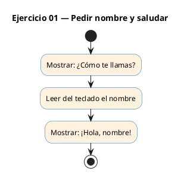
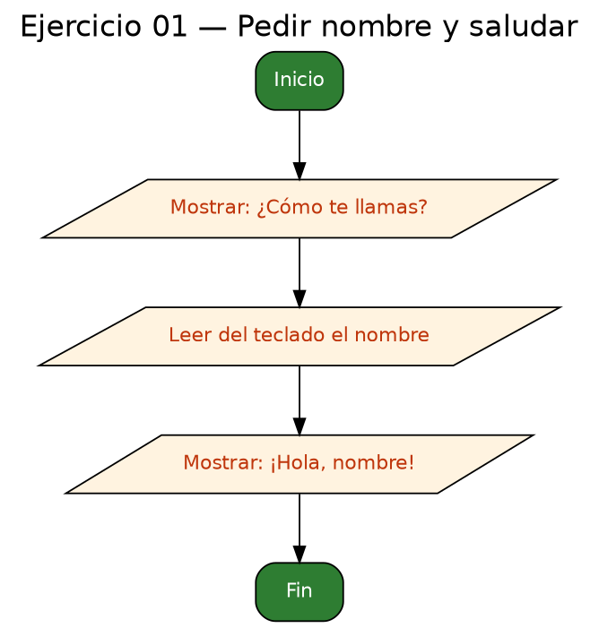

<!-- FICHERO GENERADO — NO EDITAR. Fuente de verdad: curso-c/practica/01-variables/ej01.md (se regenera con gen_course.py). -->

# Ejercicio 01 — Pedir nombre al usuario y saludar con printf

Dificultad: verde · Módulo 01 (Variables, tipos y entrada/salida)

## Enunciado

Pedir nombre al usuario y saludar con printf.

## Diagramas de flujo





## Cómo se resuelve

<!-- EXPLICACION -->
Un texto en C se guarda en un **array de `char`**. Declaramos `char nombre[50]`: 50 casillas, de sobra para un nombre normal contando el terminador.

1. `printf("¿Cómo te llamas? ")` — un `printf` **sin `\n`** deja el cursor en la misma línea, como una pregunta que espera respuesta.
2. `scanf("%49s", nombre)` — lee una palabra del teclado. Dos detalles clave:
   - Con `%s` la variable es un array y **no lleva `&`** delante (a diferencia de un `int` o un `float`): el nombre del array ya es su dirección en memoria.
   - El `49` limita la lectura a 49 caracteres para dejar sitio al `'\0'` final y **no desbordar** el array de 50. Escribir `%s` a secas es la puerta a un fallo de seguridad clásico.
3. `printf("¡Hola, %s!\n", nombre)` — `%s` inserta la cadena leída.

Trampa habitual: `scanf("%s")` corta en el primer espacio, así que "Ana María" solo captura "Ana". Para leer la línea entera se usa `fgets`, que verás más adelante.

## Para practicar — cópialo y complétalo

Pega este esqueleto y completa los `TODO`. Es la mejor forma de aprender: inténtalo antes de mirar la solución.

```c
/*
 * Curso de C — Modulo 01: Variables, tipos y entrada/salida
 * Ejercicio 01 — PRACTICA (rellena los TODO)
 * Enunciado: Pedir nombre al usuario y saludar con printf.
 * Dificultad: verde
 * Compilar: gcc -std=c11 -Wall ej01_practica.c -o ej01 && ./ej01
 */
#include <stdio.h>

int main(void) {
    // TODO: declara un array de char de 50 posiciones llamado 'nombre'

    // TODO: usa printf para mostrar el mensaje "¿Cómo te llamas? "
    //       (sin salto de línea al final, para que el cursor quede en la misma línea)

    // TODO: usa scanf con el formato "%49s" para leer el nombre
    //       (los arrays NO llevan & en scanf)

    // TODO: usa printf para mostrar "¡Hola, <nombre>!\n"
    //       Pista: el formato de cadena es %s

    return 0;
}
```

## Solución — cópiala y ejecútala

```c
/*
 * Curso de C — Modulo 01: Variables, tipos y entrada/salida
 * Ejercicio 01 — MODELO (resuelto)
 * Enunciado: Pedir nombre al usuario y saludar con printf.
 * Dificultad: verde
 * Compilar: gcc -std=c11 -Wall ej01_modelo.c -o ej01 && ./ej01
 */
#include <stdio.h>

int main(void) {
    char nombre[50];

    // Pedimos el nombre al usuario
    printf("¿Cómo te llamas? ");
    scanf("%49s", nombre);   // 49 = tamaño - 1 para dejar espacio al '\0'

    // Saludamos usando el nombre leido
    printf("¡Hola, %s!\n", nombre);

    return 0;
}
```

## Cómo usarlo

Pega el código en un fichero y ejecútalo con tu toolchain habitual (o el botón de Ejecutar de tu editor). Antes de mirar la solución, intenta completar tú el esqueleto: es la mejor forma de aprender.

## Conexiones

- [[Curso_C/modelo/01-variables|Teoría del módulo]]
- [[Curso_C/practica/00_README|Índice del curso]]
