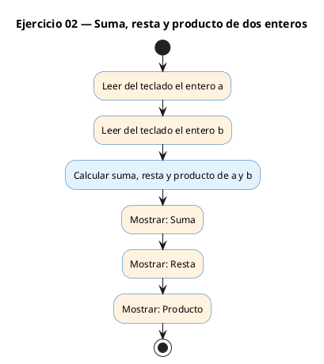
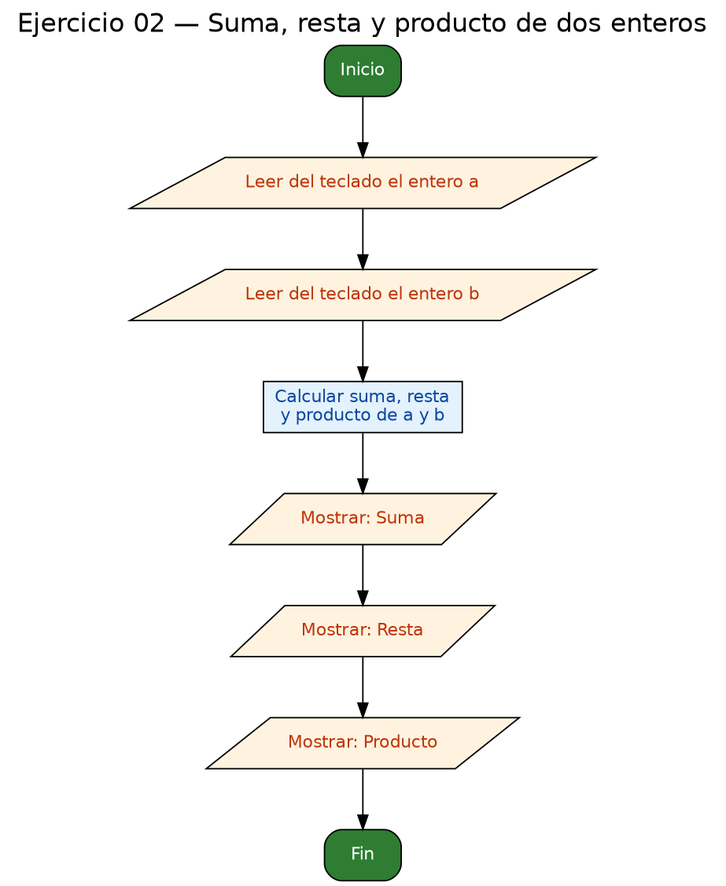

<!-- FICHERO GENERADO — NO EDITAR. Fuente de verdad: curso-c/practica/01-variables/ej02.md (se regenera con gen_course.py). -->

# Ejercicio 02 — Leer dos enteros y mostrar suma, resta y producto

Dificultad: verde · Módulo 01 (Variables, tipos y entrada/salida)

## Enunciado

Leer dos enteros y mostrar suma, resta y producto.

## Diagramas de flujo





## Cómo se resuelve

<!-- EXPLICACION -->
El patrón de todo el módulo: **declarar → leer → calcular → mostrar**.

1. `int a = 0, b = 0;` — dos enteros, inicializados a 0 (buena costumbre: nunca dejes una variable con valor basura).
2. `scanf("%d", &a)` — `%d` es el formato de un entero. Aquí sí hace falta el **`&`**: le pasas a `scanf` la *dirección* de `a` para que pueda escribir dentro. Olvidar el `&` en variables simples es el error número uno al empezar.
3. Los cálculos se hacen **dentro del `printf`**: `printf("Suma: %d\n", a + b)`. No necesitas variables intermedias; C evalúa `a + b` y coloca el resultado donde está el `%d`.

Regla mental para el `&`: los tipos simples (`int`, `float`, `char`) llevan `&` en `scanf`; los arrays y cadenas, no.

## Para practicar — cópialo y complétalo

Pega este esqueleto y completa los `TODO`. Es la mejor forma de aprender: inténtalo antes de mirar la solución.

```c
/*
 * Curso de C — Modulo 01: Variables, tipos y entrada/salida
 * Ejercicio 02 — PRACTICA (rellena los TODO)
 * Enunciado: Leer dos enteros y mostrar suma, resta y producto.
 * Dificultad: verde
 * Compilar: gcc -std=c11 -Wall ej02_practica.c -o ej02 && ./ej02
 */
#include <stdio.h>

int main(void) {
    // TODO: declara dos variables enteras 'a' y 'b', inicializadas a 0

    // TODO: muestra "a = " y lee 'a' con scanf
    //       Recuerda: scanf necesita & delante de variables simples (&a)

    // TODO: muestra "b = " y lee 'b' con scanf

    // TODO: calcula e imprime la suma de a y b en el formato "Suma: %d\n"
    //       Puedes calcular directamente dentro del printf: printf("...", a + b)

    // TODO: calcula e imprime la resta (a - b)

    // TODO: calcula e imprime el producto (a * b)

    return 0;
}
```

## Solución — cópiala y ejecútala

```c
/*
 * Curso de C — Modulo 01: Variables, tipos y entrada/salida
 * Ejercicio 02 — MODELO (resuelto)
 * Enunciado: Leer dos enteros y mostrar suma, resta y producto.
 * Dificultad: verde
 * Compilar: gcc -std=c11 -Wall ej02_modelo.c -o ej02 && ./ej02
 */
#include <stdio.h>

int main(void) {
    int a = 0, b = 0;

    // Leer los dos enteros
    printf("a = ");
    scanf("%d", &a);
    printf("b = ");
    scanf("%d", &b);

    // Calcular y mostrar los tres resultados
    printf("Suma: %d\n",      a + b);
    printf("Resta: %d\n",     a - b);
    printf("Producto: %d\n",  a * b);

    return 0;
}
```

## Cómo usarlo

Pega el código en un fichero y ejecútalo con tu toolchain habitual (o el botón de Ejecutar de tu editor). Antes de mirar la solución, intenta completar tú el esqueleto: es la mejor forma de aprender.

## Conexiones

- [[Curso_C/modelo/01-variables|Teoría del módulo]]
- [[Curso_C/practica/00_README|Índice del curso]]
