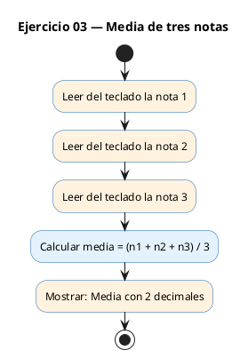

# Ejercicio 03 — Leer tres notas (float) y mostrar la media con 2 decimales

Dificultad: verde · Módulo 01 (Variables, tipos y entrada/salida)

## Enunciado

Leer tres notas (float) y mostrar la media con 2 decimales.

## Diagrama de flujo



## Cómo se resuelve

<!-- EXPLICACION -->
Aquí aparecen los decimales (`float`) y la trampa más famosa de C: la **división entera**.

1. Tres `float` (`n1`, `n2`, `n3`) se leen con `scanf("%f", ...)`. Ojo: en `scanf` un `float` usa `%f`, y sigue llevando `&`.
2. La media es `(n1 + n2 + n3) / 3.0f`. Fíjate en el `3.0f` y no `3`:
   - Si divides entre `3` (entero) y los operandos fueran enteros, C haría **división entera** y tiraría los decimales. Como aquí los sumandos ya son `float`, el resultado sería correcto igualmente, pero escribir `3.0f` **deja clara la intención** y te protege si algún día cambias los tipos.
3. `printf("Media: %.2f\n", media)` — el `%.2f` redondea a **2 decimales** al mostrar (no cambia el valor guardado, solo cómo se ve).

Idea que se repetirá: en C, el tipo de los operandos decide el tipo de la operación. Mezcla un `.0f` cuando quieras forzar cálculo decimal.

## Para practicar — cópialo en Dev-C++

Pega este esqueleto y completa los `TODO`. Es la mejor forma de aprender: inténtalo antes de mirar la solución.

```c
/*
 * Curso de C — Modulo 01: Variables, tipos y entrada/salida
 * Ejercicio 03 — PRACTICA (rellena los TODO)
 * Enunciado: Leer tres notas (float) y mostrar la media con 2 decimales.
 * Dificultad: verde
 * Compilar: gcc -std=c11 -Wall ej03_practica.c -o ej03 && ./ej03
 */
#include <stdio.h>

int main(void) {
    // TODO: declara tres variables float (n1, n2, n3) inicializadas a 0.0f

    // TODO: para cada nota, muestra "Nota X: " y leela con scanf
    //       El formato de scanf para float es "%f"

    // TODO: declara una variable float 'media' y calcula (n1 + n2 + n3) / 3.0f
    //       Ojo: divide entre 3.0f (no entre 3) para forzar division real

    // TODO: muestra la media con 2 decimales usando el formato "%.2f\n"

    return 0;
}
```

## Solución — cópiala y ejecútala

```c
/*
 * Curso de C — Modulo 01: Variables, tipos y entrada/salida
 * Ejercicio 03 — MODELO (resuelto)
 * Enunciado: Leer tres notas (float) y mostrar la media con 2 decimales.
 * Dificultad: verde
 * Compilar: gcc -std=c11 -Wall ej03_modelo.c -o ej03 && ./ej03
 */
#include <stdio.h>

int main(void) {
    float n1 = 0.0f, n2 = 0.0f, n3 = 0.0f;

    // Leer las tres notas
    printf("Nota 1: ");
    scanf("%f", &n1);
    printf("Nota 2: ");
    scanf("%f", &n2);
    printf("Nota 3: ");
    scanf("%f", &n3);

    // Calcular la media
    // Dividimos entre 3.0f para asegurar division de punto flotante
    float media = (n1 + n2 + n3) / 3.0f;

    // Mostrar resultado con 2 decimales
    printf("Media: %.2f\n", media);

    return 0;
}
```

## Cómo usarlo

Dev-C++ (Windows): Archivo → Nuevo → Código fuente, pega el código y pulsa F11 (compilar y ejecutar). Si ves los acentos raros en la consola, escribe `chcp 65001` y vuelve a ejecutar.

## Conexiones

- [[Curso_C/modelo/01-variables|Teoría del módulo]]
- [[Curso_C/00_README|Índice del curso]]
