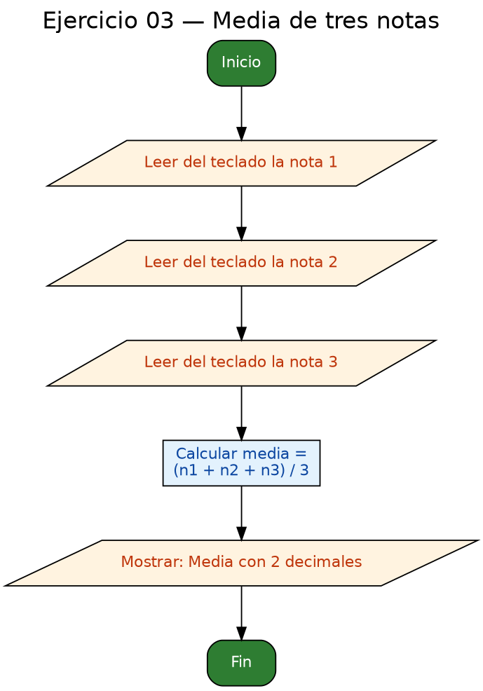

<!-- FICHERO GENERADO — NO EDITAR. Fuente de verdad: curso-c/practica/01-variables/ej03.md (se regenera con gen_course.py). -->

# Ejercicio 03 — Leer tres notas (float) y mostrar la media con 2 decimales

Dificultad: verde · Módulo 01 (Variables, tipos y entrada/salida)

## Enunciado

Leer tres notas (float) y mostrar la media con 2 decimales.

## Diagramas de flujo




## Cómo se resuelve

<!-- EXPLICACION -->
Aquí aparecen los decimales (`float`) y la trampa más famosa de C: la **división entera**.

1. Tres `float` (`n1`, `n2`, `n3`) se leen con `scanf("%f", ...)`. Ojo: en `scanf` un `float` usa `%f`, y sigue llevando `&`.
2. La media es `(n1 + n2 + n3) / 3.0f`. Fíjate en el `3.0f` y no `3`:
   - Si divides entre `3` (entero) y los operandos fueran enteros, C haría **división entera** y tiraría los decimales. Como aquí los sumandos ya son `float`, el resultado sería correcto igualmente, pero escribir `3.0f` **deja clara la intención** y te protege si algún día cambias los tipos.
3. `printf("Media: %.2f\n", media)` — el `%.2f` redondea a **2 decimales** al mostrar (no cambia el valor guardado, solo cómo se ve).

Idea que se repetirá: en C, el tipo de los operandos decide el tipo de la operación. Mezcla un `.0f` cuando quieras forzar cálculo decimal.

## Para practicar — cópialo y complétalo

Pega este esqueleto y completa los `TODO`. Es la mejor forma de aprender: inténtalo antes de mirar la solución.

```c
/*
 * Curso de C — Modulo 01: Variables, tipos y entrada/salida
 * Ejercicio 03 — PRACTICA (rellena los TODO)
 * Enunciado: Leer tres notas (float) y mostrar la media con 2 decimales.
 * Dificultad: verde
 * Stdin: 8.5\n7.0\n9.5
 * Compilar: gcc -std=c11 -Wall ej03_practica.c -o ej03 && ./ej03
 */
#include <stdio.h>

int main(void) {
    // TODO: declara tres variables float (n1, n2, n3) inicializadas a 0.0f

    // TODO: para cada nota, muestra "Nota X: " y leela con scanf
    //       El formato de scanf para float es "%f"

    // TODO: declara una variable float 'media' y calcula (n1 + n2 + n3) / 3.0f
    //       Ojo: divide entre 3.0f (no entre 3) para forzar division real

    // TODO: muestra la media con 2 decimales usando el formato "%.2f\n"

    return 0;
}
```

## Solución — cópiala y ejecútala

```c
/*
 * Curso de C — Modulo 01: Variables, tipos y entrada/salida
 * Ejercicio 03 — MODELO (resuelto)
 * Enunciado: Leer tres notas (float) y mostrar la media con 2 decimales.
 * Dificultad: verde
 * Stdin: 8.5\n7.0\n9.5
 * Compilar: gcc -std=c11 -Wall ej03_modelo.c -o ej03 && ./ej03
 */
#include <stdio.h>

int main(void) {
    float n1 = 0.0f, n2 = 0.0f, n3 = 0.0f;

    // Leer las tres notas
    printf("Nota 1: ");
    scanf("%f", &n1);
    printf("Nota 2: ");
    scanf("%f", &n2);
    printf("Nota 3: ");
    scanf("%f", &n3);

    // Calcular la media
    // Dividimos entre 3.0f para asegurar division de punto flotante
    float media = (n1 + n2 + n3) / 3.0f;

    // Mostrar resultado con 2 decimales
    printf("Media: %.2f\n", media);

    return 0;
}
```

## Ejecútalo en el navegador

[▶ Abrir y ejecutar en Compiler Explorer](https://godbolt.org/clientstate/eyJzZXNzaW9ucyI6W3siaWQiOjEsImxhbmd1YWdlIjoiYyIsInNvdXJjZSI6Ii8qXG4gKiBDdXJzbyBkZSBDIFx1MjAxNCBNb2R1bG8gMDE6IFZhcmlhYmxlcywgdGlwb3MgeSBlbnRyYWRhL3NhbGlkYVxuICogRWplcmNpY2lvIDAzIFx1MjAxNCBNT0RFTE8gKHJlc3VlbHRvKVxuICogRW51bmNpYWRvOiBMZWVyIHRyZXMgbm90YXMgKGZsb2F0KSB5IG1vc3RyYXIgbGEgbWVkaWEgY29uIDIgZGVjaW1hbGVzLlxuICogRGlmaWN1bHRhZDogdmVyZGVcbiAqIFN0ZGluOiA4LjVcXG43LjBcXG45LjVcbiAqIENvbXBpbGFyOiBnY2MgLXN0ZD1jMTEgLVdhbGwgZWowM19tb2RlbG8uYyAtbyBlajAzICYmIC4vZWowM1xuICovXG4jaW5jbHVkZSA8c3RkaW8uaD5cblxuaW50IG1haW4odm9pZCkge1xuICAgIGZsb2F0IG4xID0gMC4wZiwgbjIgPSAwLjBmLCBuMyA9IDAuMGY7XG5cbiAgICAvLyBMZWVyIGxhcyB0cmVzIG5vdGFzXG4gICAgcHJpbnRmKFwiTm90YSAxOiBcIik7XG4gICAgc2NhbmYoXCIlZlwiLCAmbjEpO1xuICAgIHByaW50ZihcIk5vdGEgMjogXCIpO1xuICAgIHNjYW5mKFwiJWZcIiwgJm4yKTtcbiAgICBwcmludGYoXCJOb3RhIDM6IFwiKTtcbiAgICBzY2FuZihcIiVmXCIsICZuMyk7XG5cbiAgICAvLyBDYWxjdWxhciBsYSBtZWRpYVxuICAgIC8vIERpdmlkaW1vcyBlbnRyZSAzLjBmIHBhcmEgYXNlZ3VyYXIgZGl2aXNpb24gZGUgcHVudG8gZmxvdGFudGVcbiAgICBmbG9hdCBtZWRpYSA9IChuMSArIG4yICsgbjMpIC8gMy4wZjtcblxuICAgIC8vIE1vc3RyYXIgcmVzdWx0YWRvIGNvbiAyIGRlY2ltYWxlc1xuICAgIHByaW50ZihcIk1lZGlhOiAlLjJmXFxuXCIsIG1lZGlhKTtcblxuICAgIHJldHVybiAwO1xufVxuIiwiY29tcGlsZXJzIjpbXSwiZXhlY3V0b3JzIjpbeyJhcmd1bWVudHMiOiIiLCJjb21waWxlciI6eyJpZCI6ImNnMTQzIiwibGlicyI6W10sIm9wdGlvbnMiOiItc3RkPWMxMSAtbG0ifSwic3RkaW4iOiI4LjVcbjcuMFxuOS41Iiwid3JhcCI6ZmFsc2V9XX1dfQ%3D%3D)

Se abre con la solución ya cargada; pulsa el botón de ejecutar (Run) para ver la salida. No hay que instalar nada.

## Cómo usarlo

Pega el código en un fichero y ejecútalo con tu toolchain habitual (o el botón de Ejecutar de tu editor). Antes de mirar la solución, intenta completar tú el esqueleto: es la mejor forma de aprender.

## Conexiones

- [[Curso_C/modelo/01-variables|Teoría del módulo]]
- [[Curso_C/practica/00_README|Índice del curso]]
