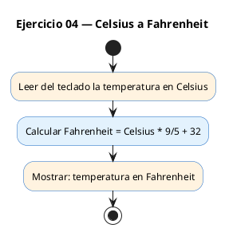
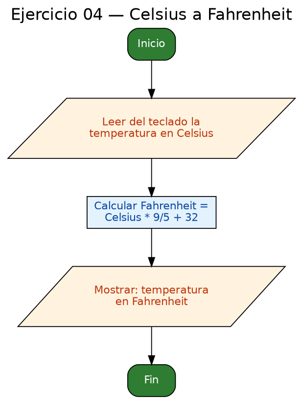

<!-- FICHERO GENERADO — NO EDITAR. Fuente de verdad: curso-c/practica/01-variables/ej04.md (se regenera con gen_course.py). -->

# Ejercicio 04 — Leer temperatura en Celsius y convertir a Fahrenheit

Dificultad: amarillo · Módulo 01 (Variables, tipos y entrada/salida)

## Enunciado

Leer temperatura en Celsius y convertir a Fahrenheit (F = C * 9/5 + 32).

## Diagramas de flujo





## Cómo se resuelve

<!-- EXPLICACION -->
Una conversión de unidades que existe **solo** para enseñarte la trampa de la división entera.

1. Se lee un `float celsius` con `scanf("%f", &celsius)`.
2. La fórmula es `F = C · 9/5 + 32`. En el código: `celsius * (9.0f / 5.0f) + 32.0f`.
   - **La clave está en `9.0f / 5.0f`**. Si escribes `9 / 5` (dos enteros), C calcula división entera y da **`1`**, no `1.8`. Toda la conversión saldría mal.
   - Basta con que **uno** de los dos sea decimal (`9.0f/5`, `9/5.0f`) o usar directamente `1.8f`.
3. `printf("En Fahrenheit: %.1f\n", fahrenheit)` — un decimal es suficiente para una temperatura.

Comprueba tú mismo: con 100 °C debe salir 212.0; con 0 °C, 32.0. Si te sale 132.0, has caído en el `9/5 = 1`.

## Para practicar — cópialo y complétalo

Pega este esqueleto y completa los `TODO`. Es la mejor forma de aprender: inténtalo antes de mirar la solución.

```c
/*
 * Curso de C — Modulo 01: Variables, tipos y entrada/salida
 * Ejercicio 04 — PRACTICA (rellena los TODO)
 * Enunciado: Leer temperatura en Celsius y convertir a Fahrenheit (F = C * 9/5 + 32).
 * Dificultad: amarillo
 * Compilar: gcc -std=c11 -Wall ej04_practica.c -o ej04 && ./ej04
 */
#include <stdio.h>

int main(void) {
    // TODO: declara una variable float llamada 'celsius', inicializada a 0.0f

    // TODO: muestra "Temperatura en Celsius: " y lee el valor con scanf ("%f")

    // TODO: declara otra variable float llamada 'fahrenheit'
    //       Calcula: fahrenheit = celsius * (9.0f / 5.0f) + 32.0f
    //       Trampa clasica: si escribes 9/5 (enteros) el resultado es 1, no 1.8
    //       Solución: usa 9.0f/5.0f o simplemente 1.8f

    // TODO: muestra la temperatura en Fahrenheit con 1 decimal: "En Fahrenheit: %.1f\n"

    return 0;
}
```

## Solución — cópiala y ejecútala

```c
/*
 * Curso de C — Modulo 01: Variables, tipos y entrada/salida
 * Ejercicio 04 — MODELO (resuelto)
 * Enunciado: Leer temperatura en Celsius y convertir a Fahrenheit (F = C * 9/5 + 32).
 * Dificultad: amarillo
 * Compilar: gcc -std=c11 -Wall ej04_modelo.c -o ej04 && ./ej04
 */
#include <stdio.h>

int main(void) {
    float celsius = 0.0f;

    printf("Temperatura en Celsius: ");
    scanf("%f", &celsius);

    // F = C * 9/5 + 32
    // IMPORTANTE: escribimos 9.0f/5.0f para que sea division real,
    // no entera (9/5 en enteros = 1, perdiendo precision).
    float fahrenheit = celsius * (9.0f / 5.0f) + 32.0f;

    printf("En Fahrenheit: %.1f\n", fahrenheit);

    return 0;
}
```

## Cómo usarlo

Pega el código en un fichero y ejecútalo con tu toolchain habitual (o el botón de Ejecutar de tu editor). Antes de mirar la solución, intenta completar tú el esqueleto: es la mejor forma de aprender.

## Conexiones

- [[Curso_C/modelo/01-variables|Teoría del módulo]]
- [[Curso_C/practica/00_README|Índice del curso]]
