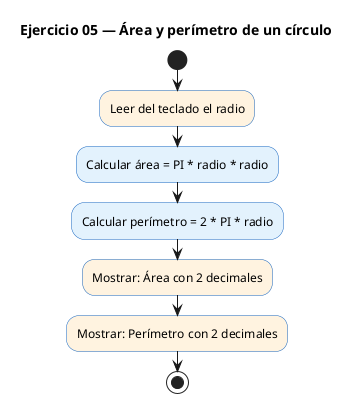
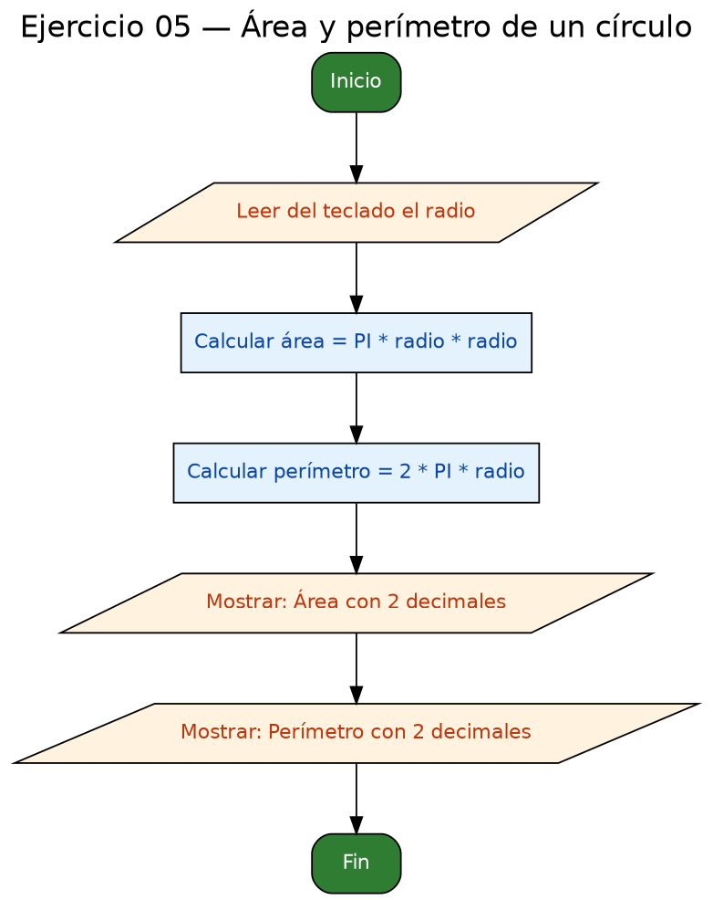

<!-- FICHERO GENERADO — NO EDITAR. Fuente de verdad: curso-c/practica/01-variables/ej05.md (se regenera con gen_course.py). -->

# Ejercicio 05 — Leer el radio y calcular área y perímetro de un círculo

Dificultad: amarillo · Módulo 01 (Variables, tipos y entrada/salida)

## Enunciado

Leer el radio y calcular área y perímetro de un círculo.

## Diagramas de flujo





## Cómo se resuelve

<!-- EXPLICACION -->
Geometría sencilla que introduce las **constantes** y la ausencia de `pow` en C básico.

1. `const float PI = 3.14159f;` — la palabra `const` le dice al compilador que ese valor **no puede cambiar**. Si por error escribieras `PI = 4;` más abajo, el programa ni siquiera compilaría. Es la forma correcta de declarar un valor fijo.
2. `float radio` se lee con `scanf("%f", &radio)`.
3. Área = `PI * radio * radio`. En C básico **no hay operador de potencia** ni se usa `pow` para algo tan simple: elevar al cuadrado es, literalmente, **multiplicar el número por sí mismo** (`radio * radio`).
4. Perímetro = `2.0f * PI * radio`.
5. Ambos resultados se muestran con `%.2f` (dos decimales).

Idea que se queda: C te da lo mínimo. Operaciones que en otros lenguajes son un símbolo (`**`), aquí las construyes tú con multiplicaciones.

## Para practicar — cópialo y complétalo

Pega este esqueleto y completa los `TODO`. Es la mejor forma de aprender: inténtalo antes de mirar la solución.

```c
/*
 * Curso de C — Modulo 01: Variables, tipos y entrada/salida
 * Ejercicio 05 — PRACTICA (rellena los TODO)
 * Enunciado: Leer el radio y calcular área y perímetro de un círculo.
 * Dificultad: amarillo
 * Stdin: 5
 * Compilar: gcc -std=c11 -Wall ej05_practica.c -o ej05 && ./ej05
 */
#include <stdio.h>

int main(void) {
    // TODO: declara una constante float llamada PI con valor 3.14159f
    //       Usa la palabra clave 'const' antes del tipo

    // TODO: declara una variable float 'radio', inicializada a 0.0f

    // TODO: muestra "Radio: " y lee el radio con scanf

    // TODO: calcula el area: PI * radio * radio
    //       (en C basico no hay funcion pow, multiplica directamente)

    // TODO: calcula el perimetro: 2.0f * PI * radio

    // TODO: muestra "Area: %.2f\n" con el valor del area

    // TODO: muestra "Perimetro: %.2f\n" con el valor del perimetro

    return 0;
}
```

## Solución — cópiala y ejecútala

```c
/*
 * Curso de C — Modulo 01: Variables, tipos y entrada/salida
 * Ejercicio 05 — MODELO (resuelto)
 * Enunciado: Leer el radio y calcular área y perímetro de un círculo.
 * Dificultad: amarillo
 * Stdin: 5
 * Compilar: gcc -std=c11 -Wall ej05_modelo.c -o ej05 && ./ej05
 */
#include <stdio.h>

int main(void) {
    const float PI = 3.14159f;
    float radio = 0.0f;

    printf("Radio: ");
    scanf("%f", &radio);

    // Area = PI * r^2   (r*r es lo mismo que r al cuadrado)
    float area = PI * radio * radio;

    // Perimetro = 2 * PI * r
    float perimetro = 2.0f * PI * radio;

    printf("Area: %.2f\n",      area);
    printf("Perimetro: %.2f\n", perimetro);

    return 0;
}
```

## Ejecútalo en el navegador

[▶ Abrir y ejecutar en Compiler Explorer](https://godbolt.org/clientstate/eyJzZXNzaW9ucyI6W3siaWQiOjEsImxhbmd1YWdlIjoiYyIsInNvdXJjZSI6Ii8qXG4gKiBDdXJzbyBkZSBDIFx1MjAxNCBNb2R1bG8gMDE6IFZhcmlhYmxlcywgdGlwb3MgeSBlbnRyYWRhL3NhbGlkYVxuICogRWplcmNpY2lvIDA1IFx1MjAxNCBNT0RFTE8gKHJlc3VlbHRvKVxuICogRW51bmNpYWRvOiBMZWVyIGVsIHJhZGlvIHkgY2FsY3VsYXIgXHUwMGUxcmVhIHkgcGVyXHUwMGVkbWV0cm8gZGUgdW4gY1x1MDBlZHJjdWxvLlxuICogRGlmaWN1bHRhZDogYW1hcmlsbG9cbiAqIFN0ZGluOiA1XG4gKiBDb21waWxhcjogZ2NjIC1zdGQ9YzExIC1XYWxsIGVqMDVfbW9kZWxvLmMgLW8gZWowNSAmJiAuL2VqMDVcbiAqL1xuI2luY2x1ZGUgPHN0ZGlvLmg%2BXG5cbmludCBtYWluKHZvaWQpIHtcbiAgICBjb25zdCBmbG9hdCBQSSA9IDMuMTQxNTlmO1xuICAgIGZsb2F0IHJhZGlvID0gMC4wZjtcblxuICAgIHByaW50ZihcIlJhZGlvOiBcIik7XG4gICAgc2NhbmYoXCIlZlwiLCAmcmFkaW8pO1xuXG4gICAgLy8gQXJlYSA9IFBJICogcl4yICAgKHIqciBlcyBsbyBtaXNtbyBxdWUgciBhbCBjdWFkcmFkbylcbiAgICBmbG9hdCBhcmVhID0gUEkgKiByYWRpbyAqIHJhZGlvO1xuXG4gICAgLy8gUGVyaW1ldHJvID0gMiAqIFBJICogclxuICAgIGZsb2F0IHBlcmltZXRybyA9IDIuMGYgKiBQSSAqIHJhZGlvO1xuXG4gICAgcHJpbnRmKFwiQXJlYTogJS4yZlxcblwiLCAgICAgIGFyZWEpO1xuICAgIHByaW50ZihcIlBlcmltZXRybzogJS4yZlxcblwiLCBwZXJpbWV0cm8pO1xuXG4gICAgcmV0dXJuIDA7XG59XG4iLCJjb21waWxlcnMiOltdLCJleGVjdXRvcnMiOlt7ImFyZ3VtZW50cyI6IiIsImNvbXBpbGVyIjp7ImlkIjoiY2cxNDMiLCJsaWJzIjpbXSwib3B0aW9ucyI6Ii1zdGQ9YzExIC1sbSJ9LCJzdGRpbiI6IjUiLCJ3cmFwIjpmYWxzZX1dfV19)

Se abre con la solución ya cargada; pulsa el botón de ejecutar (Run) para ver la salida. No hay que instalar nada.

## Cómo usarlo

Pega el código en un fichero y ejecútalo con tu toolchain habitual (o el botón de Ejecutar de tu editor). Antes de mirar la solución, intenta completar tú el esqueleto: es la mejor forma de aprender.

## Conexiones

- [[Curso_C/modelo/01-variables|Teoría del módulo]]
- [[Curso_C/practica/00_README|Índice del curso]]
