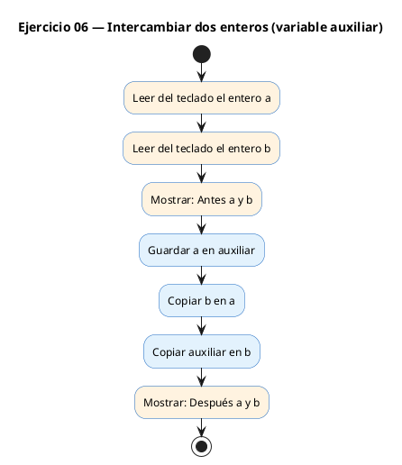
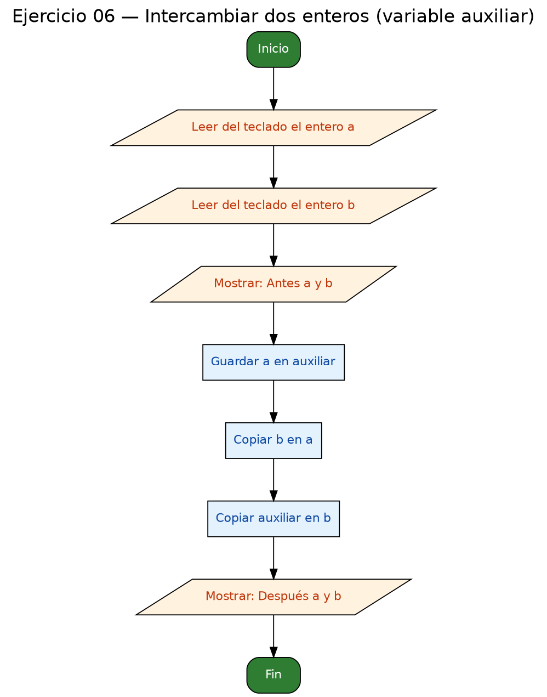

<!-- FICHERO GENERADO — NO EDITAR. Fuente de verdad: curso-c/practica/01-variables/ej06.md (se regenera con gen_course.py). -->

# Ejercicio 06 — Leer dos enteros e intercambiarlos con una variable auxiliar

Dificultad: amarillo · Módulo 01 (Variables, tipos y entrada/salida)

## Enunciado

Leer dos enteros e intercambiarlos con una variable auxiliar.

## Diagramas de flujo





## Cómo se resuelve

<!-- EXPLICACION -->
Intercambiar el contenido de dos variables. Parece trivial, pero esconde un problema de **orden**.

El intento ingenuo `a = b; b = a;` **no funciona**: en cuanto haces `a = b`, el valor original de `a` se pierde para siempre, y la segunda línea copia `b` sobre sí mismo. Acabas con las dos variables iguales.

La solución es una **variable auxiliar** que guarde el valor antes de pisarlo:

1. `int aux = a;` — guardamos una copia del `a` original.
2. `a = b;` — ahora `a` puede tomar el valor de `b` sin perder nada (lo teníamos en `aux`).
3. `b = aux;` — `b` recibe el `a` original que habíamos guardado.

Imagínalo con dos vasos llenos: para intercambiar sus líquidos necesitas un tercer vaso vacío. `aux` es ese tercer vaso. Este patrón del "swap con variable temporal" reaparece constantemente al ordenar listas.

## Para practicar — cópialo y complétalo

Pega este esqueleto y completa los `TODO`. Es la mejor forma de aprender: inténtalo antes de mirar la solución.

```c
/*
 * Curso de C — Modulo 01: Variables, tipos y entrada/salida
 * Ejercicio 06 — PRACTICA (rellena los TODO)
 * Enunciado: Leer dos enteros e intercambiarlos con una variable auxiliar.
 * Dificultad: amarillo
 * Stdin: 3\n8
 * Compilar: gcc -std=c11 -Wall ej06_practica.c -o ej06 && ./ej06
 */
#include <stdio.h>

int main(void) {
    // TODO: declara dos enteros 'a' y 'b', inicializados a 0

    // TODO: lee 'a' del usuario (muestra "a = " antes)

    // TODO: lee 'b' del usuario (muestra "b = " antes)

    // TODO: muestra los valores ANTES del intercambio:
    //       "Antes: a = %d, b = %d\n"

    // TODO: intercambia a y b usando una variable auxiliar 'aux'
    //       Paso 1: aux = a        (guarda a)
    //       Paso 2: a   = b        (a recibe b)
    //       Paso 3: b   = aux      (b recibe el a original)

    // TODO: muestra los valores DESPUES del intercambio:
    //       "Después: a = %d, b = %d\n"

    return 0;
}
```

## Solución — cópiala y ejecútala

```c
/*
 * Curso de C — Modulo 01: Variables, tipos y entrada/salida
 * Ejercicio 06 — MODELO (resuelto)
 * Enunciado: Leer dos enteros e intercambiarlos con una variable auxiliar.
 * Dificultad: amarillo
 * Stdin: 3\n8
 * Compilar: gcc -std=c11 -Wall ej06_modelo.c -o ej06 && ./ej06
 */
#include <stdio.h>

int main(void) {
    int a = 0, b = 0;

    printf("a = ");
    scanf("%d", &a);
    printf("b = ");
    scanf("%d", &b);

    printf("Antes: a = %d, b = %d\n", a, b);

    // Intercambio clasico con variable auxiliar
    // Si hicieramos a = b directamente, perderiamos el valor original de a
    int aux = a;   // guardamos a
    a = b;         // a toma el valor de b
    b = aux;       // b toma el valor original de a

    printf("Después: a = %d, b = %d\n", a, b);

    return 0;
}
```

## Ejecútalo en el navegador

[▶ Abrir y ejecutar en Compiler Explorer](https://godbolt.org/clientstate/eyJzZXNzaW9ucyI6W3siaWQiOjEsImxhbmd1YWdlIjoiYyIsInNvdXJjZSI6Ii8qXG4gKiBDdXJzbyBkZSBDIFx1MjAxNCBNb2R1bG8gMDE6IFZhcmlhYmxlcywgdGlwb3MgeSBlbnRyYWRhL3NhbGlkYVxuICogRWplcmNpY2lvIDA2IFx1MjAxNCBNT0RFTE8gKHJlc3VlbHRvKVxuICogRW51bmNpYWRvOiBMZWVyIGRvcyBlbnRlcm9zIGUgaW50ZXJjYW1iaWFybG9zIGNvbiB1bmEgdmFyaWFibGUgYXV4aWxpYXIuXG4gKiBEaWZpY3VsdGFkOiBhbWFyaWxsb1xuICogU3RkaW46IDNcXG44XG4gKiBDb21waWxhcjogZ2NjIC1zdGQ9YzExIC1XYWxsIGVqMDZfbW9kZWxvLmMgLW8gZWowNiAmJiAuL2VqMDZcbiAqL1xuI2luY2x1ZGUgPHN0ZGlvLmg%2BXG5cbmludCBtYWluKHZvaWQpIHtcbiAgICBpbnQgYSA9IDAsIGIgPSAwO1xuXG4gICAgcHJpbnRmKFwiYSA9IFwiKTtcbiAgICBzY2FuZihcIiVkXCIsICZhKTtcbiAgICBwcmludGYoXCJiID0gXCIpO1xuICAgIHNjYW5mKFwiJWRcIiwgJmIpO1xuXG4gICAgcHJpbnRmKFwiQW50ZXM6IGEgPSAlZCwgYiA9ICVkXFxuXCIsIGEsIGIpO1xuXG4gICAgLy8gSW50ZXJjYW1iaW8gY2xhc2ljbyBjb24gdmFyaWFibGUgYXV4aWxpYXJcbiAgICAvLyBTaSBoaWNpZXJhbW9zIGEgPSBiIGRpcmVjdGFtZW50ZSwgcGVyZGVyaWFtb3MgZWwgdmFsb3Igb3JpZ2luYWwgZGUgYVxuICAgIGludCBhdXggPSBhOyAgIC8vIGd1YXJkYW1vcyBhXG4gICAgYSA9IGI7ICAgICAgICAgLy8gYSB0b21hIGVsIHZhbG9yIGRlIGJcbiAgICBiID0gYXV4OyAgICAgICAvLyBiIHRvbWEgZWwgdmFsb3Igb3JpZ2luYWwgZGUgYVxuXG4gICAgcHJpbnRmKFwiRGVzcHVcdTAwZTlzOiBhID0gJWQsIGIgPSAlZFxcblwiLCBhLCBiKTtcblxuICAgIHJldHVybiAwO1xufVxuIiwiY29tcGlsZXJzIjpbXSwiZXhlY3V0b3JzIjpbeyJhcmd1bWVudHMiOiIiLCJjb21waWxlciI6eyJpZCI6ImNnMTQzIiwibGlicyI6W10sIm9wdGlvbnMiOiItc3RkPWMxMSAtbG0ifSwic3RkaW4iOiIzXG44Iiwid3JhcCI6ZmFsc2V9XX1dfQ%3D%3D)

Se abre con la solución ya cargada; pulsa el botón de ejecutar (Run) para ver la salida. No hay que instalar nada.

## Cómo usarlo

Pega el código en un fichero y ejecútalo con tu toolchain habitual (o el botón de Ejecutar de tu editor). Antes de mirar la solución, intenta completar tú el esqueleto: es la mejor forma de aprender.

## Conexiones

- [[Curso_C/modelo/01-variables|Teoría del módulo]]
- [[Curso_C/practica/00_README|Índice del curso]]
