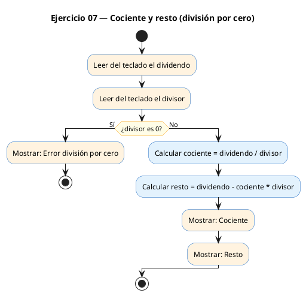
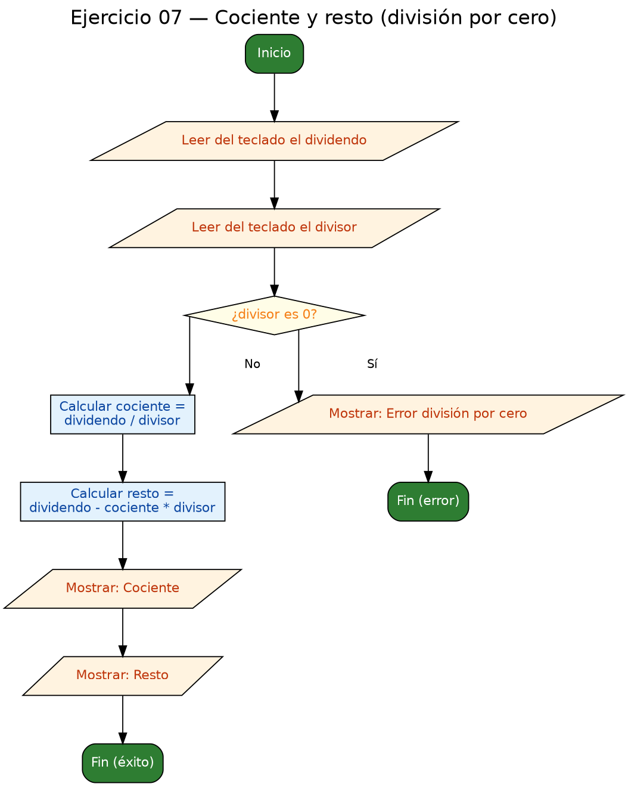

<!-- FICHERO GENERADO — NO EDITAR. Fuente de verdad: curso-c/practica/01-variables/ej07.md (se regenera con gen_course.py). -->

# Ejercicio 07 — Cociente y resto sin usar % para el resto

Dificultad: rojo · Módulo 01 (Variables, tipos y entrada/salida)

## Enunciado

Cociente y resto sin usar % para el resto; detectar división por cero.

## Diagramas de flujo





## Cómo se resuelve

<!-- EXPLICACION -->
El ejercicio rojo del módulo: junta un cálculo con "truco" y la **defensa ante una entrada peligrosa**.

1. **Comprobar antes de dividir.** Dividir un entero entre cero es un error grave en C (el programa revienta). Por eso, antes de calcular nada:
   ```c
   if (divisor == 0) {
       printf("Error: división por cero.\n");
       return 1;
   }
   ```
   El `return 1` sale del programa con un **código de error** distinto de 0, la convención con la que un programa le dice al sistema operativo "he terminado mal". (El `if` lo verás a fondo en el módulo 02; aquí basta la forma `if (condición) { ... }`.)
2. **Cociente:** `dividendo / divisor`. Entre enteros, `/` da la **división entera** (trunca hacia cero): `7 / 2` es `3`, no `3.5`.
3. **Resto sin usar `%`:** en lugar del operador módulo, se aplica su definición: `resto = dividendo - cociente * divisor`. Con 7 y 2: `7 - 3*2 = 1`. Es exactamente lo que haría `7 % 2`.

La idea transferible: **valida las entradas peligrosas antes de operar con ellas**. Comprobar el divisor a cero es el primer ejemplo de programación defensiva, algo que harás toda tu vida.

## Para practicar — cópialo y complétalo

Pega este esqueleto y completa los `TODO`. Es la mejor forma de aprender: inténtalo antes de mirar la solución.

```c
/*
 * Curso de C — Modulo 01: Variables, tipos y entrada/salida
 * Ejercicio 07 — PRACTICA (rellena los TODO)
 * Enunciado: Cociente y resto sin usar % para el resto; detectar división por cero.
 * Dificultad: rojo
 * Stdin: 17\n5
 * Compilar: gcc -std=c11 -Wall ej07_practica.c -o ej07 && ./ej07
 */
#include <stdio.h>

int main(void) {
    // TODO: declara dos enteros 'dividendo' y 'divisor', inicializados a 0

    // TODO: lee el dividendo del usuario

    // TODO: lee el divisor del usuario

    // TODO: comprueba si el divisor es 0.
    //       Si lo es, muestra "Error: división por cero.\n" y haz return 1.
    //       (el if lo veras en detalle en el modulo 02, pero la sintaxis es:
    //        if (condicion) { ... }  )

    // TODO: calcula el cociente usando division entera: dividendo / divisor
    //       Guarda el resultado en una variable int llamada 'cociente'

    // TODO: calcula el resto SIN usar el operador %
    //       Formula: resto = dividendo - cociente * divisor
    //       Guarda el resultado en una variable int llamada 'resto'

    // TODO: muestra "Cociente: %d\n" y "Resto: %d\n"

    return 0;
}
```

## Solución — cópiala y ejecútala

```c
/*
 * Curso de C — Modulo 01: Variables, tipos y entrada/salida
 * Ejercicio 07 — MODELO (resuelto)
 * Enunciado: Cociente y resto sin usar % para el resto; detectar división por cero.
 * Dificultad: rojo
 * Stdin: 17\n5
 * Compilar: gcc -std=c11 -Wall ej07_modelo.c -o ej07 && ./ej07
 */
#include <stdio.h>

int main(void) {
    int dividendo = 0, divisor = 0;

    printf("Dividendo: ");
    scanf("%d", &dividendo);
    printf("Divisor: ");
    scanf("%d", &divisor);

    // Comprobamos division por cero ANTES de calcular
    if (divisor == 0) {
        printf("Error: división por cero.\n");
        return 1;   // devolvemos 1 para indicar error al sistema operativo
    }

    // Cociente: division entera en C trunca hacia cero
    int cociente = dividendo / divisor;

    // Resto sin usar %: resto = dividendo - cociente * divisor
    // (equivalente matematico a la definicion de division euclidiana)
    int resto = dividendo - cociente * divisor;

    printf("Cociente: %d\n", cociente);
    printf("Resto: %d\n",    resto);

    return 0;
}
```

## Ejecútalo en el navegador

[▶ Abrir y ejecutar en Compiler Explorer](https://godbolt.org/clientstate/eyJzZXNzaW9ucyI6W3siaWQiOjEsImxhbmd1YWdlIjoiYyIsInNvdXJjZSI6Ii8qXG4gKiBDdXJzbyBkZSBDIFx1MjAxNCBNb2R1bG8gMDE6IFZhcmlhYmxlcywgdGlwb3MgeSBlbnRyYWRhL3NhbGlkYVxuICogRWplcmNpY2lvIDA3IFx1MjAxNCBNT0RFTE8gKHJlc3VlbHRvKVxuICogRW51bmNpYWRvOiBDb2NpZW50ZSB5IHJlc3RvIHNpbiB1c2FyICUgcGFyYSBlbCByZXN0bzsgZGV0ZWN0YXIgZGl2aXNpXHUwMGYzbiBwb3IgY2Vyby5cbiAqIERpZmljdWx0YWQ6IHJvam9cbiAqIFN0ZGluOiAxN1xcbjVcbiAqIENvbXBpbGFyOiBnY2MgLXN0ZD1jMTEgLVdhbGwgZWowN19tb2RlbG8uYyAtbyBlajA3ICYmIC4vZWowN1xuICovXG4jaW5jbHVkZSA8c3RkaW8uaD5cblxuaW50IG1haW4odm9pZCkge1xuICAgIGludCBkaXZpZGVuZG8gPSAwLCBkaXZpc29yID0gMDtcblxuICAgIHByaW50ZihcIkRpdmlkZW5kbzogXCIpO1xuICAgIHNjYW5mKFwiJWRcIiwgJmRpdmlkZW5kbyk7XG4gICAgcHJpbnRmKFwiRGl2aXNvcjogXCIpO1xuICAgIHNjYW5mKFwiJWRcIiwgJmRpdmlzb3IpO1xuXG4gICAgLy8gQ29tcHJvYmFtb3MgZGl2aXNpb24gcG9yIGNlcm8gQU5URVMgZGUgY2FsY3VsYXJcbiAgICBpZiAoZGl2aXNvciA9PSAwKSB7XG4gICAgICAgIHByaW50ZihcIkVycm9yOiBkaXZpc2lcdTAwZjNuIHBvciBjZXJvLlxcblwiKTtcbiAgICAgICAgcmV0dXJuIDE7ICAgLy8gZGV2b2x2ZW1vcyAxIHBhcmEgaW5kaWNhciBlcnJvciBhbCBzaXN0ZW1hIG9wZXJhdGl2b1xuICAgIH1cblxuICAgIC8vIENvY2llbnRlOiBkaXZpc2lvbiBlbnRlcmEgZW4gQyB0cnVuY2EgaGFjaWEgY2Vyb1xuICAgIGludCBjb2NpZW50ZSA9IGRpdmlkZW5kbyAvIGRpdmlzb3I7XG5cbiAgICAvLyBSZXN0byBzaW4gdXNhciAlOiByZXN0byA9IGRpdmlkZW5kbyAtIGNvY2llbnRlICogZGl2aXNvclxuICAgIC8vIChlcXVpdmFsZW50ZSBtYXRlbWF0aWNvIGEgbGEgZGVmaW5pY2lvbiBkZSBkaXZpc2lvbiBldWNsaWRpYW5hKVxuICAgIGludCByZXN0byA9IGRpdmlkZW5kbyAtIGNvY2llbnRlICogZGl2aXNvcjtcblxuICAgIHByaW50ZihcIkNvY2llbnRlOiAlZFxcblwiLCBjb2NpZW50ZSk7XG4gICAgcHJpbnRmKFwiUmVzdG86ICVkXFxuXCIsICAgIHJlc3RvKTtcblxuICAgIHJldHVybiAwO1xufVxuIiwiY29tcGlsZXJzIjpbXSwiZXhlY3V0b3JzIjpbeyJhcmd1bWVudHMiOiIiLCJjb21waWxlciI6eyJpZCI6ImNnMTQzIiwibGlicyI6W10sIm9wdGlvbnMiOiItc3RkPWMxMSAtbG0ifSwic3RkaW4iOiIxN1xuNSIsIndyYXAiOmZhbHNlfV19XX0%3D)

Se abre con la solución ya cargada; pulsa el botón de ejecutar (Run) para ver la salida. No hay que instalar nada.

## Cómo usarlo

Pega el código en un fichero y ejecútalo con tu toolchain habitual (o el botón de Ejecutar de tu editor). Antes de mirar la solución, intenta completar tú el esqueleto: es la mejor forma de aprender.

## Conexiones

- [[Curso_C/modelo/01-variables|Teoría del módulo]]
- [[Curso_C/practica/00_README|Índice del curso]]
