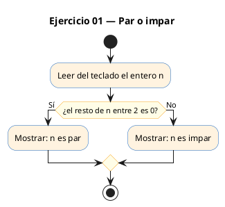
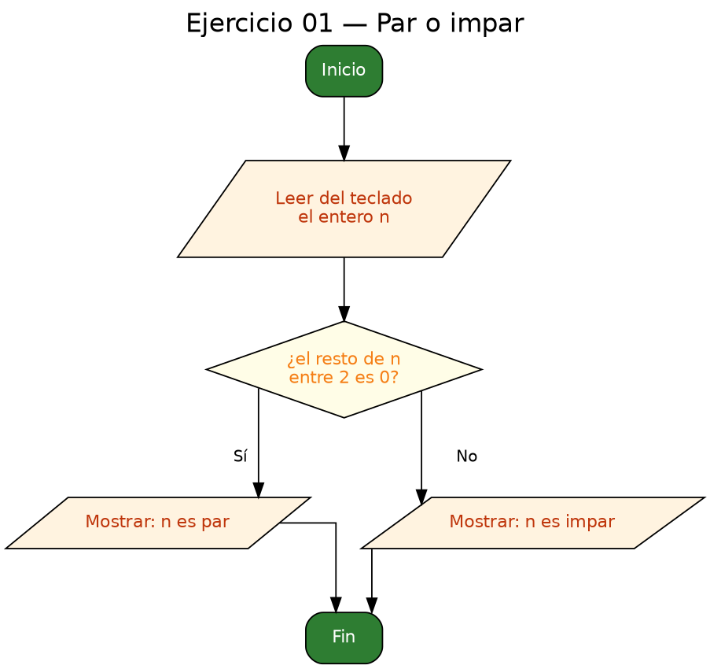

<!-- FICHERO GENERADO — NO EDITAR. Fuente de verdad: curso-c/practica/02-condicionales/ej01.md (se regenera con gen_course.py). -->

# Ejercicio 01 — Lee un entero e indica si es par o impar

Dificultad: verde · Módulo 02 (Condicionales)

## Enunciado

Lee un entero e indica si es par o impar.

## Diagramas de flujo





## Cómo se resuelve

<!-- EXPLICACION -->
El programa lee un entero por teclado y decide si es par o impar. La herramienta clave es el operador módulo `%`, que devuelve el **resto** de una división entera: `n % 2` vale `0` cuando `n` es múltiplo de 2 (par) y distinto de `0` cuando no lo es (impar).

1. `scanf("%d", &n)` lee el número. Fíjate en el `&` delante de `n`: `scanf` necesita la **dirección** de la variable para escribir en ella.
2. `if (n % 2 == 0)` es la condición. El operador `==` **compara** (no confundir con `=`, que asigna). Si el resto es cero, entra la rama del `if`; en cualquier otro caso, la del `else`.

Trampa habitual: querer detectar impar con `if (n % 2 == 1)`. Parece razonable, pero falla con números negativos. En C el resto conserva el signo del dividendo, así que `-3 % 2` vale `-1`, no `1`, y la comparación con `1` daría falso. Por eso lo correcto es preguntar siempre por `== 0` (par) y dejar el resto de los casos al `else`.

## Para practicar — cópialo y complétalo

Pega este esqueleto y completa los `TODO`. Es la mejor forma de aprender: inténtalo antes de mirar la solución.

```c
/*
  Curso de C — Modulo 02: Condicionales
  Ejercicio 01 — PRACTICA (rellena los TODO)
  Enunciado: Lee un entero e indica si es par o impar.
  Dificultad: verde
  Compilar: gcc -std=c11 -Wall ej01_practica.c -o ej01 && ./ej01
*/

#include <stdio.h>

int main(void) {
    int n;

    // TODO: muestra un mensaje pidiendo al usuario un entero
    // TODO: lee el entero con scanf (recuerda el & delante de n)

    // TODO: usa if-else para comprobar si n % 2 == 0
    //       - si es 0: imprime "<n> es par"
    //       - si no:   imprime "<n> es impar"

    return 0;
}
```

## Solución — cópiala y ejecútala

```c
/*
  Curso de C — Modulo 02: Condicionales
  Ejercicio 01 — MODELO (resuelto)
  Enunciado: Lee un entero e indica si es par o impar.
  Dificultad: verde
  Compilar: gcc -std=c11 -Wall ej01_modelo.c -o ej01 && ./ej01
*/

#include <stdio.h>

int main(void) {
    int n;
    printf("Introduce un entero: ");
    scanf("%d", &n);

    // El operador % da el resto de la division entera.
    // Si el resto al dividir entre 2 es 0, el numero es par.
    if (n % 2 == 0) {
        printf("%d es par\n", n);
    } else {
        printf("%d es impar\n", n);
    }

    return 0;
}
```

## Cómo usarlo

Pega el código en un fichero y ejecútalo con tu toolchain habitual (o el botón de Ejecutar de tu editor). Antes de mirar la solución, intenta completar tú el esqueleto: es la mejor forma de aprender.

## Conexiones

- [[Curso_C/modelo/02-condicionales|Teoría del módulo]]
- [[Curso_C/practica/00_README|Índice del curso]]
