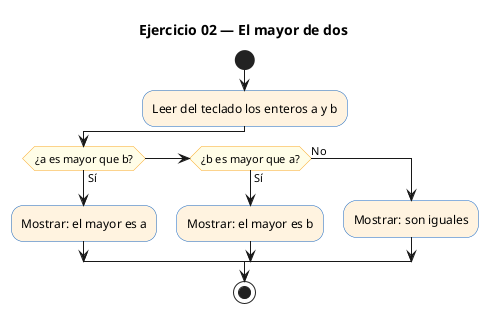
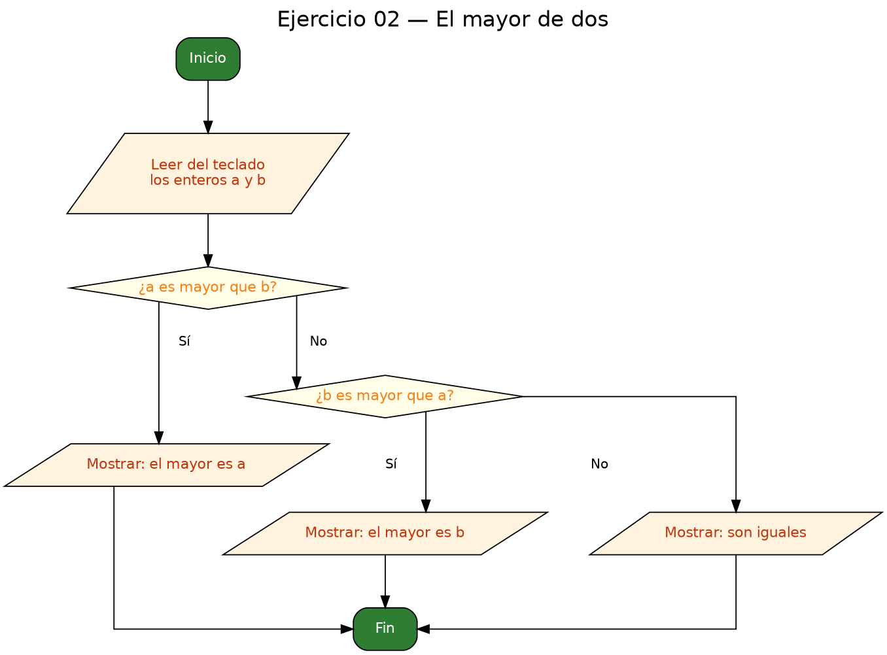

<!-- FICHERO GENERADO — NO EDITAR. Fuente de verdad: curso-c/practica/02-condicionales/ej02.md (se regenera con gen_course.py). -->

# Ejercicio 02 — Lee dos enteros e imprime el mayor

Dificultad: verde · Módulo 02 (Condicionales)

## Enunciado

Lee dos enteros e imprime el mayor; si son iguales, indícalo.

## Diagramas de flujo





## Cómo se resuelve

<!-- EXPLICACION -->
Tres resultados posibles (a mayor, b mayor, o iguales) se resuelven con una **cadena `if / else if / else`**, que garantiza que se ejecute **exactamente una** rama.

1. Se leen los dos enteros de una vez con `scanf("%d %d", &a, &b)` (dos `%d` separados por espacio; ambos con `&`).
2. `if (a > b)` cubre el primer caso; `else if (b > a)` el segundo.
3. El `else` final no necesita condición: si las dos comparaciones anteriores fallaron, es que **no** es `a > b` **ni** `b > a`, así que forzosamente `a == b`. El caso "son iguales" te lo regala la lógica, sin escribirlo.

La trampa habitual es usar tres `if` sueltos e independientes en vez de encadenarlos con `else if`: así C evalúa siempre las tres condiciones, y es fácil imprimir dos mensajes o dejar el caso de iguales sin cubrir. La cadena `if/else if/else` es excluyente por construcción: en cuanto una rama entra, el resto se ignora.

## Para practicar — cópialo y complétalo

Pega este esqueleto y completa los `TODO`. Es la mejor forma de aprender: inténtalo antes de mirar la solución.

```c
/*
  Curso de C — Modulo 02: Condicionales
  Ejercicio 02 — PRACTICA (rellena los TODO)
  Enunciado: Lee dos enteros e imprime el mayor; si son iguales, indícalo.
  Dificultad: verde
  Stdin: 8\n3
  Compilar: gcc -std=c11 -Wall ej02_practica.c -o ej02 && ./ej02
*/

#include <stdio.h>

int main(void) {
    int a, b;

    // TODO: pide al usuario dos enteros
    // TODO: leerlos con scanf en una sola llamada: scanf("%d %d", &a, &b)

    // TODO: usa if / else if / else con tres ramas:
    //   rama 1 (a > b):  "El mayor es <a>"
    //   rama 2 (b > a):  "El mayor es <b>"
    //   rama 3 (iguales): "Son iguales"

    return 0;
}
```

## Solución — cópiala y ejecútala

```c
/*
  Curso de C — Modulo 02: Condicionales
  Ejercicio 02 — MODELO (resuelto)
  Enunciado: Lee dos enteros e imprime el mayor; si son iguales, indícalo.
  Dificultad: verde
  Stdin: 8\n3
  Compilar: gcc -std=c11 -Wall ej02_modelo.c -o ej02 && ./ej02
*/

#include <stdio.h>

int main(void) {
    int a, b;
    printf("Introduce dos enteros: ");
    scanf("%d %d", &a, &b);

    if (a > b) {
        printf("El mayor es %d\n", a);
    } else if (b > a) {
        printf("El mayor es %d\n", b);
    } else {
        // a == b: ambas condiciones anteriores fallaron
        printf("Son iguales\n");
    }

    return 0;
}
```

## Ejecútalo en el navegador

[▶ Abrir y ejecutar en Compiler Explorer](https://godbolt.org/clientstate/eyJzZXNzaW9ucyI6W3siaWQiOjEsImxhbmd1YWdlIjoiYyIsInNvdXJjZSI6Ii8qXG4gIEN1cnNvIGRlIEMgXHUyMDE0IE1vZHVsbyAwMjogQ29uZGljaW9uYWxlc1xuICBFamVyY2ljaW8gMDIgXHUyMDE0IE1PREVMTyAocmVzdWVsdG8pXG4gIEVudW5jaWFkbzogTGVlIGRvcyBlbnRlcm9zIGUgaW1wcmltZSBlbCBtYXlvcjsgc2kgc29uIGlndWFsZXMsIGluZFx1MDBlZGNhbG8uXG4gIERpZmljdWx0YWQ6IHZlcmRlXG4gIFN0ZGluOiA4XFxuM1xuICBDb21waWxhcjogZ2NjIC1zdGQ9YzExIC1XYWxsIGVqMDJfbW9kZWxvLmMgLW8gZWowMiAmJiAuL2VqMDJcbiovXG5cbiNpbmNsdWRlIDxzdGRpby5oPlxuXG5pbnQgbWFpbih2b2lkKSB7XG4gICAgaW50IGEsIGI7XG4gICAgcHJpbnRmKFwiSW50cm9kdWNlIGRvcyBlbnRlcm9zOiBcIik7XG4gICAgc2NhbmYoXCIlZCAlZFwiLCAmYSwgJmIpO1xuXG4gICAgaWYgKGEgPiBiKSB7XG4gICAgICAgIHByaW50ZihcIkVsIG1heW9yIGVzICVkXFxuXCIsIGEpO1xuICAgIH0gZWxzZSBpZiAoYiA%2BIGEpIHtcbiAgICAgICAgcHJpbnRmKFwiRWwgbWF5b3IgZXMgJWRcXG5cIiwgYik7XG4gICAgfSBlbHNlIHtcbiAgICAgICAgLy8gYSA9PSBiOiBhbWJhcyBjb25kaWNpb25lcyBhbnRlcmlvcmVzIGZhbGxhcm9uXG4gICAgICAgIHByaW50ZihcIlNvbiBpZ3VhbGVzXFxuXCIpO1xuICAgIH1cblxuICAgIHJldHVybiAwO1xufVxuIiwiY29tcGlsZXJzIjpbXSwiZXhlY3V0b3JzIjpbeyJhcmd1bWVudHMiOiIiLCJjb21waWxlciI6eyJpZCI6ImNnMTQzIiwibGlicyI6W10sIm9wdGlvbnMiOiItc3RkPWMxMSAtbG0ifSwic3RkaW4iOiI4XG4zIiwid3JhcCI6ZmFsc2V9XX1dfQ%3D%3D)

Se abre con la solución ya cargada; pulsa el botón de ejecutar (Run) para ver la salida. No hay que instalar nada.

## Cómo usarlo

Pega el código en un fichero y ejecútalo con tu toolchain habitual (o el botón de Ejecutar de tu editor). Antes de mirar la solución, intenta completar tú el esqueleto: es la mejor forma de aprender.

## Conexiones

- [[Curso_C/modelo/02-condicionales|Teoría del módulo]]
- [[Curso_C/practica/00_README|Índice del curso]]
