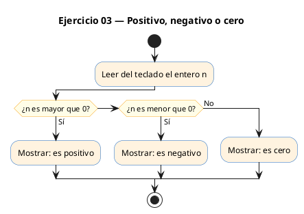
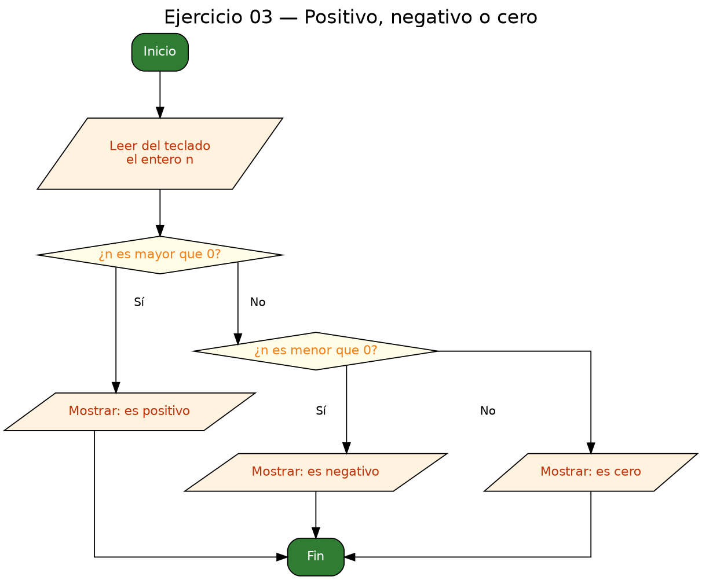

<!-- FICHERO GENERADO — NO EDITAR. Fuente de verdad: curso-c/practica/02-condicionales/ej03.md (se regenera con gen_course.py). -->

# Ejercicio 03 — Lee un entero e indica si es positivo, negativo o cero

Dificultad: verde · Módulo 02 (Condicionales)

## Enunciado

Lee un entero e indica si es positivo, negativo o cero.

## Diagramas de flujo





## Cómo se resuelve

<!-- EXPLICACION -->
El programa lee un entero y lo clasifica en tres categorías mutuamente excluyentes: positivo, negativo o cero. Es el ejemplo de libro para la estructura `if / else if / else`.

1. `scanf("%d", &n)` lee el número (recuerda el `&`).
2. `if (n > 0)` atrapa los positivos; `else if (n < 0)` los negativos. El `else` final no lleva condición porque, si un número no es mayor ni menor que cero, solo puede ser exactamente cero.

La idea importante es el **orden y la exclusión**: las ramas se prueban de arriba abajo y en cuanto una es verdadera, las demás se ignoran. Eso hace innecesario (y sería redundante) escribir `else if (n == 0)` en la última rama.

Trampa habitual: tratar el cero como si fuera un positivo. Si comprobaras solo `if (n >= 0)` para "positivo", el cero se colaría ahí y nunca imprimirías "Es cero". Al usar `n > 0` estricto y dejar el cero al `else`, cada valor cae en una única categoría.

## Para practicar — cópialo y complétalo

Pega este esqueleto y completa los `TODO`. Es la mejor forma de aprender: inténtalo antes de mirar la solución.

```c
/*
  Curso de C — Modulo 02: Condicionales
  Ejercicio 03 — PRACTICA (rellena los TODO)
  Enunciado: Lee un entero e indica si es positivo, negativo o cero.
  Dificultad: verde
  Stdin: 5
  Compilar: gcc -std=c11 -Wall ej03_practica.c -o ej03 && ./ej03
*/

#include <stdio.h>

int main(void) {
    int n;

    // TODO: pide el entero al usuario y leelo con scanf

    // TODO: escribe un if / else if / else con tres ramas:
    //   n > 0  -> "Es positivo"
    //   n < 0  -> "Es negativo"
    //   resto  -> "Es cero"

    return 0;
}
```

## Solución — cópiala y ejecútala

```c
/*
  Curso de C — Modulo 02: Condicionales
  Ejercicio 03 — MODELO (resuelto)
  Enunciado: Lee un entero e indica si es positivo, negativo o cero.
  Dificultad: verde
  Stdin: 5
  Compilar: gcc -std=c11 -Wall ej03_modelo.c -o ej03 && ./ej03
*/

#include <stdio.h>

int main(void) {
    int n;
    printf("Introduce un entero: ");
    scanf("%d", &n);

    // Tres casos mutuamente excluyentes: usamos if-else if-else.
    if (n > 0) {
        printf("Es positivo\n");
    } else if (n < 0) {
        printf("Es negativo\n");
    } else {
        // Solo queda n == 0
        printf("Es cero\n");
    }

    return 0;
}
```

## Ejecútalo en el navegador

[▶ Abrir y ejecutar en Compiler Explorer](https://godbolt.org/clientstate/eyJzZXNzaW9ucyI6W3siaWQiOjEsImxhbmd1YWdlIjoiYyIsInNvdXJjZSI6Ii8qXG4gIEN1cnNvIGRlIEMgXHUyMDE0IE1vZHVsbyAwMjogQ29uZGljaW9uYWxlc1xuICBFamVyY2ljaW8gMDMgXHUyMDE0IE1PREVMTyAocmVzdWVsdG8pXG4gIEVudW5jaWFkbzogTGVlIHVuIGVudGVybyBlIGluZGljYSBzaSBlcyBwb3NpdGl2bywgbmVnYXRpdm8gbyBjZXJvLlxuICBEaWZpY3VsdGFkOiB2ZXJkZVxuICBTdGRpbjogNVxuICBDb21waWxhcjogZ2NjIC1zdGQ9YzExIC1XYWxsIGVqMDNfbW9kZWxvLmMgLW8gZWowMyAmJiAuL2VqMDNcbiovXG5cbiNpbmNsdWRlIDxzdGRpby5oPlxuXG5pbnQgbWFpbih2b2lkKSB7XG4gICAgaW50IG47XG4gICAgcHJpbnRmKFwiSW50cm9kdWNlIHVuIGVudGVybzogXCIpO1xuICAgIHNjYW5mKFwiJWRcIiwgJm4pO1xuXG4gICAgLy8gVHJlcyBjYXNvcyBtdXR1YW1lbnRlIGV4Y2x1eWVudGVzOiB1c2Ftb3MgaWYtZWxzZSBpZi1lbHNlLlxuICAgIGlmIChuID4gMCkge1xuICAgICAgICBwcmludGYoXCJFcyBwb3NpdGl2b1xcblwiKTtcbiAgICB9IGVsc2UgaWYgKG4gPCAwKSB7XG4gICAgICAgIHByaW50ZihcIkVzIG5lZ2F0aXZvXFxuXCIpO1xuICAgIH0gZWxzZSB7XG4gICAgICAgIC8vIFNvbG8gcXVlZGEgbiA9PSAwXG4gICAgICAgIHByaW50ZihcIkVzIGNlcm9cXG5cIik7XG4gICAgfVxuXG4gICAgcmV0dXJuIDA7XG59XG4iLCJjb21waWxlcnMiOltdLCJleGVjdXRvcnMiOlt7ImFyZ3VtZW50cyI6IiIsImNvbXBpbGVyIjp7ImlkIjoiY2cxNDMiLCJsaWJzIjpbXSwib3B0aW9ucyI6Ii1zdGQ9YzExIC1sbSJ9LCJzdGRpbiI6IjUiLCJ3cmFwIjpmYWxzZX1dfV19)

Se abre con la solución ya cargada; pulsa el botón de ejecutar (Run) para ver la salida. No hay que instalar nada.

## Cómo usarlo

Pega el código en un fichero y ejecútalo con tu toolchain habitual (o el botón de Ejecutar de tu editor). Antes de mirar la solución, intenta completar tú el esqueleto: es la mejor forma de aprender.

## Conexiones

- [[Curso_C/modelo/02-condicionales|Teoría del módulo]]
- [[Curso_C/practica/00_README|Índice del curso]]
