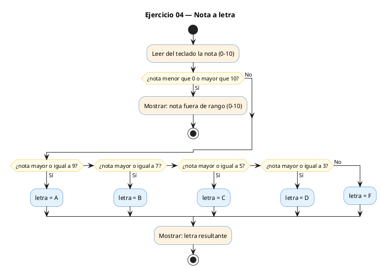
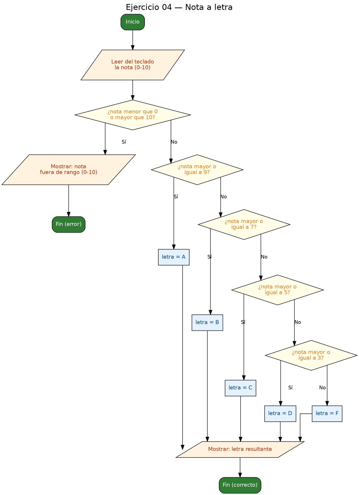

<!-- FICHERO GENERADO — NO EDITAR. Fuente de verdad: curso-c/practica/02-condicionales/ej04.md (se regenera con gen_course.py). -->

# Ejercicio 04 — Lee una nota entera (0-10) e imprime la letra

Dificultad: amarillo · Módulo 02 (Condicionales)

## Enunciado

Lee una nota entera (0-10) e imprime la letra: 9-10 -> A, 7-8 -> B, 5-6 -> C, 3-4 -> D, 0-2 -> F.

## Diagramas de flujo





## Cómo se resuelve

<!-- EXPLICACION -->
El programa lee una nota entera de 0 a 10 y la traduce a una letra (A, B, C, D o F). Combina dos ideas: **validar la entrada** y **clasificar por rangos** con `if / else if / else`.

1. Validación: antes de clasificar, `if (nota < 0 || nota > 10)` comprueba que la nota está en el rango permitido. El operador lógico `||` (OR) es verdadero si **cualquiera** de las dos comparaciones lo es. Si la nota es inválida, se imprime un error y `return 1` termina el programa con un código distinto de cero (convención de "algo salió mal").
2. Clasificación: usamos una variable `char letra` y una cadena `if-else if` en **orden descendente** (`>= 9`, luego `>= 7`, etc.). La clave es que cada rama solo se alcanza si todas las anteriores fallaron. Cuando llegamos a `else if (nota >= 7)`, ya sabemos que la nota es menor que 9, así que ese `>= 7` cubre exactamente el tramo 7-8 sin necesidad de escribir `nota >= 7 && nota <= 8`.

Trampa habitual: comprobar los rangos de menor a mayor. Si empezaras por `if (nota >= 3)`, un 10 entraría ahí y recibiría una D, porque 10 también es `>= 3`. Al ir de mayor a menor, cada nota cae en su tramo correcto en la primera condición que cumple. También conviene no olvidar la validación: sin ella, una nota como 15 recibiría una A silenciosamente.

## Para practicar — cópialo y complétalo

Pega este esqueleto y completa los `TODO`. Es la mejor forma de aprender: inténtalo antes de mirar la solución.

```c
/*
  Curso de C — Modulo 02: Condicionales
  Ejercicio 04 — PRACTICA (rellena los TODO)
  Enunciado: Lee una nota entera (0-10) e imprime la letra:
             9-10 -> A, 7-8 -> B, 5-6 -> C, 3-4 -> D, 0-2 -> F.
  Dificultad: amarillo
  Stdin: 8
  Compilar: gcc -std=c11 -Wall ej04_practica.c -o ej04 && ./ej04
*/

#include <stdio.h>

int main(void) {
    int nota;

    // TODO: pide la nota al usuario y leela con scanf

    // TODO: valida que la nota esta entre 0 y 10 (usa ||)
    //       si no es valida, imprime error y haz return 1

    char letra;

    // TODO: asigna a 'letra' el caracter correcto usando if / else if / else:
    //   nota >= 9        -> 'A'
    //   nota >= 7        -> 'B'
    //   nota >= 5        -> 'C'
    //   nota >= 3        -> 'D'
    //   resto (0-2)      -> 'F'
    // Consejo: comprueba de mayor a menor para evitar solapamientos.

    // TODO: imprime "Nota: <letra>"

    return 0;
}
```

## Solución — cópiala y ejecútala

```c
/*
  Curso de C — Modulo 02: Condicionales
  Ejercicio 04 — MODELO (resuelto)
  Enunciado: Lee una nota entera (0-10) e imprime la letra:
             9-10 -> A, 7-8 -> B, 5-6 -> C, 3-4 -> D, 0-2 -> F.
  Dificultad: amarillo
  Stdin: 8
  Compilar: gcc -std=c11 -Wall ej04_modelo.c -o ej04 && ./ej04
*/

#include <stdio.h>

int main(void) {
    int nota;
    printf("Introduce la nota (0-10): ");
    scanf("%d", &nota);

    // Validacion: la nota debe estar en rango valido
    if (nota < 0 || nota > 10) {
        printf("Nota fuera de rango (0-10)\n");
        return 1;  // codigo de error distinto de 0
    }

    // Convertimos la nota entera a letra con if-else if en orden descendente.
    // El orden importa: comprobamos el rango mas alto primero.
    char letra;
    if (nota >= 9) {
        letra = 'A';
    } else if (nota >= 7) {
        letra = 'B';
    } else if (nota >= 5) {
        letra = 'C';
    } else if (nota >= 3) {
        letra = 'D';
    } else {
        letra = 'F';
    }

    printf("Nota: %c\n", letra);

    return 0;
}
```

## Ejecútalo en el navegador

[▶ Abrir y ejecutar en Compiler Explorer](https://godbolt.org/clientstate/eyJzZXNzaW9ucyI6W3siaWQiOjEsImxhbmd1YWdlIjoiYyIsInNvdXJjZSI6Ii8qXG4gIEN1cnNvIGRlIEMgXHUyMDE0IE1vZHVsbyAwMjogQ29uZGljaW9uYWxlc1xuICBFamVyY2ljaW8gMDQgXHUyMDE0IE1PREVMTyAocmVzdWVsdG8pXG4gIEVudW5jaWFkbzogTGVlIHVuYSBub3RhIGVudGVyYSAoMC0xMCkgZSBpbXByaW1lIGxhIGxldHJhOlxuICAgICAgICAgICAgIDktMTAgLT4gQSwgNy04IC0%2BIEIsIDUtNiAtPiBDLCAzLTQgLT4gRCwgMC0yIC0%2BIEYuXG4gIERpZmljdWx0YWQ6IGFtYXJpbGxvXG4gIFN0ZGluOiA4XG4gIENvbXBpbGFyOiBnY2MgLXN0ZD1jMTEgLVdhbGwgZWowNF9tb2RlbG8uYyAtbyBlajA0ICYmIC4vZWowNFxuKi9cblxuI2luY2x1ZGUgPHN0ZGlvLmg%2BXG5cbmludCBtYWluKHZvaWQpIHtcbiAgICBpbnQgbm90YTtcbiAgICBwcmludGYoXCJJbnRyb2R1Y2UgbGEgbm90YSAoMC0xMCk6IFwiKTtcbiAgICBzY2FuZihcIiVkXCIsICZub3RhKTtcblxuICAgIC8vIFZhbGlkYWNpb246IGxhIG5vdGEgZGViZSBlc3RhciBlbiByYW5nbyB2YWxpZG9cbiAgICBpZiAobm90YSA8IDAgfHwgbm90YSA%2BIDEwKSB7XG4gICAgICAgIHByaW50ZihcIk5vdGEgZnVlcmEgZGUgcmFuZ28gKDAtMTApXFxuXCIpO1xuICAgICAgICByZXR1cm4gMTsgIC8vIGNvZGlnbyBkZSBlcnJvciBkaXN0aW50byBkZSAwXG4gICAgfVxuXG4gICAgLy8gQ29udmVydGltb3MgbGEgbm90YSBlbnRlcmEgYSBsZXRyYSBjb24gaWYtZWxzZSBpZiBlbiBvcmRlbiBkZXNjZW5kZW50ZS5cbiAgICAvLyBFbCBvcmRlbiBpbXBvcnRhOiBjb21wcm9iYW1vcyBlbCByYW5nbyBtYXMgYWx0byBwcmltZXJvLlxuICAgIGNoYXIgbGV0cmE7XG4gICAgaWYgKG5vdGEgPj0gOSkge1xuICAgICAgICBsZXRyYSA9ICdBJztcbiAgICB9IGVsc2UgaWYgKG5vdGEgPj0gNykge1xuICAgICAgICBsZXRyYSA9ICdCJztcbiAgICB9IGVsc2UgaWYgKG5vdGEgPj0gNSkge1xuICAgICAgICBsZXRyYSA9ICdDJztcbiAgICB9IGVsc2UgaWYgKG5vdGEgPj0gMykge1xuICAgICAgICBsZXRyYSA9ICdEJztcbiAgICB9IGVsc2Uge1xuICAgICAgICBsZXRyYSA9ICdGJztcbiAgICB9XG5cbiAgICBwcmludGYoXCJOb3RhOiAlY1xcblwiLCBsZXRyYSk7XG5cbiAgICByZXR1cm4gMDtcbn1cbiIsImNvbXBpbGVycyI6W10sImV4ZWN1dG9ycyI6W3siYXJndW1lbnRzIjoiIiwiY29tcGlsZXIiOnsiaWQiOiJjZzE0MyIsImxpYnMiOltdLCJvcHRpb25zIjoiLXN0ZD1jMTEgLWxtIn0sInN0ZGluIjoiOCIsIndyYXAiOmZhbHNlfV19XX0%3D)

Se abre con la solución ya cargada; pulsa el botón de ejecutar (Run) para ver la salida. No hay que instalar nada.

## Cómo usarlo

Pega el código en un fichero y ejecútalo con tu toolchain habitual (o el botón de Ejecutar de tu editor). Antes de mirar la solución, intenta completar tú el esqueleto: es la mejor forma de aprender.

## Conexiones

- [[Curso_C/modelo/02-condicionales|Teoría del módulo]]
- [[Curso_C/practica/00_README|Índice del curso]]
