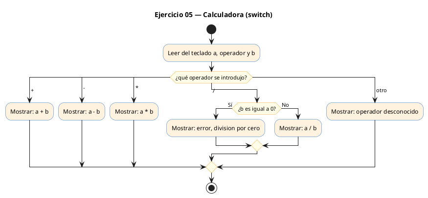
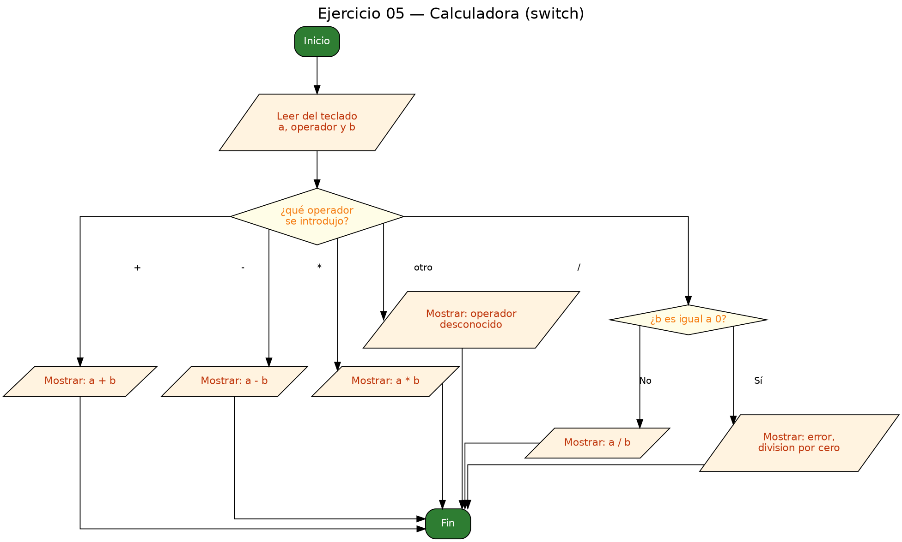

<!-- FICHERO GENERADO — NO EDITAR. Fuente de verdad: curso-c/practica/02-condicionales/ej05.md (se regenera con gen_course.py). -->

# Ejercicio 05 — Lee dos números reales y un operador

Dificultad: amarillo · Módulo 02 (Condicionales)

## Enunciado

Lee dos números reales y un operador (+,-,*,/) e imprime el resultado; avisa si se intenta dividir por cero.

## Diagramas de flujo





## Cómo se resuelve

<!-- EXPLICACION -->
El programa es una mini-calculadora: lee dos números reales y un operador (`+`, `-`, `*`, `/`) y muestra el resultado. Es el ejercicio para practicar `switch`, que elige entre varios casos discretos de forma más limpia que una cadena de `if-else`.

1. `scanf("%lf %c %lf", &a, &op, &b)` lee los tres datos de golpe: `%lf` lee un `double` y `%c` lee un único carácter (el operador). Al usar `double` guardamos decimales, y por eso imprimimos con `%.2f` (dos decimales).
2. `switch (op)` compara el carácter leído contra cada `case`. Cada rama calcula su operación, imprime el resultado y termina con `break`. El `default` recoge cualquier operador que no reconozcamos.
3. El caso `'/'` lleva un `if` extra: antes de dividir, comprueba que `b` no sea cero, porque dividir entre cero es una operación inválida. Es un buen ejemplo de anidar un condicional dentro de un `case`.

Trampa habitual: olvidar el `break` al final de cada `case`. Sin él, la ejecución "cae" al siguiente caso (*fall-through*): si escribieras `+` sin `break`, además de la suma se ejecutaría también el código de la resta. El compilador no siempre avisa, así que pon `break` en cada rama salvo que el encadenamiento sea deliberado.

## Para practicar — cópialo y complétalo

Pega este esqueleto y completa los `TODO`. Es la mejor forma de aprender: inténtalo antes de mirar la solución.

```c
/*
  Curso de C — Modulo 02: Condicionales
  Ejercicio 05 — PRACTICA (rellena los TODO)
  Enunciado: Lee dos números reales y un operador (+,-,*,/) e imprime el
             resultado; avisa si se intenta dividir por cero.
  Dificultad: amarillo
  Stdin: 10 / 2
  Compilar: gcc -std=c11 -Wall ej05_practica.c -o ej05 && ./ej05
*/

#include <stdio.h>

int main(void) {
    double a, b;
    char op;

    // TODO: muestra un mensaje como "Introduce: num1 op num2 (ej: 10 / 2): "
    // TODO: lee a, op y b con una sola llamada a scanf
    //       formato sugerido: "%lf %c %lf"
    //       (usa &a, &op, &b)

    // TODO: escribe un switch sobre 'op' con cuatro cases: '+' '-' '*' '/'
    //   - Para cada operacion aritmetica, calcula e imprime "Resultado: %.2f"
    //   - Para '/', antes de dividir comprueba con un if que b != 0.0
    //     Si b es 0, imprime "Error: division por cero"
    //   - En el case default, imprime "Operador desconocido"
    //   - No olvides el break al final de cada case

    return 0;
}
```

## Solución — cópiala y ejecútala

```c
/*
  Curso de C — Modulo 02: Condicionales
  Ejercicio 05 — MODELO (resuelto)
  Enunciado: Lee dos números reales y un operador (+,-,*,/) e imprime el
             resultado; avisa si se intenta dividir por cero.
  Dificultad: amarillo
  Stdin: 10 / 2
  Compilar: gcc -std=c11 -Wall ej05_modelo.c -o ej05 && ./ej05
*/

#include <stdio.h>

int main(void) {
    double a, b;
    char op;

    printf("Introduce: num1 operador num2 (ej: 10 / 2): ");
    // %lf lee double; %c lee el caracter del operador
    scanf("%lf %c %lf", &a, &op, &b);

    // switch sobre el caracter del operador
    switch (op) {
        case '+':
            printf("Resultado: %.2f\n", a + b);
            break;
        case '-':
            printf("Resultado: %.2f\n", a - b);
            break;
        case '*':
            printf("Resultado: %.2f\n", a * b);
            break;
        case '/':
            // Antes de dividir, comprobamos que el divisor no sea cero
            if (b == 0.0) {
                printf("Error: division por cero\n");
            } else {
                printf("Resultado: %.2f\n", a / b);
            }
            break;
        default:
            printf("Operador desconocido: %c\n", op);
            break;
    }

    return 0;
}
```

## Ejecútalo en el navegador

[▶ Abrir y ejecutar en Compiler Explorer](https://godbolt.org/clientstate/eyJzZXNzaW9ucyI6W3siaWQiOjEsImxhbmd1YWdlIjoiYyIsInNvdXJjZSI6Ii8qXG4gIEN1cnNvIGRlIEMgXHUyMDE0IE1vZHVsbyAwMjogQ29uZGljaW9uYWxlc1xuICBFamVyY2ljaW8gMDUgXHUyMDE0IE1PREVMTyAocmVzdWVsdG8pXG4gIEVudW5jaWFkbzogTGVlIGRvcyBuXHUwMGZhbWVyb3MgcmVhbGVzIHkgdW4gb3BlcmFkb3IgKCssLSwqLC8pIGUgaW1wcmltZSBlbFxuICAgICAgICAgICAgIHJlc3VsdGFkbzsgYXZpc2Egc2kgc2UgaW50ZW50YSBkaXZpZGlyIHBvciBjZXJvLlxuICBEaWZpY3VsdGFkOiBhbWFyaWxsb1xuICBTdGRpbjogMTAgLyAyXG4gIENvbXBpbGFyOiBnY2MgLXN0ZD1jMTEgLVdhbGwgZWowNV9tb2RlbG8uYyAtbyBlajA1ICYmIC4vZWowNVxuKi9cblxuI2luY2x1ZGUgPHN0ZGlvLmg%2BXG5cbmludCBtYWluKHZvaWQpIHtcbiAgICBkb3VibGUgYSwgYjtcbiAgICBjaGFyIG9wO1xuXG4gICAgcHJpbnRmKFwiSW50cm9kdWNlOiBudW0xIG9wZXJhZG9yIG51bTIgKGVqOiAxMCAvIDIpOiBcIik7XG4gICAgLy8gJWxmIGxlZSBkb3VibGU7ICVjIGxlZSBlbCBjYXJhY3RlciBkZWwgb3BlcmFkb3JcbiAgICBzY2FuZihcIiVsZiAlYyAlbGZcIiwgJmEsICZvcCwgJmIpO1xuXG4gICAgLy8gc3dpdGNoIHNvYnJlIGVsIGNhcmFjdGVyIGRlbCBvcGVyYWRvclxuICAgIHN3aXRjaCAob3ApIHtcbiAgICAgICAgY2FzZSAnKyc6XG4gICAgICAgICAgICBwcmludGYoXCJSZXN1bHRhZG86ICUuMmZcXG5cIiwgYSArIGIpO1xuICAgICAgICAgICAgYnJlYWs7XG4gICAgICAgIGNhc2UgJy0nOlxuICAgICAgICAgICAgcHJpbnRmKFwiUmVzdWx0YWRvOiAlLjJmXFxuXCIsIGEgLSBiKTtcbiAgICAgICAgICAgIGJyZWFrO1xuICAgICAgICBjYXNlICcqJzpcbiAgICAgICAgICAgIHByaW50ZihcIlJlc3VsdGFkbzogJS4yZlxcblwiLCBhICogYik7XG4gICAgICAgICAgICBicmVhaztcbiAgICAgICAgY2FzZSAnLyc6XG4gICAgICAgICAgICAvLyBBbnRlcyBkZSBkaXZpZGlyLCBjb21wcm9iYW1vcyBxdWUgZWwgZGl2aXNvciBubyBzZWEgY2Vyb1xuICAgICAgICAgICAgaWYgKGIgPT0gMC4wKSB7XG4gICAgICAgICAgICAgICAgcHJpbnRmKFwiRXJyb3I6IGRpdmlzaW9uIHBvciBjZXJvXFxuXCIpO1xuICAgICAgICAgICAgfSBlbHNlIHtcbiAgICAgICAgICAgICAgICBwcmludGYoXCJSZXN1bHRhZG86ICUuMmZcXG5cIiwgYSAvIGIpO1xuICAgICAgICAgICAgfVxuICAgICAgICAgICAgYnJlYWs7XG4gICAgICAgIGRlZmF1bHQ6XG4gICAgICAgICAgICBwcmludGYoXCJPcGVyYWRvciBkZXNjb25vY2lkbzogJWNcXG5cIiwgb3ApO1xuICAgICAgICAgICAgYnJlYWs7XG4gICAgfVxuXG4gICAgcmV0dXJuIDA7XG59XG4iLCJjb21waWxlcnMiOltdLCJleGVjdXRvcnMiOlt7ImFyZ3VtZW50cyI6IiIsImNvbXBpbGVyIjp7ImlkIjoiY2cxNDMiLCJsaWJzIjpbXSwib3B0aW9ucyI6Ii1zdGQ9YzExIC1sbSJ9LCJzdGRpbiI6IjEwIC8gMiIsIndyYXAiOmZhbHNlfV19XX0%3D)

Se abre con la solución ya cargada; pulsa el botón de ejecutar (Run) para ver la salida. No hay que instalar nada.

## Cómo usarlo

Pega el código en un fichero y ejecútalo con tu toolchain habitual (o el botón de Ejecutar de tu editor). Antes de mirar la solución, intenta completar tú el esqueleto: es la mejor forma de aprender.

## Conexiones

- [[Curso_C/modelo/02-condicionales|Teoría del módulo]]
- [[Curso_C/practica/00_README|Índice del curso]]
