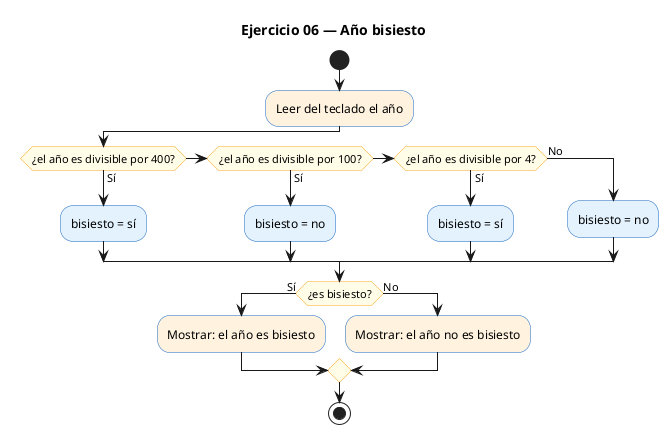
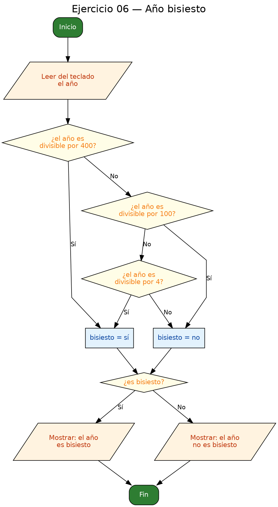

<!-- FICHERO GENERADO — NO EDITAR. Fuente de verdad: curso-c/practica/02-condicionales/ej06.md (se regenera con gen_course.py). -->

# Ejercicio 06 — Lee un año e indica si es bisiesto

Dificultad: amarillo · Módulo 02 (Condicionales)

## Enunciado

Lee un año e indica si es bisiesto. Regla: divisible por 4; EXCEPTO siglos (div. por 100) que no sean tambien divisibles por 400.

## Diagramas de flujo





## Cómo se resuelve

<!-- EXPLICACION -->
El programa lee un año y decide si es bisiesto. La regla del calendario tiene una excepción anidada: un año es bisiesto si es divisible por 4, **excepto** los años de siglo (divisibles por 100), que solo son bisiestos si además lo son por 400. Es el ejemplo perfecto de que en una cadena `if / else if` **el orden manda**.

1. Se lee el año con `scanf` y se usa una variable `int bisiesto` a modo de bandera (`1` = sí, `0` = no), un patrón muy común para "recordar" una decisión.
2. La lógica va de la regla más específica a la más general:
   - `if (anio % 400 == 0)` → bisiesto (2000 lo es).
   - `else if (anio % 100 == 0)` → NO bisiesto (1900 es siglo normal).
   - `else if (anio % 4 == 0)` → bisiesto (2024).
   - `else` → NO bisiesto.
3. Al final, `if (bisiesto)` aprovecha que en C cualquier valor distinto de cero es "verdadero", así que la bandera se puede evaluar directamente sin escribir `== 1`.

Trampa habitual: poner la comprobación del 400 después de la del 100 (o del 4). Como 2000 también es divisible por 100 y por 4, si esas ramas van primero lo clasificarían mal. La condición del 400 debe evaluarse **antes** para que capture su excepción antes de que las reglas más generales se la lleven.

## Para practicar — cópialo y complétalo

Pega este esqueleto y completa los `TODO`. Es la mejor forma de aprender: inténtalo antes de mirar la solución.

```c
/*
  Curso de C — Modulo 02: Condicionales
  Ejercicio 06 — PRACTICA (rellena los TODO)
  Enunciado: Lee un año e indica si es bisiesto.
             Regla: divisible por 4; EXCEPTO siglos (div. por 100)
             que no sean tambien divisibles por 400.
  Dificultad: amarillo
  Stdin: 2024
  Compilar: gcc -std=c11 -Wall ej06_practica.c -o ej06 && ./ej06
*/

#include <stdio.h>

int main(void) {
    int anio;

    // TODO: pide el ano al usuario y leelo con scanf

    int bisiesto;  // usaremos 1 = si, 0 = no

    // TODO: implementa la logica en orden de prioridad con if-else if-else:
    //   1. Si anio % 400 == 0  -> bisiesto = 1
    //   2. Si anio % 100 == 0  -> bisiesto = 0  (siglo NO bisiesto)
    //   3. Si anio % 4 == 0    -> bisiesto = 1
    //   4. Resto               -> bisiesto = 0
    // El orden importa: el caso del 400 debe ir ANTES que el del 100.

    // TODO: imprime "<anio> es bisiesto" o "<anio> no es bisiesto"
    //       segun el valor de la variable bisiesto

    return 0;
}
```

## Solución — cópiala y ejecútala

```c
/*
  Curso de C — Modulo 02: Condicionales
  Ejercicio 06 — MODELO (resuelto)
  Enunciado: Lee un año e indica si es bisiesto.
             Regla: divisible por 4; EXCEPTO siglos (div. por 100)
             que no sean tambien divisibles por 400.
  Dificultad: amarillo
  Stdin: 2024
  Compilar: gcc -std=c11 -Wall ej06_modelo.c -o ej06 && ./ej06
*/

#include <stdio.h>

int main(void) {
    int anio;
    printf("Introduce un ano: ");
    scanf("%d", &anio);

    // Algoritmo de bisextilidad:
    // Un ano es bisiesto si:
    //   (divisible por 4) Y ((no divisible por 100) O (divisible por 400))
    // Que es equivalente a:
    //   div por 400  -> bisiesto
    //   div por 100  -> NO bisiesto (siglo normal)
    //   div por 4    -> bisiesto
    //   resto        -> NO bisiesto

    int bisiesto;  // 1 = si, 0 = no

    if (anio % 400 == 0) {
        bisiesto = 1;
    } else if (anio % 100 == 0) {
        bisiesto = 0;
    } else if (anio % 4 == 0) {
        bisiesto = 1;
    } else {
        bisiesto = 0;
    }

    if (bisiesto) {
        printf("%d es bisiesto\n", anio);
    } else {
        printf("%d no es bisiesto\n", anio);
    }

    return 0;
}
```

## Ejecútalo en el navegador

[▶ Abrir y ejecutar en Compiler Explorer](https://godbolt.org/clientstate/eyJzZXNzaW9ucyI6W3siaWQiOjEsImxhbmd1YWdlIjoiYyIsInNvdXJjZSI6Ii8qXG4gIEN1cnNvIGRlIEMgXHUyMDE0IE1vZHVsbyAwMjogQ29uZGljaW9uYWxlc1xuICBFamVyY2ljaW8gMDYgXHUyMDE0IE1PREVMTyAocmVzdWVsdG8pXG4gIEVudW5jaWFkbzogTGVlIHVuIGFcdTAwZjFvIGUgaW5kaWNhIHNpIGVzIGJpc2llc3RvLlxuICAgICAgICAgICAgIFJlZ2xhOiBkaXZpc2libGUgcG9yIDQ7IEVYQ0VQVE8gc2lnbG9zIChkaXYuIHBvciAxMDApXG4gICAgICAgICAgICAgcXVlIG5vIHNlYW4gdGFtYmllbiBkaXZpc2libGVzIHBvciA0MDAuXG4gIERpZmljdWx0YWQ6IGFtYXJpbGxvXG4gIFN0ZGluOiAyMDI0XG4gIENvbXBpbGFyOiBnY2MgLXN0ZD1jMTEgLVdhbGwgZWowNl9tb2RlbG8uYyAtbyBlajA2ICYmIC4vZWowNlxuKi9cblxuI2luY2x1ZGUgPHN0ZGlvLmg%2BXG5cbmludCBtYWluKHZvaWQpIHtcbiAgICBpbnQgYW5pbztcbiAgICBwcmludGYoXCJJbnRyb2R1Y2UgdW4gYW5vOiBcIik7XG4gICAgc2NhbmYoXCIlZFwiLCAmYW5pbyk7XG5cbiAgICAvLyBBbGdvcml0bW8gZGUgYmlzZXh0aWxpZGFkOlxuICAgIC8vIFVuIGFubyBlcyBiaXNpZXN0byBzaTpcbiAgICAvLyAgIChkaXZpc2libGUgcG9yIDQpIFkgKChubyBkaXZpc2libGUgcG9yIDEwMCkgTyAoZGl2aXNpYmxlIHBvciA0MDApKVxuICAgIC8vIFF1ZSBlcyBlcXVpdmFsZW50ZSBhOlxuICAgIC8vICAgZGl2IHBvciA0MDAgIC0%2BIGJpc2llc3RvXG4gICAgLy8gICBkaXYgcG9yIDEwMCAgLT4gTk8gYmlzaWVzdG8gKHNpZ2xvIG5vcm1hbClcbiAgICAvLyAgIGRpdiBwb3IgNCAgICAtPiBiaXNpZXN0b1xuICAgIC8vICAgcmVzdG8gICAgICAgIC0%2BIE5PIGJpc2llc3RvXG5cbiAgICBpbnQgYmlzaWVzdG87ICAvLyAxID0gc2ksIDAgPSBub1xuXG4gICAgaWYgKGFuaW8gJSA0MDAgPT0gMCkge1xuICAgICAgICBiaXNpZXN0byA9IDE7XG4gICAgfSBlbHNlIGlmIChhbmlvICUgMTAwID09IDApIHtcbiAgICAgICAgYmlzaWVzdG8gPSAwO1xuICAgIH0gZWxzZSBpZiAoYW5pbyAlIDQgPT0gMCkge1xuICAgICAgICBiaXNpZXN0byA9IDE7XG4gICAgfSBlbHNlIHtcbiAgICAgICAgYmlzaWVzdG8gPSAwO1xuICAgIH1cblxuICAgIGlmIChiaXNpZXN0bykge1xuICAgICAgICBwcmludGYoXCIlZCBlcyBiaXNpZXN0b1xcblwiLCBhbmlvKTtcbiAgICB9IGVsc2Uge1xuICAgICAgICBwcmludGYoXCIlZCBubyBlcyBiaXNpZXN0b1xcblwiLCBhbmlvKTtcbiAgICB9XG5cbiAgICByZXR1cm4gMDtcbn1cbiIsImNvbXBpbGVycyI6W10sImV4ZWN1dG9ycyI6W3siYXJndW1lbnRzIjoiIiwiY29tcGlsZXIiOnsiaWQiOiJjZzE0MyIsImxpYnMiOltdLCJvcHRpb25zIjoiLXN0ZD1jMTEgLWxtIn0sInN0ZGluIjoiMjAyNCIsIndyYXAiOmZhbHNlfV19XX0%3D)

Se abre con la solución ya cargada; pulsa el botón de ejecutar (Run) para ver la salida. No hay que instalar nada.

## Cómo usarlo

Pega el código en un fichero y ejecútalo con tu toolchain habitual (o el botón de Ejecutar de tu editor). Antes de mirar la solución, intenta completar tú el esqueleto: es la mejor forma de aprender.

## Conexiones

- [[Curso_C/modelo/02-condicionales|Teoría del módulo]]
- [[Curso_C/practica/00_README|Índice del curso]]
