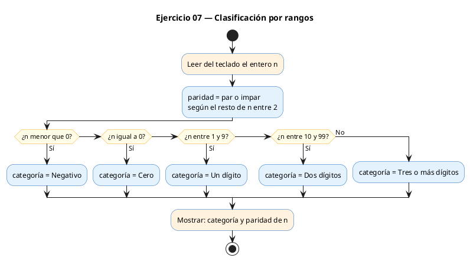
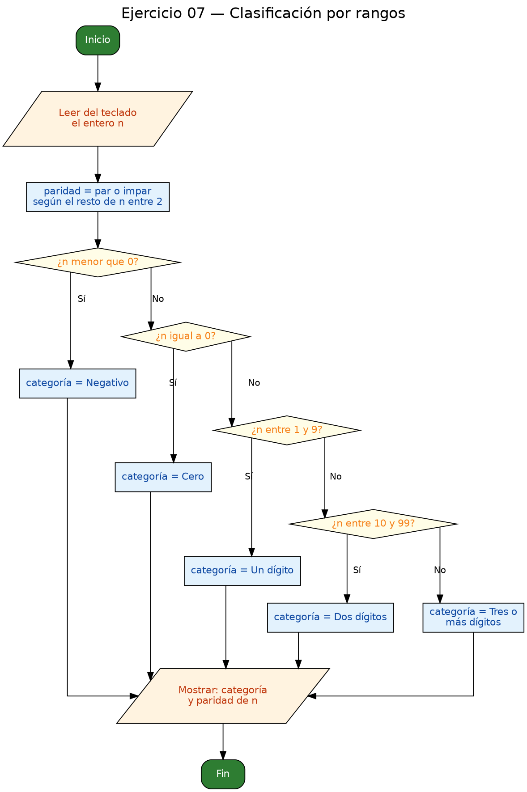

<!-- FICHERO GENERADO — NO EDITAR. Fuente de verdad: curso-c/practica/02-condicionales/ej07.md (se regenera con gen_course.py). -->

# Ejercicio 07 — Lee un entero y clasifícalo en rangos

Dificultad: rojo · Módulo 02 (Condicionales)

## Enunciado

Lee un entero y clasifícalo en rangos: < 0 -> "Negativo" == 0 -> "Cero" 1 a 9 -> "Un digito" 10 a 99 -> "Dos digitos" >= 100 -> "Tres o mas digitos"

## Diagramas de flujo





## Cómo se resuelve

<!-- EXPLICACION -->
El programa lee un entero y lo clasifica en cinco rangos (negativo, cero, un dígito, dos dígitos, tres o más) y, de paso, indica si es par o impar. Reúne todos los conceptos del módulo: operador ternario, encadenamiento `if / else if` y operadores lógicos.

1. Paridad con **operador ternario**: `const char *paridad = (n % 2 == 0) ? "par" : "impar";`. El ternario `condicion ? A : B` es un `if-else` comprimido en una sola expresión que **produce un valor**; aquí ese valor es un puntero al texto `"par"` o `"impar"` que guardamos para imprimirlo luego.
2. Clasificación por rangos con `if / else if`. Para los tramos intermedios necesitamos el operador lógico `&&` (AND), que es verdadero solo si **ambas** comparaciones lo son: `n >= 10 && n <= 99` describe exactamente "dos dígitos".
3. Al imprimir se combinan ambos resultados: `printf("Clasificacion: %s (%s)\n", categoria, paridad)`.

Trampa habitual: escribir mal los rangos con `&&`. Un error clásico es intentar `10 <= n <= 99` como en matemáticas; en C eso **no** significa lo que parece (se evalúa por pasos y da un resultado sin sentido), hay que escribir siempre las dos comparaciones unidas con `&&`. Igual que en los ejercicios anteriores, el orden de las ramas importa: al comprobar primero `n < 0` y `n == 0`, cuando llegas a los rangos de dígitos ya trabajas solo con positivos.

## Para practicar — cópialo y complétalo

Pega este esqueleto y completa los `TODO`. Es la mejor forma de aprender: inténtalo antes de mirar la solución.

```c
/*
  Curso de C — Modulo 02: Condicionales
  Ejercicio 07 — PRACTICA (rellena los TODO)
  Enunciado: Lee un entero y clasifícalo en rangos:
             < 0          -> "Negativo"
             == 0         -> "Cero"
             1 a 9        -> "Un digito"
             10 a 99      -> "Dos digitos"
             >= 100       -> "Tres o mas digitos"
  Dificultad: rojo
  Stdin: 42
  Compilar: gcc -std=c11 -Wall ej07_practica.c -o ej07 && ./ej07
*/

#include <stdio.h>

int main(void) {
    int n;

    // TODO: pide el entero al usuario y leelo

    // PARTE A — operador ternario (practica)
    // TODO: usando el operador ternario (?:), asigna a un puntero a char
    //       el string "par" o "impar" segun n % 2 == 0
    //       Sintaxis: const char *paridad = (condicion) ? "par" : "impar";

    // PARTE B — clasificacion por rangos
    const char *categoria;
    // TODO: rellena la cadena de if / else if con cinco ramas:
    //   n < 0              -> categoria = "Negativo"
    //   n == 0             -> categoria = "Cero"
    //   n entre 1 y 9      -> categoria = "Un digito"    (usa &&)
    //   n entre 10 y 99    -> categoria = "Dos digitos"  (usa &&)
    //   resto              -> categoria = "Tres o mas digitos"

    // TODO: imprime "Clasificacion: <categoria> (<paridad>)"

    return 0;
}
```

## Solución — cópiala y ejecútala

```c
/*
  Curso de C — Modulo 02: Condicionales
  Ejercicio 07 — MODELO (resuelto)
  Enunciado: Lee un entero y clasifícalo en rangos:
             < 0          -> "Negativo"
             == 0         -> "Cero"
             1 a 9        -> "Un digito"
             10 a 99      -> "Dos digitos"
             >= 100       -> "Tres o mas digitos"
  Dificultad: rojo
  Stdin: 42
  Compilar: gcc -std=c11 -Wall ej07_modelo.c -o ej07 && ./ej07
*/

#include <stdio.h>

int main(void) {
    int n;
    printf("Introduce un entero: ");
    scanf("%d", &n);

    // Usamos operador ternario para ilustrar su sintaxis en el caso simple
    // (par/impar), y if-else encadenado para los rangos multiples.

    // Paridad como ejemplo de ternario (extra informativo):
    const char *paridad = (n % 2 == 0) ? "par" : "impar";

    // Clasificacion por rangos: necesitamos AND (&&) para rangos intermedios
    const char *categoria;
    if (n < 0) {
        categoria = "Negativo";
    } else if (n == 0) {
        categoria = "Cero";
    } else if (n >= 1 && n <= 9) {
        categoria = "Un digito";
    } else if (n >= 10 && n <= 99) {
        categoria = "Dos digitos";
    } else {
        // n >= 100
        categoria = "Tres o mas digitos";
    }

    printf("Clasificacion: %s (%s)\n", categoria, paridad);

    return 0;
}
```

## Ejecútalo en el navegador

[▶ Abrir y ejecutar en Compiler Explorer](https://godbolt.org/clientstate/eyJzZXNzaW9ucyI6W3siaWQiOjEsImxhbmd1YWdlIjoiYyIsInNvdXJjZSI6Ii8qXG4gIEN1cnNvIGRlIEMgXHUyMDE0IE1vZHVsbyAwMjogQ29uZGljaW9uYWxlc1xuICBFamVyY2ljaW8gMDcgXHUyMDE0IE1PREVMTyAocmVzdWVsdG8pXG4gIEVudW5jaWFkbzogTGVlIHVuIGVudGVybyB5IGNsYXNpZlx1MDBlZGNhbG8gZW4gcmFuZ29zOlxuICAgICAgICAgICAgIDwgMCAgICAgICAgICAtPiBcIk5lZ2F0aXZvXCJcbiAgICAgICAgICAgICA9PSAwICAgICAgICAgLT4gXCJDZXJvXCJcbiAgICAgICAgICAgICAxIGEgOSAgICAgICAgLT4gXCJVbiBkaWdpdG9cIlxuICAgICAgICAgICAgIDEwIGEgOTkgICAgICAtPiBcIkRvcyBkaWdpdG9zXCJcbiAgICAgICAgICAgICA%2BPSAxMDAgICAgICAgLT4gXCJUcmVzIG8gbWFzIGRpZ2l0b3NcIlxuICBEaWZpY3VsdGFkOiByb2pvXG4gIFN0ZGluOiA0MlxuICBDb21waWxhcjogZ2NjIC1zdGQ9YzExIC1XYWxsIGVqMDdfbW9kZWxvLmMgLW8gZWowNyAmJiAuL2VqMDdcbiovXG5cbiNpbmNsdWRlIDxzdGRpby5oPlxuXG5pbnQgbWFpbih2b2lkKSB7XG4gICAgaW50IG47XG4gICAgcHJpbnRmKFwiSW50cm9kdWNlIHVuIGVudGVybzogXCIpO1xuICAgIHNjYW5mKFwiJWRcIiwgJm4pO1xuXG4gICAgLy8gVXNhbW9zIG9wZXJhZG9yIHRlcm5hcmlvIHBhcmEgaWx1c3RyYXIgc3Ugc2ludGF4aXMgZW4gZWwgY2FzbyBzaW1wbGVcbiAgICAvLyAocGFyL2ltcGFyKSwgeSBpZi1lbHNlIGVuY2FkZW5hZG8gcGFyYSBsb3MgcmFuZ29zIG11bHRpcGxlcy5cblxuICAgIC8vIFBhcmlkYWQgY29tbyBlamVtcGxvIGRlIHRlcm5hcmlvIChleHRyYSBpbmZvcm1hdGl2byk6XG4gICAgY29uc3QgY2hhciAqcGFyaWRhZCA9IChuICUgMiA9PSAwKSA%2FIFwicGFyXCIgOiBcImltcGFyXCI7XG5cbiAgICAvLyBDbGFzaWZpY2FjaW9uIHBvciByYW5nb3M6IG5lY2VzaXRhbW9zIEFORCAoJiYpIHBhcmEgcmFuZ29zIGludGVybWVkaW9zXG4gICAgY29uc3QgY2hhciAqY2F0ZWdvcmlhO1xuICAgIGlmIChuIDwgMCkge1xuICAgICAgICBjYXRlZ29yaWEgPSBcIk5lZ2F0aXZvXCI7XG4gICAgfSBlbHNlIGlmIChuID09IDApIHtcbiAgICAgICAgY2F0ZWdvcmlhID0gXCJDZXJvXCI7XG4gICAgfSBlbHNlIGlmIChuID49IDEgJiYgbiA8PSA5KSB7XG4gICAgICAgIGNhdGVnb3JpYSA9IFwiVW4gZGlnaXRvXCI7XG4gICAgfSBlbHNlIGlmIChuID49IDEwICYmIG4gPD0gOTkpIHtcbiAgICAgICAgY2F0ZWdvcmlhID0gXCJEb3MgZGlnaXRvc1wiO1xuICAgIH0gZWxzZSB7XG4gICAgICAgIC8vIG4gPj0gMTAwXG4gICAgICAgIGNhdGVnb3JpYSA9IFwiVHJlcyBvIG1hcyBkaWdpdG9zXCI7XG4gICAgfVxuXG4gICAgcHJpbnRmKFwiQ2xhc2lmaWNhY2lvbjogJXMgKCVzKVxcblwiLCBjYXRlZ29yaWEsIHBhcmlkYWQpO1xuXG4gICAgcmV0dXJuIDA7XG59XG4iLCJjb21waWxlcnMiOltdLCJleGVjdXRvcnMiOlt7ImFyZ3VtZW50cyI6IiIsImNvbXBpbGVyIjp7ImlkIjoiY2cxNDMiLCJsaWJzIjpbXSwib3B0aW9ucyI6Ii1zdGQ9YzExIC1sbSJ9LCJzdGRpbiI6IjQyIiwid3JhcCI6ZmFsc2V9XX1dfQ%3D%3D)

Se abre con la solución ya cargada; pulsa el botón de ejecutar (Run) para ver la salida. No hay que instalar nada.

## Cómo usarlo

Pega el código en un fichero y ejecútalo con tu toolchain habitual (o el botón de Ejecutar de tu editor). Antes de mirar la solución, intenta completar tú el esqueleto: es la mejor forma de aprender.

## Conexiones

- [[Curso_C/modelo/02-condicionales|Teoría del módulo]]
- [[Curso_C/practica/00_README|Índice del curso]]
