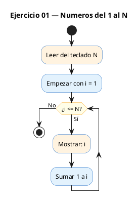
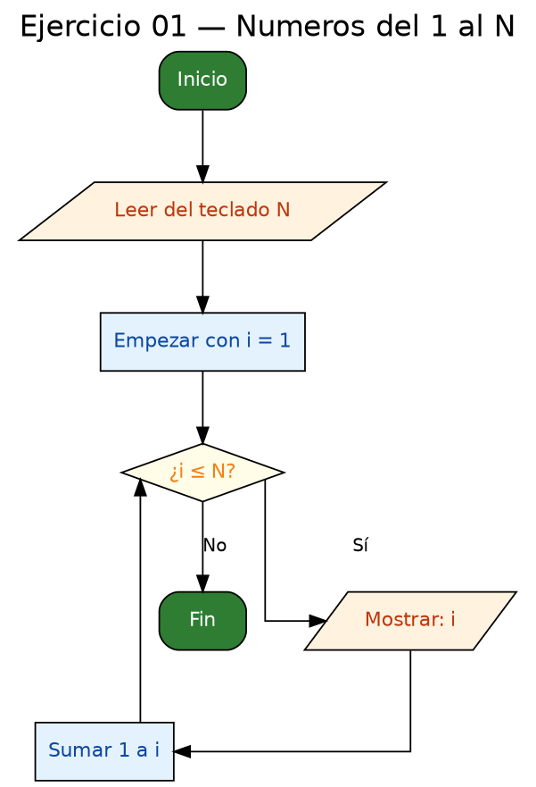

<!-- FICHERO GENERADO — NO EDITAR. Fuente de verdad: curso-c/practica/03-bucles/ej01.md (se regenera con gen_course.py). -->

# Ejercicio 01 — Leer N y mostrar los números del 1 al N, uno por línea

Dificultad: verde · Módulo 03 (Bucles)

## Enunciado

Leer N y mostrar los números del 1 al N, uno por línea.

## Diagramas de flujo





## Cómo se resuelve

<!-- EXPLICACION -->
Este es el ejercicio más básico de un bucle: pedir un número `N` y escribir en pantalla `1, 2, 3, ... N`, cada uno en su línea. Es el primer paso para entender que un bucle nos ahorra escribir la misma instrucción una y otra vez.

1. `scanf("%d", &n)` lee el número. Fíjate en el `&` delante de `n`: al leer un entero, `scanf` necesita la **dirección** de la variable para guardar ahí lo que teclees.
2. El `for` reúne las tres piezas de todo contador en una sola línea: `int i = 1` (arranque), `i <= n` (condición para seguir) e `i++` (avanzar). Se lee como "empieza en 1, repite mientras `i` sea menor o igual que `n`, y suma 1 en cada vuelta".
3. Dentro del cuerpo, `printf("%d\n", i)` imprime el valor actual de `i` seguido de un salto de línea, de modo que cada número cae en su propia fila.

La trampa habitual está en la condición: usar `i < n` en lugar de `i <= n`. Con `i < n` el bucle se detiene una vuelta antes y **nunca imprime el propio `N`**. Cuando quieras incluir el último valor, la condición lleva `<=`. El otro error clásico de todo principiante es olvidar el `i++`: sin él, `i` se queda en 1 para siempre y el programa se cuelga en un bucle infinito.

## Para practicar — cópialo y complétalo

Pega este esqueleto y completa los `TODO`. Es la mejor forma de aprender: inténtalo antes de mirar la solución.

```c
/*
 * Curso de C — Modulo 03: Bucles
 * Ejercicio 01 — PRACTICA (rellena los TODO)
 * Enunciado: Leer N y mostrar los números del 1 al N, uno por línea.
 * Dificultad: verde
 * Stdin: 5
 * Compilar: gcc -std=c11 -Wall ej01_practica.c -o ej01 && ./ej01
 */

#include <stdio.h>

int main(void) {
    int n;

    // TODO 1: Pide al usuario que introduzca N con printf
    // TODO 2: Lee el valor de N con scanf (recuerda el &)

    // TODO 3: Crea un bucle for que vaya de i=1 hasta i<=n
    //         En cada iteracion, imprime i seguido de un salto de linea

    return 0;
}
```

## Solución — cópiala y ejecútala

```c
/*
 * Curso de C — Modulo 03: Bucles
 * Ejercicio 01 — MODELO (resuelto)
 * Enunciado: Leer N y mostrar los números del 1 al N, uno por línea.
 * Dificultad: verde
 * Stdin: 5
 * Compilar: gcc -std=c11 -Wall ej01_modelo.c -o ej01 && ./ej01
 */

#include <stdio.h>

int main(void) {
    int n;
    printf("Introduce N: ");
    scanf("%d", &n);

    // Recorremos desde 1 hasta n inclusive
    for (int i = 1; i <= n; i++) {
        printf("%d\n", i);
    }

    return 0;
}
```

## Ejecútalo en el navegador

[▶ Abrir y ejecutar en Compiler Explorer](https://godbolt.org/clientstate/eyJzZXNzaW9ucyI6W3siaWQiOjEsImxhbmd1YWdlIjoiYyIsInNvdXJjZSI6Ii8qXG4gKiBDdXJzbyBkZSBDIFx1MjAxNCBNb2R1bG8gMDM6IEJ1Y2xlc1xuICogRWplcmNpY2lvIDAxIFx1MjAxNCBNT0RFTE8gKHJlc3VlbHRvKVxuICogRW51bmNpYWRvOiBMZWVyIE4geSBtb3N0cmFyIGxvcyBuXHUwMGZhbWVyb3MgZGVsIDEgYWwgTiwgdW5vIHBvciBsXHUwMGVkbmVhLlxuICogRGlmaWN1bHRhZDogdmVyZGVcbiAqIFN0ZGluOiA1XG4gKiBDb21waWxhcjogZ2NjIC1zdGQ9YzExIC1XYWxsIGVqMDFfbW9kZWxvLmMgLW8gZWowMSAmJiAuL2VqMDFcbiAqL1xuXG4jaW5jbHVkZSA8c3RkaW8uaD5cblxuaW50IG1haW4odm9pZCkge1xuICAgIGludCBuO1xuICAgIHByaW50ZihcIkludHJvZHVjZSBOOiBcIik7XG4gICAgc2NhbmYoXCIlZFwiLCAmbik7XG5cbiAgICAvLyBSZWNvcnJlbW9zIGRlc2RlIDEgaGFzdGEgbiBpbmNsdXNpdmVcbiAgICBmb3IgKGludCBpID0gMTsgaSA8PSBuOyBpKyspIHtcbiAgICAgICAgcHJpbnRmKFwiJWRcXG5cIiwgaSk7XG4gICAgfVxuXG4gICAgcmV0dXJuIDA7XG59XG4iLCJjb21waWxlcnMiOltdLCJleGVjdXRvcnMiOlt7ImFyZ3VtZW50cyI6IiIsImNvbXBpbGVyIjp7ImlkIjoiY2cxNDMiLCJsaWJzIjpbXSwib3B0aW9ucyI6Ii1zdGQ9YzExIC1sbSJ9LCJzdGRpbiI6IjUiLCJ3cmFwIjpmYWxzZX1dfV19)

Se abre con la solución ya cargada; pulsa el botón de ejecutar (Run) para ver la salida. No hay que instalar nada.

## Cómo usarlo

Pega el código en un fichero y ejecútalo con tu toolchain habitual (o el botón de Ejecutar de tu editor). Antes de mirar la solución, intenta completar tú el esqueleto: es la mejor forma de aprender.

## Conexiones

- [[Curso_C/modelo/03-bucles|Teoría del módulo]]
- [[Curso_C/practica/00_README|Índice del curso]]
