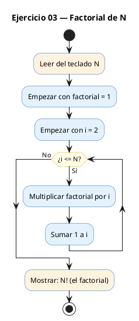
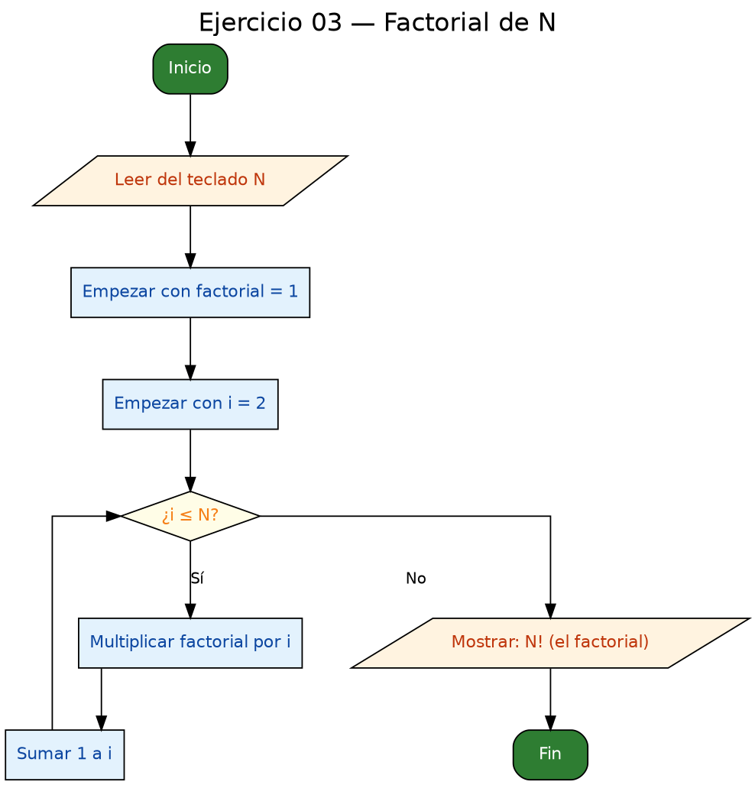

<!-- FICHERO GENERADO — NO EDITAR. Fuente de verdad: curso-c/practica/03-bucles/ej03.md (se regenera con gen_course.py). -->

# Ejercicio 03 — Leer N y calcular N! (factorial)

Dificultad: verde · Módulo 03 (Bucles)

## Enunciado

Leer N y calcular N! (factorial). Usar long long.

## Diagramas de flujo





## Cómo se resuelve

<!-- EXPLICACION -->
El factorial de `N` (`N!`) es el producto `1 x 2 x 3 x ... x N`. Es el mismo patrón acumulador del ejercicio anterior, pero **multiplicando** en vez de sumar, así que hay dos detalles nuevos que entender.

1. `long long factorial = 1`. Empezamos en 1, no en 0, porque es un acumulador de producto: si arrancara en 0, cualquier multiplicación daría 0. Además, ese 1 ya deja resuelto el caso `0! = 1` y `1! = 1`, porque si `N` vale 0 o 1 el bucle no llega a ejecutarse.
2. El `for` va desde `i = 2` hasta `n`, y en cada vuelta `factorial *= i` (equivale a `factorial = factorial * i`). Empezar en 2 es una pequeña optimización: multiplicar por 1 no cambia nada.
3. Se imprime con `%lld`, el especificador propio de `long long`.

La trampa central del ejercicio es el **desbordamiento**. El factorial crece a una velocidad brutal: `13!` ya no cabe en un `int` normal. Por eso usamos `long long`, que aguanta hasta `20!`. Y aquí está el segundo despiste: si declaras `factorial` como `long long` pero lo imprimes con `%d` en lugar de `%lld`, verás un número incorrecto, porque el formato debe coincidir con el tipo de la variable.

## Para practicar — cópialo y complétalo

Pega este esqueleto y completa los `TODO`. Es la mejor forma de aprender: inténtalo antes de mirar la solución.

```c
/*
 * Curso de C — Modulo 03: Bucles
 * Ejercicio 03 — PRACTICA (rellena los TODO)
 * Enunciado: Leer N y calcular N! (factorial). Usar long long.
 * Dificultad: verde
 * Compilar: gcc -std=c11 -Wall ej03_practica.c -o ej03 && ./ej03
 */

#include <stdio.h>

int main(void) {
    int n;

    // TODO 1: Pide N al usuario (sugiere rango 0-20) y leelo

    // TODO 2: Declara 'long long factorial' e iniciala a 1
    //         Piensa: 0! = 1, por eso el valor inicial es 1, no 0

    // TODO 3: Bucle for desde i=2 hasta i<=n
    //         En cada paso: factorial *= i

    // TODO 4: Imprime con printf usando %lld para long long
    //         Formato: "N! = resultado"

    return 0;
}
```

## Solución — cópiala y ejecútala

```c
/*
 * Curso de C — Modulo 03: Bucles
 * Ejercicio 03 — MODELO (resuelto)
 * Enunciado: Leer N y calcular N! (factorial). Usar long long.
 * Dificultad: verde
 * Compilar: gcc -std=c11 -Wall ej03_modelo.c -o ej03 && ./ej03
 */

#include <stdio.h>

int main(void) {
    int n;
    printf("Introduce N (0-20): ");
    scanf("%d", &n);

    // long long para evitar desbordamiento con N grandes
    long long factorial = 1;    // 0! = 1 y 1! = 1, valor inicial correcto

    for (int i = 2; i <= n; i++) {
        factorial *= i;         // factorial = factorial * i
    }

    // %lld es el especificador para long long
    printf("%d! = %lld\n", n, factorial);
    return 0;
}
```

## Cómo usarlo

Pega el código en un fichero y ejecútalo con tu toolchain habitual (o el botón de Ejecutar de tu editor). Antes de mirar la solución, intenta completar tú el esqueleto: es la mejor forma de aprender.

## Conexiones

- [[Curso_C/modelo/03-bucles|Teoría del módulo]]
- [[Curso_C/practica/00_README|Índice del curso]]
