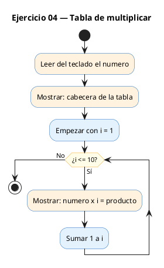
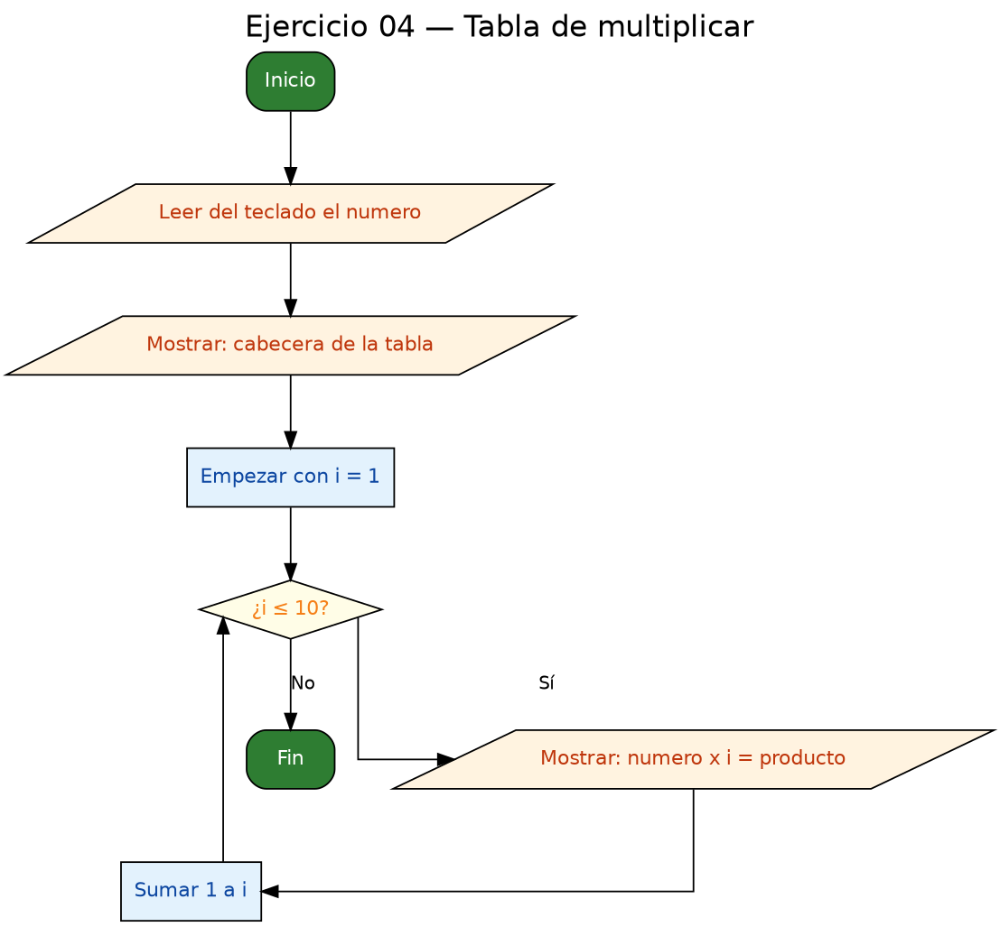

<!-- FICHERO GENERADO — NO EDITAR. Fuente de verdad: curso-c/practica/03-bucles/ej04.md (se regenera con gen_course.py). -->

# Ejercicio 04 — Leer un número y mostrar su tabla de multiplicar del 1 al 10

Dificultad: amarillo · Módulo 03 (Bucles)

## Enunciado

Leer un número y mostrar su tabla de multiplicar del 1 al 10.

## Diagramas de flujo





## Cómo se resuelve

<!-- EXPLICACION -->
Este programa pide un número y muestra su tabla de multiplicar, de `num x 1` hasta `num x 10`. El bucle es un `for` sencillo con un límite fijo: aquí no dependemos de lo que teclee el usuario para saber cuántas vueltas dar, siempre son 10.

1. Leemos `num` y mostramos un encabezado con `printf`.
2. El `for` recorre `i` de 1 a 10. En cada vuelta imprimimos una línea completa: `printf("%d x %2d = %3d\n", num, i, num * i)`. El cálculo `num * i` se hace sobre la marcha dentro del propio `printf`.
3. La novedad está en los formatos `%2d` y `%3d`. El número entre el `%` y la `d` reserva un **ancho mínimo** de columna: `%2d` ocupa al menos 2 caracteres y `%3d` al menos 3, rellenando con espacios por la izquierda. Gracias a eso las columnas quedan alineadas aunque los resultados tengan distinto número de cifras (por ejemplo `3 x 3 = 9` frente a `3 x 10 = 30`).

La trampa de este ejercicio no es la lógica del bucle, que ya conoces, sino el **formateo de la salida**. Si usas `%d` a secas, el programa funciona igual de bien pero la tabla sale desalineada y fea, con los números "bailando" según su tamaño. Aprender a alinear con `%2d` / `%3d` es lo que convierte una salida correcta en una salida legible.

## Para practicar — cópialo y complétalo

Pega este esqueleto y completa los `TODO`. Es la mejor forma de aprender: inténtalo antes de mirar la solución.

```c
/*
 * Curso de C — Modulo 03: Bucles
 * Ejercicio 04 — PRACTICA (rellena los TODO)
 * Enunciado: Leer un número y mostrar su tabla de multiplicar del 1 al 10.
 * Dificultad: amarillo
 * Compilar: gcc -std=c11 -Wall ej04_practica.c -o ej04 && ./ej04
 */

#include <stdio.h>

int main(void) {
    int num;

    // TODO 1: Pide al usuario el numero y leelo con scanf

    // TODO 2: Imprime un encabezado: "--- Tabla del X ---"

    // TODO 3: Bucle for de i=1 a i<=10
    //         Imprime cada linea: "num x i = resultado"
    //         Consejo: prueba con %2d para i y %3d para el resultado
    //         y observa como queda alineado

    return 0;
}
```

## Solución — cópiala y ejecútala

```c
/*
 * Curso de C — Modulo 03: Bucles
 * Ejercicio 04 — MODELO (resuelto)
 * Enunciado: Leer un número y mostrar su tabla de multiplicar del 1 al 10.
 * Dificultad: amarillo
 * Compilar: gcc -std=c11 -Wall ej04_modelo.c -o ej04 && ./ej04
 */

#include <stdio.h>

int main(void) {
    int num;
    printf("Introduce un numero para su tabla: ");
    scanf("%d", &num);

    printf("\n--- Tabla del %d ---\n", num);

    for (int i = 1; i <= 10; i++) {
        printf("%d x %2d = %3d\n", num, i, num * i);
        // %2d: campo de ancho 2 para el multiplicador (alineacion)
        // %3d: campo de ancho 3 para el resultado
    }

    return 0;
}
```

## Cómo usarlo

Pega el código en un fichero y ejecútalo con tu toolchain habitual (o el botón de Ejecutar de tu editor). Antes de mirar la solución, intenta completar tú el esqueleto: es la mejor forma de aprender.

## Conexiones

- [[Curso_C/modelo/03-bucles|Teoría del módulo]]
- [[Curso_C/practica/00_README|Índice del curso]]
