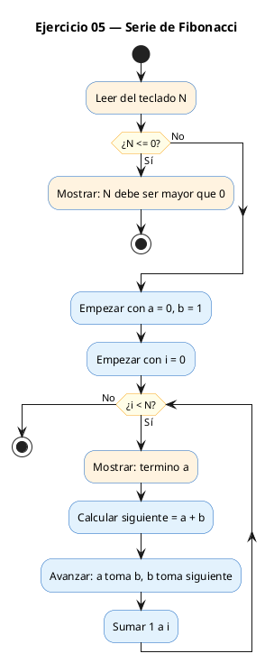
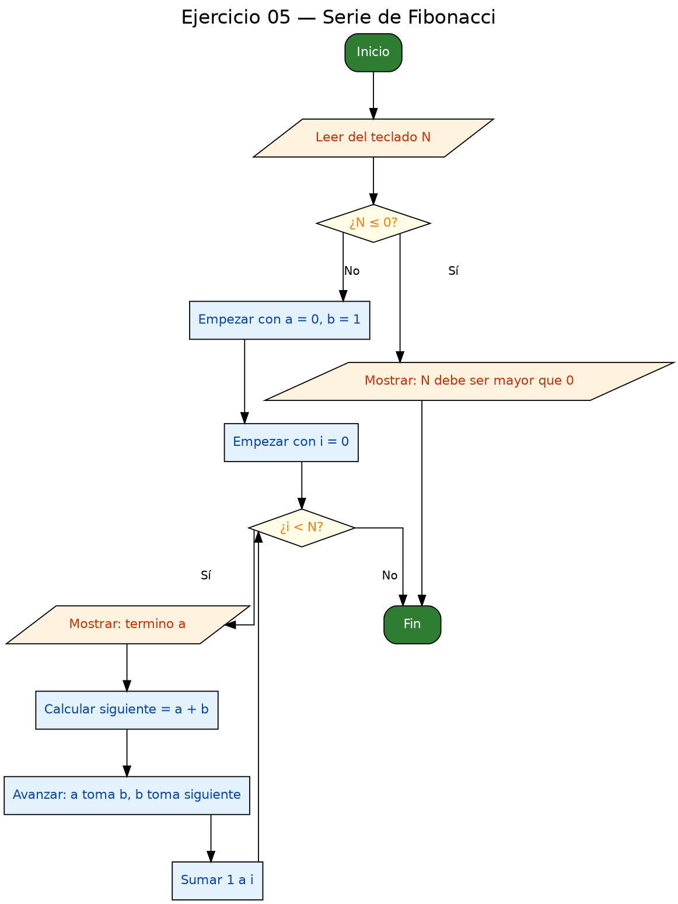

<!-- FICHERO GENERADO — NO EDITAR. Fuente de verdad: curso-c/practica/03-bucles/ej05.md (se regenera con gen_course.py). -->

# Ejercicio 05 — Leer N y mostrar los N primeros términos de la serie de Fibonacci

Dificultad: amarillo · Módulo 03 (Bucles)

## Enunciado

Leer N y mostrar los N primeros términos de la serie de Fibonacci.

## Diagramas de flujo





## Cómo se resuelve

<!-- EXPLICACION -->
La serie de Fibonacci empieza con `0` y `1`, y cada término siguiente es la suma de los dos anteriores: `0, 1, 1, 2, 3, 5, 8, ...`. El reto es generarla con un bucle usando solo dos variables que se van "deslizando" a lo largo de la serie.

1. Antes de nada, el programa comprueba `if (n <= 0)` y sale con `return 1` si `N` no es válido: no tiene sentido pedir "0 términos".
2. Arrancamos con `long long a = 0, b = 1`, los dos primeros términos.
3. En cada vuelta imprimimos `a` (el término actual) y luego avanzamos: `siguiente = a + b`, después `a = b` y `b = siguiente`. Es como si una ventana de dos números fuera resbalando hacia la derecha por la sucesión.

La trampa clave está en el **orden de las tres asignaciones**. Necesitamos la variable auxiliar `siguiente` porque, si hiciéramos `a = b` primero y luego intentáramos calcular `b = a + b`, ya habríamos perdido el valor original de `a` y el cálculo saldría mal. Guardar antes la suma en `siguiente` protege ese valor. Como segundo detalle, se usa `long long` porque Fibonacci también crece muy rápido y desbordaría un `int` en pocas decenas de términos.

## Para practicar — cópialo y complétalo

Pega este esqueleto y completa los `TODO`. Es la mejor forma de aprender: inténtalo antes de mirar la solución.

```c
/*
 * Curso de C — Modulo 03: Bucles
 * Ejercicio 05 — PRACTICA (rellena los TODO)
 * Enunciado: Leer N y mostrar los N primeros términos de la serie de Fibonacci.
 * Dificultad: amarillo
 * Stdin: 10
 * Compilar: gcc -std=c11 -Wall ej05_practica.c -o ej05 && ./ej05
 */

#include <stdio.h>

int main(void) {
    int n;

    // TODO 1: Pide N al usuario y leelo

    // TODO 2: Declara dos variables long long: a = 0, b = 1
    //         Estos son los dos primeros terminos de la serie

    // TODO 3: Bucle for de i=0 a i<n:
    //         - Imprime 'a' (el termino actual)
    //         - Calcula el siguiente: siguiente = a + b
    //         - Actualiza: a = b, b = siguiente
    //         CUIDADO con el orden de las asignaciones: si cambias a primero,
    //         pierdes su valor al calcular b. Usa una variable temporal.

    // TODO 4: Imprime un salto de linea al final

    return 0;
}
```

## Solución — cópiala y ejecútala

```c
/*
 * Curso de C — Modulo 03: Bucles
 * Ejercicio 05 — MODELO (resuelto)
 * Enunciado: Leer N y mostrar los N primeros términos de la serie de Fibonacci.
 * Dificultad: amarillo
 * Stdin: 10
 * Compilar: gcc -std=c11 -Wall ej05_modelo.c -o ej05 && ./ej05
 */

#include <stdio.h>

int main(void) {
    int n;
    printf("Cuantos terminos de Fibonacci quieres ver? ");
    scanf("%d", &n);

    if (n <= 0) {
        printf("N debe ser mayor que 0.\n");
        return 1;
    }

    // Los dos primeros terminos son fijos: 0 y 1
    long long a = 0, b = 1;

    printf("Fibonacci (%d terminos): ", n);

    for (int i = 0; i < n; i++) {
        printf("%lld", a);
        if (i < n - 1) printf(" ");     // separador entre terminos

        long long siguiente = a + b;    // calculamos el siguiente
        a = b;                          // avanzamos: a toma el valor de b
        b = siguiente;                  // b toma el siguiente
    }
    printf("\n");

    return 0;
}
```

## Ejecútalo en el navegador

[▶ Abrir y ejecutar en Compiler Explorer](https://godbolt.org/clientstate/eyJzZXNzaW9ucyI6W3siaWQiOjEsImxhbmd1YWdlIjoiYyIsInNvdXJjZSI6Ii8qXG4gKiBDdXJzbyBkZSBDIFx1MjAxNCBNb2R1bG8gMDM6IEJ1Y2xlc1xuICogRWplcmNpY2lvIDA1IFx1MjAxNCBNT0RFTE8gKHJlc3VlbHRvKVxuICogRW51bmNpYWRvOiBMZWVyIE4geSBtb3N0cmFyIGxvcyBOIHByaW1lcm9zIHRcdTAwZTlybWlub3MgZGUgbGEgc2VyaWUgZGUgRmlib25hY2NpLlxuICogRGlmaWN1bHRhZDogYW1hcmlsbG9cbiAqIFN0ZGluOiAxMFxuICogQ29tcGlsYXI6IGdjYyAtc3RkPWMxMSAtV2FsbCBlajA1X21vZGVsby5jIC1vIGVqMDUgJiYgLi9lajA1XG4gKi9cblxuI2luY2x1ZGUgPHN0ZGlvLmg%2BXG5cbmludCBtYWluKHZvaWQpIHtcbiAgICBpbnQgbjtcbiAgICBwcmludGYoXCJDdWFudG9zIHRlcm1pbm9zIGRlIEZpYm9uYWNjaSBxdWllcmVzIHZlcj8gXCIpO1xuICAgIHNjYW5mKFwiJWRcIiwgJm4pO1xuXG4gICAgaWYgKG4gPD0gMCkge1xuICAgICAgICBwcmludGYoXCJOIGRlYmUgc2VyIG1heW9yIHF1ZSAwLlxcblwiKTtcbiAgICAgICAgcmV0dXJuIDE7XG4gICAgfVxuXG4gICAgLy8gTG9zIGRvcyBwcmltZXJvcyB0ZXJtaW5vcyBzb24gZmlqb3M6IDAgeSAxXG4gICAgbG9uZyBsb25nIGEgPSAwLCBiID0gMTtcblxuICAgIHByaW50ZihcIkZpYm9uYWNjaSAoJWQgdGVybWlub3MpOiBcIiwgbik7XG5cbiAgICBmb3IgKGludCBpID0gMDsgaSA8IG47IGkrKykge1xuICAgICAgICBwcmludGYoXCIlbGxkXCIsIGEpO1xuICAgICAgICBpZiAoaSA8IG4gLSAxKSBwcmludGYoXCIgXCIpOyAgICAgLy8gc2VwYXJhZG9yIGVudHJlIHRlcm1pbm9zXG5cbiAgICAgICAgbG9uZyBsb25nIHNpZ3VpZW50ZSA9IGEgKyBiOyAgICAvLyBjYWxjdWxhbW9zIGVsIHNpZ3VpZW50ZVxuICAgICAgICBhID0gYjsgICAgICAgICAgICAgICAgICAgICAgICAgIC8vIGF2YW56YW1vczogYSB0b21hIGVsIHZhbG9yIGRlIGJcbiAgICAgICAgYiA9IHNpZ3VpZW50ZTsgICAgICAgICAgICAgICAgICAvLyBiIHRvbWEgZWwgc2lndWllbnRlXG4gICAgfVxuICAgIHByaW50ZihcIlxcblwiKTtcblxuICAgIHJldHVybiAwO1xufVxuIiwiY29tcGlsZXJzIjpbXSwiZXhlY3V0b3JzIjpbeyJhcmd1bWVudHMiOiIiLCJjb21waWxlciI6eyJpZCI6ImNnMTQzIiwibGlicyI6W10sIm9wdGlvbnMiOiItc3RkPWMxMSAtbG0ifSwic3RkaW4iOiIxMCIsIndyYXAiOmZhbHNlfV19XX0%3D)

Se abre con la solución ya cargada; pulsa el botón de ejecutar (Run) para ver la salida. No hay que instalar nada.

## Cómo usarlo

Pega el código en un fichero y ejecútalo con tu toolchain habitual (o el botón de Ejecutar de tu editor). Antes de mirar la solución, intenta completar tú el esqueleto: es la mejor forma de aprender.

## Conexiones

- [[Curso_C/modelo/03-bucles|Teoría del módulo]]
- [[Curso_C/practica/00_README|Índice del curso]]
