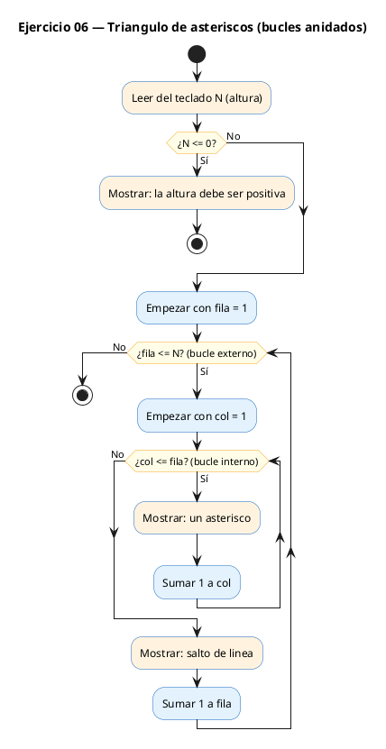
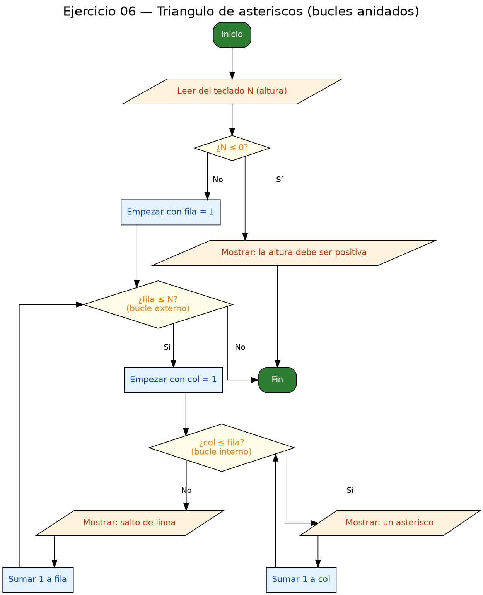

<!-- FICHERO GENERADO — NO EDITAR. Fuente de verdad: curso-c/practica/03-bucles/ej06.md (se regenera con gen_course.py). -->

# Ejercicio 06 — Mostrar un triángulo de asteriscos de altura N

Dificultad: rojo · Módulo 03 (Bucles)

## Enunciado

Mostrar un triángulo de asteriscos de altura N (leída por teclado).

## Diagramas de flujo





## Cómo se resuelve

<!-- EXPLICACION -->
Aquí aparece la gran idea de este módulo: los **bucles anidados**, un bucle dentro de otro. Para dibujar un triángulo de asteriscos, un solo bucle no basta, porque tenemos que manejar dos cosas a la vez: cuántas filas hay y cuántos asteriscos lleva cada fila.

1. El **bucle externo** (`fila` de 1 a `n`) controla las filas: da una vuelta por cada línea del triángulo.
2. Dentro de él, el **bucle interno** (`col` de 1 a `fila`) imprime los asteriscos de esa fila. La clave es que su límite es `fila`, no `n`: en la fila 1 imprime 1 asterisco, en la fila 2 imprime 2, y así el triángulo crece. Cada `printf("*")` va **sin** salto de línea, para que los asteriscos queden pegados en horizontal.
3. Al terminar el bucle interno, pero todavía dentro del externo, un `printf("\n")` cierra la fila y baja a la siguiente.

La trampa típica de los anidados es la **colocación del salto de línea**. Si pones el `printf("\n")` dentro del bucle interno, cada asterisco cae en una línea distinta y no se forma el triángulo; si lo pones fuera del bucle externo, todos los asteriscos salen en una única fila. El `\n` tiene que ir justo entre los dos bucles: después de cerrar el interno y antes de la siguiente vuelta del externo. Piensa siempre en el anidado como "el externo cuenta filas, el interno cuenta columnas".

## Para practicar — cópialo y complétalo

Pega este esqueleto y completa los `TODO`. Es la mejor forma de aprender: inténtalo antes de mirar la solución.

```c
/*
 * Curso de C — Modulo 03: Bucles
 * Ejercicio 06 — PRACTICA (rellena los TODO)
 * Enunciado: Mostrar un triángulo de asteriscos de altura N (leída por teclado).
 * Dificultad: rojo
 * Stdin: 4
 * Compilar: gcc -std=c11 -Wall ej06_practica.c -o ej06 && ./ej06
 *
 * Salida esperada para N=4:
 *   *
 *   **
 *   ***
 *   ****
 */

#include <stdio.h>

int main(void) {
    int n;

    // TODO 1: Pide la altura N al usuario y leela

    // TODO 2: Bucle EXTERNO: variable 'fila' de 1 a n
    //         Cada iteracion representa una fila del triangulo

    //   TODO 3: Bucle INTERNO: variable 'col' de 1 a fila
    //           (la fila 1 tiene 1 asterisco, la fila 2 tiene 2, etc.)
    //           Imprime un '*' sin salto de linea: printf("*");

    //   TODO 4: Despues del bucle interno (pero dentro del externo),
    //           imprime un salto de linea: printf("\n");

    return 0;
}
```

## Solución — cópiala y ejecútala

```c
/*
 * Curso de C — Modulo 03: Bucles
 * Ejercicio 06 — MODELO (resuelto)
 * Enunciado: Mostrar un triángulo de asteriscos de altura N (leída por teclado).
 * Dificultad: rojo
 * Stdin: 4
 * Compilar: gcc -std=c11 -Wall ej06_modelo.c -o ej06 && ./ej06
 *
 * Salida esperada para N=4:
 *   *
 *   **
 *   ***
 *   ****
 */

#include <stdio.h>

int main(void) {
    int n;
    printf("Altura del triangulo: ");
    scanf("%d", &n);

    if (n <= 0) {
        printf("La altura debe ser un numero positivo.\n");
        return 1;
    }

    // Bucle externo: cada iteracion es una fila
    for (int fila = 1; fila <= n; fila++) {
        // Bucle interno: imprime 'fila' asteriscos en la fila actual
        for (int col = 1; col <= fila; col++) {
            printf("*");
        }
        printf("\n");   // salto de linea al terminar la fila
    }

    return 0;
}
```

## Ejecútalo en el navegador

[▶ Abrir y ejecutar en Compiler Explorer](https://godbolt.org/clientstate/eyJzZXNzaW9ucyI6W3siaWQiOjEsImxhbmd1YWdlIjoiYyIsInNvdXJjZSI6Ii8qXG4gKiBDdXJzbyBkZSBDIFx1MjAxNCBNb2R1bG8gMDM6IEJ1Y2xlc1xuICogRWplcmNpY2lvIDA2IFx1MjAxNCBNT0RFTE8gKHJlc3VlbHRvKVxuICogRW51bmNpYWRvOiBNb3N0cmFyIHVuIHRyaVx1MDBlMW5ndWxvIGRlIGFzdGVyaXNjb3MgZGUgYWx0dXJhIE4gKGxlXHUwMGVkZGEgcG9yIHRlY2xhZG8pLlxuICogRGlmaWN1bHRhZDogcm9qb1xuICogU3RkaW46IDRcbiAqIENvbXBpbGFyOiBnY2MgLXN0ZD1jMTEgLVdhbGwgZWowNl9tb2RlbG8uYyAtbyBlajA2ICYmIC4vZWowNlxuICpcbiAqIFNhbGlkYSBlc3BlcmFkYSBwYXJhIE49NDpcbiAqICAgKlxuICogICAqKlxuICogICAqKipcbiAqICAgKioqKlxuICovXG5cbiNpbmNsdWRlIDxzdGRpby5oPlxuXG5pbnQgbWFpbih2b2lkKSB7XG4gICAgaW50IG47XG4gICAgcHJpbnRmKFwiQWx0dXJhIGRlbCB0cmlhbmd1bG86IFwiKTtcbiAgICBzY2FuZihcIiVkXCIsICZuKTtcblxuICAgIGlmIChuIDw9IDApIHtcbiAgICAgICAgcHJpbnRmKFwiTGEgYWx0dXJhIGRlYmUgc2VyIHVuIG51bWVybyBwb3NpdGl2by5cXG5cIik7XG4gICAgICAgIHJldHVybiAxO1xuICAgIH1cblxuICAgIC8vIEJ1Y2xlIGV4dGVybm86IGNhZGEgaXRlcmFjaW9uIGVzIHVuYSBmaWxhXG4gICAgZm9yIChpbnQgZmlsYSA9IDE7IGZpbGEgPD0gbjsgZmlsYSsrKSB7XG4gICAgICAgIC8vIEJ1Y2xlIGludGVybm86IGltcHJpbWUgJ2ZpbGEnIGFzdGVyaXNjb3MgZW4gbGEgZmlsYSBhY3R1YWxcbiAgICAgICAgZm9yIChpbnQgY29sID0gMTsgY29sIDw9IGZpbGE7IGNvbCsrKSB7XG4gICAgICAgICAgICBwcmludGYoXCIqXCIpO1xuICAgICAgICB9XG4gICAgICAgIHByaW50ZihcIlxcblwiKTsgICAvLyBzYWx0byBkZSBsaW5lYSBhbCB0ZXJtaW5hciBsYSBmaWxhXG4gICAgfVxuXG4gICAgcmV0dXJuIDA7XG59XG4iLCJjb21waWxlcnMiOltdLCJleGVjdXRvcnMiOlt7ImFyZ3VtZW50cyI6IiIsImNvbXBpbGVyIjp7ImlkIjoiY2cxNDMiLCJsaWJzIjpbXSwib3B0aW9ucyI6Ii1zdGQ9YzExIC1sbSJ9LCJzdGRpbiI6IjQiLCJ3cmFwIjpmYWxzZX1dfV19)

Se abre con la solución ya cargada; pulsa el botón de ejecutar (Run) para ver la salida. No hay que instalar nada.

## Cómo usarlo

Pega el código en un fichero y ejecútalo con tu toolchain habitual (o el botón de Ejecutar de tu editor). Antes de mirar la solución, intenta completar tú el esqueleto: es la mejor forma de aprender.

## Conexiones

- [[Curso_C/modelo/03-bucles|Teoría del módulo]]
- [[Curso_C/practica/00_README|Índice del curso]]
