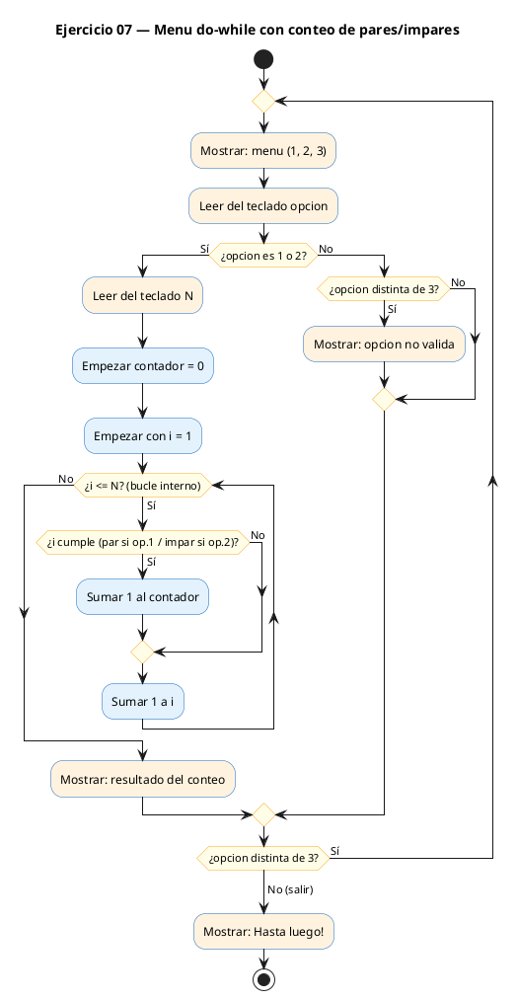
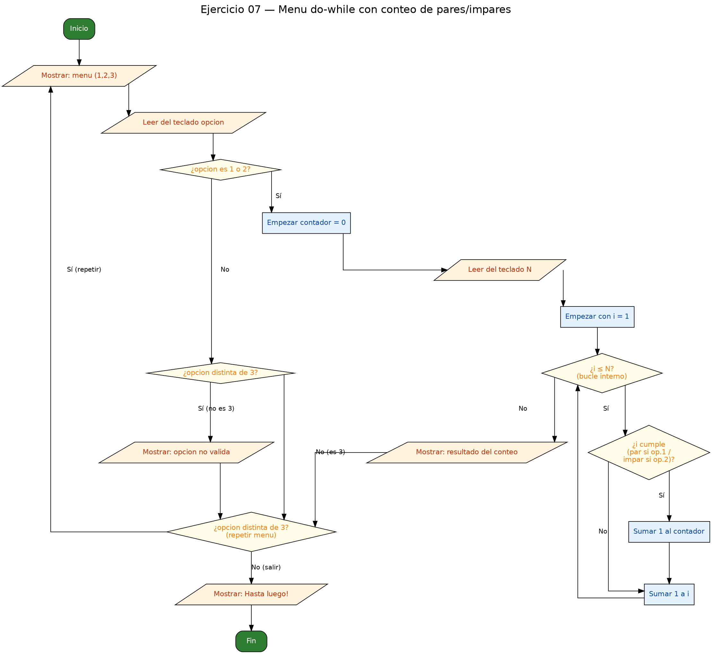

<!-- FICHERO GENERADO — NO EDITAR. Fuente de verdad: curso-c/practica/03-bucles/ej07.md (se regenera con gen_course.py). -->

# Ejercicio 07 — Menú do-while con 3 opciones

Dificultad: rojo · Módulo 03 (Bucles)

## Enunciado

Menú do-while con 3 opciones: contar pares 1..N, contar impares 1..N, salir. Pedir N al elegir 1 o 2.

## Diagramas de flujo





## Cómo se resuelve

<!-- EXPLICACION -->
Este ejercicio junta casi todo lo del módulo en un pequeño programa interactivo: un menú que se repite hasta que el usuario decide salir. La herramienta ideal para un menú es el `do-while`, porque **garantiza que el menú se muestra al menos una vez** antes de comprobar nada.

1. El `do { ... } while (opcion != 3)` ejecuta primero el cuerpo (mostrar el menú y leer la opción) y solo al final comprueba la condición. Mientras el usuario no teclee 3, vuelve a empezar. Ojo al **punto y coma final** tras el `while`: en el `do-while` es obligatorio y olvidarlo es un error de compilación muy común.
2. Dentro, un `if (opcion == 1 || opcion == 2)` agrupa las dos acciones que necesitan un `N`: pide el número, crea un `contador = 0` y lanza un `for` de 1 a `N`. Según la opción, cuenta pares (`i % 2 == 0`) o impares (`i % 2 != 0`). Aquí ves un bucle `for` anidado dentro del `do-while`.
3. El `else if (opcion != 3)` avisa de una opción no válida, sin molestar cuando el usuario simplemente eligió salir con el 3.

La trampa central es la **condición de parada del `do-while`**. Como la comprobación ocurre al final, hay que asegurarse de que `opcion` se lee dentro del bucle en cada vuelta; si por error se leyera fuera, tendríamos un bucle infinito. Fíjate también en el reparto de la lógica: el 3 no hace nada dentro del cuerpo (no es ni 1, ni 2, ni opción inválida), simplemente deja que la condición `opcion != 3` se vuelva falsa y el bucle termine, imprimiendo entonces "Hasta luego!".

## Para practicar — cópialo y complétalo

Pega este esqueleto y completa los `TODO`. Es la mejor forma de aprender: inténtalo antes de mirar la solución.

```c
/*
 * Curso de C — Modulo 03: Bucles
 * Ejercicio 07 — PRACTICA (rellena los TODO)
 * Enunciado: Menú do-while con 3 opciones: contar pares 1..N,
 *            contar impares 1..N, salir. Pedir N al elegir 1 o 2.
 * Dificultad: rojo
 * Stdin: 1\n10\n3
 * Compilar: gcc -std=c11 -Wall ej07_practica.c -o ej07 && ./ej07
 */

#include <stdio.h>

int main(void) {
    int opcion;

    // TODO 1: Escribe un bucle do-while que se repita mientras opcion != 3

    //   TODO 2: Dentro del do, imprime el menu con printf:
    //           "=== MENU ==="
    //           "1. Contar pares de 1 a N"
    //           "2. Contar impares de 1 a N"
    //           "3. Salir"
    //           Lee la opcion con scanf

    //   TODO 3: Si opcion es 1 o 2:
    //           - Pide N al usuario y leelo
    //           - Declara un contador inicializado a 0
    //           - Bucle for de 1 a N:
    //             * Opcion 1: si i%2==0, incrementa contador (es par)
    //             * Opcion 2: si i%2!=0, incrementa contador (es impar)
    //           - Imprime el resultado

    //   TODO 4: Si opcion no es 1, 2 ni 3, avisa al usuario de opcion invalida

    // TODO 5: Cierra el do-while con: } while (opcion != 3);

    // TODO 6: Imprime "Hasta luego!" al salir del bucle

    return 0;
}
```

## Solución — cópiala y ejecútala

```c
/*
 * Curso de C — Modulo 03: Bucles
 * Ejercicio 07 — MODELO (resuelto)
 * Enunciado: Menú do-while con 3 opciones: contar pares 1..N,
 *            contar impares 1..N, salir. Pedir N al elegir 1 o 2.
 * Dificultad: rojo
 * Stdin: 1\n10\n3
 * Compilar: gcc -std=c11 -Wall ej07_modelo.c -o ej07 && ./ej07
 *
 * Ejemplo de sesion:
 *   === MENU ===
 *   1. Contar pares de 1 a N
 *   2. Contar impares de 1 a N
 *   3. Salir
 *   Opcion: 1
 *   Hasta que N? 10
 *   Pares entre 1 y 10: 5
 *   ...
 *   Opcion: 3
 *   Hasta luego!
 */

#include <stdio.h>

int main(void) {
    int opcion;

    do {
        // Mostrar menu
        printf("\n=== MENU ===\n");
        printf("1. Contar pares de 1 a N\n");
        printf("2. Contar impares de 1 a N\n");
        printf("3. Salir\n");
        printf("Opcion: ");
        scanf("%d", &opcion);

        if (opcion == 1 || opcion == 2) {
            int n;
            printf("Hasta que N? ");
            scanf("%d", &n);

            int contador = 0;

            if (opcion == 1) {
                // Contar pares: divisibles por 2
                for (int i = 1; i <= n; i++) {
                    if (i % 2 == 0) contador++;
                }
                printf("Pares entre 1 y %d: %d\n", n, contador);
            } else {
                // Contar impares: no divisibles por 2
                for (int i = 1; i <= n; i++) {
                    if (i % 2 != 0) contador++;
                }
                printf("Impares entre 1 y %d: %d\n", n, contador);
            }
        } else if (opcion != 3) {
            printf("Opcion no valida. Elige 1, 2 o 3.\n");
        }

    } while (opcion != 3);  // repetir hasta que el usuario elija salir

    printf("Hasta luego!\n");
    return 0;
}
```

## Ejecútalo en el navegador

[▶ Abrir y ejecutar en Compiler Explorer](https://godbolt.org/clientstate/eyJzZXNzaW9ucyI6W3siaWQiOjEsImxhbmd1YWdlIjoiYyIsInNvdXJjZSI6Ii8qXG4gKiBDdXJzbyBkZSBDIFx1MjAxNCBNb2R1bG8gMDM6IEJ1Y2xlc1xuICogRWplcmNpY2lvIDA3IFx1MjAxNCBNT0RFTE8gKHJlc3VlbHRvKVxuICogRW51bmNpYWRvOiBNZW5cdTAwZmEgZG8td2hpbGUgY29uIDMgb3BjaW9uZXM6IGNvbnRhciBwYXJlcyAxLi5OLFxuICogICAgICAgICAgICBjb250YXIgaW1wYXJlcyAxLi5OLCBzYWxpci4gUGVkaXIgTiBhbCBlbGVnaXIgMSBvIDIuXG4gKiBEaWZpY3VsdGFkOiByb2pvXG4gKiBTdGRpbjogMVxcbjEwXFxuM1xuICogQ29tcGlsYXI6IGdjYyAtc3RkPWMxMSAtV2FsbCBlajA3X21vZGVsby5jIC1vIGVqMDcgJiYgLi9lajA3XG4gKlxuICogRWplbXBsbyBkZSBzZXNpb246XG4gKiAgID09PSBNRU5VID09PVxuICogICAxLiBDb250YXIgcGFyZXMgZGUgMSBhIE5cbiAqICAgMi4gQ29udGFyIGltcGFyZXMgZGUgMSBhIE5cbiAqICAgMy4gU2FsaXJcbiAqICAgT3BjaW9uOiAxXG4gKiAgIEhhc3RhIHF1ZSBOPyAxMFxuICogICBQYXJlcyBlbnRyZSAxIHkgMTA6IDVcbiAqICAgLi4uXG4gKiAgIE9wY2lvbjogM1xuICogICBIYXN0YSBsdWVnbyFcbiAqL1xuXG4jaW5jbHVkZSA8c3RkaW8uaD5cblxuaW50IG1haW4odm9pZCkge1xuICAgIGludCBvcGNpb247XG5cbiAgICBkbyB7XG4gICAgICAgIC8vIE1vc3RyYXIgbWVudVxuICAgICAgICBwcmludGYoXCJcXG49PT0gTUVOVSA9PT1cXG5cIik7XG4gICAgICAgIHByaW50ZihcIjEuIENvbnRhciBwYXJlcyBkZSAxIGEgTlxcblwiKTtcbiAgICAgICAgcHJpbnRmKFwiMi4gQ29udGFyIGltcGFyZXMgZGUgMSBhIE5cXG5cIik7XG4gICAgICAgIHByaW50ZihcIjMuIFNhbGlyXFxuXCIpO1xuICAgICAgICBwcmludGYoXCJPcGNpb246IFwiKTtcbiAgICAgICAgc2NhbmYoXCIlZFwiLCAmb3BjaW9uKTtcblxuICAgICAgICBpZiAob3BjaW9uID09IDEgfHwgb3BjaW9uID09IDIpIHtcbiAgICAgICAgICAgIGludCBuO1xuICAgICAgICAgICAgcHJpbnRmKFwiSGFzdGEgcXVlIE4%2FIFwiKTtcbiAgICAgICAgICAgIHNjYW5mKFwiJWRcIiwgJm4pO1xuXG4gICAgICAgICAgICBpbnQgY29udGFkb3IgPSAwO1xuXG4gICAgICAgICAgICBpZiAob3BjaW9uID09IDEpIHtcbiAgICAgICAgICAgICAgICAvLyBDb250YXIgcGFyZXM6IGRpdmlzaWJsZXMgcG9yIDJcbiAgICAgICAgICAgICAgICBmb3IgKGludCBpID0gMTsgaSA8PSBuOyBpKyspIHtcbiAgICAgICAgICAgICAgICAgICAgaWYgKGkgJSAyID09IDApIGNvbnRhZG9yKys7XG4gICAgICAgICAgICAgICAgfVxuICAgICAgICAgICAgICAgIHByaW50ZihcIlBhcmVzIGVudHJlIDEgeSAlZDogJWRcXG5cIiwgbiwgY29udGFkb3IpO1xuICAgICAgICAgICAgfSBlbHNlIHtcbiAgICAgICAgICAgICAgICAvLyBDb250YXIgaW1wYXJlczogbm8gZGl2aXNpYmxlcyBwb3IgMlxuICAgICAgICAgICAgICAgIGZvciAoaW50IGkgPSAxOyBpIDw9IG47IGkrKykge1xuICAgICAgICAgICAgICAgICAgICBpZiAoaSAlIDIgIT0gMCkgY29udGFkb3IrKztcbiAgICAgICAgICAgICAgICB9XG4gICAgICAgICAgICAgICAgcHJpbnRmKFwiSW1wYXJlcyBlbnRyZSAxIHkgJWQ6ICVkXFxuXCIsIG4sIGNvbnRhZG9yKTtcbiAgICAgICAgICAgIH1cbiAgICAgICAgfSBlbHNlIGlmIChvcGNpb24gIT0gMykge1xuICAgICAgICAgICAgcHJpbnRmKFwiT3BjaW9uIG5vIHZhbGlkYS4gRWxpZ2UgMSwgMiBvIDMuXFxuXCIpO1xuICAgICAgICB9XG5cbiAgICB9IHdoaWxlIChvcGNpb24gIT0gMyk7ICAvLyByZXBldGlyIGhhc3RhIHF1ZSBlbCB1c3VhcmlvIGVsaWphIHNhbGlyXG5cbiAgICBwcmludGYoXCJIYXN0YSBsdWVnbyFcXG5cIik7XG4gICAgcmV0dXJuIDA7XG59XG4iLCJjb21waWxlcnMiOltdLCJleGVjdXRvcnMiOlt7ImFyZ3VtZW50cyI6IiIsImNvbXBpbGVyIjp7ImlkIjoiY2cxNDMiLCJsaWJzIjpbXSwib3B0aW9ucyI6Ii1zdGQ9YzExIC1sbSJ9LCJzdGRpbiI6IjFcbjEwXG4zIiwid3JhcCI6ZmFsc2V9XX1dfQ%3D%3D)

Se abre con la solución ya cargada; pulsa el botón de ejecutar (Run) para ver la salida. No hay que instalar nada.

## Cómo usarlo

Pega el código en un fichero y ejecútalo con tu toolchain habitual (o el botón de Ejecutar de tu editor). Antes de mirar la solución, intenta completar tú el esqueleto: es la mejor forma de aprender.

## Conexiones

- [[Curso_C/modelo/03-bucles|Teoría del módulo]]
- [[Curso_C/practica/00_README|Índice del curso]]
