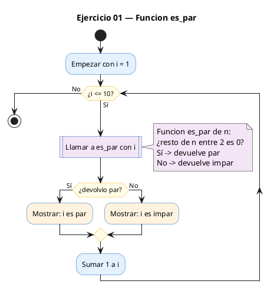
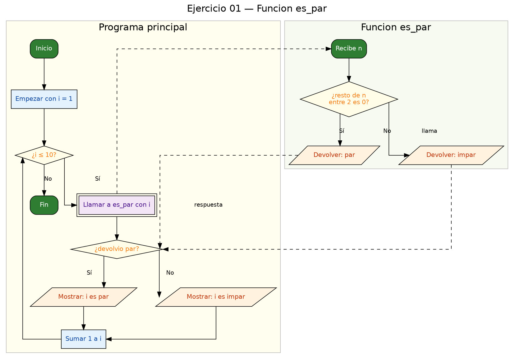

<!-- FICHERO GENERADO — NO EDITAR. Fuente de verdad: curso-c/practica/04-funciones/ej01.md (se regenera con gen_course.py). -->

# Ejercicio 01 — Función es_par(n) que devuelve 1 si n es par, 0 si no

Dificultad: verde · Módulo 04 (Funciones)

## Enunciado

Función es_par(n) que devuelve 1 si n es par, 0 si no. Prueba con 1..10.

## Diagramas de flujo





## Cómo se resuelve

<!-- EXPLICACION -->
La idea de este módulo es **sacar un cálculo de `main` y meterlo en su propia función**. Aquí esa función es `es_par(int n)`: recibe un entero y devuelve `1` si es par y `0` si es impar.

1. **Prototipo** — `int es_par(int n);` antes de `main`. Es la "firma" de la función (tipo que devuelve, nombre y tipo de parámetros) seguida de `;`. Le dice al compilador que la función existe, aunque la definas más abajo.
2. **El cálculo** — un número es par si al dividirlo entre 2 no sobra nada. El operador módulo `%` da ese resto, así que `n % 2 == 0` es verdadero (vale `1`) cuando `n` es par. Como en C un test de comparación ya vale `1` o `0`, basta con `return n % 2 == 0;`.
3. **La llamada** — en `main`, `es_par(i)` dentro del `?:` elige el texto `"par"` o `"impar"`.

Fíjate en que `n` es una **copia**: la función recibe el valor de `i`, no la variable `i` en sí. Puede hacer lo que quiera con `n` sin tocar el `i` del bucle.

Trampa típica: escribir `return n % 2;`. Eso devuelve el **resto** (0 o 1), justo al revés de lo que quieres: daría `0` (falso) para los pares. Si necesitas el sí/no, compara: `n % 2 == 0`.

## Para practicar — cópialo y complétalo

Pega este esqueleto y completa los `TODO`. Es la mejor forma de aprender: inténtalo antes de mirar la solución.

```c
/*
 * Curso de C — Modulo 04: Funciones
 * Ejercicio 01 — PRACTICA (rellena los TODO)
 * Enunciado: Función es_par(n) que devuelve 1 si n es par, 0 si no. Prueba con 1..10.
 * Dificultad: verde
 * Compilar: gcc -std=c11 -Wall ej01_practica.c -o ej01 && ./ej01
 */

#include <stdio.h>

/* TODO: escribe el prototipo de es_par aqui */

int main(void) {
    /* TODO: recorre los numeros del 1 al 10 con un bucle for */
    /* TODO: para cada numero llama a es_par y muestra "par" o "impar" */
    /*       formato sugerido: "%2d: par\n"  o  "%2d: impar\n"         */
    return 0;
}

/* TODO: define la funcion es_par(int n)
 *   - recibe un entero n
 *   - devuelve 1 si n es par, 0 si es impar
 *   - pista: usa el operador % (modulo)
 */
```

## Solución — cópiala y ejecútala

```c
/*
 * Curso de C — Modulo 04: Funciones
 * Ejercicio 01 — MODELO (resuelto)
 * Enunciado: Función es_par(n) que devuelve 1 si n es par, 0 si no. Prueba con 1..10.
 * Dificultad: verde
 * Compilar: gcc -std=c11 -Wall ej01_modelo.c -o ej01 && ./ej01
 */

#include <stdio.h>

/* Prototipo */
int es_par(int n);

int main(void) {
    for (int i = 1; i <= 10; i++) {
        printf("%2d: %s\n", i, es_par(i) ? "par" : "impar");
    }
    return 0;
}

/* Devuelve 1 si n es par, 0 si es impar.
 * Usamos el operador modulo: n % 2 == 0 <=> par. */
int es_par(int n) {
    return n % 2 == 0;
}
```

## Cómo usarlo

Pega el código en un fichero y ejecútalo con tu toolchain habitual (o el botón de Ejecutar de tu editor). Antes de mirar la solución, intenta completar tú el esqueleto: es la mejor forma de aprender.

## Conexiones

- [[Curso_C/modelo/04-funciones|Teoría del módulo]]
- [[Curso_C/practica/00_README|Índice del curso]]
