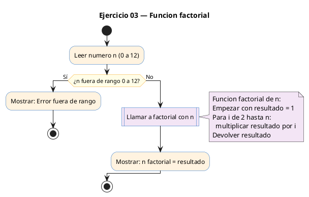
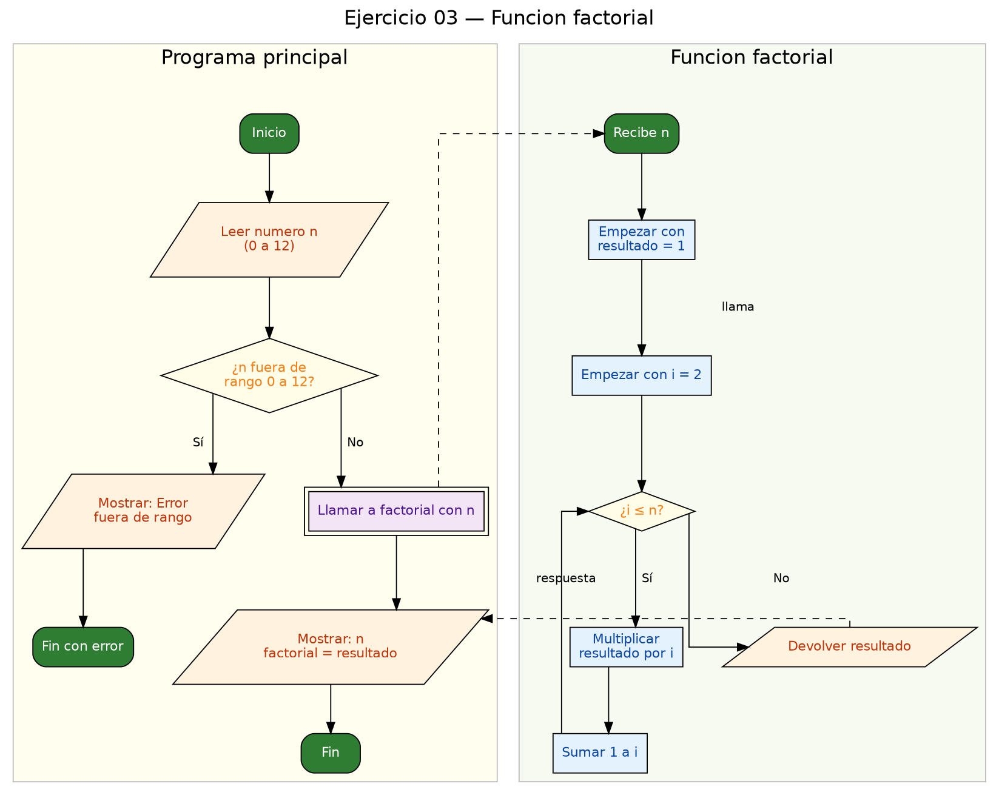

<!-- FICHERO GENERADO — NO EDITAR. Fuente de verdad: curso-c/practica/04-funciones/ej03.md (se regenera con gen_course.py). -->

# Ejercicio 03 — Función factorial(n)

Dificultad: verde · Módulo 04 (Funciones)

## Enunciado

Función factorial(n). Pide un número entre 0 y 12 e imprime su factorial.

## Diagramas de flujo





## Cómo se resuelve

<!-- EXPLICACION -->
El factorial de `n` (escrito `n!`) es `1 x 2 x 3 x ... x n`. Lo encapsulamos en `factorial(int n)`, que devuelve el resultado.

1. **Tipo de retorno `long`** — el prototipo es `long factorial(int n);`. El factorial crece muy rápido (`12!` ya son casi 480 millones), así que un `int` normal se quedaría corto y se desbordaría. Por eso se devuelve un `long`, y en `main` se imprime con `%ld`.
2. **El bucle acumulador** — dentro de la función, `resultado` empieza en `1` y se multiplica por cada `i` de 2 hasta `n`. Empezar en `1` hace que `0!` y `1!` salgan `1` automáticamente: el bucle ni siquiera entra, y devuelve el `1` inicial.
3. **La validación va en `main`** — se comprueba `n < 0 || n > 12` y, si falla, se imprime el error y `return 1;` cierra el programa. Separar la validación (en `main`) del cálculo (en la función) mantiene la función limpia y reutilizable.

Trampa típica: declarar `int resultado` en vez de `long`. Compila sin quejarse, pero para `n` grande el número "da la vuelta" y sale un resultado disparatado o negativo. Cuando un cálculo puede crecer mucho, piensa en el tipo antes de escribir el bucle.

## Para practicar — cópialo y complétalo

Pega este esqueleto y completa los `TODO`. Es la mejor forma de aprender: inténtalo antes de mirar la solución.

```c
/*
 * Curso de C — Modulo 04: Funciones
 * Ejercicio 03 — PRACTICA (rellena los TODO)
 * Enunciado: Función factorial(n). Pide un número entre 0 y 12 e imprime su factorial.
 * Dificultad: verde
 * Stdin: 5
 * Compilar: gcc -std=c11 -Wall ej03_practica.c -o ej03 && ./ej03
 */

#include <stdio.h>

/* TODO: escribe el prototipo de factorial (devuelve long, recibe int) */

int main(void) {
    int n;
    /* TODO: pide el numero al usuario */
    /* TODO: valida que este entre 0 y 12; si no, imprime error y haz return 1 */
    /* TODO: imprime el resultado con formato "%d! = %ld\n" */
    return 0;
}

/* TODO: define long factorial(int n)
 *   - factorial de 0 y 1 es 1
 *   - usa un bucle for que multiplique resultado *= i para i de 2 a n
 *   - devuelve el resultado
 */
```

## Solución — cópiala y ejecútala

```c
/*
 * Curso de C — Modulo 04: Funciones
 * Ejercicio 03 — MODELO (resuelto)
 * Enunciado: Función factorial(n). Pide un número entre 0 y 12 e imprime su factorial.
 * Dificultad: verde
 * Stdin: 5
 * Compilar: gcc -std=c11 -Wall ej03_modelo.c -o ej03 && ./ej03
 */

#include <stdio.h>

/* Prototipo */
long factorial(int n);

int main(void) {
    int n;
    printf("Introduce un numero entre 0 y 12: ");
    scanf("%d", &n);

    if (n < 0 || n > 12) {
        printf("Error: numero fuera de rango.\n");
        return 1;
    }

    printf("%d! = %ld\n", n, factorial(n));
    return 0;
}

/* Devuelve n! de forma iterativa.
 * Usamos long para evitar desbordamiento hasta n=12. */
long factorial(int n) {
    long resultado = 1;
    for (int i = 2; i <= n; i++) {
        resultado *= i;
    }
    return resultado;
}
```

## Ejecútalo en el navegador

[▶ Abrir y ejecutar en Compiler Explorer](https://godbolt.org/clientstate/eyJzZXNzaW9ucyI6W3siaWQiOjEsImxhbmd1YWdlIjoiYyIsInNvdXJjZSI6Ii8qXG4gKiBDdXJzbyBkZSBDIFx1MjAxNCBNb2R1bG8gMDQ6IEZ1bmNpb25lc1xuICogRWplcmNpY2lvIDAzIFx1MjAxNCBNT0RFTE8gKHJlc3VlbHRvKVxuICogRW51bmNpYWRvOiBGdW5jaVx1MDBmM24gZmFjdG9yaWFsKG4pLiBQaWRlIHVuIG5cdTAwZmFtZXJvIGVudHJlIDAgeSAxMiBlIGltcHJpbWUgc3UgZmFjdG9yaWFsLlxuICogRGlmaWN1bHRhZDogdmVyZGVcbiAqIFN0ZGluOiA1XG4gKiBDb21waWxhcjogZ2NjIC1zdGQ9YzExIC1XYWxsIGVqMDNfbW9kZWxvLmMgLW8gZWowMyAmJiAuL2VqMDNcbiAqL1xuXG4jaW5jbHVkZSA8c3RkaW8uaD5cblxuLyogUHJvdG90aXBvICovXG5sb25nIGZhY3RvcmlhbChpbnQgbik7XG5cbmludCBtYWluKHZvaWQpIHtcbiAgICBpbnQgbjtcbiAgICBwcmludGYoXCJJbnRyb2R1Y2UgdW4gbnVtZXJvIGVudHJlIDAgeSAxMjogXCIpO1xuICAgIHNjYW5mKFwiJWRcIiwgJm4pO1xuXG4gICAgaWYgKG4gPCAwIHx8IG4gPiAxMikge1xuICAgICAgICBwcmludGYoXCJFcnJvcjogbnVtZXJvIGZ1ZXJhIGRlIHJhbmdvLlxcblwiKTtcbiAgICAgICAgcmV0dXJuIDE7XG4gICAgfVxuXG4gICAgcHJpbnRmKFwiJWQhID0gJWxkXFxuXCIsIG4sIGZhY3RvcmlhbChuKSk7XG4gICAgcmV0dXJuIDA7XG59XG5cbi8qIERldnVlbHZlIG4hIGRlIGZvcm1hIGl0ZXJhdGl2YS5cbiAqIFVzYW1vcyBsb25nIHBhcmEgZXZpdGFyIGRlc2JvcmRhbWllbnRvIGhhc3RhIG49MTIuICovXG5sb25nIGZhY3RvcmlhbChpbnQgbikge1xuICAgIGxvbmcgcmVzdWx0YWRvID0gMTtcbiAgICBmb3IgKGludCBpID0gMjsgaSA8PSBuOyBpKyspIHtcbiAgICAgICAgcmVzdWx0YWRvICo9IGk7XG4gICAgfVxuICAgIHJldHVybiByZXN1bHRhZG87XG59XG4iLCJjb21waWxlcnMiOltdLCJleGVjdXRvcnMiOlt7ImFyZ3VtZW50cyI6IiIsImNvbXBpbGVyIjp7ImlkIjoiY2cxNDMiLCJsaWJzIjpbXSwib3B0aW9ucyI6Ii1zdGQ9YzExIC1sbSJ9LCJzdGRpbiI6IjUiLCJ3cmFwIjpmYWxzZX1dfV19)

Se abre con la solución ya cargada; pulsa el botón de ejecutar (Run) para ver la salida. No hay que instalar nada.

## Cómo usarlo

Pega el código en un fichero y ejecútalo con tu toolchain habitual (o el botón de Ejecutar de tu editor). Antes de mirar la solución, intenta completar tú el esqueleto: es la mejor forma de aprender.

## Conexiones

- [[Curso_C/modelo/04-funciones|Teoría del módulo]]
- [[Curso_C/practica/00_README|Índice del curso]]
