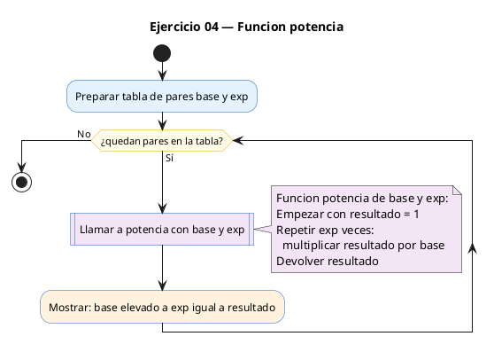

# Ejercicio 04 — Funcion potencia(base, exp) con enteros, exp >= 0

Dificultad: amarillo · Módulo 04 (Funciones)

## Enunciado

Funcion potencia(base, exp) con enteros, exp >= 0. Prueba con varios pares.

## Diagrama de flujo



## Cómo se resuelve

<!-- EXPLICACION -->
`potencia(base, exp)` calcula `base` elevado a `exp` **multiplicando a mano**, sin recurrir a `pow` de `math.h`. El prototipo es `long potencia(int base, int exp);`: recibe dos enteros y devuelve un `long`, porque una potencia crece rápido (`2^10 = 1024`, `10^6 = 1000000`).

La mecánica es un bucle acumulador, igual que en el factorial: `resultado` arranca en `1` y se multiplica por `base` tantas veces como diga `exp`. El bucle `for (i = 0; i < exp; i++)` se repite exactamente `exp` veces. Si `exp` es `0`, el bucle no se ejecuta y la función devuelve el `1` inicial, que es justo la convención `base^0 = 1`.

En `main` se prueban varios pares con dos arrays paralelos (`bases[]` y `exps[]`) recorridos a la vez: `potencia(bases[i], exps[i])`.

Trampa típica: usar `pow()`, que trabaja con `double` y devuelve algo como `1023.9999999998` por el redondeo de coma flotante. Para potencias de enteros, implementarla con un bucle da el resultado **exacto**. Ojo también con el tipo: si guardaras el resultado en `int`, potencias grandes desbordarían; por eso es `long`.

## Para practicar — cópialo en Dev-C++

Pega este esqueleto y completa los `TODO`. Es la mejor forma de aprender: inténtalo antes de mirar la solución.

```c
/*
 * Curso de C — Modulo 04: Funciones
 * Ejercicio 04 — PRACTICA (rellena los TODO)
 * Enunciado: Funcion potencia(base, exp) con enteros, exp >= 0. Prueba con varios pares.
 * Dificultad: amarillo
 * Compilar: gcc -std=c11 -Wall ej04_practica.c -o ej04 && ./ej04
 */

#include <stdio.h>

/* TODO: escribe el prototipo de potencia
 *   - devuelve long
 *   - recibe dos int: base y exp
 */

int main(void) {
    // Puedes usar esta tabla de pruebas o pedir los valores al usuario
    int bases[] = {2, 3, 5,  10, -2};
    int exps[]  = {10, 4, 3, 6,  5};
    int n = 5;

    /* TODO: recorre las parejas con un bucle for
     *       e imprime: "%d^%d = %ld\n"  usando potencia(bases[i], exps[i])
     */
    return 0;
}

/* TODO: define long potencia(int base, int exp)
 *   - caso base: exp == 0  ->  devuelve 1
 *   - caso general: multiplica base por si mismo exp veces (bucle for)
 *   - NOTA: NO uses pow() de math.h; implementalo tu
 */
```

## Solución — cópiala y ejecútala

```c
/*
 * Curso de C — Modulo 04: Funciones
 * Ejercicio 04 — MODELO (resuelto)
 * Enunciado: Funcion potencia(base, exp) con enteros, exp >= 0. Prueba con varios pares.
 * Dificultad: amarillo
 * Compilar: gcc -std=c11 -Wall ej04_modelo.c -o ej04 && ./ej04
 */

#include <stdio.h>

/* Prototipo */
long potencia(int base, int exp);

int main(void) {
    // Tabla de pruebas hardcodeada
    int bases[] = {2, 3, 5,  10, -2};
    int exps[]  = {10, 4, 3, 6,  5};
    int n = 5;

    for (int i = 0; i < n; i++) {
        printf("%d^%d = %ld\n", bases[i], exps[i], potencia(bases[i], exps[i]));
    }
    return 0;
}

/* Calcula base^exp de forma iterativa (exp >= 0).
 * Cualquier base^0 = 1 (incluido 0^0, por convencion). */
long potencia(int base, int exp) {
    long resultado = 1;
    for (int i = 0; i < exp; i++) {
        resultado *= base;
    }
    return resultado;
}
```

## Cómo usarlo

Dev-C++ (Windows): Archivo → Nuevo → Código fuente, pega el código y pulsa F11 (compilar y ejecutar). Si ves los acentos raros en la consola, escribe `chcp 65001` y vuelve a ejecutar.

## Conexiones

- [[Curso_C/modelo/04-funciones|Teoría del módulo]]
- [[Curso_C/00_README|Índice del curso]]
