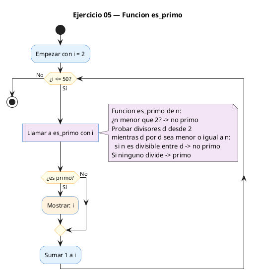
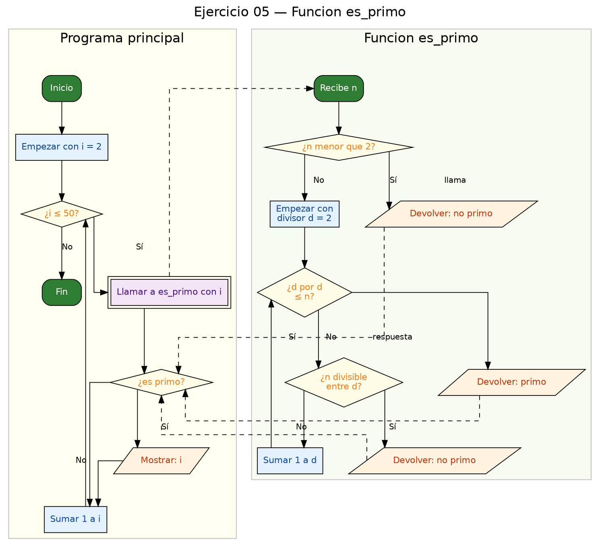

<!-- FICHERO GENERADO — NO EDITAR. Fuente de verdad: curso-c/practica/04-funciones/ej05.md (se regenera con gen_course.py). -->

# Ejercicio 05 — Función es_primo(n) que devuelve 1 si n es primo

Dificultad: amarillo · Módulo 04 (Funciones)

## Enunciado

Función es_primo(n) que devuelve 1 si n es primo. Imprime primos entre 2 y 50.

## Diagramas de flujo





## Cómo se resuelve

<!-- EXPLICACION -->
`es_primo(int n)` devuelve `1` si `n` es primo y `0` si no. Un número es primo si solo es divisible por 1 y por sí mismo, así que la estrategia es **buscar un divisor**: si encontramos uno, no es primo.

1. **Caso especial primero** — `if (n < 2) return 0;`. Ni 0, ni 1, ni los negativos son primos, y descartarlos de entrada evita líos en el bucle.
2. **Probar divisores** — el bucle recorre `d` desde 2 y comprueba `n % d == 0`. En cuanto un `d` divide exacto, `return 0;` sale de inmediato: ya sabemos que no es primo, no hace falta seguir.
3. **El truco de la raíz** — la condición del bucle es `d * d <= n`, es decir, se para en la raíz cuadrada de `n`. No hace falta llegar hasta `n`: si `n` tuviera un divisor mayor que su raíz, su pareja sería otro divisor **menor** que ya habríamos encontrado antes. Esto acelera mucho la función.
4. Si el bucle termina sin encontrar divisor, `return 1;`: es primo.

En `main`, un bucle de 2 a 50 llama a `es_primo(i)` y solo imprime los que dan `1`. Fíjate en cómo la función esconde toda la lógica: `main` queda legible como un filtro.

Trampa típica: escribir `d <= n` (o incluso `d < n`) en el bucle. Funciona, pero hace muchísimo más trabajo del necesario. La otra trampa clásica es olvidar el caso `n < 2` y que la función clasifique mal el 0 o el 1.

## Para practicar — cópialo y complétalo

Pega este esqueleto y completa los `TODO`. Es la mejor forma de aprender: inténtalo antes de mirar la solución.

```c
/*
 * Curso de C — Modulo 04: Funciones
 * Ejercicio 05 — PRACTICA (rellena los TODO)
 * Enunciado: Función es_primo(n) que devuelve 1 si n es primo. Imprime primos entre 2 y 50.
 * Dificultad: amarillo
 * Compilar: gcc -std=c11 -Wall ej05_practica.c -o ej05 && ./ej05
 */

#include <stdio.h>

/* TODO: escribe el prototipo de es_primo */

int main(void) {
    printf("Primos entre 2 y 50:\n");
    /* TODO: bucle de 2 a 50; si es_primo(i), imprime i seguido de espacio */
    printf("\n");
    return 0;
}

/* TODO: define int es_primo(int n)
 *   - n < 2  ->  no es primo (devuelve 0)
 *   - prueba divisores d desde 2; para cuando d*d > n (no necesitas ir hasta n)
 *   - si n % d == 0 para algun d, no es primo (devuelve 0)
 *   - si el bucle termina sin encontrar divisor, es primo (devuelve 1)
 */
```

## Solución — cópiala y ejecútala

```c
/*
 * Curso de C — Modulo 04: Funciones
 * Ejercicio 05 — MODELO (resuelto)
 * Enunciado: Función es_primo(n) que devuelve 1 si n es primo. Imprime primos entre 2 y 50.
 * Dificultad: amarillo
 * Compilar: gcc -std=c11 -Wall ej05_modelo.c -o ej05 && ./ej05
 */

#include <stdio.h>

/* Prototipo */
int es_primo(int n);

int main(void) {
    printf("Primos entre 2 y 50:\n");
    for (int i = 2; i <= 50; i++) {
        if (es_primo(i)) {
            printf("%d ", i);
        }
    }
    printf("\n");
    return 0;
}

/* Devuelve 1 si n es primo, 0 si no.
 * Algoritmo: probamos divisores desde 2 hasta sqrt(n).
 * Si encontramos uno que divide exactamente, no es primo. */
int es_primo(int n) {
    if (n < 2) return 0;
    for (int d = 2; d * d <= n; d++) {
        if (n % d == 0) return 0;
    }
    return 1;
}
```

## Ejecútalo en el navegador

[▶ Abrir y ejecutar en Compiler Explorer](https://godbolt.org/clientstate/eyJzZXNzaW9ucyI6W3siaWQiOjEsImxhbmd1YWdlIjoiYyIsInNvdXJjZSI6Ii8qXG4gKiBDdXJzbyBkZSBDIFx1MjAxNCBNb2R1bG8gMDQ6IEZ1bmNpb25lc1xuICogRWplcmNpY2lvIDA1IFx1MjAxNCBNT0RFTE8gKHJlc3VlbHRvKVxuICogRW51bmNpYWRvOiBGdW5jaVx1MDBmM24gZXNfcHJpbW8obikgcXVlIGRldnVlbHZlIDEgc2kgbiBlcyBwcmltby4gSW1wcmltZSBwcmltb3MgZW50cmUgMiB5IDUwLlxuICogRGlmaWN1bHRhZDogYW1hcmlsbG9cbiAqIENvbXBpbGFyOiBnY2MgLXN0ZD1jMTEgLVdhbGwgZWowNV9tb2RlbG8uYyAtbyBlajA1ICYmIC4vZWowNVxuICovXG5cbiNpbmNsdWRlIDxzdGRpby5oPlxuXG4vKiBQcm90b3RpcG8gKi9cbmludCBlc19wcmltbyhpbnQgbik7XG5cbmludCBtYWluKHZvaWQpIHtcbiAgICBwcmludGYoXCJQcmltb3MgZW50cmUgMiB5IDUwOlxcblwiKTtcbiAgICBmb3IgKGludCBpID0gMjsgaSA8PSA1MDsgaSsrKSB7XG4gICAgICAgIGlmIChlc19wcmltbyhpKSkge1xuICAgICAgICAgICAgcHJpbnRmKFwiJWQgXCIsIGkpO1xuICAgICAgICB9XG4gICAgfVxuICAgIHByaW50ZihcIlxcblwiKTtcbiAgICByZXR1cm4gMDtcbn1cblxuLyogRGV2dWVsdmUgMSBzaSBuIGVzIHByaW1vLCAwIHNpIG5vLlxuICogQWxnb3JpdG1vOiBwcm9iYW1vcyBkaXZpc29yZXMgZGVzZGUgMiBoYXN0YSBzcXJ0KG4pLlxuICogU2kgZW5jb250cmFtb3MgdW5vIHF1ZSBkaXZpZGUgZXhhY3RhbWVudGUsIG5vIGVzIHByaW1vLiAqL1xuaW50IGVzX3ByaW1vKGludCBuKSB7XG4gICAgaWYgKG4gPCAyKSByZXR1cm4gMDtcbiAgICBmb3IgKGludCBkID0gMjsgZCAqIGQgPD0gbjsgZCsrKSB7XG4gICAgICAgIGlmIChuICUgZCA9PSAwKSByZXR1cm4gMDtcbiAgICB9XG4gICAgcmV0dXJuIDE7XG59XG4iLCJjb21waWxlcnMiOltdLCJleGVjdXRvcnMiOlt7ImFyZ3VtZW50cyI6IiIsImNvbXBpbGVyIjp7ImlkIjoiY2cxNDMiLCJsaWJzIjpbXSwib3B0aW9ucyI6Ii1zdGQ9YzExIC1sbSJ9LCJzdGRpbiI6IiIsIndyYXAiOmZhbHNlfV19XX0%3D)

Se abre con la solución ya cargada; pulsa el botón de ejecutar (Run) para ver la salida. No hay que instalar nada.

## Cómo usarlo

Pega el código en un fichero y ejecútalo con tu toolchain habitual (o el botón de Ejecutar de tu editor). Antes de mirar la solución, intenta completar tú el esqueleto: es la mejor forma de aprender.

## Conexiones

- [[Curso_C/modelo/04-funciones|Teoría del módulo]]
- [[Curso_C/practica/00_README|Índice del curso]]
