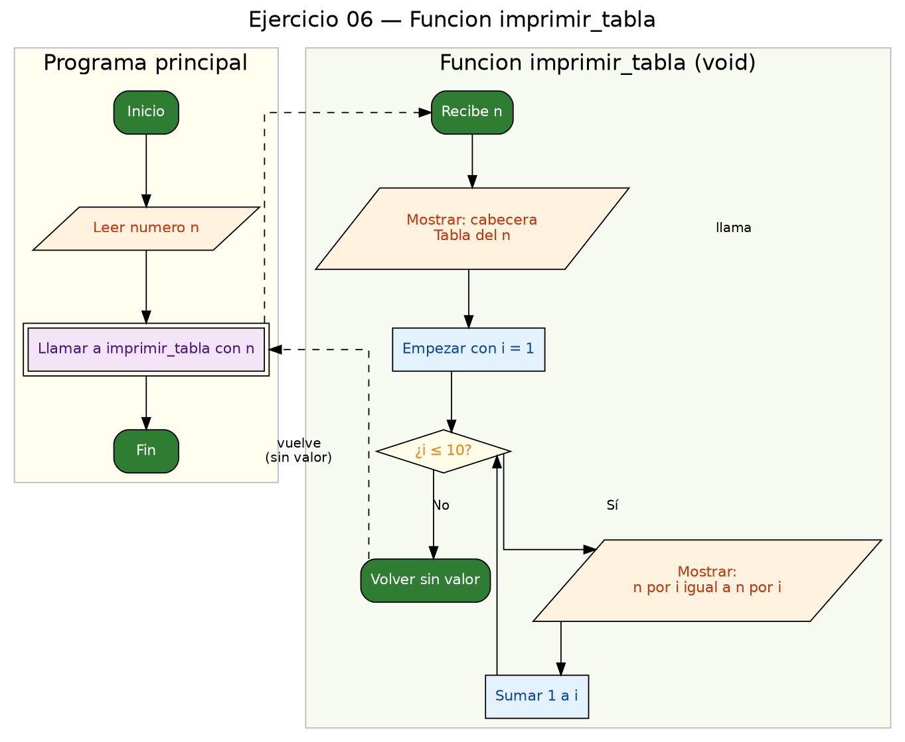

<!-- FICHERO GENERADO — NO EDITAR. Fuente de verdad: curso-c/practica/04-funciones/ej06.md (se regenera con gen_course.py). -->

# Ejercicio 06 — Función imprimir_tabla(n) que imprime la tabla de multiplicar de n

Dificultad: amarillo · Módulo 04 (Funciones)

## Enunciado

Función imprimir_tabla(n) que imprime la tabla de multiplicar de n (del 1 al 10).

## Diagramas de flujo




## Cómo se resuelve

<!-- EXPLICACION -->
Este ejercicio introduce las funciones **`void`**: las que hacen algo pero **no devuelven ningún valor**. `imprimir_tabla(n)` no calcula un resultado para el llamador; su único trabajo es imprimir por pantalla (a eso se le llama "efecto de lado").

- El prototipo es `void imprimir_tabla(int n);`. El `void` en la posición del tipo de retorno significa "esta función no devuelve nada".
- Dentro, imprime una cabecera y luego un bucle de `i = 1` a `10` que muestra cada línea `n x i = n*i`. Los anchos del formato (`%2d`, `%3d`) alinean las columnas para que la tabla quede en cuadrícula.
- Como es `void`, **no lleva `return` con valor**. Puede terminar sola al llegar al final, o usar un `return;` a secas (sin valor) para salir antes.
- En `main` la llamada es una instrucción completa por sí misma: `imprimir_tabla(n);`. No se asigna a nada, porque no hay nada que recoger.

Trampa típica: intentar usar el resultado de una función `void`, por ejemplo `int x = imprimir_tabla(3);`. El compilador lo rechaza: no hay valor que asignar. La regla es sencilla: si la función **calcula** algo que necesitas después, devuélvelo con `return` y un tipo (`int`, `long`...); si solo **actúa** (imprime, dibuja), hazla `void`.

## Para practicar — cópialo y complétalo

Pega este esqueleto y completa los `TODO`. Es la mejor forma de aprender: inténtalo antes de mirar la solución.

```c
/*
 * Curso de C — Modulo 04: Funciones
 * Ejercicio 06 — PRACTICA (rellena los TODO)
 * Enunciado: Función imprimir_tabla(n) que imprime la tabla de multiplicar de n (del 1 al 10).
 * Dificultad: amarillo
 * Stdin: 7
 * Compilar: gcc -std=c11 -Wall ej06_practica.c -o ej06 && ./ej06
 */

#include <stdio.h>

/* TODO: escribe el prototipo de imprimir_tabla
 *   - no devuelve nada (void)
 *   - recibe un int n
 */

int main(void) {
    int n;
    /* TODO: pide el numero al usuario */
    /* TODO: llama a imprimir_tabla(n) */
    return 0;
}

/* TODO: define void imprimir_tabla(int n)
 *   - imprime una cabecera, ej: "--- Tabla del 3 ---"
 *   - bucle for de i=1 a i=10
 *   - cada linea: "n x i = resultado"   (formato sugerido: "%2d x %2d = %3d\n")
 *   - NO uses return con valor (es void)
 */
```

## Solución — cópiala y ejecútala

```c
/*
 * Curso de C — Modulo 04: Funciones
 * Ejercicio 06 — MODELO (resuelto)
 * Enunciado: Función imprimir_tabla(n) que imprime la tabla de multiplicar de n (del 1 al 10).
 * Dificultad: amarillo
 * Stdin: 7
 * Compilar: gcc -std=c11 -Wall ej06_modelo.c -o ej06 && ./ej06
 */

#include <stdio.h>

/* Prototipo — void porque solo imprime, no devuelve valor */
void imprimir_tabla(int n);

int main(void) {
    int n;
    printf("Tabla de multiplicar de que numero? ");
    scanf("%d", &n);
    imprimir_tabla(n);
    return 0;
}

/* Imprime la tabla de multiplicar de n del 1 al 10.
 * No devuelve nada (void): su unico efecto es la impresion. */
void imprimir_tabla(int n) {
    printf("\n--- Tabla del %d ---\n", n);
    for (int i = 1; i <= 10; i++) {
        printf("%2d x %2d = %3d\n", n, i, n * i);
    }
}
```

## Ejecútalo en el navegador

[▶ Abrir y ejecutar en Compiler Explorer](https://godbolt.org/clientstate/eyJzZXNzaW9ucyI6W3siaWQiOjEsImxhbmd1YWdlIjoiYyIsInNvdXJjZSI6Ii8qXG4gKiBDdXJzbyBkZSBDIFx1MjAxNCBNb2R1bG8gMDQ6IEZ1bmNpb25lc1xuICogRWplcmNpY2lvIDA2IFx1MjAxNCBNT0RFTE8gKHJlc3VlbHRvKVxuICogRW51bmNpYWRvOiBGdW5jaVx1MDBmM24gaW1wcmltaXJfdGFibGEobikgcXVlIGltcHJpbWUgbGEgdGFibGEgZGUgbXVsdGlwbGljYXIgZGUgbiAoZGVsIDEgYWwgMTApLlxuICogRGlmaWN1bHRhZDogYW1hcmlsbG9cbiAqIFN0ZGluOiA3XG4gKiBDb21waWxhcjogZ2NjIC1zdGQ9YzExIC1XYWxsIGVqMDZfbW9kZWxvLmMgLW8gZWowNiAmJiAuL2VqMDZcbiAqL1xuXG4jaW5jbHVkZSA8c3RkaW8uaD5cblxuLyogUHJvdG90aXBvIFx1MjAxNCB2b2lkIHBvcnF1ZSBzb2xvIGltcHJpbWUsIG5vIGRldnVlbHZlIHZhbG9yICovXG52b2lkIGltcHJpbWlyX3RhYmxhKGludCBuKTtcblxuaW50IG1haW4odm9pZCkge1xuICAgIGludCBuO1xuICAgIHByaW50ZihcIlRhYmxhIGRlIG11bHRpcGxpY2FyIGRlIHF1ZSBudW1lcm8%2FIFwiKTtcbiAgICBzY2FuZihcIiVkXCIsICZuKTtcbiAgICBpbXByaW1pcl90YWJsYShuKTtcbiAgICByZXR1cm4gMDtcbn1cblxuLyogSW1wcmltZSBsYSB0YWJsYSBkZSBtdWx0aXBsaWNhciBkZSBuIGRlbCAxIGFsIDEwLlxuICogTm8gZGV2dWVsdmUgbmFkYSAodm9pZCk6IHN1IHVuaWNvIGVmZWN0byBlcyBsYSBpbXByZXNpb24uICovXG52b2lkIGltcHJpbWlyX3RhYmxhKGludCBuKSB7XG4gICAgcHJpbnRmKFwiXFxuLS0tIFRhYmxhIGRlbCAlZCAtLS1cXG5cIiwgbik7XG4gICAgZm9yIChpbnQgaSA9IDE7IGkgPD0gMTA7IGkrKykge1xuICAgICAgICBwcmludGYoXCIlMmQgeCAlMmQgPSAlM2RcXG5cIiwgbiwgaSwgbiAqIGkpO1xuICAgIH1cbn1cbiIsImNvbXBpbGVycyI6W10sImV4ZWN1dG9ycyI6W3siYXJndW1lbnRzIjoiIiwiY29tcGlsZXIiOnsiaWQiOiJjZzE0MyIsImxpYnMiOltdLCJvcHRpb25zIjoiLXN0ZD1jMTEgLWxtIn0sInN0ZGluIjoiNyIsIndyYXAiOmZhbHNlfV19XX0%3D)

Se abre con la solución ya cargada; pulsa el botón de ejecutar (Run) para ver la salida. No hay que instalar nada.

## Cómo usarlo

Pega el código en un fichero y ejecútalo con tu toolchain habitual (o el botón de Ejecutar de tu editor). Antes de mirar la solución, intenta completar tú el esqueleto: es la mejor forma de aprender.

## Conexiones

- [[Curso_C/modelo/04-funciones|Teoría del módulo]]
- [[Curso_C/practica/00_README|Índice del curso]]
