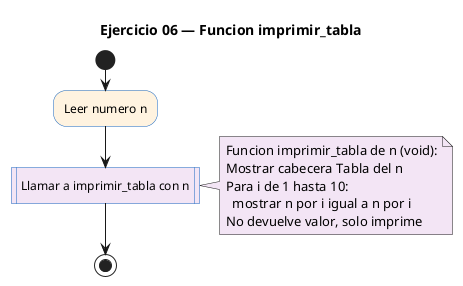

# Ejercicio 06 — Funcion imprimir_tabla(n) que imprime la tabla de multiplicar de n

Dificultad: amarillo · Módulo 04 (Funciones)

## Enunciado

Funcion imprimir_tabla(n) que imprime la tabla de multiplicar de n (del 1 al 10).

## Diagrama de flujo



## Cómo se resuelve

<!-- EXPLICACION -->
Este ejercicio introduce las funciones **`void`**: las que hacen algo pero **no devuelven ningún valor**. `imprimir_tabla(n)` no calcula un resultado para el llamador; su único trabajo es imprimir por pantalla (a eso se le llama "efecto de lado").

- El prototipo es `void imprimir_tabla(int n);`. El `void` en la posición del tipo de retorno significa "esta función no devuelve nada".
- Dentro, imprime una cabecera y luego un bucle de `i = 1` a `10` que muestra cada línea `n x i = n*i`. Los anchos del formato (`%2d`, `%3d`) alinean las columnas para que la tabla quede en cuadrícula.
- Como es `void`, **no lleva `return` con valor**. Puede terminar sola al llegar al final, o usar un `return;` a secas (sin valor) para salir antes.
- En `main` la llamada es una instrucción completa por sí misma: `imprimir_tabla(n);`. No se asigna a nada, porque no hay nada que recoger.

Trampa típica: intentar usar el resultado de una función `void`, por ejemplo `int x = imprimir_tabla(3);`. El compilador lo rechaza: no hay valor que asignar. La regla es sencilla: si la función **calcula** algo que necesitas después, devuélvelo con `return` y un tipo (`int`, `long`...); si solo **actúa** (imprime, dibuja), hazla `void`.

## Para practicar — cópialo en Dev-C++

Pega este esqueleto y completa los `TODO`. Es la mejor forma de aprender: inténtalo antes de mirar la solución.

```c
/*
 * Curso de C — Modulo 04: Funciones
 * Ejercicio 06 — PRACTICA (rellena los TODO)
 * Enunciado: Funcion imprimir_tabla(n) que imprime la tabla de multiplicar de n (del 1 al 10).
 * Dificultad: amarillo
 * Compilar: gcc -std=c11 -Wall ej06_practica.c -o ej06 && ./ej06
 */

#include <stdio.h>

/* TODO: escribe el prototipo de imprimir_tabla
 *   - no devuelve nada (void)
 *   - recibe un int n
 */

int main(void) {
    int n;
    /* TODO: pide el numero al usuario */
    /* TODO: llama a imprimir_tabla(n) */
    return 0;
}

/* TODO: define void imprimir_tabla(int n)
 *   - imprime una cabecera, ej: "--- Tabla del 3 ---"
 *   - bucle for de i=1 a i=10
 *   - cada linea: "n x i = resultado"   (formato sugerido: "%2d x %2d = %3d\n")
 *   - NO uses return con valor (es void)
 */
```

## Solución — cópiala y ejecútala

```c
/*
 * Curso de C — Modulo 04: Funciones
 * Ejercicio 06 — MODELO (resuelto)
 * Enunciado: Funcion imprimir_tabla(n) que imprime la tabla de multiplicar de n (del 1 al 10).
 * Dificultad: amarillo
 * Compilar: gcc -std=c11 -Wall ej06_modelo.c -o ej06 && ./ej06
 */

#include <stdio.h>

/* Prototipo — void porque solo imprime, no devuelve valor */
void imprimir_tabla(int n);

int main(void) {
    int n;
    printf("Tabla de multiplicar de que numero? ");
    scanf("%d", &n);
    imprimir_tabla(n);
    return 0;
}

/* Imprime la tabla de multiplicar de n del 1 al 10.
 * No devuelve nada (void): su unico efecto es la impresion. */
void imprimir_tabla(int n) {
    printf("\n--- Tabla del %d ---\n", n);
    for (int i = 1; i <= 10; i++) {
        printf("%2d x %2d = %3d\n", n, i, n * i);
    }
}
```

## Cómo usarlo

Dev-C++ (Windows): Archivo → Nuevo → Código fuente, pega el código y pulsa F11 (compilar y ejecutar). Si ves los acentos raros en la consola, escribe `chcp 65001` y vuelve a ejecutar.

## Conexiones

- [[Curso_C/modelo/04-funciones|Teoría del módulo]]
- [[Curso_C/00_README|Índice del curso]]
