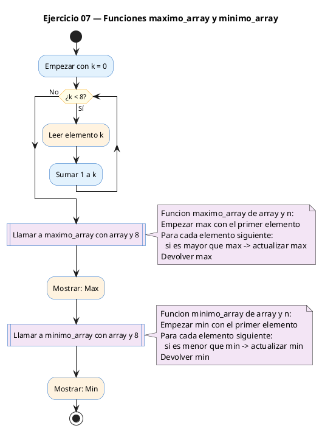
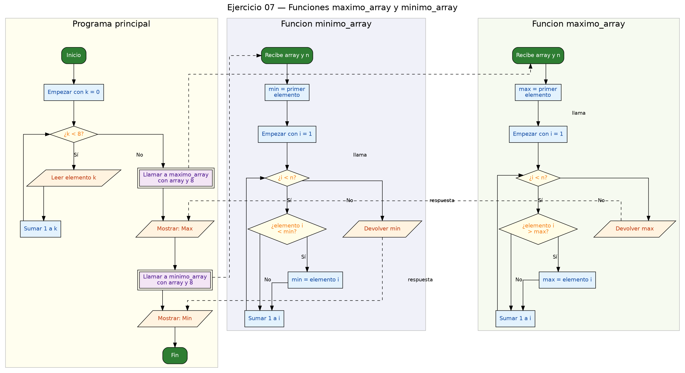

<!-- FICHERO GENERADO — NO EDITAR. Fuente de verdad: curso-c/practica/04-funciones/ej07.md (se regenera con gen_course.py). -->

# Ejercicio 07 — Funciones maximo_array y minimo_array

Dificultad: rojo · Módulo 04 (Funciones)

## Enunciado

Funciones maximo_array y minimo_array. Lee 8 enteros e imprime max y min.

## Diagramas de flujo





## Cómo se resuelve

<!-- EXPLICACION -->
Aquí pasas un **array entero a una función**. `maximo_array(int arr[], int n)` y `minimo_array(int arr[], int n)` reciben el array y su número de elementos, y devuelven el mayor y el menor.

El algoritmo es el mismo en las dos: se supone que el primer elemento (`arr[0]`) es el máximo (o el mínimo) provisional, se recorre el resto desde `i = 1` y, cada vez que aparece uno mejor, se actualiza. Empezar en `arr[0]` y recorrer desde `1` evita comparar el elemento consigo mismo.

Lo importante de este ejercicio es **cómo viaja el array**:

- Un array **no se copia** al pasarlo a una función. Lo que recibe `arr` es un puntero al primer elemento, es decir, la función trabaja sobre el array **original** de `main`.
- Por eso hay que pasar el tamaño `n` **aparte**: dentro de la función, `arr` es en realidad un puntero, y `sizeof(arr)` te daría el tamaño de un puntero (8 bytes, no el número de elementos). El array "olvida" su longitud al cruzar la frontera de la función.
- En `main` se lee con `scanf("%d", &v[i])` dentro de un bucle: cada elemento lleva `&` porque `scanf` necesita su dirección.

Trampa típica: intentar averiguar el número de elementos dentro de la función con `sizeof(arr) / sizeof(arr[0])`. Fuera de la función (donde `v` sí es un array de verdad) eso funciona; dentro, `arr` es un puntero y el cálculo sale mal. Por eso el tamaño siempre se pasa como parámetro extra.

## Para practicar — cópialo y complétalo

Pega este esqueleto y completa los `TODO`. Es la mejor forma de aprender: inténtalo antes de mirar la solución.

```c
/*
 * Curso de C — Modulo 04: Funciones
 * Ejercicio 07 — PRACTICA (rellena los TODO)
 * Enunciado: Funciones maximo_array y minimo_array. Lee 8 enteros e imprime max y min.
 * Dificultad: rojo
 * Stdin: 5\n2\n8\n1\n9\n3\n7\n4
 * Compilar: gcc -std=c11 -Wall ej07_practica.c -o ej07 && ./ej07
 */

#include <stdio.h>

#define TAM 8

/* TODO: escribe los prototipos de maximo_array y minimo_array
 *   - ambas reciben: int arr[], int n
 *   - ambas devuelven int
 */

int main(void) {
    int v[TAM];

    printf("Introduce %d enteros:\n", TAM);
    /* TODO: bucle for para leer cada elemento con scanf
     *       recuerda: &v[i]  (scanf necesita la direccion)
     */

    /* TODO: imprime el maximo y el minimo llamando a tus funciones */
    return 0;
}

/* TODO: define int maximo_array(int arr[], int n)
 *   - inicializa max = arr[0]
 *   - recorre desde i=1 hasta i<n
 *   - si arr[i] > max, actualiza max
 *   - devuelve max
 *   - CLAVE: no puedes usar sizeof(arr) aqui; usa n
 */

/* TODO: define int minimo_array(int arr[], int n)
 *   - igual que maximo_array pero buscando el menor
 */
```

## Solución — cópiala y ejecútala

```c
/*
 * Curso de C — Modulo 04: Funciones
 * Ejercicio 07 — MODELO (resuelto)
 * Enunciado: Funciones maximo_array y minimo_array. Lee 8 enteros e imprime max y min.
 * Dificultad: rojo
 * Stdin: 5\n2\n8\n1\n9\n3\n7\n4
 * Compilar: gcc -std=c11 -Wall ej07_modelo.c -o ej07 && ./ej07
 */

#include <stdio.h>

#define TAM 8

/* Prototipos — reciben el array y su tamano por separado */
int maximo_array(int arr[], int n);
int minimo_array(int arr[], int n);

int main(void) {
    int v[TAM];

    printf("Introduce %d enteros:\n", TAM);
    for (int i = 0; i < TAM; i++) {
        printf("  v[%d]: ", i);
        scanf("%d", &v[i]);
    }

    printf("\nMax: %d\n", maximo_array(v, TAM));
    printf("Min: %d\n", minimo_array(v, TAM));
    return 0;
}

/* Recorre el array y devuelve el mayor elemento.
 * IMPORTANTE: dentro de la funcion NO podemos usar sizeof(arr)/sizeof(arr[0])
 * porque arr es un puntero, no un array. Por eso pasamos n aparte. */
int maximo_array(int arr[], int n) {
    int max = arr[0];
    for (int i = 1; i < n; i++) {
        if (arr[i] > max) max = arr[i];
    }
    return max;
}

/* Igual que maximo_array pero buscando el menor */
int minimo_array(int arr[], int n) {
    int min = arr[0];
    for (int i = 1; i < n; i++) {
        if (arr[i] < min) min = arr[i];
    }
    return min;
}
```

## Ejecútalo en el navegador

[▶ Abrir y ejecutar en Compiler Explorer](https://godbolt.org/clientstate/eyJzZXNzaW9ucyI6W3siaWQiOjEsImxhbmd1YWdlIjoiYyIsInNvdXJjZSI6Ii8qXG4gKiBDdXJzbyBkZSBDIFx1MjAxNCBNb2R1bG8gMDQ6IEZ1bmNpb25lc1xuICogRWplcmNpY2lvIDA3IFx1MjAxNCBNT0RFTE8gKHJlc3VlbHRvKVxuICogRW51bmNpYWRvOiBGdW5jaW9uZXMgbWF4aW1vX2FycmF5IHkgbWluaW1vX2FycmF5LiBMZWUgOCBlbnRlcm9zIGUgaW1wcmltZSBtYXggeSBtaW4uXG4gKiBEaWZpY3VsdGFkOiByb2pvXG4gKiBTdGRpbjogNVxcbjJcXG44XFxuMVxcbjlcXG4zXFxuN1xcbjRcbiAqIENvbXBpbGFyOiBnY2MgLXN0ZD1jMTEgLVdhbGwgZWowN19tb2RlbG8uYyAtbyBlajA3ICYmIC4vZWowN1xuICovXG5cbiNpbmNsdWRlIDxzdGRpby5oPlxuXG4jZGVmaW5lIFRBTSA4XG5cbi8qIFByb3RvdGlwb3MgXHUyMDE0IHJlY2liZW4gZWwgYXJyYXkgeSBzdSB0YW1hbm8gcG9yIHNlcGFyYWRvICovXG5pbnQgbWF4aW1vX2FycmF5KGludCBhcnJbXSwgaW50IG4pO1xuaW50IG1pbmltb19hcnJheShpbnQgYXJyW10sIGludCBuKTtcblxuaW50IG1haW4odm9pZCkge1xuICAgIGludCB2W1RBTV07XG5cbiAgICBwcmludGYoXCJJbnRyb2R1Y2UgJWQgZW50ZXJvczpcXG5cIiwgVEFNKTtcbiAgICBmb3IgKGludCBpID0gMDsgaSA8IFRBTTsgaSsrKSB7XG4gICAgICAgIHByaW50ZihcIiAgdlslZF06IFwiLCBpKTtcbiAgICAgICAgc2NhbmYoXCIlZFwiLCAmdltpXSk7XG4gICAgfVxuXG4gICAgcHJpbnRmKFwiXFxuTWF4OiAlZFxcblwiLCBtYXhpbW9fYXJyYXkodiwgVEFNKSk7XG4gICAgcHJpbnRmKFwiTWluOiAlZFxcblwiLCBtaW5pbW9fYXJyYXkodiwgVEFNKSk7XG4gICAgcmV0dXJuIDA7XG59XG5cbi8qIFJlY29ycmUgZWwgYXJyYXkgeSBkZXZ1ZWx2ZSBlbCBtYXlvciBlbGVtZW50by5cbiAqIElNUE9SVEFOVEU6IGRlbnRybyBkZSBsYSBmdW5jaW9uIE5PIHBvZGVtb3MgdXNhciBzaXplb2YoYXJyKS9zaXplb2YoYXJyWzBdKVxuICogcG9ycXVlIGFyciBlcyB1biBwdW50ZXJvLCBubyB1biBhcnJheS4gUG9yIGVzbyBwYXNhbW9zIG4gYXBhcnRlLiAqL1xuaW50IG1heGltb19hcnJheShpbnQgYXJyW10sIGludCBuKSB7XG4gICAgaW50IG1heCA9IGFyclswXTtcbiAgICBmb3IgKGludCBpID0gMTsgaSA8IG47IGkrKykge1xuICAgICAgICBpZiAoYXJyW2ldID4gbWF4KSBtYXggPSBhcnJbaV07XG4gICAgfVxuICAgIHJldHVybiBtYXg7XG59XG5cbi8qIElndWFsIHF1ZSBtYXhpbW9fYXJyYXkgcGVybyBidXNjYW5kbyBlbCBtZW5vciAqL1xuaW50IG1pbmltb19hcnJheShpbnQgYXJyW10sIGludCBuKSB7XG4gICAgaW50IG1pbiA9IGFyclswXTtcbiAgICBmb3IgKGludCBpID0gMTsgaSA8IG47IGkrKykge1xuICAgICAgICBpZiAoYXJyW2ldIDwgbWluKSBtaW4gPSBhcnJbaV07XG4gICAgfVxuICAgIHJldHVybiBtaW47XG59XG4iLCJjb21waWxlcnMiOltdLCJleGVjdXRvcnMiOlt7ImFyZ3VtZW50cyI6IiIsImNvbXBpbGVyIjp7ImlkIjoiY2cxNDMiLCJsaWJzIjpbXSwib3B0aW9ucyI6Ii1zdGQ9YzExIC1sbSJ9LCJzdGRpbiI6IjVcbjJcbjhcbjFcbjlcbjNcbjdcbjQiLCJ3cmFwIjpmYWxzZX1dfV19)

Se abre con la solución ya cargada; pulsa el botón de ejecutar (Run) para ver la salida. No hay que instalar nada.

## Cómo usarlo

Pega el código en un fichero y ejecútalo con tu toolchain habitual (o el botón de Ejecutar de tu editor). Antes de mirar la solución, intenta completar tú el esqueleto: es la mejor forma de aprender.

## Conexiones

- [[Curso_C/modelo/04-funciones|Teoría del módulo]]
- [[Curso_C/practica/00_README|Índice del curso]]
