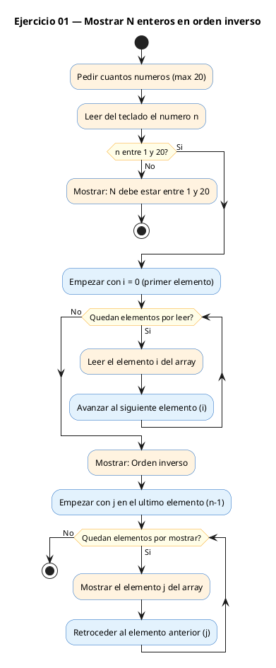

# Ejercicio 01 — Leer N enteros (N<=20) y mostrarlos en orden inverso

Dificultad: verde · Módulo 05 (Arrays y cadenas)

## Enunciado

Leer N enteros (N<=20) y mostrarlos en orden inverso.

## Diagrama de flujo



## Cómo se resuelve

<!-- EXPLICACION -->
Un **array** es un bloque de casillas numeradas del mismo tipo. Aquí declaramos `int a[20]`: 20 huecos con índices que van del `0` al `19`. Reservamos 20 aunque el usuario pida menos; solo usaremos las primeras `n` posiciones.

1. Antes de nada validamos que `n` está entre 1 y 20. Esto no es un capricho: el array solo tiene 20 casillas, así que si `n` fuera mayor escribiríamos fuera de sus límites.
2. El **primer bucle** recorre de `0` a `n-1` y llena el array leyendo con `scanf("%d", &a[i])`. Fíjate en el `&`: `scanf` necesita la dirección de la casilla donde guardar el número.
3. El **segundo bucle** es el truco del ejercicio: en vez de ir hacia adelante, arranca en el último índice (`i = n - 1`) y baja hasta `0` con `i--`. Recorrer el array al revés es lo que produce el orden inverso, sin mover ni un solo dato de sitio.

Trampa habitual: el índice válido llega hasta `n-1`, nunca hasta `n`. Un bucle que empiece en `i = n` leería `a[n]`, una casilla que no existe, y eso en C no da error de compilación: simplemente devuelve basura o rompe el programa.

## Para practicar — cópialo en Dev-C++

Pega este esqueleto y completa los `TODO`. Es la mejor forma de aprender: inténtalo antes de mirar la solución.

```c
/*
 * Curso de C — Modulo 05: Arrays y cadenas
 * Ejercicio 01 — PRACTICA (rellena los TODO)
 * Enunciado: Leer N enteros (N<=20) y mostrarlos en orden inverso.
 * Dificultad: verde
 * Compilar: gcc -std=c11 -Wall ej01_practica.c -o ej01 && ./ej01
 */

#include <stdio.h>

int main(void) {
    int n;

    // TODO 1: Pedir al usuario cuantos numeros va a introducir (max 20)
    //         y leer el valor en 'n' con scanf.

    // TODO 2: Declara un array de enteros de tamano 20.

    // TODO 3: Con un bucle for de 0 a n-1, lee cada entero del usuario
    //         y guardalo en el array. Recuerda el & en scanf.

    // TODO 4: Con otro bucle for que vaya desde n-1 hasta 0 (inclusive),
    //         imprime cada elemento seguido de un espacio.

    printf("\n");
    return 0;
}
```

## Solución — cópiala y ejecútala

```c
/*
 * Curso de C — Modulo 05: Arrays y cadenas
 * Ejercicio 01 — MODELO (resuelto)
 * Enunciado: Leer N enteros (N<=20) y mostrarlos en orden inverso.
 * Dificultad: verde
 * Compilar: gcc -std=c11 -Wall ej01_modelo.c -o ej01 && ./ej01
 */

#include <stdio.h>

int main(void) {
    int n;
    printf("Cuantos numeros (max 20)? ");
    scanf("%d", &n);

    // Validacion basica del rango
    if (n < 1 || n > 20) {
        printf("N debe estar entre 1 y 20.\n");
        return 1;
    }

    int a[20];

    // Leer los N enteros
    for (int i = 0; i < n; i++) {
        printf("a[%d] = ", i);
        scanf("%d", &a[i]);
    }

    // Mostrar en orden inverso: empezamos desde el ultimo indice (n-1)
    printf("Orden inverso: ");
    for (int i = n - 1; i >= 0; i--) {
        printf("%d ", a[i]);
    }
    printf("\n");

    return 0;
}
```

## Cómo usarlo

Dev-C++ (Windows): Archivo → Nuevo → Código fuente, pega el código y pulsa F11 (compilar y ejecutar). Si ves los acentos raros en la consola, escribe `chcp 65001` y vuelve a ejecutar.

## Conexiones

- [[Curso_C/modelo/05-arrays-cadenas|Teoría del módulo]]
- [[Curso_C/00_README|Índice del curso]]
