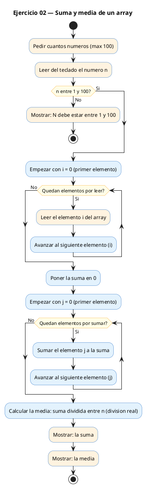
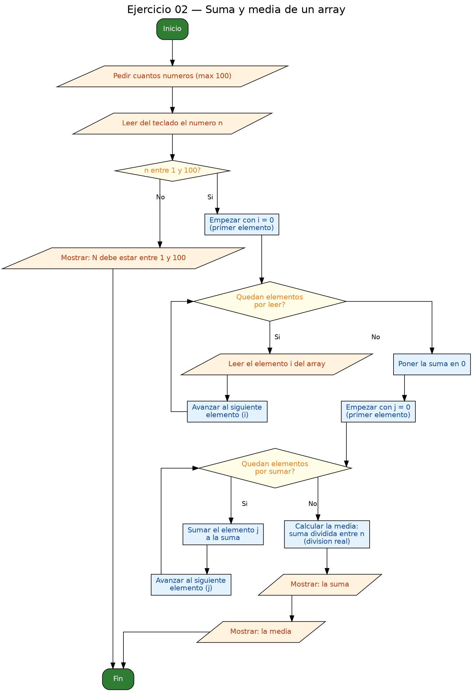

<!-- FICHERO GENERADO — NO EDITAR. Fuente de verdad: curso-c/practica/05-arrays-cadenas/ej02.md (se regenera con gen_course.py). -->

# Ejercicio 02 — Calcular la suma y la media de un array de N enteros

Dificultad: verde · Módulo 05 (Arrays y cadenas)

## Enunciado

Calcular la suma y la media de un array de N enteros.

## Diagramas de flujo





## Cómo se resuelve

<!-- EXPLICACION -->
Este ejercicio es el patrón clásico de **acumular** mientras se recorre un array. Tras leer los `n` enteros en `a`, sumamos todos sus elementos y calculamos la media.

1. `long suma = 0` — arrancamos el acumulador en `0` y en cada vuelta hacemos `suma += a[i]`. Usamos `long` en lugar de `int` porque si sumas muchos números grandes, un `int` podría **desbordarse** (dar la vuelta a un valor negativo sin avisar).
2. La media necesita una división con decimales. Aquí está la trampa: `suma / n` con ambos enteros haría **división entera** y tiraría los decimales (`30/4` daría `7`, no `7.5`). La solución es forzar el cálculo en coma flotante con un *cast*:

```c
double media = (double)suma / n;
```

Al convertir `suma` a `double`, la división pasa a ser real y conserva los decimales. Luego `printf("%.2f", media)` lo muestra con dos cifras.

Recuerda inicializar el acumulador a `0` antes del bucle: si lo dejas sin valor, arranca con basura y la suma sale mal.

## Para practicar — cópialo y complétalo

Pega este esqueleto y completa los `TODO`. Es la mejor forma de aprender: inténtalo antes de mirar la solución.

```c
/*
 * Curso de C — Modulo 05: Arrays y cadenas
 * Ejercicio 02 — PRACTICA (rellena los TODO)
 * Enunciado: Calcular la suma y la media de un array de N enteros.
 * Dificultad: verde
 * Stdin: 5\n10\n20\n30\n40\n50
 * Compilar: gcc -std=c11 -Wall ej02_practica.c -o ej02 && ./ej02
 */

#include <stdio.h>

int main(void) {
    int n;

    // TODO 1: Pedir N al usuario y leerlo.

    // TODO 2: Declara el array de enteros (max 100).

    // TODO 3: Leer los N enteros del usuario con un bucle for.

    // TODO 4: Declara una variable 'suma' de tipo long inicializada a 0.
    //         Recorre el array y acumula la suma.

    // TODO 5: Calcula la media como double. Pista: necesitas un cast.
    //         (double)suma / n

    // TODO 6: Imprime suma y media con 2 decimales.

    return 0;
}
```

## Solución — cópiala y ejecútala

```c
/*
 * Curso de C — Modulo 05: Arrays y cadenas
 * Ejercicio 02 — MODELO (resuelto)
 * Enunciado: Calcular la suma y la media de un array de N enteros.
 * Dificultad: verde
 * Stdin: 5\n10\n20\n30\n40\n50
 * Compilar: gcc -std=c11 -Wall ej02_modelo.c -o ej02 && ./ej02
 */

#include <stdio.h>

int main(void) {
    int n;
    printf("Cuantos numeros (max 100)? ");
    scanf("%d", &n);

    if (n < 1 || n > 100) {
        printf("N debe estar entre 1 y 100.\n");
        return 1;
    }

    int a[100];
    for (int i = 0; i < n; i++) {
        printf("a[%d] = ", i);
        scanf("%d", &a[i]);
    }

    // Acumular la suma; usamos long para evitar desbordamiento con valores grandes
    long suma = 0;
    for (int i = 0; i < n; i++) {
        suma += a[i];
    }

    // La media requiere division real: cast a double
    double media = (double)suma / n;

    printf("Suma: %ld\n", suma);
    printf("Media: %.2f\n", media);

    return 0;
}
```

## Ejecútalo en el navegador

[▶ Abrir y ejecutar en Compiler Explorer](https://godbolt.org/clientstate/eyJzZXNzaW9ucyI6W3siaWQiOjEsImxhbmd1YWdlIjoiYyIsInNvdXJjZSI6Ii8qXG4gKiBDdXJzbyBkZSBDIFx1MjAxNCBNb2R1bG8gMDU6IEFycmF5cyB5IGNhZGVuYXNcbiAqIEVqZXJjaWNpbyAwMiBcdTIwMTQgTU9ERUxPIChyZXN1ZWx0bylcbiAqIEVudW5jaWFkbzogQ2FsY3VsYXIgbGEgc3VtYSB5IGxhIG1lZGlhIGRlIHVuIGFycmF5IGRlIE4gZW50ZXJvcy5cbiAqIERpZmljdWx0YWQ6IHZlcmRlXG4gKiBTdGRpbjogNVxcbjEwXFxuMjBcXG4zMFxcbjQwXFxuNTBcbiAqIENvbXBpbGFyOiBnY2MgLXN0ZD1jMTEgLVdhbGwgZWowMl9tb2RlbG8uYyAtbyBlajAyICYmIC4vZWowMlxuICovXG5cbiNpbmNsdWRlIDxzdGRpby5oPlxuXG5pbnQgbWFpbih2b2lkKSB7XG4gICAgaW50IG47XG4gICAgcHJpbnRmKFwiQ3VhbnRvcyBudW1lcm9zIChtYXggMTAwKT8gXCIpO1xuICAgIHNjYW5mKFwiJWRcIiwgJm4pO1xuXG4gICAgaWYgKG4gPCAxIHx8IG4gPiAxMDApIHtcbiAgICAgICAgcHJpbnRmKFwiTiBkZWJlIGVzdGFyIGVudHJlIDEgeSAxMDAuXFxuXCIpO1xuICAgICAgICByZXR1cm4gMTtcbiAgICB9XG5cbiAgICBpbnQgYVsxMDBdO1xuICAgIGZvciAoaW50IGkgPSAwOyBpIDwgbjsgaSsrKSB7XG4gICAgICAgIHByaW50ZihcImFbJWRdID0gXCIsIGkpO1xuICAgICAgICBzY2FuZihcIiVkXCIsICZhW2ldKTtcbiAgICB9XG5cbiAgICAvLyBBY3VtdWxhciBsYSBzdW1hOyB1c2Ftb3MgbG9uZyBwYXJhIGV2aXRhciBkZXNib3JkYW1pZW50byBjb24gdmFsb3JlcyBncmFuZGVzXG4gICAgbG9uZyBzdW1hID0gMDtcbiAgICBmb3IgKGludCBpID0gMDsgaSA8IG47IGkrKykge1xuICAgICAgICBzdW1hICs9IGFbaV07XG4gICAgfVxuXG4gICAgLy8gTGEgbWVkaWEgcmVxdWllcmUgZGl2aXNpb24gcmVhbDogY2FzdCBhIGRvdWJsZVxuICAgIGRvdWJsZSBtZWRpYSA9IChkb3VibGUpc3VtYSAvIG47XG5cbiAgICBwcmludGYoXCJTdW1hOiAlbGRcXG5cIiwgc3VtYSk7XG4gICAgcHJpbnRmKFwiTWVkaWE6ICUuMmZcXG5cIiwgbWVkaWEpO1xuXG4gICAgcmV0dXJuIDA7XG59XG4iLCJjb21waWxlcnMiOltdLCJleGVjdXRvcnMiOlt7ImFyZ3VtZW50cyI6IiIsImNvbXBpbGVyIjp7ImlkIjoiY2cxNDMiLCJsaWJzIjpbXSwib3B0aW9ucyI6Ii1zdGQ9YzExIC1sbSJ9LCJzdGRpbiI6IjVcbjEwXG4yMFxuMzBcbjQwXG41MCIsIndyYXAiOmZhbHNlfV19XX0%3D)

Se abre con la solución ya cargada; pulsa el botón de ejecutar (Run) para ver la salida. No hay que instalar nada.

## Cómo usarlo

Pega el código en un fichero y ejecútalo con tu toolchain habitual (o el botón de Ejecutar de tu editor). Antes de mirar la solución, intenta completar tú el esqueleto: es la mejor forma de aprender.

## Conexiones

- [[Curso_C/modelo/05-arrays-cadenas|Teoría del módulo]]
- [[Curso_C/practica/00_README|Índice del curso]]
