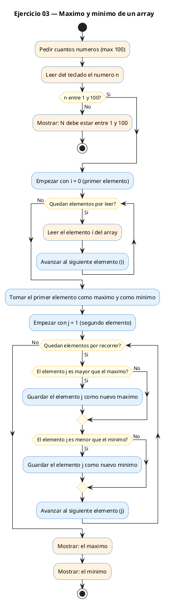
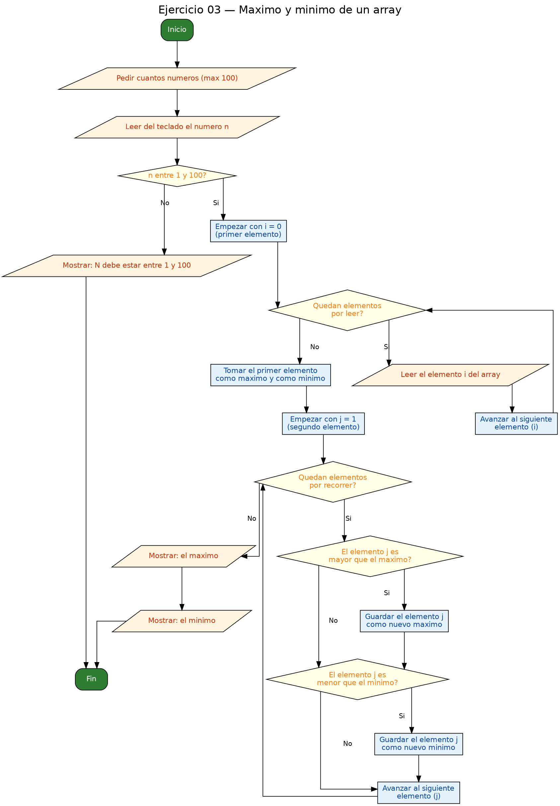

<!-- FICHERO GENERADO — NO EDITAR. Fuente de verdad: curso-c/practica/05-arrays-cadenas/ej03.md (se regenera con gen_course.py). -->

# Ejercicio 03 — Encontrar el máximo y el mínimo de un array de N enteros

Dificultad: verde · Módulo 05 (Arrays y cadenas)

## Enunciado

Encontrar el máximo y el mínimo de un array de N enteros.

## Diagramas de flujo





## Cómo se resuelve

<!-- EXPLICACION -->
Para encontrar el máximo y el mínimo recorremos el array una sola vez comparando cada elemento con los mejores candidatos que llevamos hasta el momento.

1. El detalle importante está al inicializar: `int max = a[0]; int min = a[0];`. Arrancamos ambos con el **primer elemento del array**, no con `0`. Esto es la trampa típica: si inicializaras `max = 0` y todos los números fueran negativos (por ejemplo `-5 -2 -8`), el programa diría que el máximo es `0`, un valor que nunca estuvo en los datos. Usar `a[0]` garantiza que empiezas con un valor real de la colección.
2. El bucle empieza en `i = 1`, no en `0`, porque a la posición `0` ya la hemos usado para inicializar. En cada vuelta: si `a[i]` supera a `max`, lo actualizamos; si es menor que `min`, actualizamos `min`.

Al terminar el recorrido, `max` y `min` contienen el mayor y el menor de todo el array. Este patrón "guardar el mejor hasta ahora" reaparece en muchísimos algoritmos.

## Para practicar — cópialo y complétalo

Pega este esqueleto y completa los `TODO`. Es la mejor forma de aprender: inténtalo antes de mirar la solución.

```c
/*
 * Curso de C — Modulo 05: Arrays y cadenas
 * Ejercicio 03 — PRACTICA (rellena los TODO)
 * Enunciado: Encontrar el máximo y el mínimo de un array de N enteros.
 * Dificultad: verde
 * Stdin: 5\n3\n8\n1\n9\n4
 * Compilar: gcc -std=c11 -Wall ej03_practica.c -o ej03 && ./ej03
 */

#include <stdio.h>

int main(void) {
    int n;

    // TODO 1: Pedir N y leerlo.

    // TODO 2: Declara el array y lee los N enteros.

    // TODO 3: Declara 'max' y 'min' e inicializalos con a[0].
    //         (Ojo: NO uses 0 como valor inicial si los datos pueden ser negativos.)

    // TODO 4: Recorre el array desde el indice 1. En cada iteracion:
    //         - Si a[i] > max, actualiza max.
    //         - Si a[i] < min, actualiza min.

    // TODO 5: Imprime max y min.

    return 0;
}
```

## Solución — cópiala y ejecútala

```c
/*
 * Curso de C — Modulo 05: Arrays y cadenas
 * Ejercicio 03 — MODELO (resuelto)
 * Enunciado: Encontrar el máximo y el mínimo de un array de N enteros.
 * Dificultad: verde
 * Stdin: 5\n3\n8\n1\n9\n4
 * Compilar: gcc -std=c11 -Wall ej03_modelo.c -o ej03 && ./ej03
 */

#include <stdio.h>

int main(void) {
    int n;
    printf("Cuantos numeros (max 100)? ");
    scanf("%d", &n);

    if (n < 1 || n > 100) {
        printf("N debe estar entre 1 y 100.\n");
        return 1;
    }

    int a[100];
    for (int i = 0; i < n; i++) {
        printf("a[%d] = ", i);
        scanf("%d", &a[i]);
    }

    // Inicializar max y min con el primer elemento.
    // NO inicialices con 0: si todos los valores son negativos, fallaria.
    int max = a[0];
    int min = a[0];

    for (int i = 1; i < n; i++) {   // empezamos en 1, ya tenemos a[0]
        if (a[i] > max) max = a[i];
        if (a[i] < min) min = a[i];
    }

    printf("Max: %d\n", max);
    printf("Min: %d\n", min);

    return 0;
}
```

## Ejecútalo en el navegador

[▶ Abrir y ejecutar en Compiler Explorer](https://godbolt.org/clientstate/eyJzZXNzaW9ucyI6W3siaWQiOjEsImxhbmd1YWdlIjoiYyIsInNvdXJjZSI6Ii8qXG4gKiBDdXJzbyBkZSBDIFx1MjAxNCBNb2R1bG8gMDU6IEFycmF5cyB5IGNhZGVuYXNcbiAqIEVqZXJjaWNpbyAwMyBcdTIwMTQgTU9ERUxPIChyZXN1ZWx0bylcbiAqIEVudW5jaWFkbzogRW5jb250cmFyIGVsIG1cdTAwZTF4aW1vIHkgZWwgbVx1MDBlZG5pbW8gZGUgdW4gYXJyYXkgZGUgTiBlbnRlcm9zLlxuICogRGlmaWN1bHRhZDogdmVyZGVcbiAqIFN0ZGluOiA1XFxuM1xcbjhcXG4xXFxuOVxcbjRcbiAqIENvbXBpbGFyOiBnY2MgLXN0ZD1jMTEgLVdhbGwgZWowM19tb2RlbG8uYyAtbyBlajAzICYmIC4vZWowM1xuICovXG5cbiNpbmNsdWRlIDxzdGRpby5oPlxuXG5pbnQgbWFpbih2b2lkKSB7XG4gICAgaW50IG47XG4gICAgcHJpbnRmKFwiQ3VhbnRvcyBudW1lcm9zIChtYXggMTAwKT8gXCIpO1xuICAgIHNjYW5mKFwiJWRcIiwgJm4pO1xuXG4gICAgaWYgKG4gPCAxIHx8IG4gPiAxMDApIHtcbiAgICAgICAgcHJpbnRmKFwiTiBkZWJlIGVzdGFyIGVudHJlIDEgeSAxMDAuXFxuXCIpO1xuICAgICAgICByZXR1cm4gMTtcbiAgICB9XG5cbiAgICBpbnQgYVsxMDBdO1xuICAgIGZvciAoaW50IGkgPSAwOyBpIDwgbjsgaSsrKSB7XG4gICAgICAgIHByaW50ZihcImFbJWRdID0gXCIsIGkpO1xuICAgICAgICBzY2FuZihcIiVkXCIsICZhW2ldKTtcbiAgICB9XG5cbiAgICAvLyBJbmljaWFsaXphciBtYXggeSBtaW4gY29uIGVsIHByaW1lciBlbGVtZW50by5cbiAgICAvLyBOTyBpbmljaWFsaWNlcyBjb24gMDogc2kgdG9kb3MgbG9zIHZhbG9yZXMgc29uIG5lZ2F0aXZvcywgZmFsbGFyaWEuXG4gICAgaW50IG1heCA9IGFbMF07XG4gICAgaW50IG1pbiA9IGFbMF07XG5cbiAgICBmb3IgKGludCBpID0gMTsgaSA8IG47IGkrKykgeyAgIC8vIGVtcGV6YW1vcyBlbiAxLCB5YSB0ZW5lbW9zIGFbMF1cbiAgICAgICAgaWYgKGFbaV0gPiBtYXgpIG1heCA9IGFbaV07XG4gICAgICAgIGlmIChhW2ldIDwgbWluKSBtaW4gPSBhW2ldO1xuICAgIH1cblxuICAgIHByaW50ZihcIk1heDogJWRcXG5cIiwgbWF4KTtcbiAgICBwcmludGYoXCJNaW46ICVkXFxuXCIsIG1pbik7XG5cbiAgICByZXR1cm4gMDtcbn1cbiIsImNvbXBpbGVycyI6W10sImV4ZWN1dG9ycyI6W3siYXJndW1lbnRzIjoiIiwiY29tcGlsZXIiOnsiaWQiOiJjZzE0MyIsImxpYnMiOltdLCJvcHRpb25zIjoiLXN0ZD1jMTEgLWxtIn0sInN0ZGluIjoiNVxuM1xuOFxuMVxuOVxuNCIsIndyYXAiOmZhbHNlfV19XX0%3D)

Se abre con la solución ya cargada; pulsa el botón de ejecutar (Run) para ver la salida. No hay que instalar nada.

## Cómo usarlo

Pega el código en un fichero y ejecútalo con tu toolchain habitual (o el botón de Ejecutar de tu editor). Antes de mirar la solución, intenta completar tú el esqueleto: es la mejor forma de aprender.

## Conexiones

- [[Curso_C/modelo/05-arrays-cadenas|Teoría del módulo]]
- [[Curso_C/practica/00_README|Índice del curso]]
