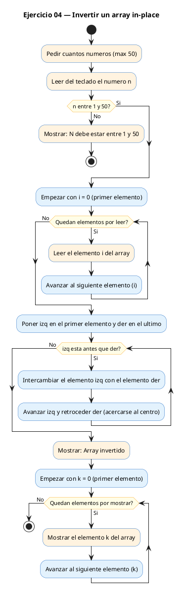
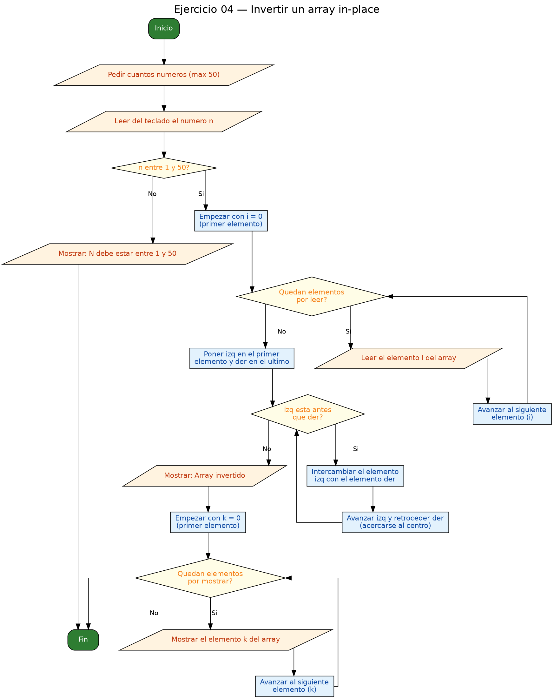

<!-- FICHERO GENERADO — NO EDITAR. Fuente de verdad: curso-c/practica/05-arrays-cadenas/ej04.md (se regenera con gen_course.py). -->

# Ejercicio 04 — Invertir un array IN-PLACE (sin array auxiliar) y mostrarlo

Dificultad: amarillo · Módulo 05 (Arrays y cadenas)

## Enunciado

Invertir un array IN-PLACE (sin array auxiliar) y mostrarlo.

## Diagramas de flujo





## Cómo se resuelve

<!-- EXPLICACION -->
Invertir **in-place** significa dar la vuelta al array sin crear otro array auxiliar: reordenamos las casillas del mismo `a`. La técnica es el patrón de **dos índices** que se acercan.

1. Colocamos un índice `izq = 0` al principio y otro `der = n - 1` al final.
2. Mientras `izq < der`, intercambiamos `a[izq]` con `a[der]` y luego avanzamos `izq++` y retrocedemos `der--`. Los dos índices se van juntando hacia el centro; cuando se cruzan, el array ya está del revés.

El intercambio se hace con el **swap de variable temporal**, imprescindible en C:

```c
int tmp = a[izq];
a[izq] = a[der];
a[der] = tmp;
```

Trampa habitual: si intentas el swap sin `tmp` (`a[izq] = a[der]; a[der] = a[izq];`), la primera línea ya machacó `a[izq]`, así que la segunda copia el valor equivocado y pierdes un dato. La variable temporal guarda una copia antes de sobrescribir. La condición `izq < der` (y no `<=`) es correcta: cuando ambos apuntan a la misma casilla central no hay nada que intercambiar.

## Para practicar — cópialo y complétalo

Pega este esqueleto y completa los `TODO`. Es la mejor forma de aprender: inténtalo antes de mirar la solución.

```c
/*
 * Curso de C — Modulo 05: Arrays y cadenas
 * Ejercicio 04 — PRACTICA (rellena los TODO)
 * Enunciado: Invertir un array IN-PLACE (sin array auxiliar) y mostrarlo.
 * Dificultad: amarillo
 * Stdin: 5\n1\n2\n3\n4\n5
 * Compilar: gcc -std=c11 -Wall ej04_practica.c -o ej04 && ./ej04
 */

#include <stdio.h>

int main(void) {
    int n;

    // TODO 1: Pedir N y leerlo. Declara el array y lee los N enteros.

    // TODO 2: Declara dos indices: 'izq = 0' y 'der = n - 1'.

    // TODO 3: Bucle while mientras izq < der:
    //         a) Guarda a[izq] en una variable temporal 'tmp'.
    //         b) Copia a[der] en a[izq].
    //         c) Copia 'tmp' en a[der].
    //         d) Incrementa izq y decrementa der.
    //         (Este es el patron "swap con variable temporal".)

    // TODO 4: Imprime el array resultante.

    return 0;
}
```

## Solución — cópiala y ejecútala

```c
/*
 * Curso de C — Modulo 05: Arrays y cadenas
 * Ejercicio 04 — MODELO (resuelto)
 * Enunciado: Invertir un array IN-PLACE (sin array auxiliar) y mostrarlo.
 * Dificultad: amarillo
 * Stdin: 5\n1\n2\n3\n4\n5
 * Compilar: gcc -std=c11 -Wall ej04_modelo.c -o ej04 && ./ej04
 */

#include <stdio.h>

int main(void) {
    int n;
    printf("Cuantos numeros (max 50)? ");
    scanf("%d", &n);

    if (n < 1 || n > 50) {
        printf("N debe estar entre 1 y 50.\n");
        return 1;
    }

    int a[50];
    for (int i = 0; i < n; i++) {
        printf("a[%d] = ", i);
        scanf("%d", &a[i]);
    }

    // Invertir con dos indices: uno desde el principio (izq) y otro desde el final (der).
    // Intercambiamos los elementos y avanzamos hacia el centro.
    int izq = 0;
    int der = n - 1;
    while (izq < der) {
        // Swap clasico con variable temporal
        int tmp = a[izq];
        a[izq] = a[der];
        a[der] = tmp;
        izq++;
        der--;
    }

    printf("Array invertido: ");
    for (int i = 0; i < n; i++) {
        printf("%d ", a[i]);
    }
    printf("\n");

    return 0;
}
```

## Ejecútalo en el navegador

[▶ Abrir y ejecutar en Compiler Explorer](https://godbolt.org/clientstate/eyJzZXNzaW9ucyI6W3siaWQiOjEsImxhbmd1YWdlIjoiYyIsInNvdXJjZSI6Ii8qXG4gKiBDdXJzbyBkZSBDIFx1MjAxNCBNb2R1bG8gMDU6IEFycmF5cyB5IGNhZGVuYXNcbiAqIEVqZXJjaWNpbyAwNCBcdTIwMTQgTU9ERUxPIChyZXN1ZWx0bylcbiAqIEVudW5jaWFkbzogSW52ZXJ0aXIgdW4gYXJyYXkgSU4tUExBQ0UgKHNpbiBhcnJheSBhdXhpbGlhcikgeSBtb3N0cmFybG8uXG4gKiBEaWZpY3VsdGFkOiBhbWFyaWxsb1xuICogU3RkaW46IDVcXG4xXFxuMlxcbjNcXG40XFxuNVxuICogQ29tcGlsYXI6IGdjYyAtc3RkPWMxMSAtV2FsbCBlajA0X21vZGVsby5jIC1vIGVqMDQgJiYgLi9lajA0XG4gKi9cblxuI2luY2x1ZGUgPHN0ZGlvLmg%2BXG5cbmludCBtYWluKHZvaWQpIHtcbiAgICBpbnQgbjtcbiAgICBwcmludGYoXCJDdWFudG9zIG51bWVyb3MgKG1heCA1MCk%2FIFwiKTtcbiAgICBzY2FuZihcIiVkXCIsICZuKTtcblxuICAgIGlmIChuIDwgMSB8fCBuID4gNTApIHtcbiAgICAgICAgcHJpbnRmKFwiTiBkZWJlIGVzdGFyIGVudHJlIDEgeSA1MC5cXG5cIik7XG4gICAgICAgIHJldHVybiAxO1xuICAgIH1cblxuICAgIGludCBhWzUwXTtcbiAgICBmb3IgKGludCBpID0gMDsgaSA8IG47IGkrKykge1xuICAgICAgICBwcmludGYoXCJhWyVkXSA9IFwiLCBpKTtcbiAgICAgICAgc2NhbmYoXCIlZFwiLCAmYVtpXSk7XG4gICAgfVxuXG4gICAgLy8gSW52ZXJ0aXIgY29uIGRvcyBpbmRpY2VzOiB1bm8gZGVzZGUgZWwgcHJpbmNpcGlvIChpenEpIHkgb3RybyBkZXNkZSBlbCBmaW5hbCAoZGVyKS5cbiAgICAvLyBJbnRlcmNhbWJpYW1vcyBsb3MgZWxlbWVudG9zIHkgYXZhbnphbW9zIGhhY2lhIGVsIGNlbnRyby5cbiAgICBpbnQgaXpxID0gMDtcbiAgICBpbnQgZGVyID0gbiAtIDE7XG4gICAgd2hpbGUgKGl6cSA8IGRlcikge1xuICAgICAgICAvLyBTd2FwIGNsYXNpY28gY29uIHZhcmlhYmxlIHRlbXBvcmFsXG4gICAgICAgIGludCB0bXAgPSBhW2l6cV07XG4gICAgICAgIGFbaXpxXSA9IGFbZGVyXTtcbiAgICAgICAgYVtkZXJdID0gdG1wO1xuICAgICAgICBpenErKztcbiAgICAgICAgZGVyLS07XG4gICAgfVxuXG4gICAgcHJpbnRmKFwiQXJyYXkgaW52ZXJ0aWRvOiBcIik7XG4gICAgZm9yIChpbnQgaSA9IDA7IGkgPCBuOyBpKyspIHtcbiAgICAgICAgcHJpbnRmKFwiJWQgXCIsIGFbaV0pO1xuICAgIH1cbiAgICBwcmludGYoXCJcXG5cIik7XG5cbiAgICByZXR1cm4gMDtcbn1cbiIsImNvbXBpbGVycyI6W10sImV4ZWN1dG9ycyI6W3siYXJndW1lbnRzIjoiIiwiY29tcGlsZXIiOnsiaWQiOiJjZzE0MyIsImxpYnMiOltdLCJvcHRpb25zIjoiLXN0ZD1jMTEgLWxtIn0sInN0ZGluIjoiNVxuMVxuMlxuM1xuNFxuNSIsIndyYXAiOmZhbHNlfV19XX0%3D)

Se abre con la solución ya cargada; pulsa el botón de ejecutar (Run) para ver la salida. No hay que instalar nada.

## Cómo usarlo

Pega el código en un fichero y ejecútalo con tu toolchain habitual (o el botón de Ejecutar de tu editor). Antes de mirar la solución, intenta completar tú el esqueleto: es la mejor forma de aprender.

## Conexiones

- [[Curso_C/modelo/05-arrays-cadenas|Teoría del módulo]]
- [[Curso_C/practica/00_README|Índice del curso]]
