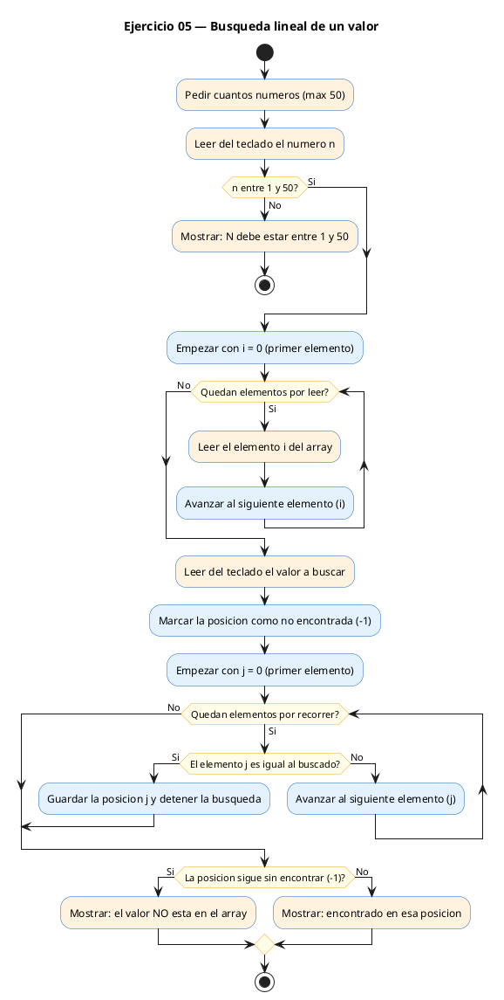
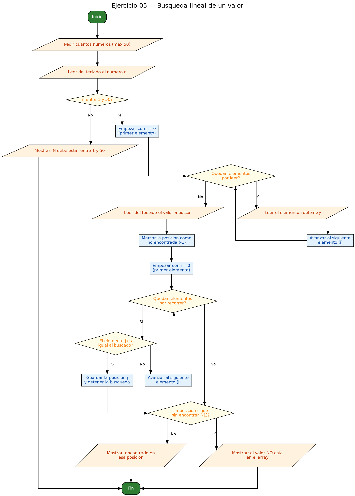

<!-- FICHERO GENERADO — NO EDITAR. Fuente de verdad: curso-c/practica/05-arrays-cadenas/ej05.md (se regenera con gen_course.py). -->

# Ejercicio 05 — Búsqueda lineal — leer un array y un valor

Dificultad: amarillo · Módulo 05 (Arrays y cadenas)

## Enunciado

Búsqueda lineal — leer un array y un valor; indicar si existe y en qué posición (primera ocurrencia).

## Diagramas de flujo





## Cómo se resuelve

<!-- EXPLICACION -->
La **búsqueda lineal** es la forma más simple de buscar: recorrer el array de principio a fin comparando cada elemento con el valor buscado hasta encontrarlo.

1. Usamos una variable `pos` como resultado, inicializada a `-1`. Ese `-1` es un **centinela** que significa "todavía no encontrado": lo elegimos porque ninguna posición válida del array es `-1` (los índices empiezan en `0`), así que no hay ambigüedad.
2. Recorremos con un `for`; en cuanto `a[i] == buscado`, guardamos `pos = i` y hacemos `break` para salir del bucle. El `break` es lo que nos da la **primera** ocurrencia: si el valor apareciera más veces, no seguimos mirando.
3. Al final, si `pos` sigue valiendo `-1` es que nunca hubo coincidencia; en caso contrario, `pos` es la posición encontrada.

Trampa habitual: usar `0` como valor de "no encontrado". Como `0` es una posición válida (la primera casilla), confundirías "está en la posición 0" con "no está". Por eso se reserva `-1`, que nunca puede ser un índice real.

## Para practicar — cópialo y complétalo

Pega este esqueleto y completa los `TODO`. Es la mejor forma de aprender: inténtalo antes de mirar la solución.

```c
/*
 * Curso de C — Modulo 05: Arrays y cadenas
 * Ejercicio 05 — PRACTICA (rellena los TODO)
 * Enunciado: Búsqueda lineal — leer un array y un valor; indicar si existe
 *            y en qué posición (primera ocurrencia).
 * Dificultad: amarillo
 * Stdin: 5\n10\n20\n30\n40\n50\n30
 * Compilar: gcc -std=c11 -Wall ej05_practica.c -o ej05 && ./ej05
 */

#include <stdio.h>

int main(void) {
    int n;

    // TODO 1: Pedir N, declarar el array y leer los N enteros.

    // TODO 2: Pedir el valor a buscar.

    // TODO 3: Declara una variable 'pos' inicializada a -1.
    //         Recorre el array con un for. Si a[i] == buscado:
    //           - guarda i en pos
    //           - usa 'break' para salir del bucle (primera ocurrencia)

    // TODO 4: Si pos sigue siendo -1, el elemento no existe.
    //         Si no, imprime la posicion donde se encontro.

    return 0;
}
```

## Solución — cópiala y ejecútala

```c
/*
 * Curso de C — Modulo 05: Arrays y cadenas
 * Ejercicio 05 — MODELO (resuelto)
 * Enunciado: Búsqueda lineal — leer un array y un valor; indicar si existe
 *            y en qué posición (primera ocurrencia).
 * Dificultad: amarillo
 * Stdin: 5\n10\n20\n30\n40\n50\n30
 * Compilar: gcc -std=c11 -Wall ej05_modelo.c -o ej05 && ./ej05
 */

#include <stdio.h>

int main(void) {
    int n;
    printf("Cuantos numeros (max 50)? ");
    scanf("%d", &n);

    if (n < 1 || n > 50) {
        printf("N debe estar entre 1 y 50.\n");
        return 1;
    }

    int a[50];
    for (int i = 0; i < n; i++) {
        printf("a[%d] = ", i);
        scanf("%d", &a[i]);
    }

    int buscado;
    printf("Valor a buscar: ");
    scanf("%d", &buscado);

    // Busqueda lineal: recorrer desde el principio y parar en la primera coincidencia
    int pos = -1;   // -1 significa "no encontrado" (ninguna posicion valida es -1)
    for (int i = 0; i < n; i++) {
        if (a[i] == buscado) {
            pos = i;
            break;  // encontramos la primera ocurrencia; salimos
        }
    }

    if (pos == -1) {
        printf("El valor %d NO esta en el array.\n", buscado);
    } else {
        printf("Encontrado en posicion %d\n", pos);
    }

    return 0;
}
```

## Ejecútalo en el navegador

[▶ Abrir y ejecutar en Compiler Explorer](https://godbolt.org/clientstate/eyJzZXNzaW9ucyI6W3siaWQiOjEsImxhbmd1YWdlIjoiYyIsInNvdXJjZSI6Ii8qXG4gKiBDdXJzbyBkZSBDIFx1MjAxNCBNb2R1bG8gMDU6IEFycmF5cyB5IGNhZGVuYXNcbiAqIEVqZXJjaWNpbyAwNSBcdTIwMTQgTU9ERUxPIChyZXN1ZWx0bylcbiAqIEVudW5jaWFkbzogQlx1MDBmYXNxdWVkYSBsaW5lYWwgXHUyMDE0IGxlZXIgdW4gYXJyYXkgeSB1biB2YWxvcjsgaW5kaWNhciBzaSBleGlzdGVcbiAqICAgICAgICAgICAgeSBlbiBxdVx1MDBlOSBwb3NpY2lcdTAwZjNuIChwcmltZXJhIG9jdXJyZW5jaWEpLlxuICogRGlmaWN1bHRhZDogYW1hcmlsbG9cbiAqIFN0ZGluOiA1XFxuMTBcXG4yMFxcbjMwXFxuNDBcXG41MFxcbjMwXG4gKiBDb21waWxhcjogZ2NjIC1zdGQ9YzExIC1XYWxsIGVqMDVfbW9kZWxvLmMgLW8gZWowNSAmJiAuL2VqMDVcbiAqL1xuXG4jaW5jbHVkZSA8c3RkaW8uaD5cblxuaW50IG1haW4odm9pZCkge1xuICAgIGludCBuO1xuICAgIHByaW50ZihcIkN1YW50b3MgbnVtZXJvcyAobWF4IDUwKT8gXCIpO1xuICAgIHNjYW5mKFwiJWRcIiwgJm4pO1xuXG4gICAgaWYgKG4gPCAxIHx8IG4gPiA1MCkge1xuICAgICAgICBwcmludGYoXCJOIGRlYmUgZXN0YXIgZW50cmUgMSB5IDUwLlxcblwiKTtcbiAgICAgICAgcmV0dXJuIDE7XG4gICAgfVxuXG4gICAgaW50IGFbNTBdO1xuICAgIGZvciAoaW50IGkgPSAwOyBpIDwgbjsgaSsrKSB7XG4gICAgICAgIHByaW50ZihcImFbJWRdID0gXCIsIGkpO1xuICAgICAgICBzY2FuZihcIiVkXCIsICZhW2ldKTtcbiAgICB9XG5cbiAgICBpbnQgYnVzY2FkbztcbiAgICBwcmludGYoXCJWYWxvciBhIGJ1c2NhcjogXCIpO1xuICAgIHNjYW5mKFwiJWRcIiwgJmJ1c2NhZG8pO1xuXG4gICAgLy8gQnVzcXVlZGEgbGluZWFsOiByZWNvcnJlciBkZXNkZSBlbCBwcmluY2lwaW8geSBwYXJhciBlbiBsYSBwcmltZXJhIGNvaW5jaWRlbmNpYVxuICAgIGludCBwb3MgPSAtMTsgICAvLyAtMSBzaWduaWZpY2EgXCJubyBlbmNvbnRyYWRvXCIgKG5pbmd1bmEgcG9zaWNpb24gdmFsaWRhIGVzIC0xKVxuICAgIGZvciAoaW50IGkgPSAwOyBpIDwgbjsgaSsrKSB7XG4gICAgICAgIGlmIChhW2ldID09IGJ1c2NhZG8pIHtcbiAgICAgICAgICAgIHBvcyA9IGk7XG4gICAgICAgICAgICBicmVhazsgIC8vIGVuY29udHJhbW9zIGxhIHByaW1lcmEgb2N1cnJlbmNpYTsgc2FsaW1vc1xuICAgICAgICB9XG4gICAgfVxuXG4gICAgaWYgKHBvcyA9PSAtMSkge1xuICAgICAgICBwcmludGYoXCJFbCB2YWxvciAlZCBOTyBlc3RhIGVuIGVsIGFycmF5LlxcblwiLCBidXNjYWRvKTtcbiAgICB9IGVsc2Uge1xuICAgICAgICBwcmludGYoXCJFbmNvbnRyYWRvIGVuIHBvc2ljaW9uICVkXFxuXCIsIHBvcyk7XG4gICAgfVxuXG4gICAgcmV0dXJuIDA7XG59XG4iLCJjb21waWxlcnMiOltdLCJleGVjdXRvcnMiOlt7ImFyZ3VtZW50cyI6IiIsImNvbXBpbGVyIjp7ImlkIjoiY2cxNDMiLCJsaWJzIjpbXSwib3B0aW9ucyI6Ii1zdGQ9YzExIC1sbSJ9LCJzdGRpbiI6IjVcbjEwXG4yMFxuMzBcbjQwXG41MFxuMzAiLCJ3cmFwIjpmYWxzZX1dfV19)

Se abre con la solución ya cargada; pulsa el botón de ejecutar (Run) para ver la salida. No hay que instalar nada.

## Cómo usarlo

Pega el código en un fichero y ejecútalo con tu toolchain habitual (o el botón de Ejecutar de tu editor). Antes de mirar la solución, intenta completar tú el esqueleto: es la mejor forma de aprender.

## Conexiones

- [[Curso_C/modelo/05-arrays-cadenas|Teoría del módulo]]
- [[Curso_C/practica/00_README|Índice del curso]]
