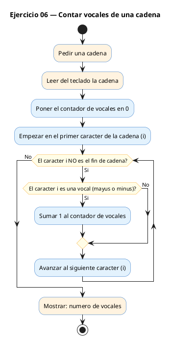
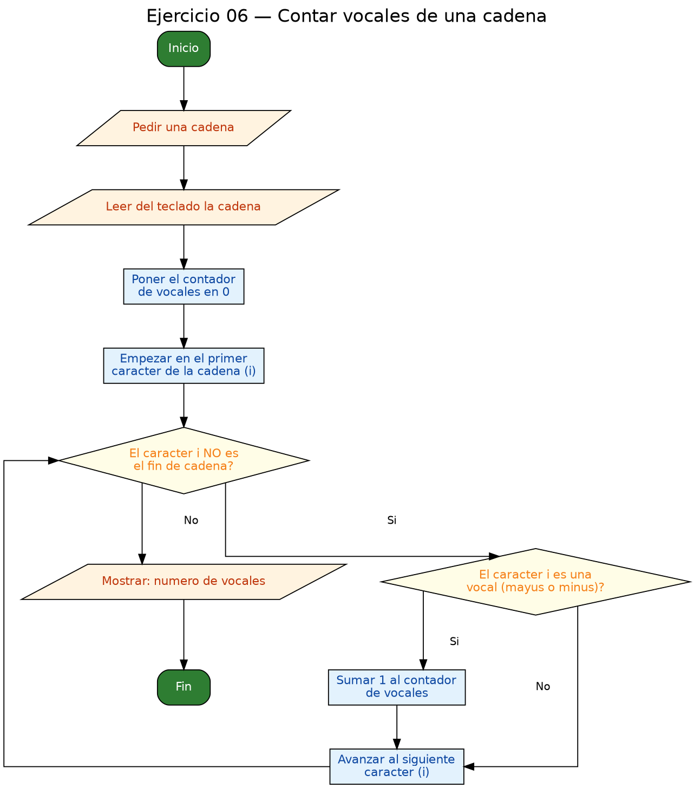

<!-- FICHERO GENERADO — NO EDITAR. Fuente de verdad: curso-c/practica/05-arrays-cadenas/ej06.md (se regenera con gen_course.py). -->

# Ejercicio 06 — Contar vocales (a e i o u, mayúsculas y minúsculas) en una cadena…

Dificultad: amarillo · Módulo 05 (Arrays y cadenas)

## Enunciado

Contar vocales (a e i o u, mayúsculas y minúsculas) en una cadena leída con fgets.

## Diagramas de flujo





## Cómo se resuelve

<!-- EXPLICACION -->
Aquí trabajamos con una **cadena**, que en C no es más que un array de `char` terminado en el carácter especial `'\0'` (el byte cero). Ese `'\0'` marca el final del texto útil.

1. Leemos con `fgets(s, sizeof(s), stdin)`. Usamos `fgets` y no `gets` porque `fgets` respeta el tamaño del buffer (`sizeof(s)` = 200) y **nunca escribe más allá del array**, evitando el desbordamiento clásico. Como efecto, `fgets` coloca automáticamente el `'\0'` al final de lo leído.
2. Recorremos la cadena con un bucle cuya condición es `s[i] != '\0'`. Esta es la idea clave de las cadenas en C: no recorres "hasta una longitud", sino **hasta el terminador nulo**. Cuando el bucle llega a `'\0'`, para solo.
3. Dentro comparamos cada carácter con las diez vocales (minúsculas y mayúsculas) usando `||`, y si coincide sumamos uno al contador.

Trampa habitual: olvidar que las mayúsculas son caracteres distintos de las minúsculas (`'a'` y `'A'` no son iguales para el ordenador), por eso hay que comprobar ambas. Y si recorrieras con un número fijo de vueltas en vez de parar en `'\0'`, contarías basura de la memoria sobrante del array.

## Para practicar — cópialo y complétalo

Pega este esqueleto y completa los `TODO`. Es la mejor forma de aprender: inténtalo antes de mirar la solución.

```c
/*
 * Curso de C — Modulo 05: Arrays y cadenas
 * Ejercicio 06 — PRACTICA (rellena los TODO)
 * Enunciado: Contar vocales (a e i o u, mayúsculas y minúsculas) en una
 *            cadena leída con fgets.
 * Dificultad: amarillo
 * Stdin: Hola mundo
 * Compilar: gcc -std=c11 -Wall ej06_practica.c -o ej06 && ./ej06
 */

#include <stdio.h>

int main(void) {
    char s[200];

    // TODO 1: Usa fgets para leer una cadena de hasta 199 caracteres.
    //         Sintaxis: fgets(s, sizeof(s), stdin);

    // TODO 2: Declara un contador de vocales inicializado a 0.

    // TODO 3: Recorre la cadena con un for cuya condicion sea s[i] != '\0'.
    //         En cada iteracion, comprueba si s[i] es una vocal
    //         (a, e, i, o, u en minuscula O en mayuscula) e incrementa el contador.

    // TODO 4: Imprime el numero de vocales.

    return 0;
}
```

## Solución — cópiala y ejecútala

```c
/*
 * Curso de C — Modulo 05: Arrays y cadenas
 * Ejercicio 06 — MODELO (resuelto)
 * Enunciado: Contar vocales (a e i o u, mayúsculas y minúsculas) en una
 *            cadena leída con fgets.
 * Dificultad: amarillo
 * Stdin: Hola mundo
 * Compilar: gcc -std=c11 -Wall ej06_modelo.c -o ej06 && ./ej06
 */

#include <stdio.h>

int main(void) {
    char s[200];

    printf("Introduce una cadena: ");
    fgets(s, sizeof(s), stdin);  // lee hasta 199 chars + '\0'; incluye '\n'

    int vocales = 0;

    // Recorremos la cadena hasta encontrar '\0'
    for (int i = 0; s[i] != '\0'; i++) {
        char c = s[i];
        // Comprobamos cada vocal en mayuscula y minuscula
        if (c == 'a' || c == 'e' || c == 'i' || c == 'o' || c == 'u' ||
            c == 'A' || c == 'E' || c == 'I' || c == 'O' || c == 'U') {
            vocales++;
        }
    }

    printf("Vocales: %d\n", vocales);

    return 0;
}
```

## Ejecútalo en el navegador

[▶ Abrir y ejecutar en Compiler Explorer](https://godbolt.org/clientstate/eyJzZXNzaW9ucyI6W3siaWQiOjEsImxhbmd1YWdlIjoiYyIsInNvdXJjZSI6Ii8qXG4gKiBDdXJzbyBkZSBDIFx1MjAxNCBNb2R1bG8gMDU6IEFycmF5cyB5IGNhZGVuYXNcbiAqIEVqZXJjaWNpbyAwNiBcdTIwMTQgTU9ERUxPIChyZXN1ZWx0bylcbiAqIEVudW5jaWFkbzogQ29udGFyIHZvY2FsZXMgKGEgZSBpIG8gdSwgbWF5XHUwMGZhc2N1bGFzIHkgbWluXHUwMGZhc2N1bGFzKSBlbiB1bmFcbiAqICAgICAgICAgICAgY2FkZW5hIGxlXHUwMGVkZGEgY29uIGZnZXRzLlxuICogRGlmaWN1bHRhZDogYW1hcmlsbG9cbiAqIFN0ZGluOiBIb2xhIG11bmRvXG4gKiBDb21waWxhcjogZ2NjIC1zdGQ9YzExIC1XYWxsIGVqMDZfbW9kZWxvLmMgLW8gZWowNiAmJiAuL2VqMDZcbiAqL1xuXG4jaW5jbHVkZSA8c3RkaW8uaD5cblxuaW50IG1haW4odm9pZCkge1xuICAgIGNoYXIgc1syMDBdO1xuXG4gICAgcHJpbnRmKFwiSW50cm9kdWNlIHVuYSBjYWRlbmE6IFwiKTtcbiAgICBmZ2V0cyhzLCBzaXplb2YocyksIHN0ZGluKTsgIC8vIGxlZSBoYXN0YSAxOTkgY2hhcnMgKyAnXFwwJzsgaW5jbHV5ZSAnXFxuJ1xuXG4gICAgaW50IHZvY2FsZXMgPSAwO1xuXG4gICAgLy8gUmVjb3JyZW1vcyBsYSBjYWRlbmEgaGFzdGEgZW5jb250cmFyICdcXDAnXG4gICAgZm9yIChpbnQgaSA9IDA7IHNbaV0gIT0gJ1xcMCc7IGkrKykge1xuICAgICAgICBjaGFyIGMgPSBzW2ldO1xuICAgICAgICAvLyBDb21wcm9iYW1vcyBjYWRhIHZvY2FsIGVuIG1heXVzY3VsYSB5IG1pbnVzY3VsYVxuICAgICAgICBpZiAoYyA9PSAnYScgfHwgYyA9PSAnZScgfHwgYyA9PSAnaScgfHwgYyA9PSAnbycgfHwgYyA9PSAndScgfHxcbiAgICAgICAgICAgIGMgPT0gJ0EnIHx8IGMgPT0gJ0UnIHx8IGMgPT0gJ0knIHx8IGMgPT0gJ08nIHx8IGMgPT0gJ1UnKSB7XG4gICAgICAgICAgICB2b2NhbGVzKys7XG4gICAgICAgIH1cbiAgICB9XG5cbiAgICBwcmludGYoXCJWb2NhbGVzOiAlZFxcblwiLCB2b2NhbGVzKTtcblxuICAgIHJldHVybiAwO1xufVxuIiwiY29tcGlsZXJzIjpbXSwiZXhlY3V0b3JzIjpbeyJhcmd1bWVudHMiOiIiLCJjb21waWxlciI6eyJpZCI6ImNnMTQzIiwibGlicyI6W10sIm9wdGlvbnMiOiItc3RkPWMxMSAtbG0ifSwic3RkaW4iOiJIb2xhIG11bmRvIiwid3JhcCI6ZmFsc2V9XX1dfQ%3D%3D)

Se abre con la solución ya cargada; pulsa el botón de ejecutar (Run) para ver la salida. No hay que instalar nada.

## Cómo usarlo

Pega el código en un fichero y ejecútalo con tu toolchain habitual (o el botón de Ejecutar de tu editor). Antes de mirar la solución, intenta completar tú el esqueleto: es la mejor forma de aprender.

## Conexiones

- [[Curso_C/modelo/05-arrays-cadenas|Teoría del módulo]]
- [[Curso_C/practica/00_README|Índice del curso]]
