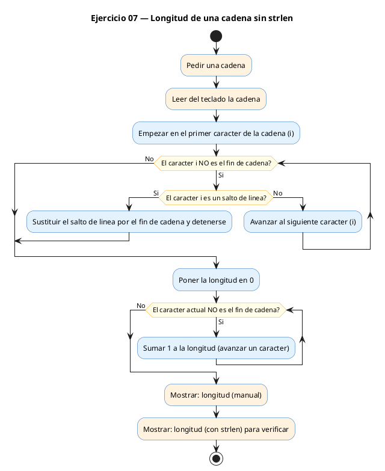
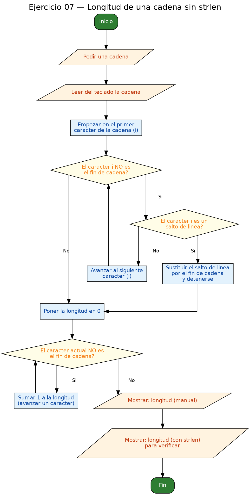

<!-- FICHERO GENERADO — NO EDITAR. Fuente de verdad: curso-c/practica/05-arrays-cadenas/ej07.md (se regenera con gen_course.py). -->

# Ejercicio 07 — Calcular la longitud de una cadena SIN usar strlen, recorriendo hasta…

Dificultad: rojo · Módulo 05 (Arrays y cadenas)

## Enunciado

Calcular la longitud de una cadena SIN usar strlen, recorriendo hasta encontrar el carácter '\0'.

## Diagramas de flujo





## Cómo se resuelve

<!-- EXPLICACION -->
La función `strlen` de `<string.h>` mide la longitud de una cadena, pero aquí la calculamos **a mano** para entender qué hace por dentro: una cadena en C es un array de `char` que termina en `'\0'`, y su longitud es simplemente cuántos caracteres hay antes de ese terminador.

1. Leemos con `fgets`, que además del texto guarda el salto de línea `'\n'` que pulsas con Enter. Por eso primero lo limpiamos: recorremos la cadena y, al encontrar `'\n'`, lo sustituimos por `'\0'` y salimos. Así el `\n` deja de contar como carácter útil.
2. El núcleo del ejercicio es este bucle:

```c
int longitud = 0;
while (s[longitud] != '\0') {
    longitud++;
}
```

Avanzamos un índice mientras no lleguemos al terminador. Cuando `s[longitud]` es `'\0'`, paramos, y en ese momento `longitud` vale exactamente el número de caracteres reales. Eso es todo lo que hace `strlen`.

3. Al final imprimimos ambos valores (el manual y el de `strlen`, con `%zu`) para comprobar que coinciden.

Trampa habitual: si la cadena no tuviera `'\0'` (por ejemplo si rellenas un `char[]` a mano y olvidas ponerlo), el `while` no sabría dónde parar y seguiría leyendo memoria ajena hasta encontrar por casualidad un byte cero. El terminador nulo es lo que hace que una cadena en C tenga final.

## Para practicar — cópialo y complétalo

Pega este esqueleto y completa los `TODO`. Es la mejor forma de aprender: inténtalo antes de mirar la solución.

```c
/*
 * Curso de C — Modulo 05: Arrays y cadenas
 * Ejercicio 07 — PRACTICA (rellena los TODO)
 * Enunciado: Calcular la longitud de una cadena SIN usar strlen,
 *            recorriendo hasta encontrar el carácter '\0'.
 * Dificultad: rojo
 * Stdin: Hola mundo
 * Compilar: gcc -std=c11 -Wall ej07_practica.c -o ej07 && ./ej07
 */

#include <stdio.h>
#include <string.h>   // solo para la verificacion final con strlen

int main(void) {
    char s[200];

    // TODO 1: Lee una cadena con fgets.

    // TODO 2 (opcional pero recomendado): Elimina el '\n' que fgets
    //         incluye al final. Recorre la cadena y si encuentras '\n',
    //         sustituye por '\0' y sal del bucle.

    // TODO 3: Declara 'longitud = 0'. Usa un bucle while cuya condicion
    //         sea s[longitud] != '\0'. Dentro, incrementa longitud.
    //         Al salir, longitud tiene el numero de chars utiles.

    // TODO 4: Imprime la longitud calculada.

    // TODO 5: Verifica con strlen(s) que el resultado coincide.
    //         printf("strlen dice: %zu\n", strlen(s));

    return 0;
}
```

## Solución — cópiala y ejecútala

```c
/*
 * Curso de C — Modulo 05: Arrays y cadenas
 * Ejercicio 07 — MODELO (resuelto)
 * Enunciado: Calcular la longitud de una cadena SIN usar strlen,
 *            recorriendo hasta encontrar el carácter '\0'.
 * Dificultad: rojo
 * Stdin: Hola mundo
 * Compilar: gcc -std=c11 -Wall ej07_modelo.c -o ej07 && ./ej07
 */

#include <stdio.h>
#include <string.h>   // solo para verificar con strlen al final

int main(void) {
    char s[200];

    printf("Introduce una cadena: ");
    fgets(s, sizeof(s), stdin);

    // Eliminar el '\n' que fgets incluye al final (si cabe en el buffer)
    // Recorremos hasta '\n' o '\0' y sustituimos '\n' por '\0'
    for (int i = 0; s[i] != '\0'; i++) {
        if (s[i] == '\n') {
            s[i] = '\0';
            break;
        }
    }

    // Contar longitud manualmente: avanzar un indice hasta encontrar '\0'
    int longitud = 0;
    while (s[longitud] != '\0') {
        longitud++;
    }
    // Al salir del while, s[longitud] == '\0', asi que longitud
    // contiene exactamente el numero de caracteres utiles.

    printf("Longitud (manual): %d\n", longitud);

    // Verificacion con strlen (debe coincidir)
    printf("Longitud (strlen): %zu\n", strlen(s));

    return 0;
}
```

## Ejecútalo en el navegador

[▶ Abrir y ejecutar en Compiler Explorer](https://godbolt.org/clientstate/eyJzZXNzaW9ucyI6W3siaWQiOjEsImxhbmd1YWdlIjoiYyIsInNvdXJjZSI6Ii8qXG4gKiBDdXJzbyBkZSBDIFx1MjAxNCBNb2R1bG8gMDU6IEFycmF5cyB5IGNhZGVuYXNcbiAqIEVqZXJjaWNpbyAwNyBcdTIwMTQgTU9ERUxPIChyZXN1ZWx0bylcbiAqIEVudW5jaWFkbzogQ2FsY3VsYXIgbGEgbG9uZ2l0dWQgZGUgdW5hIGNhZGVuYSBTSU4gdXNhciBzdHJsZW4sXG4gKiAgICAgICAgICAgIHJlY29ycmllbmRvIGhhc3RhIGVuY29udHJhciBlbCBjYXJcdTAwZTFjdGVyICdcXDAnLlxuICogRGlmaWN1bHRhZDogcm9qb1xuICogU3RkaW46IEhvbGEgbXVuZG9cbiAqIENvbXBpbGFyOiBnY2MgLXN0ZD1jMTEgLVdhbGwgZWowN19tb2RlbG8uYyAtbyBlajA3ICYmIC4vZWowN1xuICovXG5cbiNpbmNsdWRlIDxzdGRpby5oPlxuI2luY2x1ZGUgPHN0cmluZy5oPiAgIC8vIHNvbG8gcGFyYSB2ZXJpZmljYXIgY29uIHN0cmxlbiBhbCBmaW5hbFxuXG5pbnQgbWFpbih2b2lkKSB7XG4gICAgY2hhciBzWzIwMF07XG5cbiAgICBwcmludGYoXCJJbnRyb2R1Y2UgdW5hIGNhZGVuYTogXCIpO1xuICAgIGZnZXRzKHMsIHNpemVvZihzKSwgc3RkaW4pO1xuXG4gICAgLy8gRWxpbWluYXIgZWwgJ1xcbicgcXVlIGZnZXRzIGluY2x1eWUgYWwgZmluYWwgKHNpIGNhYmUgZW4gZWwgYnVmZmVyKVxuICAgIC8vIFJlY29ycmVtb3MgaGFzdGEgJ1xcbicgbyAnXFwwJyB5IHN1c3RpdHVpbW9zICdcXG4nIHBvciAnXFwwJ1xuICAgIGZvciAoaW50IGkgPSAwOyBzW2ldICE9ICdcXDAnOyBpKyspIHtcbiAgICAgICAgaWYgKHNbaV0gPT0gJ1xcbicpIHtcbiAgICAgICAgICAgIHNbaV0gPSAnXFwwJztcbiAgICAgICAgICAgIGJyZWFrO1xuICAgICAgICB9XG4gICAgfVxuXG4gICAgLy8gQ29udGFyIGxvbmdpdHVkIG1hbnVhbG1lbnRlOiBhdmFuemFyIHVuIGluZGljZSBoYXN0YSBlbmNvbnRyYXIgJ1xcMCdcbiAgICBpbnQgbG9uZ2l0dWQgPSAwO1xuICAgIHdoaWxlIChzW2xvbmdpdHVkXSAhPSAnXFwwJykge1xuICAgICAgICBsb25naXR1ZCsrO1xuICAgIH1cbiAgICAvLyBBbCBzYWxpciBkZWwgd2hpbGUsIHNbbG9uZ2l0dWRdID09ICdcXDAnLCBhc2kgcXVlIGxvbmdpdHVkXG4gICAgLy8gY29udGllbmUgZXhhY3RhbWVudGUgZWwgbnVtZXJvIGRlIGNhcmFjdGVyZXMgdXRpbGVzLlxuXG4gICAgcHJpbnRmKFwiTG9uZ2l0dWQgKG1hbnVhbCk6ICVkXFxuXCIsIGxvbmdpdHVkKTtcblxuICAgIC8vIFZlcmlmaWNhY2lvbiBjb24gc3RybGVuIChkZWJlIGNvaW5jaWRpcilcbiAgICBwcmludGYoXCJMb25naXR1ZCAoc3RybGVuKTogJXp1XFxuXCIsIHN0cmxlbihzKSk7XG5cbiAgICByZXR1cm4gMDtcbn1cbiIsImNvbXBpbGVycyI6W10sImV4ZWN1dG9ycyI6W3siYXJndW1lbnRzIjoiIiwiY29tcGlsZXIiOnsiaWQiOiJjZzE0MyIsImxpYnMiOltdLCJvcHRpb25zIjoiLXN0ZD1jMTEgLWxtIn0sInN0ZGluIjoiSG9sYSBtdW5kbyIsIndyYXAiOmZhbHNlfV19XX0%3D)

Se abre con la solución ya cargada; pulsa el botón de ejecutar (Run) para ver la salida. No hay que instalar nada.

## Cómo usarlo

Pega el código en un fichero y ejecútalo con tu toolchain habitual (o el botón de Ejecutar de tu editor). Antes de mirar la solución, intenta completar tú el esqueleto: es la mejor forma de aprender.

## Conexiones

- [[Curso_C/modelo/05-arrays-cadenas|Teoría del módulo]]
- [[Curso_C/practica/00_README|Índice del curso]]
