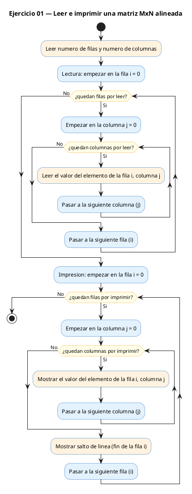
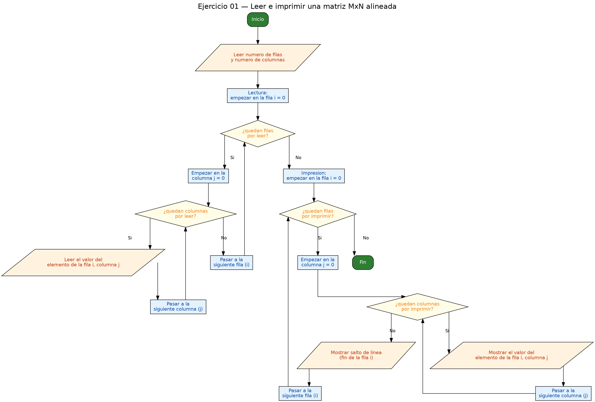

<!-- FICHERO GENERADO — NO EDITAR. Fuente de verdad: curso-c/practica/06-matrices/ej01.md (se regenera con gen_course.py). -->

# Ejercicio 01 — Lee una matriz MxN (max 10x10) e imprímela con formato alineado

Dificultad: verde · Módulo 06 (Matrices)

## Enunciado

Lee una matriz MxN (max 10x10) e imprímela con formato alineado.

## Diagramas de flujo





## Cómo se resuelve

<!-- EXPLICACION -->
Este es el "hola mundo" de las matrices: leer una cuadrícula de números y volver a imprimirla ordenada. Una matriz es un array de dos índices: el primero elige la **fila** y el segundo la **columna**, así que `m[i][j]` es la casilla de la fila `i`, columna `j`.

1. Reservamos siempre el tamaño máximo con `int m[MAX][MAX]` (una cuadrícula de 10×10), pero luego solo usamos las `filas × cols` que pida el usuario. En C el tamaño de un array se fija al declararlo, así que reservas de sobra y trabajas con una esquina.
2. Para recorrer toda la cuadrícula se usa el patrón clave del módulo, el **doble bucle**: el `for` exterior avanza por las filas (`i`) y, dentro, otro `for` recorre las columnas (`j`). Con eso lees cada celda con `scanf("%d", &m[i][j])` — ojo al `&`, obligatorio porque `scanf` necesita la dirección de la casilla.
3. Al imprimir, `printf("%4d", ...)` reserva un ancho de 4 caracteres por número para que las columnas queden alineadas.

La trampa típica está en dónde va el salto de línea. El `"\n"` no va dentro del bucle de columnas, sino **justo después**, en el cuerpo del bucle de filas: primero se pinta la fila entera y solo entonces se baja de línea.

```c
for (int i = 0; i < filas; i++) {
    for (int j = 0; j < cols; j++)
        printf("%4d", m[i][j]);
    printf("\n");   // salto AL TERMINAR cada fila, no en cada número
}
```

## Para practicar — cópialo y complétalo

Pega este esqueleto y completa los `TODO`. Es la mejor forma de aprender: inténtalo antes de mirar la solución.

```c
/*
 * Curso de C — Modulo 06: Matrices (arrays 2D)
 * Ejercicio 01 — PRACTICA (rellena los TODO)
 * Enunciado: Lee una matriz MxN (max 10x10) e imprímela con formato alineado.
 * Dificultad: verde
 * Stdin: 2\n3\n1\n2\n3\n4\n5\n6
 * Compilar: gcc -std=c11 -Wall ej01_practica.c -o ej01 && ./ej01
 */

#include <stdio.h>

#define MAX 10

int main(void) {
    int m[MAX][MAX];
    int filas, cols;

    // TODO 1: pedir al usuario el numero de filas y columnas con scanf
    //         (recuerda: scanf necesita & delante de la variable)

    // TODO 2: con un doble bucle for (i = filas, j = cols),
    //         leer cada elemento m[i][j] con scanf

    // TODO 3: con otro doble bucle, imprimir la matriz:
    //         - usa printf("%4d", m[i][j]) para alinear
    //         - al terminar cada fila (bucle exterior), imprime "\n"

    return 0;
}
```

## Solución — cópiala y ejecútala

```c
/*
 * Curso de C — Modulo 06: Matrices (arrays 2D)
 * Ejercicio 01 — MODELO (resuelto)
 * Enunciado: Lee una matriz MxN (max 10x10) e imprímela con formato alineado.
 * Dificultad: verde
 * Stdin: 2\n3\n1\n2\n3\n4\n5\n6
 * Compilar: gcc -std=c11 -Wall ej01_modelo.c -o ej01 && ./ej01
 */

#include <stdio.h>

#define MAX 10

int main(void) {
    int m[MAX][MAX];
    int filas, cols;

    // Leer dimensiones
    printf("Numero de filas (1-%d): ", MAX);
    scanf("%d", &filas);
    printf("Numero de columnas (1-%d): ", MAX);
    scanf("%d", &cols);

    // Leer matriz elemento a elemento
    printf("Introduce los %d valores fila a fila:\n", filas * cols);
    for (int i = 0; i < filas; i++)
        for (int j = 0; j < cols; j++)
            scanf("%d", &m[i][j]);

    // Imprimir la matriz con campo de 4 caracteres para alinear
    printf("\nMatriz %dx%d:\n", filas, cols);
    for (int i = 0; i < filas; i++) {
        for (int j = 0; j < cols; j++)
            printf("%4d", m[i][j]);
        printf("\n");   // nueva fila
    }

    return 0;
}
```

## Ejecútalo en el navegador

[▶ Abrir y ejecutar en Compiler Explorer](https://godbolt.org/clientstate/eyJzZXNzaW9ucyI6W3siaWQiOjEsImxhbmd1YWdlIjoiYyIsInNvdXJjZSI6Ii8qXG4gKiBDdXJzbyBkZSBDIFx1MjAxNCBNb2R1bG8gMDY6IE1hdHJpY2VzIChhcnJheXMgMkQpXG4gKiBFamVyY2ljaW8gMDEgXHUyMDE0IE1PREVMTyAocmVzdWVsdG8pXG4gKiBFbnVuY2lhZG86IExlZSB1bmEgbWF0cml6IE14TiAobWF4IDEweDEwKSBlIGltcHJcdTAwZWRtZWxhIGNvbiBmb3JtYXRvIGFsaW5lYWRvLlxuICogRGlmaWN1bHRhZDogdmVyZGVcbiAqIFN0ZGluOiAyXFxuM1xcbjFcXG4yXFxuM1xcbjRcXG41XFxuNlxuICogQ29tcGlsYXI6IGdjYyAtc3RkPWMxMSAtV2FsbCBlajAxX21vZGVsby5jIC1vIGVqMDEgJiYgLi9lajAxXG4gKi9cblxuI2luY2x1ZGUgPHN0ZGlvLmg%2BXG5cbiNkZWZpbmUgTUFYIDEwXG5cbmludCBtYWluKHZvaWQpIHtcbiAgICBpbnQgbVtNQVhdW01BWF07XG4gICAgaW50IGZpbGFzLCBjb2xzO1xuXG4gICAgLy8gTGVlciBkaW1lbnNpb25lc1xuICAgIHByaW50ZihcIk51bWVybyBkZSBmaWxhcyAoMS0lZCk6IFwiLCBNQVgpO1xuICAgIHNjYW5mKFwiJWRcIiwgJmZpbGFzKTtcbiAgICBwcmludGYoXCJOdW1lcm8gZGUgY29sdW1uYXMgKDEtJWQpOiBcIiwgTUFYKTtcbiAgICBzY2FuZihcIiVkXCIsICZjb2xzKTtcblxuICAgIC8vIExlZXIgbWF0cml6IGVsZW1lbnRvIGEgZWxlbWVudG9cbiAgICBwcmludGYoXCJJbnRyb2R1Y2UgbG9zICVkIHZhbG9yZXMgZmlsYSBhIGZpbGE6XFxuXCIsIGZpbGFzICogY29scyk7XG4gICAgZm9yIChpbnQgaSA9IDA7IGkgPCBmaWxhczsgaSsrKVxuICAgICAgICBmb3IgKGludCBqID0gMDsgaiA8IGNvbHM7IGorKylcbiAgICAgICAgICAgIHNjYW5mKFwiJWRcIiwgJm1baV1bal0pO1xuXG4gICAgLy8gSW1wcmltaXIgbGEgbWF0cml6IGNvbiBjYW1wbyBkZSA0IGNhcmFjdGVyZXMgcGFyYSBhbGluZWFyXG4gICAgcHJpbnRmKFwiXFxuTWF0cml6ICVkeCVkOlxcblwiLCBmaWxhcywgY29scyk7XG4gICAgZm9yIChpbnQgaSA9IDA7IGkgPCBmaWxhczsgaSsrKSB7XG4gICAgICAgIGZvciAoaW50IGogPSAwOyBqIDwgY29sczsgaisrKVxuICAgICAgICAgICAgcHJpbnRmKFwiJTRkXCIsIG1baV1bal0pO1xuICAgICAgICBwcmludGYoXCJcXG5cIik7ICAgLy8gbnVldmEgZmlsYVxuICAgIH1cblxuICAgIHJldHVybiAwO1xufVxuIiwiY29tcGlsZXJzIjpbXSwiZXhlY3V0b3JzIjpbeyJhcmd1bWVudHMiOiIiLCJjb21waWxlciI6eyJpZCI6ImNnMTQzIiwibGlicyI6W10sIm9wdGlvbnMiOiItc3RkPWMxMSAtbG0ifSwic3RkaW4iOiIyXG4zXG4xXG4yXG4zXG40XG41XG42Iiwid3JhcCI6ZmFsc2V9XX1dfQ%3D%3D)

Se abre con la solución ya cargada; pulsa el botón de ejecutar (Run) para ver la salida. No hay que instalar nada.

## Cómo usarlo

Pega el código en un fichero y ejecútalo con tu toolchain habitual (o el botón de Ejecutar de tu editor). Antes de mirar la solución, intenta completar tú el esqueleto: es la mejor forma de aprender.

## Conexiones

- [[Curso_C/modelo/06-matrices|Teoría del módulo]]
- [[Curso_C/practica/00_README|Índice del curso]]
