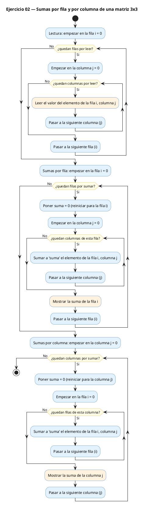
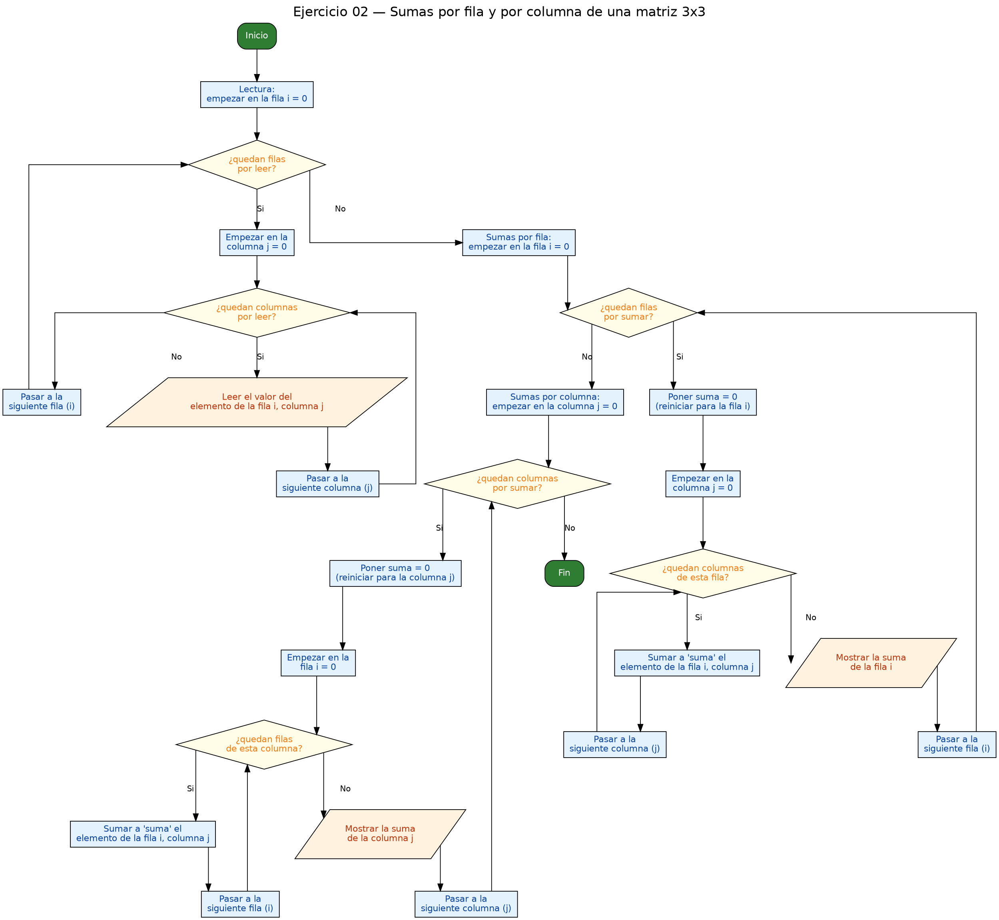

<!-- FICHERO GENERADO — NO EDITAR. Fuente de verdad: curso-c/practica/06-matrices/ej02.md (se regenera con gen_course.py). -->

# Ejercicio 02 — Dada una matriz 3x3, imprime la suma de cada fila y cada columna

Dificultad: verde · Módulo 06 (Matrices)

## Enunciado

Dada una matriz 3x3, imprime la suma de cada fila y cada columna.

## Diagramas de flujo





## Cómo se resuelve

<!-- EXPLICACION -->
Aquí no solo recorremos la matriz: la **reducimos** a totales. Sumamos cada fila por un lado y cada columna por otro. La idea central es que el mismo doble bucle sirve para las dos cosas cambiando solo cuál índice va por fuera.

- **Suma por filas:** el bucle exterior recorre las filas (`i`) y el interior las columnas (`j`). Antes de entrar en cada fila declaras `int suma = 0`, sumas todos sus elementos y la imprimes. Como sumas a lo largo de una fila fija, dejas `i` quieta y mueves `j`.
- **Suma por columnas:** es el mismo esquema pero **con los bucles al revés**: el exterior recorre columnas (`j`) y el interior filas (`i`), sumando `m[i][j]` con `j` fija. Ese intercambio de quién manda es lo que cambia "recorrer por filas" por "recorrer por columnas".

Hay dos trampas clásicas, ambas sobre la variable acumuladora `suma`:

1. **Reiniciarla en el sitio correcto.** El `int suma = 0` va **dentro** del bucle exterior, para que se ponga a cero al empezar cada fila (o columna). Si la declaras fuera, arrastras el total de la fila anterior y todo se suma junto.
2. **Inicializarla.** Un `int suma;` sin `= 0` empieza con un valor basura de la memoria, y el resultado sale sin sentido. Siempre `int suma = 0;`.

## Para practicar — cópialo y complétalo

Pega este esqueleto y completa los `TODO`. Es la mejor forma de aprender: inténtalo antes de mirar la solución.

```c
/*
 * Curso de C — Modulo 06: Matrices (arrays 2D)
 * Ejercicio 02 — PRACTICA (rellena los TODO)
 * Enunciado: Dada una matriz 3x3, imprime la suma de cada fila y cada columna.
 * Dificultad: verde
 * Stdin: 1\n2\n3\n4\n5\n6\n7\n8\n9
 * Compilar: gcc -std=c11 -Wall ej02_practica.c -o ej02 && ./ej02
 */

#include <stdio.h>

#define N 3

int main(void) {
    int m[N][N];

    // TODO 1: leer la matriz 3x3 con doble bucle y scanf

    // TODO 2: imprimir la matriz con formato

    // TODO 3: suma por FILAS
    //   - bucle exterior recorre i (filas)
    //   - inicializa int suma = 0 dentro de ese bucle (se resetea cada fila)
    //   - bucle interior suma m[i][j]
    //   - imprime la suma de esa fila

    // TODO 4: suma por COLUMNAS
    //   - igual que antes pero el bucle exterior recorre j (columnas)
    //   - el interior recorre i (filas)
    //   - imprime la suma de cada columna

    return 0;
}
```

## Solución — cópiala y ejecútala

```c
/*
 * Curso de C — Modulo 06: Matrices (arrays 2D)
 * Ejercicio 02 — MODELO (resuelto)
 * Enunciado: Dada una matriz 3x3, imprime la suma de cada fila y cada columna.
 * Dificultad: verde
 * Stdin: 1\n2\n3\n4\n5\n6\n7\n8\n9
 * Compilar: gcc -std=c11 -Wall ej02_modelo.c -o ej02 && ./ej02
 */

#include <stdio.h>

#define N 3

int main(void) {
    int m[N][N];

    // Leer la matriz
    printf("Introduce la matriz %dx%d:\n", N, N);
    for (int i = 0; i < N; i++)
        for (int j = 0; j < N; j++)
            scanf("%d", &m[i][j]);

    // Imprimir la matriz
    printf("\nMatriz:\n");
    for (int i = 0; i < N; i++) {
        for (int j = 0; j < N; j++)
            printf("%4d", m[i][j]);
        printf("\n");
    }

    // Suma por filas: bucle exterior = fila
    printf("\nSumas por fila:");
    for (int i = 0; i < N; i++) {
        int suma = 0;           // reiniciar por cada fila
        for (int j = 0; j < N; j++)
            suma += m[i][j];
        printf("  %d", suma);
    }
    printf("\n");

    // Suma por columnas: bucle exterior = columna
    printf("Sumas por columna:");
    for (int j = 0; j < N; j++) {
        int suma = 0;           // reiniciar por cada columna
        for (int i = 0; i < N; i++)
            suma += m[i][j];
        printf("  %d", suma);
    }
    printf("\n");

    return 0;
}
```

## Ejecútalo en el navegador

[▶ Abrir y ejecutar en Compiler Explorer](https://godbolt.org/clientstate/eyJzZXNzaW9ucyI6W3siaWQiOjEsImxhbmd1YWdlIjoiYyIsInNvdXJjZSI6Ii8qXG4gKiBDdXJzbyBkZSBDIFx1MjAxNCBNb2R1bG8gMDY6IE1hdHJpY2VzIChhcnJheXMgMkQpXG4gKiBFamVyY2ljaW8gMDIgXHUyMDE0IE1PREVMTyAocmVzdWVsdG8pXG4gKiBFbnVuY2lhZG86IERhZGEgdW5hIG1hdHJpeiAzeDMsIGltcHJpbWUgbGEgc3VtYSBkZSBjYWRhIGZpbGEgeSBjYWRhIGNvbHVtbmEuXG4gKiBEaWZpY3VsdGFkOiB2ZXJkZVxuICogU3RkaW46IDFcXG4yXFxuM1xcbjRcXG41XFxuNlxcbjdcXG44XFxuOVxuICogQ29tcGlsYXI6IGdjYyAtc3RkPWMxMSAtV2FsbCBlajAyX21vZGVsby5jIC1vIGVqMDIgJiYgLi9lajAyXG4gKi9cblxuI2luY2x1ZGUgPHN0ZGlvLmg%2BXG5cbiNkZWZpbmUgTiAzXG5cbmludCBtYWluKHZvaWQpIHtcbiAgICBpbnQgbVtOXVtOXTtcblxuICAgIC8vIExlZXIgbGEgbWF0cml6XG4gICAgcHJpbnRmKFwiSW50cm9kdWNlIGxhIG1hdHJpeiAlZHglZDpcXG5cIiwgTiwgTik7XG4gICAgZm9yIChpbnQgaSA9IDA7IGkgPCBOOyBpKyspXG4gICAgICAgIGZvciAoaW50IGogPSAwOyBqIDwgTjsgaisrKVxuICAgICAgICAgICAgc2NhbmYoXCIlZFwiLCAmbVtpXVtqXSk7XG5cbiAgICAvLyBJbXByaW1pciBsYSBtYXRyaXpcbiAgICBwcmludGYoXCJcXG5NYXRyaXo6XFxuXCIpO1xuICAgIGZvciAoaW50IGkgPSAwOyBpIDwgTjsgaSsrKSB7XG4gICAgICAgIGZvciAoaW50IGogPSAwOyBqIDwgTjsgaisrKVxuICAgICAgICAgICAgcHJpbnRmKFwiJTRkXCIsIG1baV1bal0pO1xuICAgICAgICBwcmludGYoXCJcXG5cIik7XG4gICAgfVxuXG4gICAgLy8gU3VtYSBwb3IgZmlsYXM6IGJ1Y2xlIGV4dGVyaW9yID0gZmlsYVxuICAgIHByaW50ZihcIlxcblN1bWFzIHBvciBmaWxhOlwiKTtcbiAgICBmb3IgKGludCBpID0gMDsgaSA8IE47IGkrKykge1xuICAgICAgICBpbnQgc3VtYSA9IDA7ICAgICAgICAgICAvLyByZWluaWNpYXIgcG9yIGNhZGEgZmlsYVxuICAgICAgICBmb3IgKGludCBqID0gMDsgaiA8IE47IGorKylcbiAgICAgICAgICAgIHN1bWEgKz0gbVtpXVtqXTtcbiAgICAgICAgcHJpbnRmKFwiICAlZFwiLCBzdW1hKTtcbiAgICB9XG4gICAgcHJpbnRmKFwiXFxuXCIpO1xuXG4gICAgLy8gU3VtYSBwb3IgY29sdW1uYXM6IGJ1Y2xlIGV4dGVyaW9yID0gY29sdW1uYVxuICAgIHByaW50ZihcIlN1bWFzIHBvciBjb2x1bW5hOlwiKTtcbiAgICBmb3IgKGludCBqID0gMDsgaiA8IE47IGorKykge1xuICAgICAgICBpbnQgc3VtYSA9IDA7ICAgICAgICAgICAvLyByZWluaWNpYXIgcG9yIGNhZGEgY29sdW1uYVxuICAgICAgICBmb3IgKGludCBpID0gMDsgaSA8IE47IGkrKylcbiAgICAgICAgICAgIHN1bWEgKz0gbVtpXVtqXTtcbiAgICAgICAgcHJpbnRmKFwiICAlZFwiLCBzdW1hKTtcbiAgICB9XG4gICAgcHJpbnRmKFwiXFxuXCIpO1xuXG4gICAgcmV0dXJuIDA7XG59XG4iLCJjb21waWxlcnMiOltdLCJleGVjdXRvcnMiOlt7ImFyZ3VtZW50cyI6IiIsImNvbXBpbGVyIjp7ImlkIjoiY2cxNDMiLCJsaWJzIjpbXSwib3B0aW9ucyI6Ii1zdGQ9YzExIC1sbSJ9LCJzdGRpbiI6IjFcbjJcbjNcbjRcbjVcbjZcbjdcbjhcbjkiLCJ3cmFwIjpmYWxzZX1dfV19)

Se abre con la solución ya cargada; pulsa el botón de ejecutar (Run) para ver la salida. No hay que instalar nada.

## Cómo usarlo

Pega el código en un fichero y ejecútalo con tu toolchain habitual (o el botón de Ejecutar de tu editor). Antes de mirar la solución, intenta completar tú el esqueleto: es la mejor forma de aprender.

## Conexiones

- [[Curso_C/modelo/06-matrices|Teoría del módulo]]
- [[Curso_C/practica/00_README|Índice del curso]]
