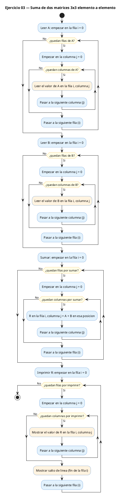
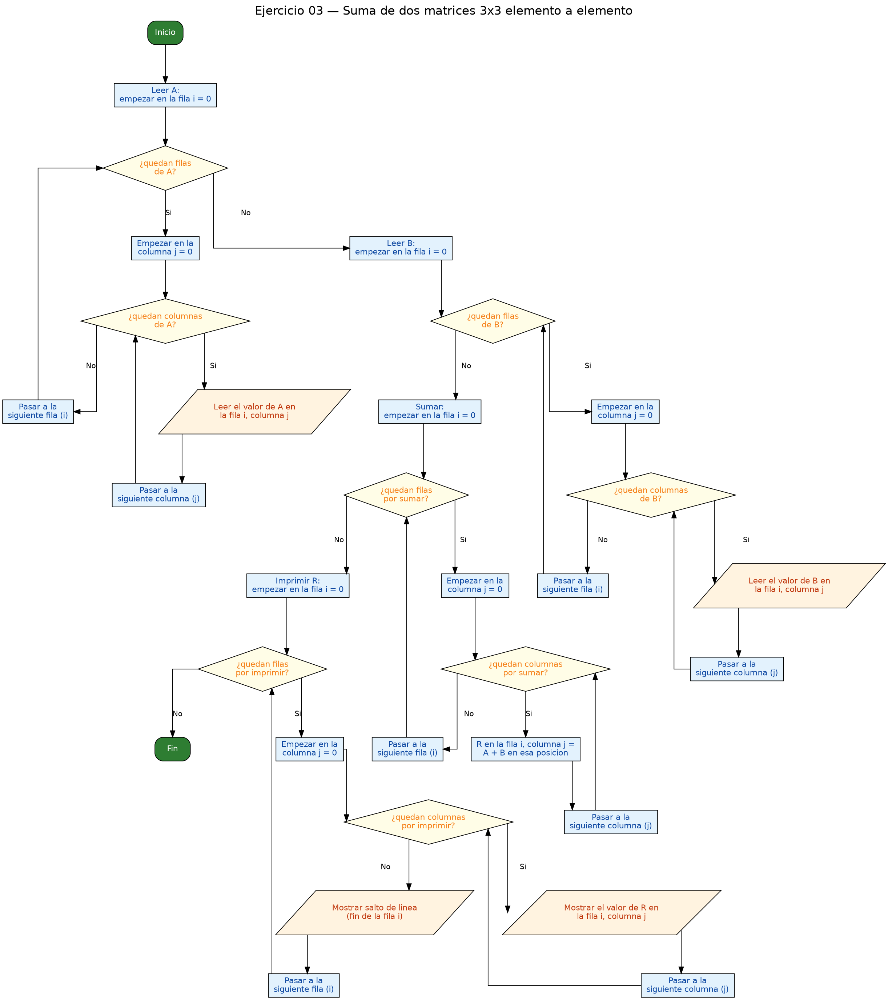

<!-- FICHERO GENERADO — NO EDITAR. Fuente de verdad: curso-c/practica/06-matrices/ej03.md (se regenera con gen_course.py). -->

# Ejercicio 03 — Lee dos matrices 3x3 e imprime su suma elemento a elemento

Dificultad: verde · Módulo 06 (Matrices)

## Enunciado

Lee dos matrices 3x3 e imprime su suma elemento a elemento.

## Diagramas de flujo





## Cómo se resuelve

<!-- EXPLICACION -->
Sumar dos matrices es la operación más directa entre cuadrículas: casilla contra casilla. La suma de la posición `[i][j]` solo depende de las dos casillas que están en esa misma posición, nunca de las vecinas. Por eso la fórmula es tan simple:

```c
r[i][j] = a[i][j] + b[i][j];
```

El programa usa **tres** matrices del mismo tamaño: `a` y `b` son las que lee el usuario, y `r` es donde guardamos el resultado. Fíjate en que aparecen cuatro dobles bucles con la misma forma (`for i` dentro `for j`), cada uno para una tarea: leer A, leer B, calcular la suma en R, e imprimir R. Ese patrón de "recorrer las dos dimensiones" es el mismo de siempre; lo único que cambia es qué hacemos en la casilla.

La trampa típica aquí es querer sumar dentro del propio bucle de lectura o mezclar índices cruzados (como `a[i][j] + b[j][i]`). En una suma de matrices los índices de las tres siempre coinciden: `[i][j]` en las tres. Cruzarlos es transponer, que es otro ejercicio. Además, las tres matrices deben tener las **mismas dimensiones**; sumar una 3×3 con una 2×4 no está definido.

## Para practicar — cópialo y complétalo

Pega este esqueleto y completa los `TODO`. Es la mejor forma de aprender: inténtalo antes de mirar la solución.

```c
/*
 * Curso de C — Modulo 06: Matrices (arrays 2D)
 * Ejercicio 03 — PRACTICA (rellena los TODO)
 * Enunciado: Lee dos matrices 3x3 e imprime su suma elemento a elemento.
 * Dificultad: verde
 * Compilar: gcc -std=c11 -Wall ej03_practica.c -o ej03 && ./ej03
 */

#include <stdio.h>

#define N 3

int main(void) {
    int a[N][N], b[N][N], r[N][N];

    // TODO 1: leer la matriz A con doble bucle y scanf

    // TODO 2: leer la matriz B igual

    // TODO 3: calcular r[i][j] = a[i][j] + b[i][j] para toda i, j
    //         (otro doble bucle; r es la matriz resultado)

    // TODO 4: imprimir la matriz r con formato alineado

    return 0;
}
```

## Solución — cópiala y ejecútala

```c
/*
 * Curso de C — Modulo 06: Matrices (arrays 2D)
 * Ejercicio 03 — MODELO (resuelto)
 * Enunciado: Lee dos matrices 3x3 e imprime su suma elemento a elemento.
 * Dificultad: verde
 * Compilar: gcc -std=c11 -Wall ej03_modelo.c -o ej03 && ./ej03
 */

#include <stdio.h>

#define N 3

int main(void) {
    int a[N][N], b[N][N], r[N][N];

    // Leer matriz A
    printf("Introduce la matriz A (%dx%d):\n", N, N);
    for (int i = 0; i < N; i++)
        for (int j = 0; j < N; j++)
            scanf("%d", &a[i][j]);

    // Leer matriz B
    printf("Introduce la matriz B (%dx%d):\n", N, N);
    for (int i = 0; i < N; i++)
        for (int j = 0; j < N; j++)
            scanf("%d", &b[i][j]);

    // Calcular suma: r[i][j] = a[i][j] + b[i][j]
    for (int i = 0; i < N; i++)
        for (int j = 0; j < N; j++)
            r[i][j] = a[i][j] + b[i][j];

    // Imprimir resultado
    printf("\nA + B =\n");
    for (int i = 0; i < N; i++) {
        for (int j = 0; j < N; j++)
            printf("%4d", r[i][j]);
        printf("\n");
    }

    return 0;
}
```

## Cómo usarlo

Pega el código en un fichero y ejecútalo con tu toolchain habitual (o el botón de Ejecutar de tu editor). Antes de mirar la solución, intenta completar tú el esqueleto: es la mejor forma de aprender.

## Conexiones

- [[Curso_C/modelo/06-matrices|Teoría del módulo]]
- [[Curso_C/practica/00_README|Índice del curso]]
