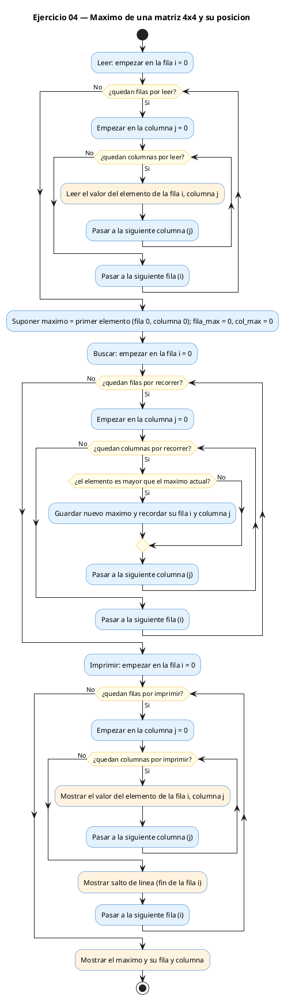
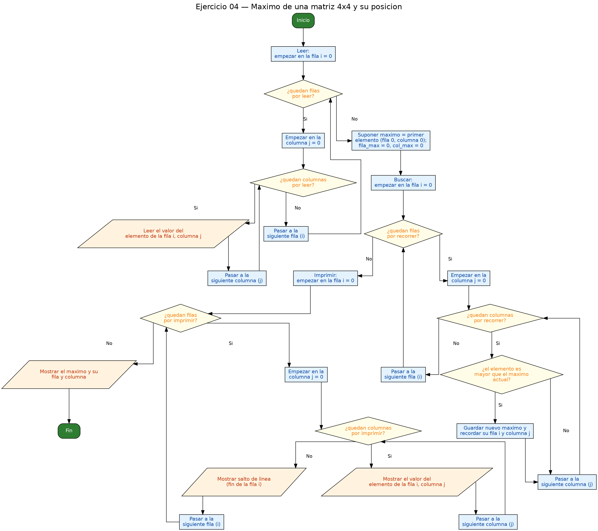

<!-- FICHERO GENERADO — NO EDITAR. Fuente de verdad: curso-c/practica/06-matrices/ej04.md (se regenera con gen_course.py). -->

# Ejercicio 04 — Lee una matriz 4x4 e imprime el valor máximo y su posición

Dificultad: amarillo · Módulo 06 (Matrices)

## Enunciado

Lee una matriz 4x4 e imprime el valor máximo y su posición.

## Diagramas de flujo





## Cómo se resuelve

<!-- EXPLICACION -->
Buscar el máximo de una matriz es el mismo "campeón provisional" que ya usaste con arrays de una dimensión, pero recorriendo una cuadrícula. Guardas un candidato a máximo y, cada vez que encuentras algo mayor, lo destronas. La novedad es que aquí, además del valor, nos interesa **dónde** está, así que llevamos tres variables a la vez:

```c
int max = m[0][0];
int fila_max = 0, col_max = 0;
```

El doble bucle visita todas las celdas y, en cada una, un `if (m[i][j] > max)` comprueba si hemos encontrado un nuevo campeón. Cuando eso pasa, actualizamos las **tres** variables juntas: el valor `max`, y su posición `fila_max` y `col_max`. Así, al terminar, no solo sabes el mayor número sino la casilla exacta donde vivía.

La trampa clásica es inicializar `max = 0` en lugar de `max = m[0][0]`. Si la matriz tuviera todos los valores negativos (por ejemplo temperaturas bajo cero), ningún elemento superaría al 0 y el programa diría que el máximo es 0, un valor que ni siquiera está en la matriz. Empezar por el primer elemento real evita ese error. Un detalle menor: si hay empates, este código se queda con la **primera** aparición, porque solo cambia de campeón cuando encuentra algo estrictamente mayor (`>`, no `>=`).

## Para practicar — cópialo y complétalo

Pega este esqueleto y completa los `TODO`. Es la mejor forma de aprender: inténtalo antes de mirar la solución.

```c
/*
 * Curso de C — Modulo 06: Matrices (arrays 2D)
 * Ejercicio 04 — PRACTICA (rellena los TODO)
 * Enunciado: Lee una matriz 4x4 e imprime el valor máximo y su posición.
 * Dificultad: amarillo
 * Stdin: 1\n2\n3\n4\n5\n6\n7\n8\n9\n10\n11\n12\n13\n14\n15\n16
 * Compilar: gcc -std=c11 -Wall ej04_practica.c -o ej04 && ./ej04
 */

#include <stdio.h>

#define N 4

int main(void) {
    int m[N][N];

    // TODO 1: leer la matriz 4x4 con doble bucle y scanf

    // TODO 2: inicializar tres variables:
    //         int max = m[0][0];
    //         int fila_max = 0, col_max = 0;

    // TODO 3: doble bucle que recorra todas las celdas:
    //         si m[i][j] > max, actualiza max, fila_max y col_max

    // TODO 4: imprimir la matriz (opcional, pero ayuda a verificar)

    // TODO 5: imprimir el maximo y su posicion con printf

    return 0;
}
```

## Solución — cópiala y ejecútala

```c
/*
 * Curso de C — Modulo 06: Matrices (arrays 2D)
 * Ejercicio 04 — MODELO (resuelto)
 * Enunciado: Lee una matriz 4x4 e imprime el valor máximo y su posición.
 * Dificultad: amarillo
 * Stdin: 1\n2\n3\n4\n5\n6\n7\n8\n9\n10\n11\n12\n13\n14\n15\n16
 * Compilar: gcc -std=c11 -Wall ej04_modelo.c -o ej04 && ./ej04
 */

#include <stdio.h>

#define N 4

int main(void) {
    int m[N][N];

    // Leer la matriz
    printf("Introduce la matriz %dx%d:\n", N, N);
    for (int i = 0; i < N; i++)
        for (int j = 0; j < N; j++)
            scanf("%d", &m[i][j]);

    // Buscar el maximo: empezar en m[0][0] y actualizar si encontramos mayor
    int max = m[0][0];
    int fila_max = 0, col_max = 0;

    for (int i = 0; i < N; i++) {
        for (int j = 0; j < N; j++) {
            if (m[i][j] > max) {
                max = m[i][j];
                fila_max = i;
                col_max  = j;
            }
        }
    }

    // Imprimir la matriz
    printf("\nMatriz:\n");
    for (int i = 0; i < N; i++) {
        for (int j = 0; j < N; j++)
            printf("%4d", m[i][j]);
        printf("\n");
    }

    printf("\nMaximo: %d en posicion [%d][%d]\n", max, fila_max, col_max);

    return 0;
}
```

## Ejecútalo en el navegador

[▶ Abrir y ejecutar en Compiler Explorer](https://godbolt.org/clientstate/eyJzZXNzaW9ucyI6W3siaWQiOjEsImxhbmd1YWdlIjoiYyIsInNvdXJjZSI6Ii8qXG4gKiBDdXJzbyBkZSBDIFx1MjAxNCBNb2R1bG8gMDY6IE1hdHJpY2VzIChhcnJheXMgMkQpXG4gKiBFamVyY2ljaW8gMDQgXHUyMDE0IE1PREVMTyAocmVzdWVsdG8pXG4gKiBFbnVuY2lhZG86IExlZSB1bmEgbWF0cml6IDR4NCBlIGltcHJpbWUgZWwgdmFsb3IgbVx1MDBlMXhpbW8geSBzdSBwb3NpY2lcdTAwZjNuLlxuICogRGlmaWN1bHRhZDogYW1hcmlsbG9cbiAqIFN0ZGluOiAxXFxuMlxcbjNcXG40XFxuNVxcbjZcXG43XFxuOFxcbjlcXG4xMFxcbjExXFxuMTJcXG4xM1xcbjE0XFxuMTVcXG4xNlxuICogQ29tcGlsYXI6IGdjYyAtc3RkPWMxMSAtV2FsbCBlajA0X21vZGVsby5jIC1vIGVqMDQgJiYgLi9lajA0XG4gKi9cblxuI2luY2x1ZGUgPHN0ZGlvLmg%2BXG5cbiNkZWZpbmUgTiA0XG5cbmludCBtYWluKHZvaWQpIHtcbiAgICBpbnQgbVtOXVtOXTtcblxuICAgIC8vIExlZXIgbGEgbWF0cml6XG4gICAgcHJpbnRmKFwiSW50cm9kdWNlIGxhIG1hdHJpeiAlZHglZDpcXG5cIiwgTiwgTik7XG4gICAgZm9yIChpbnQgaSA9IDA7IGkgPCBOOyBpKyspXG4gICAgICAgIGZvciAoaW50IGogPSAwOyBqIDwgTjsgaisrKVxuICAgICAgICAgICAgc2NhbmYoXCIlZFwiLCAmbVtpXVtqXSk7XG5cbiAgICAvLyBCdXNjYXIgZWwgbWF4aW1vOiBlbXBlemFyIGVuIG1bMF1bMF0geSBhY3R1YWxpemFyIHNpIGVuY29udHJhbW9zIG1heW9yXG4gICAgaW50IG1heCA9IG1bMF1bMF07XG4gICAgaW50IGZpbGFfbWF4ID0gMCwgY29sX21heCA9IDA7XG5cbiAgICBmb3IgKGludCBpID0gMDsgaSA8IE47IGkrKykge1xuICAgICAgICBmb3IgKGludCBqID0gMDsgaiA8IE47IGorKykge1xuICAgICAgICAgICAgaWYgKG1baV1bal0gPiBtYXgpIHtcbiAgICAgICAgICAgICAgICBtYXggPSBtW2ldW2pdO1xuICAgICAgICAgICAgICAgIGZpbGFfbWF4ID0gaTtcbiAgICAgICAgICAgICAgICBjb2xfbWF4ICA9IGo7XG4gICAgICAgICAgICB9XG4gICAgICAgIH1cbiAgICB9XG5cbiAgICAvLyBJbXByaW1pciBsYSBtYXRyaXpcbiAgICBwcmludGYoXCJcXG5NYXRyaXo6XFxuXCIpO1xuICAgIGZvciAoaW50IGkgPSAwOyBpIDwgTjsgaSsrKSB7XG4gICAgICAgIGZvciAoaW50IGogPSAwOyBqIDwgTjsgaisrKVxuICAgICAgICAgICAgcHJpbnRmKFwiJTRkXCIsIG1baV1bal0pO1xuICAgICAgICBwcmludGYoXCJcXG5cIik7XG4gICAgfVxuXG4gICAgcHJpbnRmKFwiXFxuTWF4aW1vOiAlZCBlbiBwb3NpY2lvbiBbJWRdWyVkXVxcblwiLCBtYXgsIGZpbGFfbWF4LCBjb2xfbWF4KTtcblxuICAgIHJldHVybiAwO1xufVxuIiwiY29tcGlsZXJzIjpbXSwiZXhlY3V0b3JzIjpbeyJhcmd1bWVudHMiOiIiLCJjb21waWxlciI6eyJpZCI6ImNnMTQzIiwibGlicyI6W10sIm9wdGlvbnMiOiItc3RkPWMxMSAtbG0ifSwic3RkaW4iOiIxXG4yXG4zXG40XG41XG42XG43XG44XG45XG4xMFxuMTFcbjEyXG4xM1xuMTRcbjE1XG4xNiIsIndyYXAiOmZhbHNlfV19XX0%3D)

Se abre con la solución ya cargada; pulsa el botón de ejecutar (Run) para ver la salida. No hay que instalar nada.

## Cómo usarlo

Pega el código en un fichero y ejecútalo con tu toolchain habitual (o el botón de Ejecutar de tu editor). Antes de mirar la solución, intenta completar tú el esqueleto: es la mejor forma de aprender.

## Conexiones

- [[Curso_C/modelo/06-matrices|Teoría del módulo]]
- [[Curso_C/practica/00_README|Índice del curso]]
