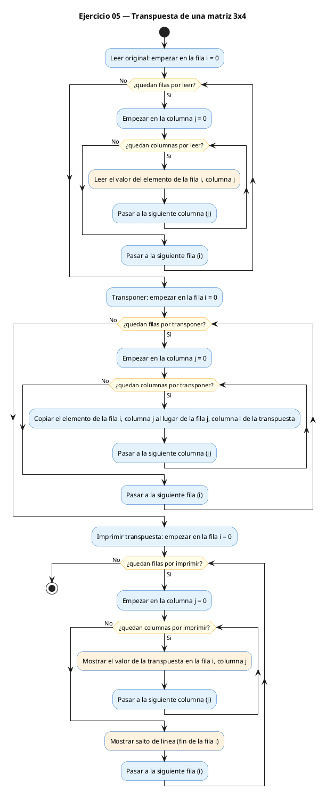
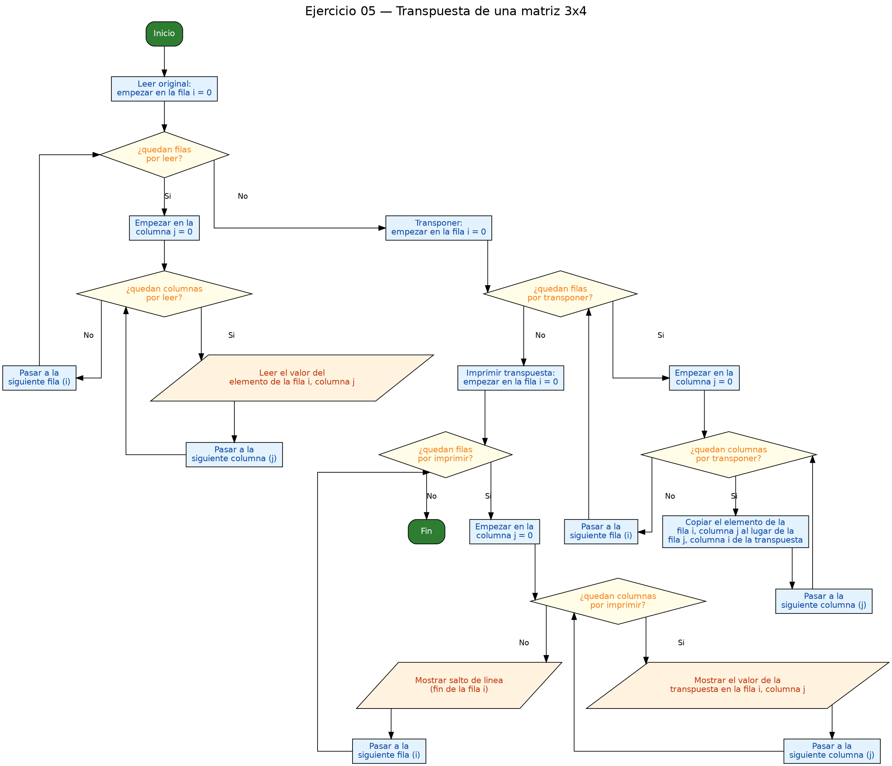

<!-- FICHERO GENERADO — NO EDITAR. Fuente de verdad: curso-c/practica/06-matrices/ej05.md (se regenera con gen_course.py). -->

# Ejercicio 05 — Lee una matriz 3x4 e imprime su transpuesta

Dificultad: amarillo · Módulo 06 (Matrices)

## Enunciado

Lee una matriz 3x4 e imprime su transpuesta (4x3).

## Diagramas de flujo





## Cómo se resuelve

<!-- EXPLICACION -->
Transponer una matriz es "girarla" sobre su diagonal: lo que era una fila pasa a ser una columna y viceversa. Si la original `m` es de 3×4, la transpuesta `t` es de 4×3. Toda la operación cabe en una línea dentro del doble bucle:

```c
t[j][i] = m[i][j];   // los índices van intercambiados
```

El elemento que estaba en la fila `i`, columna `j` de la original acaba en la fila `j`, columna `i` de la transpuesta. Es el mismo valor colocado en la posición espejo.

La trampa principal es olvidar que la matriz destino tiene las **dimensiones invertidas**. Por eso se declara `int t[COLS][FILAS]` y no `int t[FILAS][COLS]`: si le das el tamaño de la original, cuando `m` no es cuadrada te sales de los límites del array y corrompes memoria. Fíjate también en que al **imprimir** `t` recorres primero sus `COLS` filas y luego sus `FILAS` columnas: las dimensiones de `t` son las de `m` al revés, y hay que respetarlo en cada bucle que la toque. Un truco para no perderte: en un array 2D en C, el **primer** índice siempre cuenta filas y el **segundo** columnas, sea cual sea el nombre de la matriz.

## Para practicar — cópialo y complétalo

Pega este esqueleto y completa los `TODO`. Es la mejor forma de aprender: inténtalo antes de mirar la solución.

```c
/*
 * Curso de C — Modulo 06: Matrices (arrays 2D)
 * Ejercicio 05 — PRACTICA (rellena los TODO)
 * Enunciado: Lee una matriz 3x4 e imprime su transpuesta (4x3).
 * Dificultad: amarillo
 * Stdin: 1\n2\n3\n4\n5\n6\n7\n8\n9\n10\n11\n12
 * Compilar: gcc -std=c11 -Wall ej05_practica.c -o ej05 && ./ej05
 */

#include <stdio.h>

#define FILAS 3
#define COLS  4

int main(void) {
    int m[FILAS][COLS];
    // TODO 1: declara la matriz transpuesta t con dimensiones COLS x FILAS
    //         (las dimensiones estan invertidas respecto a m)

    // TODO 2: leer la matriz m (FILAS x COLS) con doble bucle y scanf

    // TODO 3: calcular la transpuesta con un doble bucle:
    //         t[j][i] = m[i][j]
    //         Pista: el bucle recorre i de 0 a FILAS y j de 0 a COLS,
    //         pero asigna con los indices al reves en t

    // TODO 4: imprimir t, que tiene COLS filas y FILAS columnas
    //         (bucle exterior de 0 a COLS, interior de 0 a FILAS)

    return 0;
}
```

## Solución — cópiala y ejecútala

```c
/*
 * Curso de C — Modulo 06: Matrices (arrays 2D)
 * Ejercicio 05 — MODELO (resuelto)
 * Enunciado: Lee una matriz 3x4 e imprime su transpuesta (4x3).
 * Dificultad: amarillo
 * Stdin: 1\n2\n3\n4\n5\n6\n7\n8\n9\n10\n11\n12
 * Compilar: gcc -std=c11 -Wall ej05_modelo.c -o ej05 && ./ej05
 */

#include <stdio.h>

#define FILAS 3
#define COLS  4

int main(void) {
    int m[FILAS][COLS];
    int t[COLS][FILAS];   // transpuesta: dimensiones invertidas

    // Leer la matriz original
    printf("Introduce la matriz %dx%d:\n", FILAS, COLS);
    for (int i = 0; i < FILAS; i++)
        for (int j = 0; j < COLS; j++)
            scanf("%d", &m[i][j]);

    // Calcular la transpuesta: t[j][i] = m[i][j]
    for (int i = 0; i < FILAS; i++)
        for (int j = 0; j < COLS; j++)
            t[j][i] = m[i][j];

    // Imprimir la transpuesta (es COLS x FILAS)
    printf("\nTranspuesta (%dx%d):\n", COLS, FILAS);
    for (int i = 0; i < COLS; i++) {
        for (int j = 0; j < FILAS; j++)
            printf("%4d", t[i][j]);
        printf("\n");
    }

    return 0;
}
```

## Ejecútalo en el navegador

[▶ Abrir y ejecutar en Compiler Explorer](https://godbolt.org/clientstate/eyJzZXNzaW9ucyI6W3siaWQiOjEsImxhbmd1YWdlIjoiYyIsInNvdXJjZSI6Ii8qXG4gKiBDdXJzbyBkZSBDIFx1MjAxNCBNb2R1bG8gMDY6IE1hdHJpY2VzIChhcnJheXMgMkQpXG4gKiBFamVyY2ljaW8gMDUgXHUyMDE0IE1PREVMTyAocmVzdWVsdG8pXG4gKiBFbnVuY2lhZG86IExlZSB1bmEgbWF0cml6IDN4NCBlIGltcHJpbWUgc3UgdHJhbnNwdWVzdGEgKDR4MykuXG4gKiBEaWZpY3VsdGFkOiBhbWFyaWxsb1xuICogU3RkaW46IDFcXG4yXFxuM1xcbjRcXG41XFxuNlxcbjdcXG44XFxuOVxcbjEwXFxuMTFcXG4xMlxuICogQ29tcGlsYXI6IGdjYyAtc3RkPWMxMSAtV2FsbCBlajA1X21vZGVsby5jIC1vIGVqMDUgJiYgLi9lajA1XG4gKi9cblxuI2luY2x1ZGUgPHN0ZGlvLmg%2BXG5cbiNkZWZpbmUgRklMQVMgM1xuI2RlZmluZSBDT0xTICA0XG5cbmludCBtYWluKHZvaWQpIHtcbiAgICBpbnQgbVtGSUxBU11bQ09MU107XG4gICAgaW50IHRbQ09MU11bRklMQVNdOyAgIC8vIHRyYW5zcHVlc3RhOiBkaW1lbnNpb25lcyBpbnZlcnRpZGFzXG5cbiAgICAvLyBMZWVyIGxhIG1hdHJpeiBvcmlnaW5hbFxuICAgIHByaW50ZihcIkludHJvZHVjZSBsYSBtYXRyaXogJWR4JWQ6XFxuXCIsIEZJTEFTLCBDT0xTKTtcbiAgICBmb3IgKGludCBpID0gMDsgaSA8IEZJTEFTOyBpKyspXG4gICAgICAgIGZvciAoaW50IGogPSAwOyBqIDwgQ09MUzsgaisrKVxuICAgICAgICAgICAgc2NhbmYoXCIlZFwiLCAmbVtpXVtqXSk7XG5cbiAgICAvLyBDYWxjdWxhciBsYSB0cmFuc3B1ZXN0YTogdFtqXVtpXSA9IG1baV1bal1cbiAgICBmb3IgKGludCBpID0gMDsgaSA8IEZJTEFTOyBpKyspXG4gICAgICAgIGZvciAoaW50IGogPSAwOyBqIDwgQ09MUzsgaisrKVxuICAgICAgICAgICAgdFtqXVtpXSA9IG1baV1bal07XG5cbiAgICAvLyBJbXByaW1pciBsYSB0cmFuc3B1ZXN0YSAoZXMgQ09MUyB4IEZJTEFTKVxuICAgIHByaW50ZihcIlxcblRyYW5zcHVlc3RhICglZHglZCk6XFxuXCIsIENPTFMsIEZJTEFTKTtcbiAgICBmb3IgKGludCBpID0gMDsgaSA8IENPTFM7IGkrKykge1xuICAgICAgICBmb3IgKGludCBqID0gMDsgaiA8IEZJTEFTOyBqKyspXG4gICAgICAgICAgICBwcmludGYoXCIlNGRcIiwgdFtpXVtqXSk7XG4gICAgICAgIHByaW50ZihcIlxcblwiKTtcbiAgICB9XG5cbiAgICByZXR1cm4gMDtcbn1cbiIsImNvbXBpbGVycyI6W10sImV4ZWN1dG9ycyI6W3siYXJndW1lbnRzIjoiIiwiY29tcGlsZXIiOnsiaWQiOiJjZzE0MyIsImxpYnMiOltdLCJvcHRpb25zIjoiLXN0ZD1jMTEgLWxtIn0sInN0ZGluIjoiMVxuMlxuM1xuNFxuNVxuNlxuN1xuOFxuOVxuMTBcbjExXG4xMiIsIndyYXAiOmZhbHNlfV19XX0%3D)

Se abre con la solución ya cargada; pulsa el botón de ejecutar (Run) para ver la salida. No hay que instalar nada.

## Cómo usarlo

Pega el código en un fichero y ejecútalo con tu toolchain habitual (o el botón de Ejecutar de tu editor). Antes de mirar la solución, intenta completar tú el esqueleto: es la mejor forma de aprender.

## Conexiones

- [[Curso_C/modelo/06-matrices|Teoría del módulo]]
- [[Curso_C/practica/00_README|Índice del curso]]
