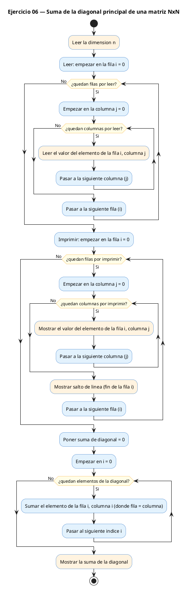
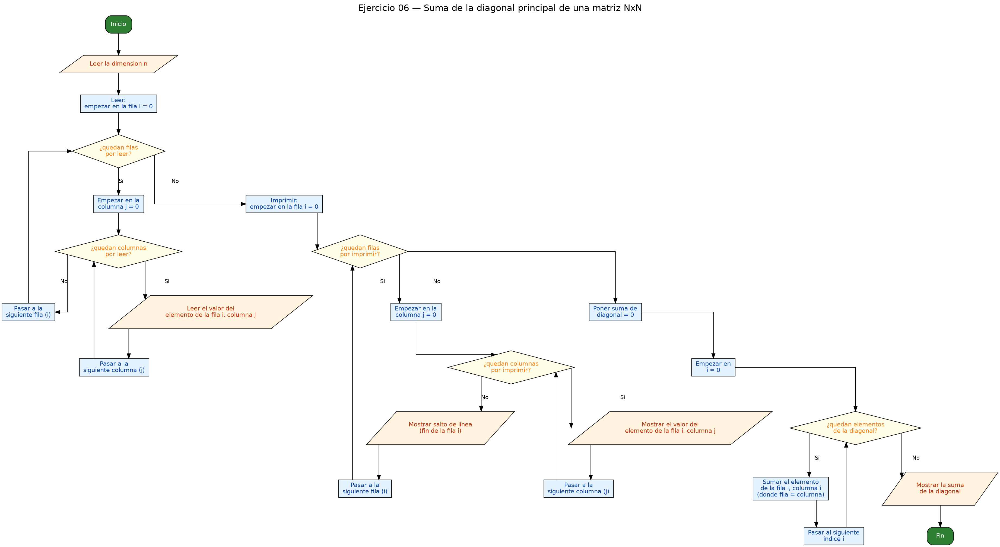

<!-- FICHERO GENERADO — NO EDITAR. Fuente de verdad: curso-c/practica/06-matrices/ej06.md (se regenera con gen_course.py). -->

# Ejercicio 06 — Lee una matriz cuadrada NxN (max 8) y calcula la suma de la diagonal…

Dificultad: amarillo · Módulo 06 (Matrices)

## Enunciado

Lee una matriz cuadrada NxN (max 8) y calcula la suma de la diagonal principal.

## Diagramas de flujo





## Cómo se resuelve

<!-- EXPLICACION -->
La diagonal principal de una matriz cuadrada son las celdas donde la fila y la columna coinciden: `m[0][0]`, `m[1][1]`, `m[2][2]`, etc. Es decir, todas las posiciones donde `i == j`. Esa observación es la clave del ejercicio y también su mayor economía.

Aunque leemos e imprimimos la matriz con el doble bucle de siempre, para sumar la diagonal **no hace falta doble bucle**. Como solo nos interesan las celdas con `i == j`, basta un único `for` que recorra la diagonal directamente:

```c
int diag = 0;
for (int i = 0; i < n; i++)
    diag += m[i][i];   // i vale a la vez de fila y de columna
```

Ese `m[i][i]` es el detalle bonito: al usar la misma variable para los dos índices, saltas de una casilla diagonal a la siguiente sin visitar el resto.

La trampa típica es usar un doble bucle con un `if (i == j)` dentro. Funciona y da el resultado correcto, pero recorre las `n × n` celdas para quedarse solo con `n`: haces mucho más trabajo del necesario. El bucle simple `m[i][i]` es la forma directa. Ojo también: la diagonal principal solo tiene sentido en matrices **cuadradas**, por eso el enunciado pide una N×N y solo se lee una dimensión.

## Para practicar — cópialo y complétalo

Pega este esqueleto y completa los `TODO`. Es la mejor forma de aprender: inténtalo antes de mirar la solución.

```c
/*
 * Curso de C — Modulo 06: Matrices (arrays 2D)
 * Ejercicio 06 — PRACTICA (rellena los TODO)
 * Enunciado: Lee una matriz cuadrada NxN (max 8) y calcula la suma de la diagonal principal.
 * Dificultad: amarillo
 * Stdin: 3\n1\n2\n3\n4\n5\n6\n7\n8\n9
 * Compilar: gcc -std=c11 -Wall ej06_practica.c -o ej06 && ./ej06
 */

#include <stdio.h>

#define MAX 8

int main(void) {
    int m[MAX][MAX];
    int n;

    // TODO 1: leer la dimension n (entre 1 y MAX) con scanf

    // TODO 2: leer la matriz nxn con doble bucle

    // TODO 3: imprimir la matriz (opcional pero util para verificar)

    // TODO 4: calcular la suma de la diagonal principal
    //         Pista: la diagonal son los elementos donde i == j
    //         Un solo bucle for (i de 0 a n) sumando m[i][i] es suficiente
    //         Recuerda inicializar int diag = 0

    // TODO 5: imprimir el resultado

    return 0;
}
```

## Solución — cópiala y ejecútala

```c
/*
 * Curso de C — Modulo 06: Matrices (arrays 2D)
 * Ejercicio 06 — MODELO (resuelto)
 * Enunciado: Lee una matriz cuadrada NxN (max 8) y calcula la suma de la diagonal principal.
 * Dificultad: amarillo
 * Stdin: 3\n1\n2\n3\n4\n5\n6\n7\n8\n9
 * Compilar: gcc -std=c11 -Wall ej06_modelo.c -o ej06 && ./ej06
 */

#include <stdio.h>

#define MAX 8

int main(void) {
    int m[MAX][MAX];
    int n;

    // Leer dimension
    printf("Dimension de la matriz cuadrada (1-%d): ", MAX);
    scanf("%d", &n);

    // Leer la matriz
    printf("Introduce los %d valores fila a fila:\n", n * n);
    for (int i = 0; i < n; i++)
        for (int j = 0; j < n; j++)
            scanf("%d", &m[i][j]);

    // Imprimir la matriz
    printf("\nMatriz:\n");
    for (int i = 0; i < n; i++) {
        for (int j = 0; j < n; j++)
            printf("%4d", m[i][j]);
        printf("\n");
    }

    // Sumar diagonal: solo donde i == j
    int diag = 0;
    for (int i = 0; i < n; i++)
        diag += m[i][i];   // m[0][0], m[1][1], m[2][2], ...

    printf("\nSuma diagonal: %d\n", diag);

    return 0;
}
```

## Ejecútalo en el navegador

[▶ Abrir y ejecutar en Compiler Explorer](https://godbolt.org/clientstate/eyJzZXNzaW9ucyI6W3siaWQiOjEsImxhbmd1YWdlIjoiYyIsInNvdXJjZSI6Ii8qXG4gKiBDdXJzbyBkZSBDIFx1MjAxNCBNb2R1bG8gMDY6IE1hdHJpY2VzIChhcnJheXMgMkQpXG4gKiBFamVyY2ljaW8gMDYgXHUyMDE0IE1PREVMTyAocmVzdWVsdG8pXG4gKiBFbnVuY2lhZG86IExlZSB1bmEgbWF0cml6IGN1YWRyYWRhIE54TiAobWF4IDgpIHkgY2FsY3VsYSBsYSBzdW1hIGRlIGxhIGRpYWdvbmFsIHByaW5jaXBhbC5cbiAqIERpZmljdWx0YWQ6IGFtYXJpbGxvXG4gKiBTdGRpbjogM1xcbjFcXG4yXFxuM1xcbjRcXG41XFxuNlxcbjdcXG44XFxuOVxuICogQ29tcGlsYXI6IGdjYyAtc3RkPWMxMSAtV2FsbCBlajA2X21vZGVsby5jIC1vIGVqMDYgJiYgLi9lajA2XG4gKi9cblxuI2luY2x1ZGUgPHN0ZGlvLmg%2BXG5cbiNkZWZpbmUgTUFYIDhcblxuaW50IG1haW4odm9pZCkge1xuICAgIGludCBtW01BWF1bTUFYXTtcbiAgICBpbnQgbjtcblxuICAgIC8vIExlZXIgZGltZW5zaW9uXG4gICAgcHJpbnRmKFwiRGltZW5zaW9uIGRlIGxhIG1hdHJpeiBjdWFkcmFkYSAoMS0lZCk6IFwiLCBNQVgpO1xuICAgIHNjYW5mKFwiJWRcIiwgJm4pO1xuXG4gICAgLy8gTGVlciBsYSBtYXRyaXpcbiAgICBwcmludGYoXCJJbnRyb2R1Y2UgbG9zICVkIHZhbG9yZXMgZmlsYSBhIGZpbGE6XFxuXCIsIG4gKiBuKTtcbiAgICBmb3IgKGludCBpID0gMDsgaSA8IG47IGkrKylcbiAgICAgICAgZm9yIChpbnQgaiA9IDA7IGogPCBuOyBqKyspXG4gICAgICAgICAgICBzY2FuZihcIiVkXCIsICZtW2ldW2pdKTtcblxuICAgIC8vIEltcHJpbWlyIGxhIG1hdHJpelxuICAgIHByaW50ZihcIlxcbk1hdHJpejpcXG5cIik7XG4gICAgZm9yIChpbnQgaSA9IDA7IGkgPCBuOyBpKyspIHtcbiAgICAgICAgZm9yIChpbnQgaiA9IDA7IGogPCBuOyBqKyspXG4gICAgICAgICAgICBwcmludGYoXCIlNGRcIiwgbVtpXVtqXSk7XG4gICAgICAgIHByaW50ZihcIlxcblwiKTtcbiAgICB9XG5cbiAgICAvLyBTdW1hciBkaWFnb25hbDogc29sbyBkb25kZSBpID09IGpcbiAgICBpbnQgZGlhZyA9IDA7XG4gICAgZm9yIChpbnQgaSA9IDA7IGkgPCBuOyBpKyspXG4gICAgICAgIGRpYWcgKz0gbVtpXVtpXTsgICAvLyBtWzBdWzBdLCBtWzFdWzFdLCBtWzJdWzJdLCAuLi5cblxuICAgIHByaW50ZihcIlxcblN1bWEgZGlhZ29uYWw6ICVkXFxuXCIsIGRpYWcpO1xuXG4gICAgcmV0dXJuIDA7XG59XG4iLCJjb21waWxlcnMiOltdLCJleGVjdXRvcnMiOlt7ImFyZ3VtZW50cyI6IiIsImNvbXBpbGVyIjp7ImlkIjoiY2cxNDMiLCJsaWJzIjpbXSwib3B0aW9ucyI6Ii1zdGQ9YzExIC1sbSJ9LCJzdGRpbiI6IjNcbjFcbjJcbjNcbjRcbjVcbjZcbjdcbjhcbjkiLCJ3cmFwIjpmYWxzZX1dfV19)

Se abre con la solución ya cargada; pulsa el botón de ejecutar (Run) para ver la salida. No hay que instalar nada.

## Cómo usarlo

Pega el código en un fichero y ejecútalo con tu toolchain habitual (o el botón de Ejecutar de tu editor). Antes de mirar la solución, intenta completar tú el esqueleto: es la mejor forma de aprender.

## Conexiones

- [[Curso_C/modelo/06-matrices|Teoría del módulo]]
- [[Curso_C/practica/00_README|Índice del curso]]
