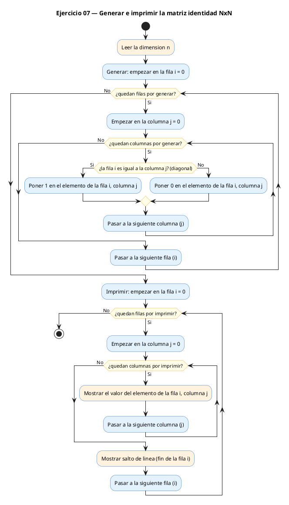
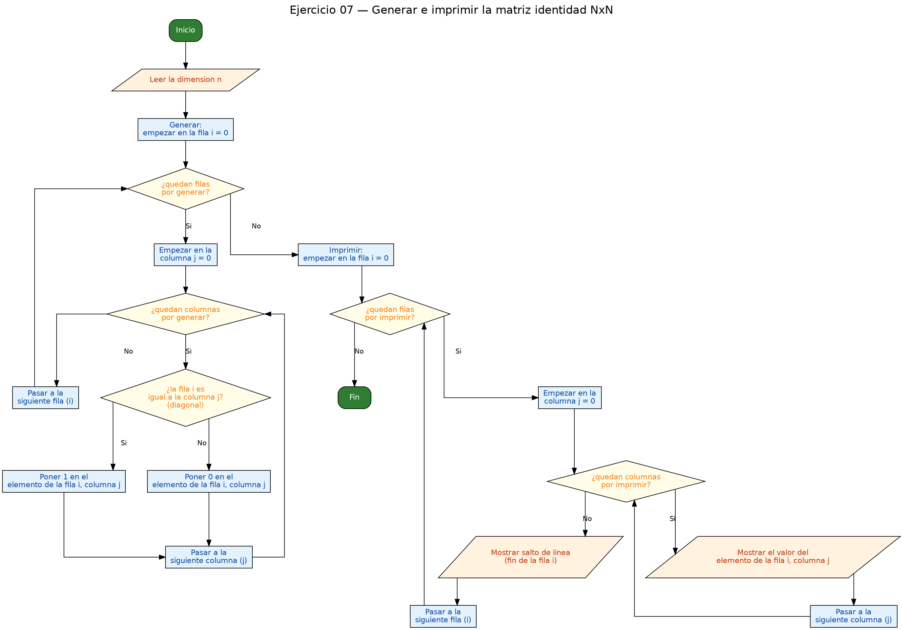

<!-- FICHERO GENERADO — NO EDITAR. Fuente de verdad: curso-c/practica/06-matrices/ej07.md (se regenera con gen_course.py). -->

# Ejercicio 07 — Dado N (max 8), genera e imprime la matriz identidad NxN

Dificultad: rojo · Módulo 06 (Matrices)

## Enunciado

Dado N (max 8), genera e imprime la matriz identidad NxN.

## Diagramas de flujo





## Cómo se resuelve

<!-- EXPLICACION -->
Aquí ya no leemos una matriz: la **generamos** nosotros según un patrón. La matriz identidad tiene 1 en la diagonal principal (donde `i == j`) y 0 en todo lo demás. Es decir, cada celda se decide mirando solo si su fila y su columna coinciden.

El doble bucle recorre todas las celdas y, en cada una, decide qué valor escribir. La forma más compacta es el **operador ternario** `condicion ? valor_si : valor_no`:

```c
m[i][j] = (i == j) ? 1 : 0;
```

Se lee como: "si `i == j`, pon 1; si no, pon 0". Es exactamente lo mismo que un `if (i == j) m[i][j] = 1; else m[i][j] = 0;`, solo que en una línea. Usar cualquiera de las dos formas es igual de correcto.

Las trampas suelen ser dos. La primera es de lógica: confundir la condición y escribir el 1 fuera de la diagonal, o invertir el ternario y generar el "negativo" de la identidad (0 en la diagonal, 1 en el resto). La segunda es de C: en el `if` no confundas la **comparación** `==` con la **asignación** `=`. Escribir `(i = j)` no compara, sino que mete el valor de `j` dentro de `i` y evalúa como cierto casi siempre, rompiendo el patrón sin dar ningún error de compilación. Para la identidad basta con `i == j`, sin doble bucle extra ni casos raros.

## Para practicar — cópialo y complétalo

Pega este esqueleto y completa los `TODO`. Es la mejor forma de aprender: inténtalo antes de mirar la solución.

```c
/*
 * Curso de C — Modulo 06: Matrices (arrays 2D)
 * Ejercicio 07 — PRACTICA (rellena los TODO)
 * Enunciado: Dado N (max 8), genera e imprime la matriz identidad NxN.
 * Dificultad: rojo
 * Compilar: gcc -std=c11 -Wall ej07_practica.c -o ej07 && ./ej07
 */

#include <stdio.h>

#define MAX 8

int main(void) {
    int m[MAX][MAX];
    int n;

    // TODO 1: leer la dimension n con scanf

    // TODO 2: doble bucle para construir la identidad.
    //         En cada celda (i, j) decide que valor poner:
    //         - si i == j (estas en la diagonal) -> m[i][j] = 1
    //         - en cualquier otro caso             -> m[i][j] = 0
    //         Puedes usar un if/else o el operador ternario (i==j) ? 1 : 0

    // TODO 3: imprimir la matriz resultado con formato

    return 0;
}
```

## Solución — cópiala y ejecútala

```c
/*
 * Curso de C — Modulo 06: Matrices (arrays 2D)
 * Ejercicio 07 — MODELO (resuelto)
 * Enunciado: Dado N (max 8), genera e imprime la matriz identidad NxN.
 * Dificultad: rojo
 * Compilar: gcc -std=c11 -Wall ej07_modelo.c -o ej07 && ./ej07
 */

#include <stdio.h>

#define MAX 8

int main(void) {
    int m[MAX][MAX];
    int n;

    // Leer dimension
    printf("Dimension de la identidad (1-%d): ", MAX);
    scanf("%d", &n);

    // Construir la matriz identidad:
    // m[i][j] = 1 si i == j (diagonal), 0 en cualquier otro caso
    for (int i = 0; i < n; i++)
        for (int j = 0; j < n; j++)
            m[i][j] = (i == j) ? 1 : 0;

    // Imprimir la identidad
    printf("\nMatriz identidad %dx%d:\n", n, n);
    for (int i = 0; i < n; i++) {
        for (int j = 0; j < n; j++)
            printf("%4d", m[i][j]);
        printf("\n");
    }

    return 0;
}
```

## Cómo usarlo

Pega el código en un fichero y ejecútalo con tu toolchain habitual (o el botón de Ejecutar de tu editor). Antes de mirar la solución, intenta completar tú el esqueleto: es la mejor forma de aprender.

## Conexiones

- [[Curso_C/modelo/06-matrices|Teoría del módulo]]
- [[Curso_C/practica/00_README|Índice del curso]]
