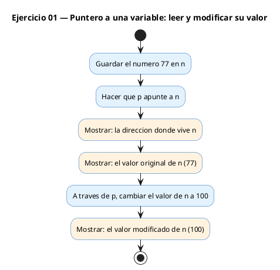

# Ejercicio 01 — Imprimir la direccion y el valor de una variable usando un puntero,…

Dificultad: verde · Módulo 07 (Punteros)

## Enunciado

Imprimir la direccion y el valor de una variable usando un puntero, luego modificar el valor a traves del puntero.

## Diagrama de flujo



## Cómo se resuelve

<!-- EXPLICACION -->
Este ejercicio es la primera toma de contacto con un puntero. Un puntero es una variable que no guarda un valor normal, sino la **dirección de memoria** donde vive otra variable.

1. `int *p = &n;` — el operador `&` (dirección) devuelve dónde está guardada `n`, y `p` la almacena. Léelo como "p es un puntero a int que apunta a n".
2. `printf("Direccion: %p\n", (void *)p);` — `%p` imprime esa dirección en hexadecimal. El cast a `(void *)` es la forma correcta y portable de pasar un puntero a `%p`.
3. `printf("Valor original: %d\n", *p);` — aquí el `*` es el operador de **desreferencia**: "dame el valor que hay en la dirección que guarda p". No confundas la `*` de la declaración (`int *p`, que dice "puntero") con la `*` de uso (`*p`, que dice "el valor apuntado").
4. `*p = 100;` — escribir a través del puntero cambia la variable original. Como `p` apunta a `n`, `n` pasa a valer 100 aunque nunca escribamos `n = 100`.

Trampa habitual: declarar el puntero sin apuntarlo a nada (`int *p;`) y hacer `*p = 100`. Ese `p` contiene basura y escribirías en una dirección aleatoria: comportamiento indefinido. Un puntero siempre debe apuntar a algo válido antes de desreferenciarlo.

## Para practicar — cópialo en Dev-C++

Pega este esqueleto y completa los `TODO`. Es la mejor forma de aprender: inténtalo antes de mirar la solución.

```c
/*
 * Curso de C — Modulo 07: Punteros
 * Ejercicio 01 — PRACTICA (rellena los TODO)
 * Enunciado: Imprimir la direccion y el valor de una variable usando un puntero,
 *            luego modificar el valor a traves del puntero.
 * Dificultad: verde
 * Compilar: gcc -std=c11 -Wall ej01_practica.c -o ej01 && ./ej01
 */

#include <stdio.h>

int main(void) {
    int n = 77;

    // TODO 1: Declara un puntero a int llamado 'p' y asignale la direccion de n
    //         Sintaxis: int *p = ...

    // TODO 2: Imprime la direccion con printf y el formato %p
    //         Recuerda hacer cast a (void *) para que %p funcione limpio
    //         printf("Direccion: %p\n", ...);

    // TODO 3: Imprime el valor apuntado con printf y %d
    //         Usa * para desreferenciar
    //         printf("Valor original: %d\n", ...);

    // TODO 4: Cambia el valor de n a 100 a traves del puntero (no uses n=100)
    //         *p = ...

    // TODO 5: Imprime n directamente para comprobar que cambio
    //         printf("Valor modificado: %d\n", n);

    return 0;
}
```

## Solución — cópiala y ejecútala

```c
/*
 * Curso de C — Modulo 07: Punteros
 * Ejercicio 01 — MODELO (resuelto)
 * Enunciado: Imprimir la direccion y el valor de una variable usando un puntero,
 *            luego modificar el valor a traves del puntero.
 * Dificultad: verde
 * Compilar: gcc -std=c11 -Wall ej01_modelo.c -o ej01 && ./ej01
 */

#include <stdio.h>

int main(void) {
    int n = 77;
    int *p = &n;  // p guarda la direccion de n

    printf("Direccion: %p\n", (void *)p);  // %p imprime la direccion en hex
    printf("Valor original: %d\n", *p);    // desreferenciamos: leemos el valor

    *p = 100;  // modificamos n a traves del puntero
    printf("Valor modificado: %d\n", n);   // n cambio aunque no escribimos n=100

    return 0;
}
```

## Cómo usarlo

Dev-C++ (Windows): Archivo → Nuevo → Código fuente, pega el código y pulsa F11 (compilar y ejecutar). Si ves los acentos raros en la consola, escribe `chcp 65001` y vuelve a ejecutar.

## Conexiones

- [[Curso_C/modelo/07-punteros|Teoría del módulo]]
- [[Curso_C/00_README|Índice del curso]]
