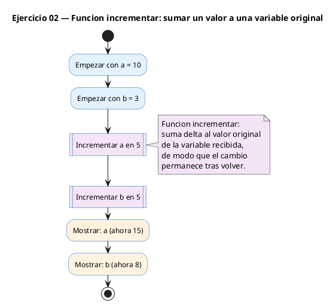
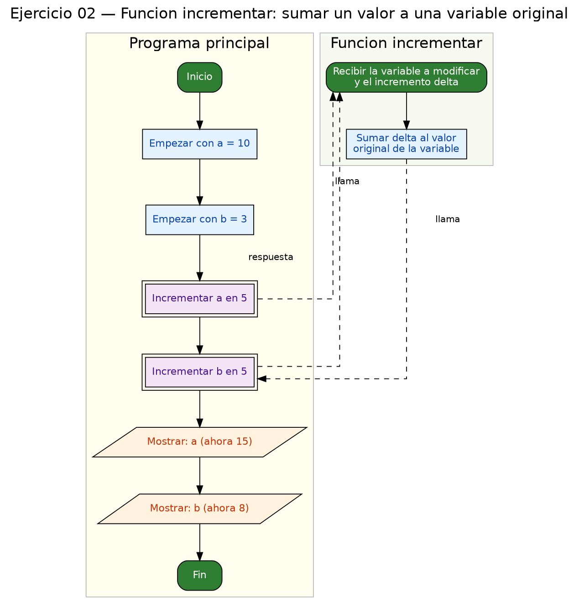

<!-- FICHERO GENERADO — NO EDITAR. Fuente de verdad: curso-c/practica/07-punteros/ej02.md (se regenera con gen_course.py). -->

# Ejercicio 02 — Función incrementar(int *p, int delta) que suma delta al entero…

Dificultad: verde · Módulo 07 (Punteros)

## Enunciado

Función incrementar(int *p, int delta) que suma delta al entero apuntado.

## Diagramas de flujo





## Cómo se resuelve

<!-- EXPLICACION -->
Aquí se ve para qué sirven de verdad los punteros: **modificar una variable desde dentro de una función**. En C los argumentos se pasan por copia, así que si `incrementar` recibiera un `int` normal, tocaría solo su copia y el original no cambiaría. Pasando la dirección, sí puede modificar el original.

- La función recibe `int *p`: una dirección. Dentro, `*p = *p + delta;` lee el valor apuntado, le suma `delta` y lo vuelve a escribir en la misma celda. Ese `*p` en ambos lados es la clave: opera sobre el valor, no sobre la dirección.
- En `main` la llamada es `incrementar(&a, 5);`. El `&` es imprescindible: pasas *dónde está* `a`, no *cuánto vale* `a`.

Trampa habitual: escribir `incrementar(a, 5)` sin el `&`. El compilador espera un `int *` y le das un `int`, así que darás un warning (o error) de tipos; y si de algún modo compilara, la función no podría cambiar `a`. Regla mental: si quieres que una función modifique tu variable, pásale su dirección con `&` y accede dentro con `*`.

## Para practicar — cópialo y complétalo

Pega este esqueleto y completa los `TODO`. Es la mejor forma de aprender: inténtalo antes de mirar la solución.

```c
/*
 * Curso de C — Modulo 07: Punteros
 * Ejercicio 02 — PRACTICA (rellena los TODO)
 * Enunciado: Función incrementar(int *p, int delta) que suma delta al entero apuntado.
 * Dificultad: verde
 * Compilar: gcc -std=c11 -Wall ej02_practica.c -o ej02 && ./ej02
 */

#include <stdio.h>

/*
 * TODO 1: Define la funcion incrementar.
 *         Firma: void incrementar(int *p, int delta)
 *         Dentro: suma delta al valor apuntado por p usando *p
 */

int main(void) {
    int a = 10;
    int b = 3;

    // TODO 2: Llama a incrementar para sumar 5 a 'a'.
    //         Recuerda pasar la DIRECCION de a, no su valor.

    // TODO 3: Llama a incrementar para sumar 5 a 'b'.

    // TODO 4: Imprime el resultado con el formato exacto:
    //         "a=10 -> <nuevo valor>"
    //         "b=3  -> <nuevo valor>"

    return 0;
}
```

## Solución — cópiala y ejecútala

```c
/*
 * Curso de C — Modulo 07: Punteros
 * Ejercicio 02 — MODELO (resuelto)
 * Enunciado: Función incrementar(int *p, int delta) que suma delta al entero apuntado.
 * Dificultad: verde
 * Compilar: gcc -std=c11 -Wall ej02_modelo.c -o ej02 && ./ej02
 */

#include <stdio.h>

/* Suma delta al entero apuntado por p */
void incrementar(int *p, int delta) {
    *p = *p + delta;  // modifica la variable original del llamador
}

int main(void) {
    int a = 10;
    int b = 3;

    incrementar(&a, 5);  // pasamos la direccion; a quedara en 15
    incrementar(&b, 5);  // b quedara en 8

    printf("a=10 -> %d\n", a);
    printf("b=3  -> %d\n", b);

    return 0;
}
```

## Ejecútalo en el navegador

[▶ Abrir y ejecutar en Compiler Explorer](https://godbolt.org/clientstate/eyJzZXNzaW9ucyI6W3siaWQiOjEsImxhbmd1YWdlIjoiYyIsInNvdXJjZSI6Ii8qXG4gKiBDdXJzbyBkZSBDIFx1MjAxNCBNb2R1bG8gMDc6IFB1bnRlcm9zXG4gKiBFamVyY2ljaW8gMDIgXHUyMDE0IE1PREVMTyAocmVzdWVsdG8pXG4gKiBFbnVuY2lhZG86IEZ1bmNpXHUwMGYzbiBpbmNyZW1lbnRhcihpbnQgKnAsIGludCBkZWx0YSkgcXVlIHN1bWEgZGVsdGEgYWwgZW50ZXJvIGFwdW50YWRvLlxuICogRGlmaWN1bHRhZDogdmVyZGVcbiAqIENvbXBpbGFyOiBnY2MgLXN0ZD1jMTEgLVdhbGwgZWowMl9tb2RlbG8uYyAtbyBlajAyICYmIC4vZWowMlxuICovXG5cbiNpbmNsdWRlIDxzdGRpby5oPlxuXG4vKiBTdW1hIGRlbHRhIGFsIGVudGVybyBhcHVudGFkbyBwb3IgcCAqL1xudm9pZCBpbmNyZW1lbnRhcihpbnQgKnAsIGludCBkZWx0YSkge1xuICAgICpwID0gKnAgKyBkZWx0YTsgIC8vIG1vZGlmaWNhIGxhIHZhcmlhYmxlIG9yaWdpbmFsIGRlbCBsbGFtYWRvclxufVxuXG5pbnQgbWFpbih2b2lkKSB7XG4gICAgaW50IGEgPSAxMDtcbiAgICBpbnQgYiA9IDM7XG5cbiAgICBpbmNyZW1lbnRhcigmYSwgNSk7ICAvLyBwYXNhbW9zIGxhIGRpcmVjY2lvbjsgYSBxdWVkYXJhIGVuIDE1XG4gICAgaW5jcmVtZW50YXIoJmIsIDUpOyAgLy8gYiBxdWVkYXJhIGVuIDhcblxuICAgIHByaW50ZihcImE9MTAgLT4gJWRcXG5cIiwgYSk7XG4gICAgcHJpbnRmKFwiYj0zICAtPiAlZFxcblwiLCBiKTtcblxuICAgIHJldHVybiAwO1xufVxuIiwiY29tcGlsZXJzIjpbXSwiZXhlY3V0b3JzIjpbeyJhcmd1bWVudHMiOiIiLCJjb21waWxlciI6eyJpZCI6ImNnMTQzIiwibGlicyI6W10sIm9wdGlvbnMiOiItc3RkPWMxMSAtbG0ifSwic3RkaW4iOiIiLCJ3cmFwIjpmYWxzZX1dfV19)

Se abre con la solución ya cargada; pulsa el botón de ejecutar (Run) para ver la salida. No hay que instalar nada.

## Cómo usarlo

Pega el código en un fichero y ejecútalo con tu toolchain habitual (o el botón de Ejecutar de tu editor). Antes de mirar la solución, intenta completar tú el esqueleto: es la mejor forma de aprender.

## Conexiones

- [[Curso_C/modelo/07-punteros|Teoría del módulo]]
- [[Curso_C/practica/00_README|Índice del curso]]
