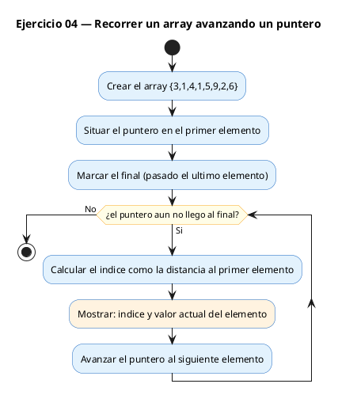
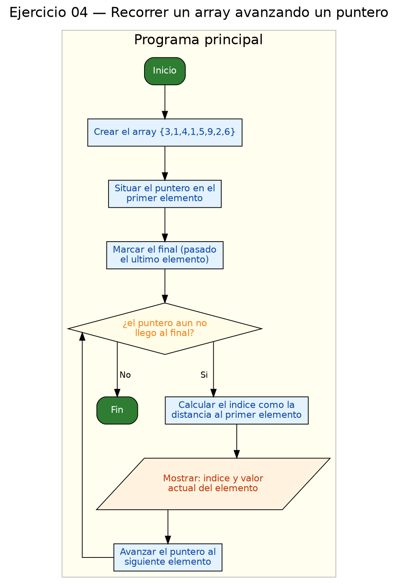

<!-- FICHERO GENERADO — NO EDITAR. Fuente de verdad: curso-c/practica/07-punteros/ej04.md (se regenera con gen_course.py). -->

# Ejercicio 04 — Recorrer un array con un puntero

Dificultad: amarillo · Módulo 07 (Punteros)

## Enunciado

Recorrer un array con un puntero (sin usar arr[i]), imprimiendo cada elemento con su indice calculado como p - arr.

## Diagramas de flujo





## Cómo se resuelve

<!-- EXPLICACION -->
Este ejercicio muestra la relación íntima entre punteros y arrays: el nombre de un array **es** un puntero a su primer elemento. Por eso `int *p = arr;` (sin corchetes ni `&`) hace que `p` apunte a `arr[0]`.

- `int *fin = arr + n;` apunta una posición *más allá* del último elemento. Es un centinela: no se lee, solo sirve para saber cuándo parar. En aritmética de punteros `arr + n` significa "avanza n elementos", no n bytes; el compilador ya cuenta el tamaño de cada `int`.
- El bucle `while (p < fin)` recorre el array. `*p` da el elemento actual y `p++` avanza al siguiente `int`.
- `int indice = (int)(p - arr);` — restar dos punteros del mismo array da **cuántos elementos** hay entre ellos, es decir, el índice actual. De nuevo, no da bytes sino posiciones.

Trampa habitual: confundir `p++` con `(*p)++`. `p++` mueve el puntero a la siguiente celda (lo que aquí queremos); `(*p)++` incrementaría el valor almacenado y dejaría el puntero clavado, provocando un bucle infinito. Y ojo con pasarse del `fin`: leer `*p` fuera del array es comportamiento indefinido.

## Para practicar — cópialo y complétalo

Pega este esqueleto y completa los `TODO`. Es la mejor forma de aprender: inténtalo antes de mirar la solución.

```c
/*
 * Curso de C — Modulo 07: Punteros
 * Ejercicio 04 — PRACTICA (rellena los TODO)
 * Enunciado: Recorrer un array con un puntero (sin usar arr[i]),
 *            imprimiendo cada elemento con su indice calculado como p - arr.
 * Dificultad: amarillo
 * Compilar: gcc -std=c11 -Wall ej04_practica.c -o ej04 && ./ej04
 */

#include <stdio.h>

int main(void) {
    int arr[] = {3, 1, 4, 1, 5, 9, 2, 6};
    int n = (int)(sizeof(arr) / sizeof(arr[0]));

    // TODO 1: Declara un puntero 'p' que apunte al primer elemento de arr.
    //         (El nombre del array sin corchetes ES un puntero a arr[0])

    // TODO 2: Declara un puntero 'fin' que apunte al elemento DESPUES del ultimo.
    //         fin = arr + n;  -> este es el centinela del bucle

    // TODO 3: Escribe un bucle while(p < fin) que:
    //         a) Calcule el indice como: int indice = (int)(p - arr);
    //         b) Imprima:  [indice] = *p
    //            Formato exacto: "[%d] = %d\n"
    //         c) Avance p con p++

    return 0;
}
```

## Solución — cópiala y ejecútala

```c
/*
 * Curso de C — Modulo 07: Punteros
 * Ejercicio 04 — MODELO (resuelto)
 * Enunciado: Recorrer un array con un puntero (sin usar arr[i]),
 *            imprimiendo cada elemento con su indice calculado como p - arr.
 * Dificultad: amarillo
 * Compilar: gcc -std=c11 -Wall ej04_modelo.c -o ej04 && ./ej04
 */

#include <stdio.h>

int main(void) {
    int arr[] = {3, 1, 4, 1, 5, 9, 2, 6};
    int n = (int)(sizeof(arr) / sizeof(arr[0]));  // numero de elementos

    int *p = arr;         // apunta al primer elemento
    int *fin = arr + n;   // apunta "pasado el ultimo" (centinela)

    while (p < fin) {
        int indice = (int)(p - arr);  // diferencia de punteros = indice
        printf("[%d] = %d\n", indice, *p);
        p++;  // avanza al siguiente int
    }

    return 0;
}
```

## Ejecútalo en el navegador

[▶ Abrir y ejecutar en Compiler Explorer](https://godbolt.org/clientstate/eyJzZXNzaW9ucyI6W3siaWQiOjEsImxhbmd1YWdlIjoiYyIsInNvdXJjZSI6Ii8qXG4gKiBDdXJzbyBkZSBDIFx1MjAxNCBNb2R1bG8gMDc6IFB1bnRlcm9zXG4gKiBFamVyY2ljaW8gMDQgXHUyMDE0IE1PREVMTyAocmVzdWVsdG8pXG4gKiBFbnVuY2lhZG86IFJlY29ycmVyIHVuIGFycmF5IGNvbiB1biBwdW50ZXJvIChzaW4gdXNhciBhcnJbaV0pLFxuICogICAgICAgICAgICBpbXByaW1pZW5kbyBjYWRhIGVsZW1lbnRvIGNvbiBzdSBpbmRpY2UgY2FsY3VsYWRvIGNvbW8gcCAtIGFyci5cbiAqIERpZmljdWx0YWQ6IGFtYXJpbGxvXG4gKiBDb21waWxhcjogZ2NjIC1zdGQ9YzExIC1XYWxsIGVqMDRfbW9kZWxvLmMgLW8gZWowNCAmJiAuL2VqMDRcbiAqL1xuXG4jaW5jbHVkZSA8c3RkaW8uaD5cblxuaW50IG1haW4odm9pZCkge1xuICAgIGludCBhcnJbXSA9IHszLCAxLCA0LCAxLCA1LCA5LCAyLCA2fTtcbiAgICBpbnQgbiA9IChpbnQpKHNpemVvZihhcnIpIC8gc2l6ZW9mKGFyclswXSkpOyAgLy8gbnVtZXJvIGRlIGVsZW1lbnRvc1xuXG4gICAgaW50ICpwID0gYXJyOyAgICAgICAgIC8vIGFwdW50YSBhbCBwcmltZXIgZWxlbWVudG9cbiAgICBpbnQgKmZpbiA9IGFyciArIG47ICAgLy8gYXB1bnRhIFwicGFzYWRvIGVsIHVsdGltb1wiIChjZW50aW5lbGEpXG5cbiAgICB3aGlsZSAocCA8IGZpbikge1xuICAgICAgICBpbnQgaW5kaWNlID0gKGludCkocCAtIGFycik7ICAvLyBkaWZlcmVuY2lhIGRlIHB1bnRlcm9zID0gaW5kaWNlXG4gICAgICAgIHByaW50ZihcIlslZF0gPSAlZFxcblwiLCBpbmRpY2UsICpwKTtcbiAgICAgICAgcCsrOyAgLy8gYXZhbnphIGFsIHNpZ3VpZW50ZSBpbnRcbiAgICB9XG5cbiAgICByZXR1cm4gMDtcbn1cbiIsImNvbXBpbGVycyI6W10sImV4ZWN1dG9ycyI6W3siYXJndW1lbnRzIjoiIiwiY29tcGlsZXIiOnsiaWQiOiJjZzE0MyIsImxpYnMiOltdLCJvcHRpb25zIjoiLXN0ZD1jMTEgLWxtIn0sInN0ZGluIjoiIiwid3JhcCI6ZmFsc2V9XX1dfQ%3D%3D)

Se abre con la solución ya cargada; pulsa el botón de ejecutar (Run) para ver la salida. No hay que instalar nada.

## Cómo usarlo

Pega el código en un fichero y ejecútalo con tu toolchain habitual (o el botón de Ejecutar de tu editor). Antes de mirar la solución, intenta completar tú el esqueleto: es la mejor forma de aprender.

## Conexiones

- [[Curso_C/modelo/07-punteros|Teoría del módulo]]
- [[Curso_C/practica/00_README|Índice del curso]]
