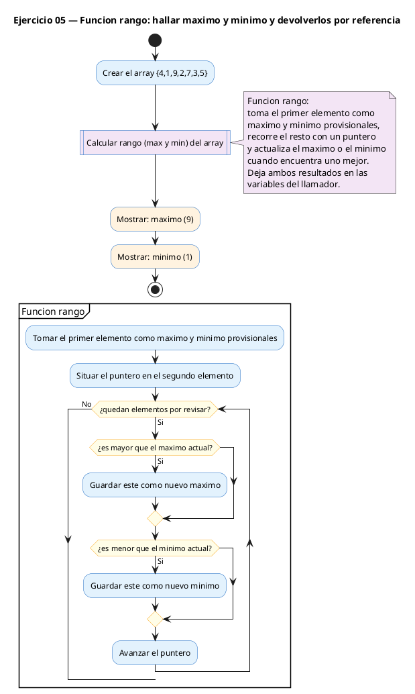
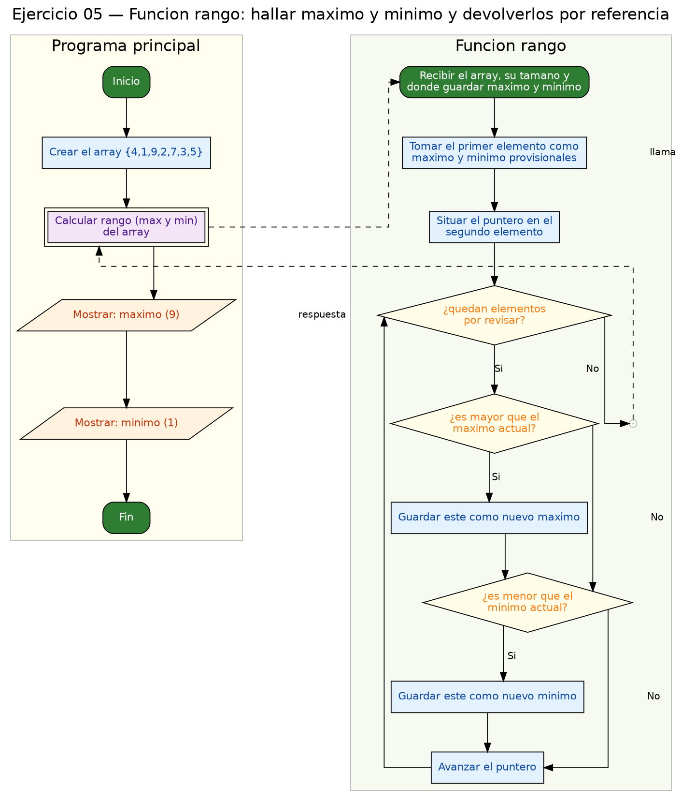

<!-- FICHERO GENERADO — NO EDITAR. Fuente de verdad: curso-c/practica/07-punteros/ej05.md (se regenera con gen_course.py). -->

# Ejercicio 05 — Función rango(int *arr, int n, int *pmax, int *pmin) que encuentra…

Dificultad: amarillo · Módulo 07 (Punteros)

## Enunciado

Función rango(int *arr, int n, int *pmax, int *pmin) que encuentra máximo y mínimo de un array usando aritmética de punteros.

## Diagramas de flujo





## Cómo se resuelve

<!-- EXPLICACION -->
Aquí una función necesita devolver **dos** resultados, el máximo y el mínimo. Como `return` solo entrega un valor, el truco es pasar dos direcciones de salida (`int *pmax`, `int *pmin`) y escribir el resultado en ellas por referencia.

- `*pmax = arr[0];` y `*pmin = arr[0];` — arrancamos suponiendo que el primer elemento es a la vez el mayor y el menor. Escribimos con `*` porque `pmax` y `pmin` son direcciones y queremos rellenar la variable del llamador.
- Recorremos con aritmética de punteros: `p = arr + 1` (empezamos en el segundo, el primero ya está considerado) y `fin = arr + n` como centinela. En el bucle, `if (*p > *pmax) *pmax = *p;` va actualizando.
- En `main`, la llamada es `rango(datos, 7, &maximo, &minimo);`. `datos` ya es un puntero (por ser array), pero `maximo` y `minimo` son enteros normales, así que necesitan `&` para pasar su dirección.

Trampa habitual: olvidar el `&` en `maximo` y `minimo` al llamar, o escribir dentro `pmax = *p` en lugar de `*pmax = *p`. Sin el `*` a la izquierda estarías cambiando a dónde apunta el puntero local, no el valor del llamador, y este se quedaría con basura.

## Para practicar — cópialo y complétalo

Pega este esqueleto y completa los `TODO`. Es la mejor forma de aprender: inténtalo antes de mirar la solución.

```c
/*
 * Curso de C — Modulo 07: Punteros
 * Ejercicio 05 — PRACTICA (rellena los TODO)
 * Enunciado: Función rango(int *arr, int n, int *pmax, int *pmin) que encuentra
 *            máximo y mínimo de un array usando aritmética de punteros.
 * Dificultad: amarillo
 * Compilar: gcc -std=c11 -Wall ej05_practica.c -o ej05 && ./ej05
 */

#include <stdio.h>

/*
 * TODO 1: Define void rango(int *arr, int n, int *pmax, int *pmin).
 *
 *   Pasos sugeridos:
 *   a) Inicializa *pmax y *pmin con arr[0] (el primer elemento).
 *   b) Declara un puntero p = arr + 1  y un centinela fin = arr + n.
 *   c) Bucle while(p < fin):
 *      - Si *p > *pmax  ->  actualiza *pmax
 *      - Si *p < *pmin  ->  actualiza *pmin
 *      - p++
 */

int main(void) {
    int datos[7] = {4, 1, 9, 2, 7, 3, 5};
    int maximo, minimo;

    // TODO 2: Llama a rango pasando datos, 7, y las DIRECCIONES de maximo y minimo.

    // TODO 3: Imprime:
    //   "Max = <valor>"
    //   "Min = <valor>"

    return 0;
}
```

## Solución — cópiala y ejecútala

```c
/*
 * Curso de C — Modulo 07: Punteros
 * Ejercicio 05 — MODELO (resuelto)
 * Enunciado: Función rango(int *arr, int n, int *pmax, int *pmin) que encuentra
 *            máximo y mínimo de un array usando aritmética de punteros.
 * Dificultad: amarillo
 * Compilar: gcc -std=c11 -Wall ej05_modelo.c -o ej05 && ./ej05
 */

#include <stdio.h>

/*
 * Recorre arr con un puntero y escribe el maximo en *pmax y el minimo en *pmin.
 * Precondicion: n >= 1.
 */
void rango(int *arr, int n, int *pmax, int *pmin) {
    *pmax = arr[0];        // inicializamos con el primer elemento
    *pmin = arr[0];

    int *p = arr + 1;      // empezamos desde el segundo elemento
    int *fin = arr + n;    // centinela

    while (p < fin) {
        if (*p > *pmax) *pmax = *p;
        if (*p < *pmin) *pmin = *p;
        p++;
    }
}

int main(void) {
    int datos[7] = {4, 1, 9, 2, 7, 3, 5};
    int maximo, minimo;

    rango(datos, 7, &maximo, &minimo);

    printf("Max = %d\n", maximo);
    printf("Min = %d\n", minimo);

    return 0;
}
```

## Ejecútalo en el navegador

[▶ Abrir y ejecutar en Compiler Explorer](https://godbolt.org/clientstate/eyJzZXNzaW9ucyI6W3siaWQiOjEsImxhbmd1YWdlIjoiYyIsInNvdXJjZSI6Ii8qXG4gKiBDdXJzbyBkZSBDIFx1MjAxNCBNb2R1bG8gMDc6IFB1bnRlcm9zXG4gKiBFamVyY2ljaW8gMDUgXHUyMDE0IE1PREVMTyAocmVzdWVsdG8pXG4gKiBFbnVuY2lhZG86IEZ1bmNpXHUwMGYzbiByYW5nbyhpbnQgKmFyciwgaW50IG4sIGludCAqcG1heCwgaW50ICpwbWluKSBxdWUgZW5jdWVudHJhXG4gKiAgICAgICAgICAgIG1cdTAwZTF4aW1vIHkgbVx1MDBlZG5pbW8gZGUgdW4gYXJyYXkgdXNhbmRvIGFyaXRtXHUwMGU5dGljYSBkZSBwdW50ZXJvcy5cbiAqIERpZmljdWx0YWQ6IGFtYXJpbGxvXG4gKiBDb21waWxhcjogZ2NjIC1zdGQ9YzExIC1XYWxsIGVqMDVfbW9kZWxvLmMgLW8gZWowNSAmJiAuL2VqMDVcbiAqL1xuXG4jaW5jbHVkZSA8c3RkaW8uaD5cblxuLypcbiAqIFJlY29ycmUgYXJyIGNvbiB1biBwdW50ZXJvIHkgZXNjcmliZSBlbCBtYXhpbW8gZW4gKnBtYXggeSBlbCBtaW5pbW8gZW4gKnBtaW4uXG4gKiBQcmVjb25kaWNpb246IG4gPj0gMS5cbiAqL1xudm9pZCByYW5nbyhpbnQgKmFyciwgaW50IG4sIGludCAqcG1heCwgaW50ICpwbWluKSB7XG4gICAgKnBtYXggPSBhcnJbMF07ICAgICAgICAvLyBpbmljaWFsaXphbW9zIGNvbiBlbCBwcmltZXIgZWxlbWVudG9cbiAgICAqcG1pbiA9IGFyclswXTtcblxuICAgIGludCAqcCA9IGFyciArIDE7ICAgICAgLy8gZW1wZXphbW9zIGRlc2RlIGVsIHNlZ3VuZG8gZWxlbWVudG9cbiAgICBpbnQgKmZpbiA9IGFyciArIG47ICAgIC8vIGNlbnRpbmVsYVxuXG4gICAgd2hpbGUgKHAgPCBmaW4pIHtcbiAgICAgICAgaWYgKCpwID4gKnBtYXgpICpwbWF4ID0gKnA7XG4gICAgICAgIGlmICgqcCA8ICpwbWluKSAqcG1pbiA9ICpwO1xuICAgICAgICBwKys7XG4gICAgfVxufVxuXG5pbnQgbWFpbih2b2lkKSB7XG4gICAgaW50IGRhdG9zWzddID0gezQsIDEsIDksIDIsIDcsIDMsIDV9O1xuICAgIGludCBtYXhpbW8sIG1pbmltbztcblxuICAgIHJhbmdvKGRhdG9zLCA3LCAmbWF4aW1vLCAmbWluaW1vKTtcblxuICAgIHByaW50ZihcIk1heCA9ICVkXFxuXCIsIG1heGltbyk7XG4gICAgcHJpbnRmKFwiTWluID0gJWRcXG5cIiwgbWluaW1vKTtcblxuICAgIHJldHVybiAwO1xufVxuIiwiY29tcGlsZXJzIjpbXSwiZXhlY3V0b3JzIjpbeyJhcmd1bWVudHMiOiIiLCJjb21waWxlciI6eyJpZCI6ImNnMTQzIiwibGlicyI6W10sIm9wdGlvbnMiOiItc3RkPWMxMSAtbG0ifSwic3RkaW4iOiIiLCJ3cmFwIjpmYWxzZX1dfV19)

Se abre con la solución ya cargada; pulsa el botón de ejecutar (Run) para ver la salida. No hay que instalar nada.

## Cómo usarlo

Pega el código en un fichero y ejecútalo con tu toolchain habitual (o el botón de Ejecutar de tu editor). Antes de mirar la solución, intenta completar tú el esqueleto: es la mejor forma de aprender.

## Conexiones

- [[Curso_C/modelo/07-punteros|Teoría del módulo]]
- [[Curso_C/practica/00_README|Índice del curso]]
