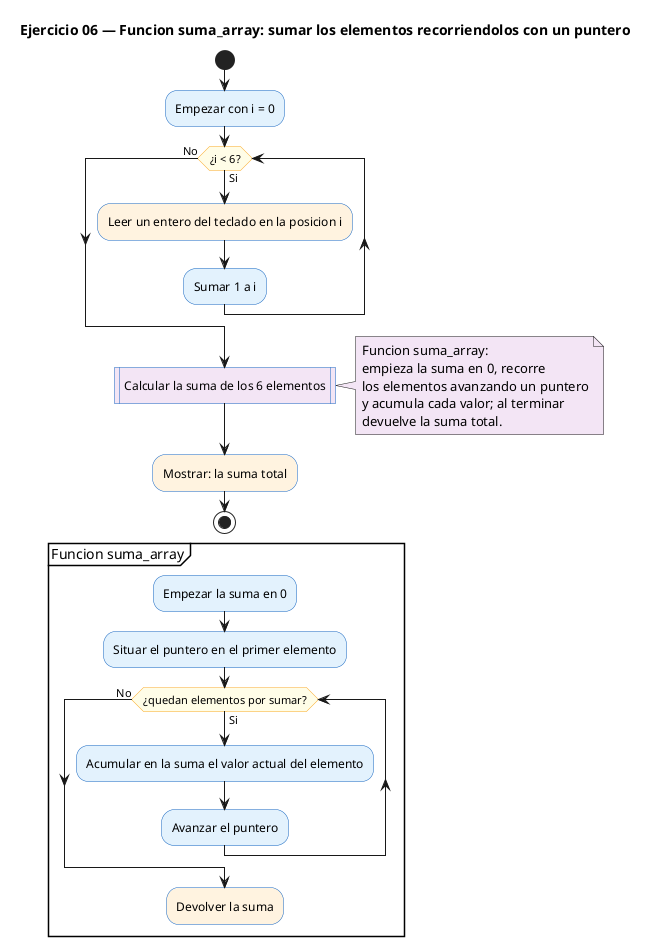
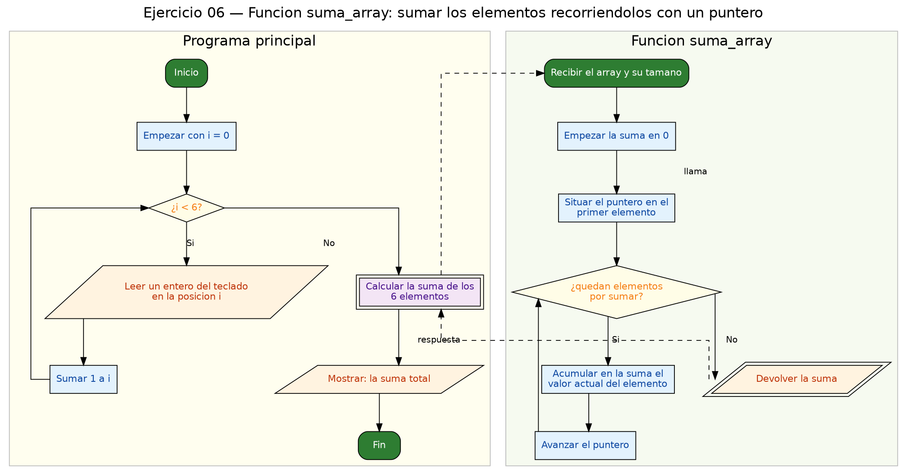

<!-- FICHERO GENERADO — NO EDITAR. Fuente de verdad: curso-c/practica/07-punteros/ej06.md (se regenera con gen_course.py). -->

# Ejercicio 06 — Función suma_array(int *arr, int n) que devuelve la suma usando…

Dificultad: amarillo · Módulo 07 (Punteros)

## Enunciado

Función suma_array(int *arr, int n) que devuelve la suma usando aritmetica de punteros (sin indexacion []). Lee 6 enteros.

## Diagramas de flujo





## Cómo se resuelve

<!-- EXPLICACION -->
El objetivo es sumar un array recorriéndolo con un puntero como iterador, sin usar la notación `arr[i]`. Es la misma idea de recorrido del ejercicio 04, ahora acumulando.

- Dentro de `suma_array`, `int *p = arr;` empieza en el primer elemento y `int *fin = arr + n;` marca el final. El bucle `while (p < fin)` hace `total += *p;` (suma el valor apuntado) y luego `p++` (avanza al siguiente `int`). Al final `return total;`.
- Recuerda: aunque el parámetro se declara `int *arr`, dentro `arr[i]` y `*(arr+i)` serían equivalentes; aquí practicamos deliberadamente la forma con puntero.
- En `main` sí se usa `arr[i]` para **leer** con `scanf("%d", &arr[i]);`. Fíjate en el `&`: `scanf` necesita la dirección de cada casilla para depositar ahí el número.

Trampa habitual: al pasar el array a la función, `int *arr` recibe solo la dirección, no cuántos elementos hay. Por eso hay que pasar `n` aparte; dentro de la función `sizeof(arr)` te daría el tamaño de un puntero, no del array original. Y como siempre, no cruces `fin`: leer más allá del array es comportamiento indefinido.

## Para practicar — cópialo y complétalo

Pega este esqueleto y completa los `TODO`. Es la mejor forma de aprender: inténtalo antes de mirar la solución.

```c
/*
 * Curso de C — Modulo 07: Punteros
 * Ejercicio 06 — PRACTICA (rellena los TODO)
 * Enunciado: Función suma_array(int *arr, int n) que devuelve la suma
 *            usando aritmetica de punteros (sin indexacion []). Lee 6 enteros.
 * Dificultad: amarillo
 * Compilar: gcc -std=c11 -Wall ej06_practica.c -o ej06 && ./ej06
 */

#include <stdio.h>

/*
 * TODO 1: Define int suma_array(int *arr, int n).
 *
 *   Restriccion: NO puedes usar arr[i] dentro de esta funcion.
 *   Pasos:
 *   a) Inicializa total = 0.
 *   b) Declara puntero p = arr  y centinela fin = arr + n.
 *   c) Bucle while(p < fin): acumula *p en total, luego p++.
 *   d) Retorna total.
 */

int main(void) {
    int arr[6];
    int i;

    // TODO 2: Lee 6 enteros con scanf en un bucle for.
    //         (Aqui si puedes usar arr[i] para leer)
    for (i = 0; i < 6; i++) {
        // scanf("%d", ...);
    }

    // TODO 3: Llama a suma_array y muestra el resultado.
    //         Formato: "Suma = <valor>\n"

    return 0;
}
```

## Solución — cópiala y ejecútala

```c
/*
 * Curso de C — Modulo 07: Punteros
 * Ejercicio 06 — MODELO (resuelto)
 * Enunciado: Función suma_array(int *arr, int n) que devuelve la suma
 *            usando aritmetica de punteros (sin indexacion []). Lee 6 enteros.
 * Dificultad: amarillo
 * Compilar: gcc -std=c11 -Wall ej06_modelo.c -o ej06 && ./ej06
 */

#include <stdio.h>

/* Suma n enteros del array usando un puntero como iterador */
int suma_array(int *arr, int n) {
    int total = 0;
    int *p = arr;
    int *fin = arr + n;
    while (p < fin) {
        total += *p;  // acumula el valor apuntado
        p++;
    }
    return total;
}

int main(void) {
    int arr[6];
    int i;

    for (i = 0; i < 6; i++) {
        scanf("%d", &arr[i]);
    }

    printf("Suma = %d\n", suma_array(arr, 6));

    return 0;
}
```

## Cómo usarlo

Pega el código en un fichero y ejecútalo con tu toolchain habitual (o el botón de Ejecutar de tu editor). Antes de mirar la solución, intenta completar tú el esqueleto: es la mejor forma de aprender.

## Conexiones

- [[Curso_C/modelo/07-punteros|Teoría del módulo]]
- [[Curso_C/practica/00_README|Índice del curso]]
