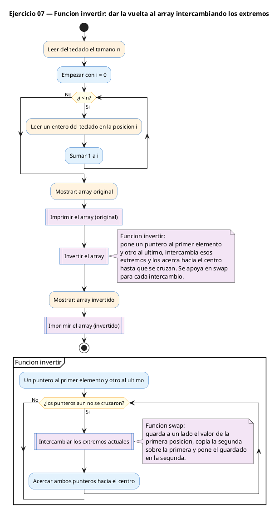
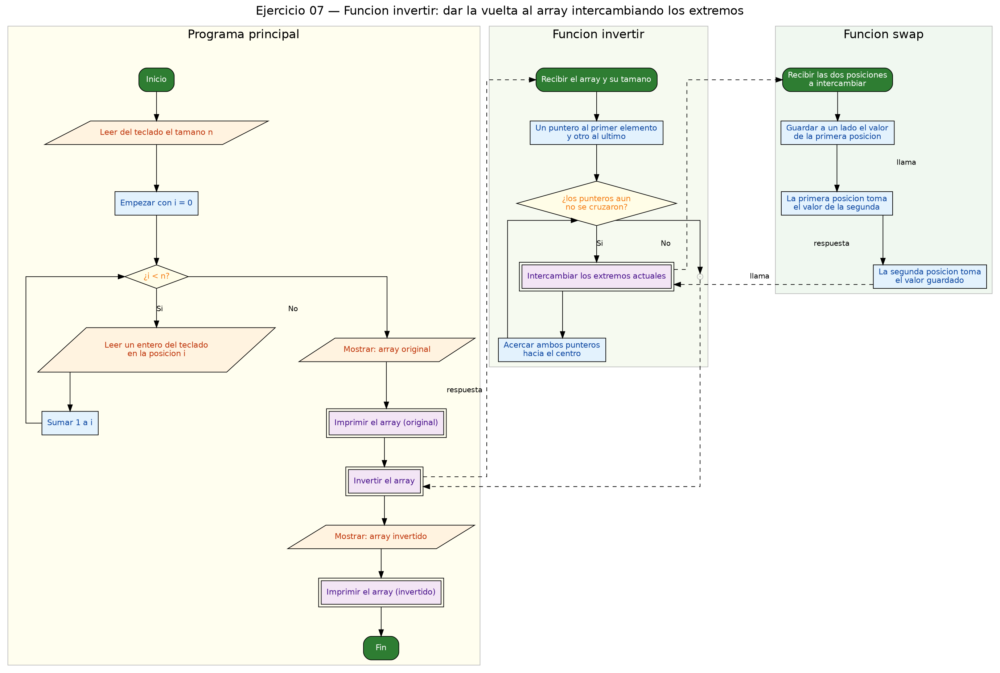

<!-- FICHERO GENERADO — NO EDITAR. Fuente de verdad: curso-c/practica/07-punteros/ej07.md (se regenera con gen_course.py). -->

# Ejercicio 07 — Función invertir(int *arr, int n) que invierte el array in-place con…

Dificultad: rojo · Módulo 07 (Punteros)

## Enunciado

Función invertir(int *arr, int n) que invierte el array in-place con dos punteros (inicio y fin) avanzando hacia el centro con swap.

## Diagramas de flujo





## Cómo se resuelve

<!-- EXPLICACION -->
Este ejercicio junta casi todo el módulo: paso por referencia, relación puntero-array y aritmética de punteros. La idea es invertir el array **in-place** (sin array auxiliar) con dos punteros que se acercan desde los extremos.

- `int *izq = arr;` apunta al primer elemento y `int *der = arr + n - 1;` al último (`n - 1` porque el índice del último es el tamaño menos uno).
- El bucle `while (izq < der)` intercambia los extremos con `swap(izq, der)` y luego acerca ambos: `izq++` avanza y `der--` retrocede. Cuando se cruzan (`izq >= der`) el array ya está invertido; el elemento central, si `n` es impar, se queda en su sitio, que es lo correcto.
- Se reutiliza el `swap` del ejercicio 03. Como `izq` y `der` ya son punteros, se pasan directamente (`swap(izq, der)`), sin `&`: ya contienen las direcciones que `swap` espera.
- `imprimir` recorre con un puntero y un centinela `fin = arr + n`, la misma técnica del ejercicio 04.

Trampa habitual: equivocar el arranque de `der` poniendo `arr + n` (que apunta *pasado* el último y leería fuera del array), o usar `while (izq <= der)`, que en arrays impares haría un swap de más del centro consigo mismo (inofensivo aquí, pero conceptualmente sobra). Con dos punteros, la condición correcta para parar es que se crucen: `izq < der`.

## Para practicar — cópialo y complétalo

Pega este esqueleto y completa los `TODO`. Es la mejor forma de aprender: inténtalo antes de mirar la solución.

```c
/*
 * Curso de C — Modulo 07: Punteros
 * Ejercicio 07 — PRACTICA (rellena los TODO)
 * Enunciado: Función invertir(int *arr, int n) que invierte el array in-place
 *            con dos punteros (inicio y fin) avanzando hacia el centro con swap.
 * Dificultad: rojo
 * Stdin: 5\n1\n2\n3\n4\n5
 * Compilar: gcc -std=c11 -Wall ej07_practica.c -o ej07 && ./ej07
 */

#include <stdio.h>

/*
 * TODO 1: Define void swap(int *a, int *b).
 *         (Igual que en ej03, la necesitamos aqui tambien)
 */

/*
 * TODO 2: Define void invertir(int *arr, int n).
 *
 *   Idea: dos punteros que se acercan desde los extremos.
 *   a) int *izq = arr;          <- apunta al primer elemento
 *   b) int *der = arr + n - 1;  <- apunta al ultimo
 *   c) while (izq < der):
 *      - swap(izq, der)
 *      - izq++
 *      - der--
 *   Cuando izq >= der hemos terminado (centro alcanzado).
 */

/*
 * TODO 3: Define void imprimir(int *arr, int n).
 *         Recorre con un puntero e imprime cada elemento separado por espacio.
 *         Al final imprime '\n'.
 */

int main(void) {
    int n;
    scanf("%d", &n);

    int arr[100];
    int i;
    for (i = 0; i < n; i++) {
        scanf("%d", &arr[i]);
    }

    // TODO 4: Imprime "Original:  " y llama a imprimir.

    // TODO 5: Llama a invertir.

    // TODO 6: Imprime "Invertido: " y llama a imprimir de nuevo.

    return 0;
}
```

## Solución — cópiala y ejecútala

```c
/*
 * Curso de C — Modulo 07: Punteros
 * Ejercicio 07 — MODELO (resuelto)
 * Enunciado: Función invertir(int *arr, int n) que invierte el array in-place
 *            con dos punteros (inicio y fin) avanzando hacia el centro con swap.
 * Dificultad: rojo
 * Stdin: 5\n1\n2\n3\n4\n5
 * Compilar: gcc -std=c11 -Wall ej07_modelo.c -o ej07 && ./ej07
 */

#include <stdio.h>

/* Intercambia los valores de *a y *b */
void swap(int *a, int *b) {
    int tmp = *a;
    *a = *b;
    *b = tmp;
}

/*
 * Invierte el array arr de n elementos sin array auxiliar.
 * Usa dos punteros: izq apunta al inicio, der al ultimo elemento.
 * Intercambia y acerca los punteros hasta que se cruzan.
 */
void invertir(int *arr, int n) {
    int *izq = arr;          // puntero al primer elemento
    int *der = arr + n - 1;  // puntero al ultimo elemento

    while (izq < der) {
        swap(izq, der);  // intercambia los extremos actuales
        izq++;           // avanza desde el inicio
        der--;           // retrocede desde el final
    }
}

/* Imprime los n elementos de arr separados por espacios */
void imprimir(int *arr, int n) {
    int *p = arr;
    int *fin = arr + n;
    while (p < fin) {
        printf("%d", *p);
        if (p + 1 < fin) printf(" ");
        p++;
    }
    printf("\n");
}

int main(void) {
    int n;
    scanf("%d", &n);

    int arr[100];  // tamano maximo razonable
    int i;
    for (i = 0; i < n; i++) {
        scanf("%d", &arr[i]);
    }

    printf("Original:  ");
    imprimir(arr, n);

    invertir(arr, n);

    printf("Invertido: ");
    imprimir(arr, n);

    return 0;
}
```

## Ejecútalo en el navegador

[▶ Abrir y ejecutar en Compiler Explorer](https://godbolt.org/clientstate/eyJzZXNzaW9ucyI6W3siaWQiOjEsImxhbmd1YWdlIjoiYyIsInNvdXJjZSI6Ii8qXG4gKiBDdXJzbyBkZSBDIFx1MjAxNCBNb2R1bG8gMDc6IFB1bnRlcm9zXG4gKiBFamVyY2ljaW8gMDcgXHUyMDE0IE1PREVMTyAocmVzdWVsdG8pXG4gKiBFbnVuY2lhZG86IEZ1bmNpXHUwMGYzbiBpbnZlcnRpcihpbnQgKmFyciwgaW50IG4pIHF1ZSBpbnZpZXJ0ZSBlbCBhcnJheSBpbi1wbGFjZVxuICogICAgICAgICAgICBjb24gZG9zIHB1bnRlcm9zIChpbmljaW8geSBmaW4pIGF2YW56YW5kbyBoYWNpYSBlbCBjZW50cm8gY29uIHN3YXAuXG4gKiBEaWZpY3VsdGFkOiByb2pvXG4gKiBTdGRpbjogNVxcbjFcXG4yXFxuM1xcbjRcXG41XG4gKiBDb21waWxhcjogZ2NjIC1zdGQ9YzExIC1XYWxsIGVqMDdfbW9kZWxvLmMgLW8gZWowNyAmJiAuL2VqMDdcbiAqL1xuXG4jaW5jbHVkZSA8c3RkaW8uaD5cblxuLyogSW50ZXJjYW1iaWEgbG9zIHZhbG9yZXMgZGUgKmEgeSAqYiAqL1xudm9pZCBzd2FwKGludCAqYSwgaW50ICpiKSB7XG4gICAgaW50IHRtcCA9ICphO1xuICAgICphID0gKmI7XG4gICAgKmIgPSB0bXA7XG59XG5cbi8qXG4gKiBJbnZpZXJ0ZSBlbCBhcnJheSBhcnIgZGUgbiBlbGVtZW50b3Mgc2luIGFycmF5IGF1eGlsaWFyLlxuICogVXNhIGRvcyBwdW50ZXJvczogaXpxIGFwdW50YSBhbCBpbmljaW8sIGRlciBhbCB1bHRpbW8gZWxlbWVudG8uXG4gKiBJbnRlcmNhbWJpYSB5IGFjZXJjYSBsb3MgcHVudGVyb3MgaGFzdGEgcXVlIHNlIGNydXphbi5cbiAqL1xudm9pZCBpbnZlcnRpcihpbnQgKmFyciwgaW50IG4pIHtcbiAgICBpbnQgKml6cSA9IGFycjsgICAgICAgICAgLy8gcHVudGVybyBhbCBwcmltZXIgZWxlbWVudG9cbiAgICBpbnQgKmRlciA9IGFyciArIG4gLSAxOyAgLy8gcHVudGVybyBhbCB1bHRpbW8gZWxlbWVudG9cblxuICAgIHdoaWxlIChpenEgPCBkZXIpIHtcbiAgICAgICAgc3dhcChpenEsIGRlcik7ICAvLyBpbnRlcmNhbWJpYSBsb3MgZXh0cmVtb3MgYWN0dWFsZXNcbiAgICAgICAgaXpxKys7ICAgICAgICAgICAvLyBhdmFuemEgZGVzZGUgZWwgaW5pY2lvXG4gICAgICAgIGRlci0tOyAgICAgICAgICAgLy8gcmV0cm9jZWRlIGRlc2RlIGVsIGZpbmFsXG4gICAgfVxufVxuXG4vKiBJbXByaW1lIGxvcyBuIGVsZW1lbnRvcyBkZSBhcnIgc2VwYXJhZG9zIHBvciBlc3BhY2lvcyAqL1xudm9pZCBpbXByaW1pcihpbnQgKmFyciwgaW50IG4pIHtcbiAgICBpbnQgKnAgPSBhcnI7XG4gICAgaW50ICpmaW4gPSBhcnIgKyBuO1xuICAgIHdoaWxlIChwIDwgZmluKSB7XG4gICAgICAgIHByaW50ZihcIiVkXCIsICpwKTtcbiAgICAgICAgaWYgKHAgKyAxIDwgZmluKSBwcmludGYoXCIgXCIpO1xuICAgICAgICBwKys7XG4gICAgfVxuICAgIHByaW50ZihcIlxcblwiKTtcbn1cblxuaW50IG1haW4odm9pZCkge1xuICAgIGludCBuO1xuICAgIHNjYW5mKFwiJWRcIiwgJm4pO1xuXG4gICAgaW50IGFyclsxMDBdOyAgLy8gdGFtYW5vIG1heGltbyByYXpvbmFibGVcbiAgICBpbnQgaTtcbiAgICBmb3IgKGkgPSAwOyBpIDwgbjsgaSsrKSB7XG4gICAgICAgIHNjYW5mKFwiJWRcIiwgJmFycltpXSk7XG4gICAgfVxuXG4gICAgcHJpbnRmKFwiT3JpZ2luYWw6ICBcIik7XG4gICAgaW1wcmltaXIoYXJyLCBuKTtcblxuICAgIGludmVydGlyKGFyciwgbik7XG5cbiAgICBwcmludGYoXCJJbnZlcnRpZG86IFwiKTtcbiAgICBpbXByaW1pcihhcnIsIG4pO1xuXG4gICAgcmV0dXJuIDA7XG59XG4iLCJjb21waWxlcnMiOltdLCJleGVjdXRvcnMiOlt7ImFyZ3VtZW50cyI6IiIsImNvbXBpbGVyIjp7ImlkIjoiY2cxNDMiLCJsaWJzIjpbXSwib3B0aW9ucyI6Ii1zdGQ9YzExIC1sbSJ9LCJzdGRpbiI6IjVcbjFcbjJcbjNcbjRcbjUiLCJ3cmFwIjpmYWxzZX1dfV19)

Se abre con la solución ya cargada; pulsa el botón de ejecutar (Run) para ver la salida. No hay que instalar nada.

## Cómo usarlo

Pega el código en un fichero y ejecútalo con tu toolchain habitual (o el botón de Ejecutar de tu editor). Antes de mirar la solución, intenta completar tú el esqueleto: es la mejor forma de aprender.

## Conexiones

- [[Curso_C/modelo/07-punteros|Teoría del módulo]]
- [[Curso_C/practica/00_README|Índice del curso]]
