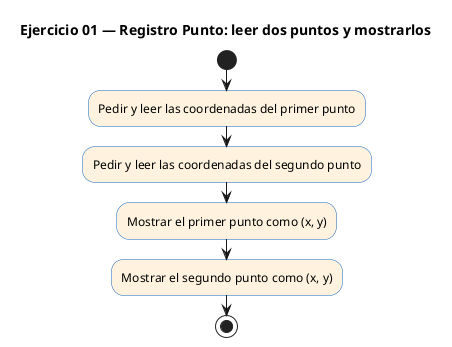
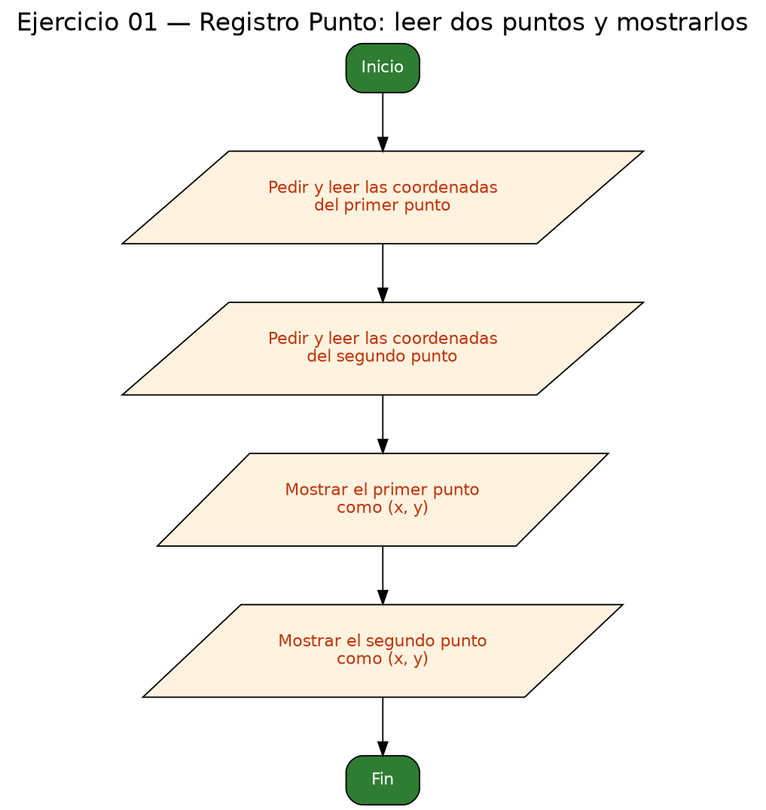

<!-- FICHERO GENERADO — NO EDITAR. Fuente de verdad: curso-c/practica/08-structs/ej01.md (se regenera con gen_course.py). -->

# Ejercicio 01 — Define Punto {x, y}, lee dos puntos del usuario e imprímelos con…

Dificultad: verde · Módulo 08 (Structs)

## Enunciado

Define Punto {x, y}, lee dos puntos del usuario e imprímelos con formato (x, y).

## Diagramas de flujo





## Cómo se resuelve

<!-- EXPLICACION -->
Un `struct` agrupa varios datos bajo un mismo nombre. Aquí un punto son dos coordenadas, así que definimos el tipo con `typedef struct { double x; double y; } Punto;`. El `typedef` es lo que nos deja escribir luego `Punto p1, p2;` en vez del más largo `struct Punto`.

1. `Punto p1, p2;` — dos variables, cada una con sus dos campos `x` e `y`.
2. `scanf("%lf %lf", &p1.x, &p1.y)` — leemos las dos coordenadas. Fíjate en dos cosas:
   - `%lf` es el formato de `double` en `scanf` (con `%f` leerías un `float` y el número saldría corrupto).
   - Los campos son variables normales, así que **sí llevan `&`**. Se escribe `&p1.x`, que C interpreta como "la dirección del campo `x` de `p1`" (el punto se aplica antes que el `&`).
3. `printf("Punto 1: (%.2f, %.2f)\n", p1.x, p1.y)` — al **imprimir** un `double` se usa `%f` (aquí `%.2f` para dos decimales), sin `&`.

Accedes a un campo con el operador punto: `p1.x`. Esa es la idea central del módulo.

Trampa habitual: olvidar el punto y coma tras la llave de cierre del `struct` (`} Punto;`). En C esa `;` es obligatoria y su ausencia dispara errores raros en la línea siguiente.

## Para practicar — cópialo y complétalo

Pega este esqueleto y completa los `TODO`. Es la mejor forma de aprender: inténtalo antes de mirar la solución.

```c
/*
 * Curso de C — Modulo 08: Structs
 * Ejercicio 01 — PRACTICA (rellena los TODO)
 * Enunciado: Define Punto {x, y}, lee dos puntos del usuario e imprímelos con formato (x, y).
 * Dificultad: verde
 * Compilar: gcc -std=c11 -Wall ej01_practica.c -o ej01 && ./ej01
 */

#include <stdio.h>

// TODO 1: Define un typedef struct llamado Punto con dos campos double: x e y.

int main(void) {
    // TODO 2: Declara dos variables de tipo Punto (p1 y p2).

    // TODO 3: Pide al usuario el punto 1 con printf y lee x e y con scanf.
    //         Recuerda: para leer un double usa %lf y el operador &.

    // TODO 4: Haz lo mismo para el punto 2.

    // TODO 5: Imprime p1 con formato "Punto 1: (x.xx, y.yy)\n"
    //         Usa %.2f para dos decimales.

    // TODO 6: Imprime p2 con el mismo formato.

    return 0;
}
```

## Solución — cópiala y ejecútala

```c
/*
 * Curso de C — Modulo 08: Structs
 * Ejercicio 01 — MODELO (resuelto)
 * Enunciado: Define Punto {x, y}, lee dos puntos del usuario e imprímelos con formato (x, y).
 * Dificultad: verde
 * Compilar: gcc -std=c11 -Wall ej01_modelo.c -o ej01 && ./ej01
 */

#include <stdio.h>

// Definicion del tipo Punto con typedef
typedef struct {
    double x;
    double y;
} Punto;

int main(void) {
    Punto p1, p2;

    // Leer primer punto
    printf("Introduce punto 1 (x y): ");
    scanf("%lf %lf", &p1.x, &p1.y);

    // Leer segundo punto
    printf("Introduce punto 2 (x y): ");
    scanf("%lf %lf", &p2.x, &p2.y);

    // Mostrar con formato (x, y)
    printf("Punto 1: (%.2f, %.2f)\n", p1.x, p1.y);
    printf("Punto 2: (%.2f, %.2f)\n", p2.x, p2.y);

    return 0;
}
```

## Cómo usarlo

Pega el código en un fichero y ejecútalo con tu toolchain habitual (o el botón de Ejecutar de tu editor). Antes de mirar la solución, intenta completar tú el esqueleto: es la mejor forma de aprender.

## Conexiones

- [[Curso_C/modelo/08-structs|Teoría del módulo]]
- [[Curso_C/practica/00_README|Índice del curso]]
