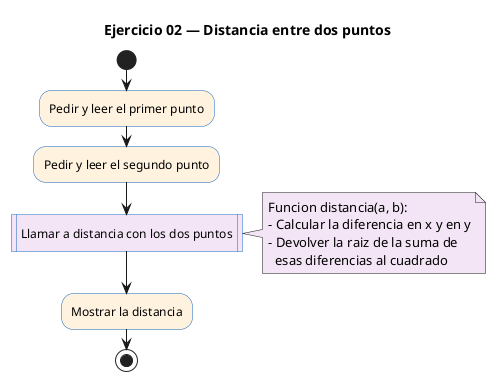
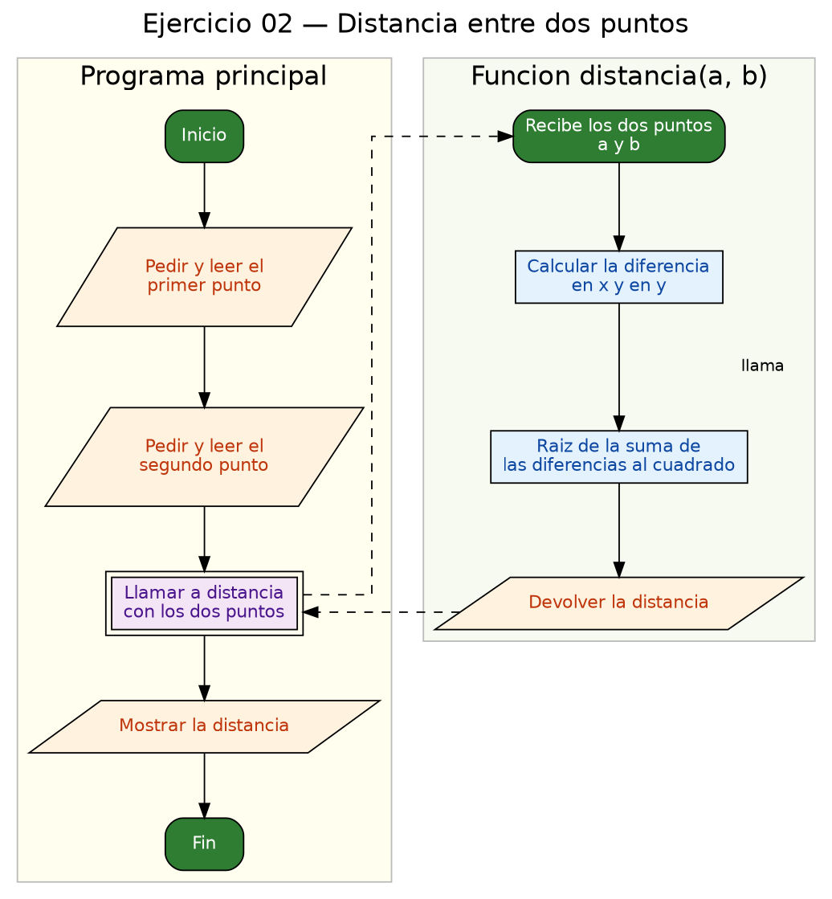

<!-- FICHERO GENERADO — NO EDITAR. Fuente de verdad: curso-c/practica/08-structs/ej02.md (se regenera con gen_course.py). -->

# Ejercicio 02 — Función distancia(Punto a, Punto b) que calcula la distancia euclídea…

Dificultad: verde · Módulo 08 (Structs)

## Enunciado

Función distancia(Punto a, Punto b) que calcula la distancia euclídea entre dos puntos.

## Diagramas de flujo





## Cómo se resuelve

<!-- EXPLICACION -->
Este ejercicio amplía el anterior: además del tipo `Punto`, escribimos una función que trabaja sobre structs.

La función `double distancia(Punto a, Punto b)` recibe **dos structs completos como parámetros**. Dentro calcula las diferencias en cada eje y aplica el teorema de Pitágoras:

```c
double dx = a.x - b.x;
double dy = a.y - b.y;
return sqrt(dx * dx + dy * dy);
```

Los parámetros se pasan **por valor**: la función recibe una copia de cada punto, así que no puede modificar los originales de `main`. Para structs pequeños de solo lectura, como aquí, es lo normal y correcto.

`sqrt` (raíz cuadrada) vive en `<math.h>`, por eso el `#include`. En Linux hay que enlazar la librería matemática al compilar añadiendo `-lm`: `gcc -std=c11 -Wall ej02_modelo.c -lm -o ej02`. En Dev-C++/Windows no hace falta ese flag.

Trampa habitual: usar `%f` en el `scanf` de las coordenadas. Como `x` e `y` son `double`, en la lectura tiene que ser `%lf`; con `%f` los valores entran mal y la distancia sale disparatada.

## Para practicar — cópialo y complétalo

Pega este esqueleto y completa los `TODO`. Es la mejor forma de aprender: inténtalo antes de mirar la solución.

```c
/*
 * Curso de C — Modulo 08: Structs
 * Ejercicio 02 — PRACTICA (rellena los TODO)
 * Enunciado: Función distancia(Punto a, Punto b) que calcula la distancia euclídea entre dos puntos.
 * Dificultad: verde
 * Stdin: 0 0\n3 4
 * Compilar: gcc -std=c11 -Wall ej02_practica.c -lm -o ej02 && ./ej02
 */

#include <stdio.h>
#include <math.h>

// TODO 1: Copia o vuelve a definir el typedef struct Punto con campos x e y (double).

// TODO 2: Declara la funcion double distancia(Punto a, Punto b).
//         Dentro: calcula dx = a.x - b.x, dy = a.y - b.y, y devuelve sqrt(dx*dx + dy*dy).

int main(void) {
    // TODO 3: Declara p1 y p2 de tipo Punto. Leelos con scanf.

    // TODO 4: Llama a distancia(p1, p2) e imprime el resultado con dos decimales.
    //         Formato esperado: "Distancia: 5.00\n"

    return 0;
}
```

## Solución — cópiala y ejecútala

```c
/*
 * Curso de C — Modulo 08: Structs
 * Ejercicio 02 — MODELO (resuelto)
 * Enunciado: Función distancia(Punto a, Punto b) que calcula la distancia euclídea entre dos puntos.
 * Dificultad: verde
 * Stdin: 0 0\n3 4
 * Compilar: gcc -std=c11 -Wall ej02_modelo.c -lm -o ej02 && ./ej02
 */

#include <stdio.h>
#include <math.h>

typedef struct {
    double x;
    double y;
} Punto;

// Funcion que recibe dos Punto por valor y devuelve la distancia
double distancia(Punto a, Punto b) {
    double dx = a.x - b.x;
    double dy = a.y - b.y;
    return sqrt(dx * dx + dy * dy);
}

int main(void) {
    Punto p1, p2;

    printf("Introduce punto 1 (x y): ");
    scanf("%lf %lf", &p1.x, &p1.y);

    printf("Introduce punto 2 (x y): ");
    scanf("%lf %lf", &p2.x, &p2.y);

    printf("Distancia: %.2f\n", distancia(p1, p2));

    return 0;
}
```

## Ejecútalo en el navegador

[▶ Abrir y ejecutar en Compiler Explorer](https://godbolt.org/clientstate/eyJzZXNzaW9ucyI6W3siaWQiOjEsImxhbmd1YWdlIjoiYyIsInNvdXJjZSI6Ii8qXG4gKiBDdXJzbyBkZSBDIFx1MjAxNCBNb2R1bG8gMDg6IFN0cnVjdHNcbiAqIEVqZXJjaWNpbyAwMiBcdTIwMTQgTU9ERUxPIChyZXN1ZWx0bylcbiAqIEVudW5jaWFkbzogRnVuY2lcdTAwZjNuIGRpc3RhbmNpYShQdW50byBhLCBQdW50byBiKSBxdWUgY2FsY3VsYSBsYSBkaXN0YW5jaWEgZXVjbFx1MDBlZGRlYSBlbnRyZSBkb3MgcHVudG9zLlxuICogRGlmaWN1bHRhZDogdmVyZGVcbiAqIFN0ZGluOiAwIDBcXG4zIDRcbiAqIENvbXBpbGFyOiBnY2MgLXN0ZD1jMTEgLVdhbGwgZWowMl9tb2RlbG8uYyAtbG0gLW8gZWowMiAmJiAuL2VqMDJcbiAqL1xuXG4jaW5jbHVkZSA8c3RkaW8uaD5cbiNpbmNsdWRlIDxtYXRoLmg%2BXG5cbnR5cGVkZWYgc3RydWN0IHtcbiAgICBkb3VibGUgeDtcbiAgICBkb3VibGUgeTtcbn0gUHVudG87XG5cbi8vIEZ1bmNpb24gcXVlIHJlY2liZSBkb3MgUHVudG8gcG9yIHZhbG9yIHkgZGV2dWVsdmUgbGEgZGlzdGFuY2lhXG5kb3VibGUgZGlzdGFuY2lhKFB1bnRvIGEsIFB1bnRvIGIpIHtcbiAgICBkb3VibGUgZHggPSBhLnggLSBiLng7XG4gICAgZG91YmxlIGR5ID0gYS55IC0gYi55O1xuICAgIHJldHVybiBzcXJ0KGR4ICogZHggKyBkeSAqIGR5KTtcbn1cblxuaW50IG1haW4odm9pZCkge1xuICAgIFB1bnRvIHAxLCBwMjtcblxuICAgIHByaW50ZihcIkludHJvZHVjZSBwdW50byAxICh4IHkpOiBcIik7XG4gICAgc2NhbmYoXCIlbGYgJWxmXCIsICZwMS54LCAmcDEueSk7XG5cbiAgICBwcmludGYoXCJJbnRyb2R1Y2UgcHVudG8gMiAoeCB5KTogXCIpO1xuICAgIHNjYW5mKFwiJWxmICVsZlwiLCAmcDIueCwgJnAyLnkpO1xuXG4gICAgcHJpbnRmKFwiRGlzdGFuY2lhOiAlLjJmXFxuXCIsIGRpc3RhbmNpYShwMSwgcDIpKTtcblxuICAgIHJldHVybiAwO1xufVxuIiwiY29tcGlsZXJzIjpbXSwiZXhlY3V0b3JzIjpbeyJhcmd1bWVudHMiOiIiLCJjb21waWxlciI6eyJpZCI6ImNnMTQzIiwibGlicyI6W10sIm9wdGlvbnMiOiItc3RkPWMxMSAtbG0ifSwic3RkaW4iOiIwIDBcbjMgNCIsIndyYXAiOmZhbHNlfV19XX0%3D)

Se abre con la solución ya cargada; pulsa el botón de ejecutar (Run) para ver la salida. No hay que instalar nada.

## Cómo usarlo

Pega el código en un fichero y ejecútalo con tu toolchain habitual (o el botón de Ejecutar de tu editor). Antes de mirar la solución, intenta completar tú el esqueleto: es la mejor forma de aprender.

## Conexiones

- [[Curso_C/modelo/08-structs|Teoría del módulo]]
- [[Curso_C/practica/00_README|Índice del curso]]
